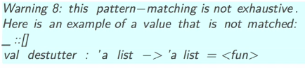

Title: [Ocaml MOOC] week0: intro and overview
Date: 2016-10-04 
Slug: ocamlMOOC_wk0_intro
Tags: ocaml  
Series: Introduction to Functional Programming in OCaml 

[TOC]

Intro
=====

### ML lang family
statically strongly typed languages


* fisrt-class functions
* type inference 
* pattern matching


### highlights of ocaml

* safty: static typing, pattern matching
* efficiency: high performance
* expressiveness: functional+type inference+polymorphism


* package manager: opam
* debugger
* profiler
* REPL: "toplevel"
* bytecode compiler: ccamlc
* native compiler: ocamlopt


programming environment **fully online:**
<https://try.ocamlpro.com/fun-demo/tryocaml_index.html>

note: the local REPL ``ocaml`` (toplevel)  is not very good, either use ``ledit ocaml``, or use ``utop``. 

Quick tour of the language
==========================

**list**


* ``[]`` is empty list
* ``a::l`` element ``a`` in head and ``l`` as remaining tail.
* ``[1;2;3;4]``


**function**: sum of list
write with pattern matching: 

```ocaml
let rec sumlist = 
        [] -> 0
|	a::rest -> a + (sumlist rest);;
```

This func has auto-inferred as of type: ``int list ->int``. all types are *computed and enforced* at compile time. 

**polymorphism and higher order**

>note: polymorphism ~= generic in java/template in cpp

turn the ``0`` and ``+`` in previous function into parameters, call this function ``fold``

```ocaml
let rec fun fold op e = 
function 
        [] -> e
| a::rest -> op a (fold op e rest)
```

infered the most general type: ``val fold : ('a -> 'b -> 'b) -> 'b -> 'a list -> 'b = <fun>``

**pattern matching**

write a function to remove all consecutive duplicates from a list: 

```ocaml
let rec destutter = 
function  
 | [] -> []
 | x::y::rest ->
    if x==y then destutter(y::rest)
    else x::destutter(rest);;
```



⇒ compiler tell us we forgot to add the case when only one element is in list !! And this case: 

```ocaml
let rec destutter = 
function  
 | [] -> []
 | x::[] -> x::[]
 | x::y::rest ->
                if x==y then destutter(y::rest)
                else x::destutter(rest);;
```
