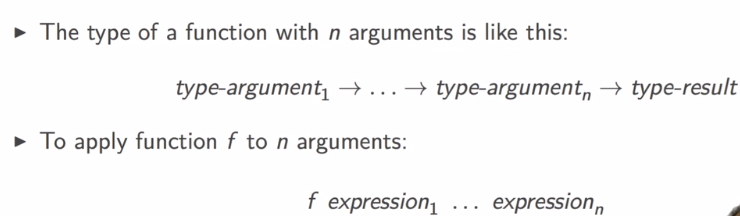
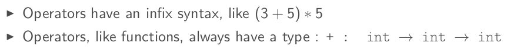
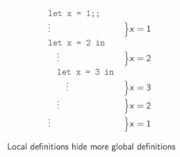
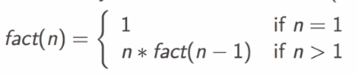
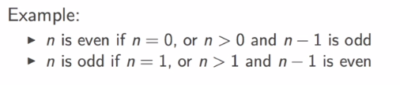

Title: [OCaml MOOC] week1: BASIC TYPES, DEFINITIONS AND FUNCTIONS 
Date: 2016-10-23  
Slug: ocamlMOOC_wk1_basics 
Tags: OCaml 
Series: Introduction to Functional Programming in OCaml 
 


1. BASIC DATA TYPES: int, bool 
============================== 
 
Rich type system and polymorphism in ocaml. Types are *infered* not declared.  
 
**Basic types**: int, bool, float, string, char, ... 
 
### int 
value: $-2^{62}$ ~ $2^{62}-1$ on 64-bit machines.  
ops: ``+, -, *, /, mod`` (reminder: ``/`` is integer division) 
 
```ocaml 
# 3+2*4-1;; 
- : int = 10 
# 5/2;; 
- : int = 2 
# -5 mod 3;; 
- : int = -2 
``` 
 
### bool 
values: ``true, false`` 
ops: ``&&,||, not`` 
comparison ops: ``<, >, =, <=, =>, <>``  
note 1: comparisons must have the *same type* of operands) 
note 2: equal test is ``=`` , ``=`` is NOT assigment.  ``==`` exists but is for something else... 
 
```ocaml 
# true && (1<7);; 
- : bool = true 
# 1.0 < 7;; 
Error: This expression has type int but an expression was expected of type 
         float 
# 5 > "hello";; 
Error: This expression has type string but an expression was expected of type 
         int 
# 3=3;; 
- : bool = true 
# 3==3;; 
- : bool = true 
# 3<3.0;; 
Error: This expression has type float but an expression was expected of type 
         int 
# 3.0 < 3.0;; 
- : bool = false 
``` 
 
 
2. MORE DATA TYPES: float, char, string 
======================================= 
 
 
### float 
value: must written with a dot (``5.0``, ``5.``), or exponential (``5e3``, ``6e-9``) 
ops: *also have a dot in the end* ``+.``, ``-.``, ``*.``, ``/.`` 
functions: ``sqrt, sin, cos, ceil, floor, ...`` 
 
```ocaml 
# 3.0 +. 1e10;; 
- : float = 10000000003. 
# 2 + 3.0;; 
Error: This expression has type float but an expression was expected of type 
         int 
# 3. +. 2.0;; 
- : float = 5. 
``` 
 
**All basic types are disjoint**: no value belongs to 2 different basic types, **no implicit conversion. ** 
 
conversion functions in both directions:  
 
* ``float_of_int``: int -> float 
* ``int_of_float``: float -> int 
  
```ocaml 
# float_of_int(2);; 
- : float = 2. 
# int_of_float(2.4);; 
- : int = 2 
# float_of_int 2;; 
- : float = 2. 
# int_of_float 2.8;; 
- : int = 2 
``` 
 
**Parentheses only necessary to indicate structure**.  
 
### char 
values: 256 chars (0~255), can be written as '``a``' or '``\087``' 
conversion functions (char ↔ int):  
 
* ``Char.chr``: int ->char 
* ``Char.code``: char -> int 
 
```ocaml 
# Char.code 'A';; 
- : int = 65 
# Char.code '\122';; 
- : int = 122 
# Char.chr 233;; 
- : char = '\233' 
# Char.chr 65;; 
- : char = 'A' 
# Char.chr (Char.code 'B');; 
- : char = 'B' 
``` 
 
### string 
values: written between ``""`` 
ops: ``^`` for string concatenation 
functions: ``String.length, int_of_string, float_of_string, String.get(s,i) ...`` 
 
```ocaml 
# "abc" ^ "def";; 
- : string = "abcdef" 
# String.length "1234";; 
- : int = 4 
# int_of_string "123";; 
- : int = 123 
# int_of_string "123a";; 
Exception: Failure "int_of_string". 
# string_of_int 123;; 
- : string = "123" 
# String.get "abc" 1;; 
- : char = 'b' 
``` 
 
3. EXPRESSIONS: if-then-else, func-applications and operators 
============================================================= 
**expressions** are used to compute values.  
 
### conditional expr 
``if... then... else...`` 
⇒ this gives an **expression**, not an **instruction**.  
 
*An expression always have a type*, type of the if-then-else expression is the type of the expressions in then and else, *which must be the same*. 
 
If the ``else`` is missing → there is a default value, to be discussed later  
 
```ocaml 
# if 1<2 then 8 else 9;; 
- : int = 8 
# if 6=8 then 1 else 8;; 
- : int = 8 
# if 6=8 then 1 else 8.;;        
Error: This expression has type float but an expression was expected of type 
         int 
# if(if 1=1 then 2=2 else 3>2) then 2<3 else 3<2;; 
- : bool = true 
``` 
 
### function application 
 
 
 
again, ``()`` are **not needed** unless indicate structure, and **parentheses are NOT function applications...** 
 
```ocaml 
# String.get;;  
- : string -> int -> char = <fun> 
# String.get "abcde" 2;; 
- : char = 'c' 
# String.get ("Hello"^"world") (3+2);; 
- : char = 'w' 
# String.get (string_of_int 65) (int_of_string "0");; 
- : char = '6' 
# String.get("hello", 2);; 
Error: This expression has type 'a * 'b 
       but an expression was expected of type string 
``` 
 
### Polymorphic operators 
 
 
Some ops have polymorphic(generic) types, like ``>``:  '``a → 'a → bool`` 
Here the '``a`` is a *type variable, *can be instantiated by any type*.* 
 
```ocaml 
# 12 > 23.0;; 
Error: This expression has type float but an expression was expected of type 
         int 
# 'a' > 'b';; 
- : bool = false 
# "hello" > "world";; 
- : bool = false 
``` 
 
 
4. DEFINITIONS 
============== 
 
**definition**s are used to give names to values, in ocaml there are *global* defs and *local* defs.  
 
### global definition 
effective for rest of session 
syntax: ``let name = expr`` 
once set, the value of the identifier never changes.  
 
```ocaml 
# let x = 2+3;; 
val x : int = 5 
# let y = 2*x;; 
val y : int = 10 
# let x = 3;; # **the old definition of x will be shadowed** 
val x : int = 3 
# x = x+1;; 
- : bool = false 
``` 
 
 
 
### local definition 
naming within a delimited scope 
syntax: ``let name = expr1 in expr2`` 
the scope of the identifier is ``expr2``, the result's value is also *expr2's value*. *So the identifier should appear in expr2*. 
 
```ocaml 
# let x = 9 in 2*x;; 
- : int = 18 
# x;; # x is not in global scope  
Error: Unbound value x 
# let y = x+1 in y/3;; 
Error: Unbound value x 
# let x = 17;; # now x is global 
val x : int = 17 
# let y = x+1 in y/3;;           
- : int = 6 
``` 
 
local defs can be nested: 
 
```ocaml 
# let x = 4 in  
  let y = x+1 in  
  let x = 2*y in x;; 
Error: Syntax error 
# let x = 4 in                    
  let y = x+1 in 
  let x=2*y in x;; 
- : int = 10 
# let x = 4 in  
  (let x=17 in x+1) + x;; 
- : int = 22 
``` 
 
 
 
### Simultaneous Definitions 
can assign 2 identifiers in the same line:  
 
```ocaml 
	# let x1=2 and x2=3-3;; 
	val x1 : int = 2 
	val x2 : int = 0 
``` 
 
**Note:** ``expr`` is  evaluated w.r.t. the value bindings *before* the ``let``. 
 
```ocaml 
# let x=2 in 
     let y=x+1 in (*y=2+1*) 
     x*y;; 
- : int = 6 
# let x=1;; 
val x : int = 1 
# let x=2 and y=x+1 in (*y=1+1 because the binding for x before the let is 1!*) 
    x*y;; 
- : int = 4 
``` 
 
5. FUNCTIONS 
============ 
 
### func definition 
global function (with 1 argument) def : ``let f x = expr`` 
 
local def: ``let f x = expr1 in expr2`` 
 
```ocaml 
# let f x = x+1;; 
val f : int -> int = <fun> 
# f 17;; 
- : int = 18 
# let g y = 2*y 
  in g 42;; 
- : int = 84 
# f f 1;; (* interpreted as apply 2 argments to f, need parentheses here*) 
Error: This function has type int -> int 
       It is applied to too many arguments; maybe you forgot a `;'. 
# f (f 1);; 
- : int = 3 
``` 
 
### lexical scoping  
 
>def. **lexical scoping** 
identifiers(names) used in function body refers to the names *that *are visible *at the moment of function definition*. 
 
> def. **dynamic scoping** 
names refer to names that are visible *at the moment of function invocation*.  
 
```ocaml 
# let f x = x+1 in 
  let g y = f (f y) in (*here f is the f defined above, which is visible at the moment of g's declaration*) 
  let f x = 2*2 in (*this f is visible after g's declaration, it is visible when g is invocated*) 
  g 5;; (*g uses the first f*) 
Warning 26: unused variable f. 
- : int = 7 
(*the same is true for global scoping*) 
# let f x = x+1;; 
val f : int -> int = <fun> 
# let g y = f (f y);; 
val g : int -> int = <fun> 
# let f x = 2*x;; 
val f : int -> int = <fun> 
# g 5;; 
- : int = 7 
``` 
 
 
 
### identifiers are NOT variables 
 
A name(identifier) can be *hidden* (the value is NOT *changed*) by a new definition of the same name.  
 
The hidden identifier can be accessed with static(lexical) binding:  
 
```ocaml 
# let a = 1;; 
val a : int = 1 
# let f x = x+a;; 
val f : int -> int = <fun> 
# f 2 ;; 
- : int = 3 
# let a = 73;; 
val a : int = 73 
# f 2;; (*f still uses a's value as 2, the old value of a is NOT changed, it's hidden --closure? *) 
- : int = 3 
```  
 
6. RECURSION 
============ 
rec functions are natural on recursively defined data structures.  
 
example: fact(n) 
 
 
 
### recursive definition 
using the ``f`` in let's ``expr`` will cause pb as ``f`` refers to the previous value of ``f``. ⇒ use key word ``rec``. 
 
```ocaml 
# let fact n = if n<=1 then 1 else n*fact(n-1);; 
Error: Unbound value fact 
# let rec fact n = if n<=1 then 1 else n*fact(n-1);; 
val fact : int -> int = <fun> 
# fact 10;; 
- : int = 3628800 
``` 
 
### mutually recursive function 
ex. 2 funcs calling each other recursively 
 
 
 
⇒ *use simultaneous defs* (``let...and...``):  
 
```ocaml 
# let rec even x = if x=0 then true else odd(x-1) 
  and odd x = if x=0 then false else even(x-1);; 
val even : int -> bool = <fun> 
val odd : int -> bool = <fun> 
# even 17;;  
- : bool = false 
# odd 10;; 
- : bool = false 
``` 
 
 
exercices 
========= 
 
```ocaml 
let multiple_of n d =  
  (n mod d) == 0;; 
 
let integer_square_root n = 
  let sqr = sqrt (float_of_int n) in 
  int_of_float sqr; 
 
let rec gcd n m =  
  let big = max n m and small = min n m in  
  let r = big mod small in  
  if r=0 then small  
  else gcd r small;; 
 
let rec multiple_upto n r = 
  if r<2 then false  
  else if multiple_of n r then true 
  else multiple_upto n (r-1);; 
 
let is_prime n = 
  if n<=1 then false 
  else not (multiple_upto n (n-1));; 
``` 
