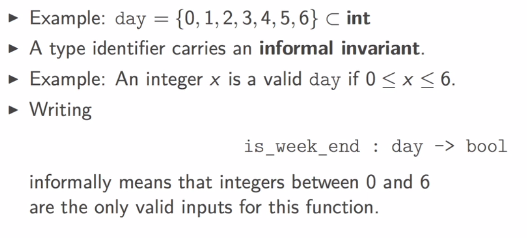
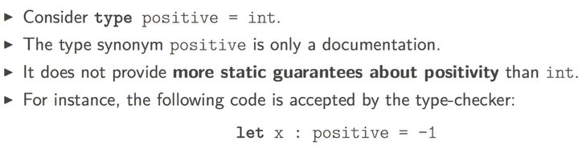
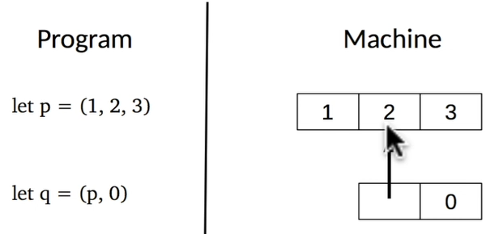
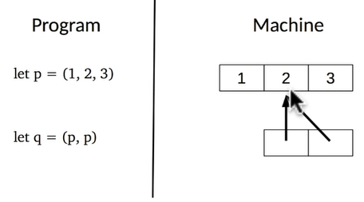
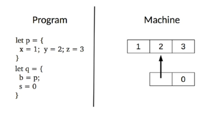
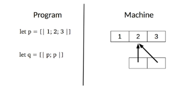

Title: [OCaml MOOC] week2: BASIC DATA STRUCTURES  
Date: 2016-11-12    
Slug: ocamlMOOC_wk2_basics_ds  
Tags: OCaml   
Series: Introduction to Functional Programming in OCaml  
   
  
[TOC]  
  
  
  
this week: structure code with types: tuples, records, arrays.   
  
1. USER-DEFINED TYPES  
=====================  
  
### primary use of types:  document your code  
  
  
  
  
* use ``type type_identifier = some_type`` to define a new type (``type_identifier`` is synonym/abbrevation of ``some_type``)  
* ``type_identifier`` *must start with lowercase letter*  
* already known types: ``int, bool, string, char`` ...  
* use ``:`` to add type annotation to identifiers ``let x : some_type = some_expr``  
* annotation param/return type of a function: ``let f(x: some_type): return_type = some_expr`` or ``let f x : return_type = some_expr``  
  
  
example: colors  
  
```ocaml   
# type color = int;;  
type color = int  
# let red: color = 0;;  
val red : color = 0  
# let white: color = 1;;  
val white : color = 1  
# let blue: color = 2;;  
val blue : color = 2   
```  
  
example: positive integers  
  
```ocaml   
# type positive = int;;  
type positive = int  
# let abs(x:int) = (if x<0 then -x else x: positive);;  
val abs : int -> positive = <fun>  
# let abs' (x:int): positive = if x<0 then -x else x;;  
val abs' : int -> positive = <fun>   
```  
  
### pitfalls  
  
  
* in the REPL, careful with unintended hiding of type identifiers:  
  
```ocaml   
# type t = int;;  
type t = int  
# let x: t = 0;;  
val x : t = 0  
# type t = bool;;  
type t = bool  
# let f (x: t) = not x;;  
val f : t -> bool = <fun>  
# let z = f x;;  
Error: This expression has type t/1027 = int  
       but an expression was expected of type t/1029 = bool   
```  
  
* limitations of type synonyms  
  
  
⇒ but ocaml has ways to define more precise types to avoid such error statically  
  
  
2. TUPLES: positioned components  
================================  
  
Some objects are naturally made of several components, example: 2d point.   
  
```ocaml   
# let origin = (0,0);;  
val origin : int * int = (0, 0)  
# let positive_range = (max_int, 0);;   
val positive_range : int * int = (4611686018427387903, 0)  
# let negative_range = (min_int, 0);;  
val negative_range : int * int = (-4611686018427387904, 0)   
```  
  
name tuples with ``type``: use ``*`` to construct tuple types.  
  
```ocaml   
# type point2D = int * int ;;  
type point2D = int * int  
# let origin : point2D = (0,0);;  
val origin : point2D = (0, 0)   
```  
  
### pattern matching: observing components of tuple  
  
  
* **pattern**: describe how values are observed by the program.   
* appear in let-bindings or in func arguments.   
* simplest form of pattern: identifiers   
  
example: ``let x = 6*3 in x`` can be read as "*I observe the value of 6*3 by naming it as x*"  
  
* ignore some component using wildcard ``_``, example: ``let _ = 6*3 in 1;;``  
  
example for tuple: ``let (x, _) = (5, 2) in x;;`` can read as: "*I observe the first component of tuple (5,2) by naming it as x, and I ignore the 2nd component*"  
  
```ocaml   
# let a = (3,4);;  
val a : int * int = (3, 4)  
# let (x,_) = a;;  
val x : int = 3  
# let x_coord (x, _) = x;;  
val x_coord : 'a * 'b -> 'a = <fun>  
# let y_coord (_, y) = y;;  
val y_coord : 'a * 'b -> 'b = <fun>   
```  
  
### tuples in the machine  
tuple is a block of memory, program holds *pointer* to the block,   
  
pointers can be *shared*:  
  
  
### structrual equality VS physical equaliity  
in ocaml there are 2 types of equalities:  
  
* ``=`` implies structrual eq — i.e. they have *the same content*.   
* ``==`` implies physical eq — i.e. they are *stored in the same memory location*.   
  
```ocaml   
# let x = (1,2)  
  let y = (1,2)  
  let z = x;;  
val x : int * int = (1, 2)  
val y : int * int = (1, 2)  
val z : int * int = (1, 2)  
# x = y;;   
- : bool = true  
# x == y;;  
- : bool = false  
# x == z;;  
- : bool = true   
```  
  
### pitfalls  
  
  
* mismatching number of components : can be caught by compiler  
* semantic errors:   
  
example: ``# let x_coord (x, y) = y;;`` can't be caught by compiler → using **records**.   
  
  
  
3. RECORDS: naming components  
=============================  
  
name each components of a tuple → record.   
  
example:   
  
```ocaml   
# type point2D = {x:int ; y:int};;  
type point2D = { x : int; y : int; }  
# let origin = {x = 0; y = 0};;  
val origin : point2D = {x = 0; y = 0}  
# let from_tuple (x,y) = {x ; y};;  
val from_tuple : int * int -> point2D = <fun>  
# let a = from_tuple (4,2) ;;  
val a : point2D = {x = 4; y = 2}  
# let b = from_tuple (10, 5);;  
val b : point2D = {x = 10; y = 5}  
# type box = {left_upper: point2D; right_lower: point2D;};;  
type box = { left_upper : point2D; right_lower : point2D; }  
# let abox = {left_upper=a; right_lower=b};;  
val abox : box = {left_upper = {x = 4; y = 2}; right_lower = {x = 10; y = 5}}  
# let get_min_xcoord {left_upper = {x}} = x;; (*pattern matching here for the func*)  
val get_min_xcoord : box -> int = <fun>   
```  
  
  
decalre a record type:   
  
``type som_type_identifier = {field_name: some_type; ...; field_name: some_type}``  
  
construct a record:  
``{field_name = some_expr; ...; field_name = som_expr}``  
  
observe a field:   
``some_expr.field_name``  
  
observe several fields: use record *patterns*:  
``{field_name = some_pattern; ...; field_name = some_pattern}``  
(don't have to write all fields here)  
  
in the machine: like a tuple, a block of memory  
  
  
  
### pitfalls: shadowing a field name  
if 2 records share some identical field names:  
  
```ocaml   
# type a = {x:int; b:int};;  
type a = { x : int; b : int; }  
# type b = {y:int; c:int;};;  
type b = { y : int; c : int; }  
# {x=0; b=2};;  
- : a = {x = 0; b = 2}  
# type t = {x:bool};;  
type t = { x : bool; }  
# {x=true};;  
- : t = {x = true}  
# type u = {x:int};;  
type u = { x : int; }  
# {x=true};;  
Error: This expression has type bool but an expression was expected of type int   
```  
  
advice: NOT share field names between records!  
  
  
4. ARRAYS  
=========  
  
  
tuple/record: sizes are statically bounded.   
  
array: *dynamically* change sequence size,  
but all array elements must have *same type*.   
  
```ocaml   
# let p = [|1;2;3;|];;  
val p : int array = [|1; 2; 3|]  
# let square x = x * x;;  
val square : int -> int = <fun>  
# let squares n = Array.init n square;;  
val squares : int -> int array = <fun>  
# let s1 = squares 5;;  
val s1 : int array = [|0; 1; 4; 9; 16|]   
```  
  
Std module ``Array``: provides functions over arrays  
  
  
* ``some_array = [|some_expr; ...; some_expr|]``  
* ``Array.make sz val``: takes an int (size of array) and a value to initialize each component of the array (like Array.fill).  
* ``Array.init sz f``: initial size of array ``sz`` and a function ``f`` to initilize each component of array, f takes the *index of* the component and returns a value.   
* ``Array.length arr``: returns array size.  
* array indexing: ``arr.(some_expr:int)``, index: 0 to sz-1  
* array patterns: observe several components of array ``[|some_expr; ...; some_expr|]`` (not very useful)  
  
```ocaml   
# let swap a = [|a.(1); a.(0)|];;  
val swap : 'a array -> 'a array = <fun>  
# let b = swap [|0;1|];;  
val b : int array = [|1; 0|]  
# let swap [|x; y|] = [|y; x|];;  
Characters 9-28:   
Warning 8: this pattern-matching is not exhaustive.   
Here is an example of a value that is not matched: [|  |]  
val swap : 'a array -> 'a array = <fun>  
# let t = swap [|2;1|];;  
val t : int array = [|1; 2|]  
# let t = swap [|2;1;0|];;  
Exception: Match_failure ("//toplevel//", 1, 9).   
```  
  
in the machine: a memory block, like a record  
  
  
  
5. CASE STUDY: A SMALL TYPED DATABASE  
=====================================  
  
a toy db for contacts,   
3 queries: ``insert, delete, search``.   
  
These functions have type: ``database -> query_contact -> status * database * contact``  
  
define the phone number/contact/database types:   
  
```ocaml   
type phone_number = int * int * int * int;;  
  
type contact = {  
  name         : string;  
  phone_number : phone_number  
};;  
  
let nobody = { name = ""; phone_number = (0, 0, 0, 0) };;  
  
type database = {  
  number_of_contacts : int;  
  contacts : contact array;  
};;   
```  
  
implement ``make`` (to create a database with parameter=max capacity):  
  
```ocaml   
let make max_number_of_contacts =  
  {  
    number_of_contacts = 0;  
    contacts = Array.make max_number_of_contacts nobody  
  };;  
(* Queries are represented by a code and a contact.  
   - If the code is 0 then the contact must be inserted.  
   - If the code is 1 then the contact must be deleted.  
   - If the code is 2 then we are looking for a contact  
     with the same name in the database. *)  
type query = {  
  code    : int;  
  contact : contact;  
}   
```  
  
implement ``search``:   
  
```ocaml   
let search db contact =  
  let rec aux idx =  
    if idx >= db.number_of_contacts then  
      (false, db, nobody)  
    else if db.contacts.(idx).name = contact.name then  
      (true, db, db.contacts.(idx))  
    else  
      aux (idx + 1)  
  in  
  aux 0;;   
```  
  
implement ``insert``:   
  
```ocaml   
let insert db contact =  
  if db.number_of_contacts >= Array.length db.contacts then  
    (false, db, nobody)  
  else  
    let (status, db, _) = search db contact in  
    if status then (false, db, contact) else  
      let cells i =  
    if i = db.number_of_contacts then contact else db.contacts.(i)  
      in  
      let db' = {  
          number_of_contacts = db.number_of_contacts + 1;  
          contacts = Array.init (Array.length db.contacts) cells  
        }  
      in  
      (true, db', contact);;   
```  
  
implement ``delete``:  
  
```ocaml   
let delete db contact =  
  let (status, db, contact) = search db contact in  
  if not status then (false, db, contact)  
  else  
    let cells i =   
      let last = db.contacts.(db.number_of_contacts-1) in   
      if db.contacts.(i).name = contact.name then last   
      else if i==(db.number_of_contacts-1) then nobody   
      else db.contacts.(i) in   
    let db' = {  
      number_of_contacts = db.number_of_contacts - 1;  
      contacts = Array.init (Array.length db.contacts) cells  
    }  
    in (true, db', contact);;   
```  
  
implement an engine function to process all kinds of queries:   
  
```ocaml   
(* Engine parses and interprets the query. *)  
let engine db { code ; contact } =  
  if code = 0 then insert db contact  
  else if code = 1 then delete db contact  
  else if code = 2 then search db contact  
  else (false, db, nobody);;   
```  
  
Remarks:  
  
This is purely functional, a new db is created each time a query is processed.   
  
  
