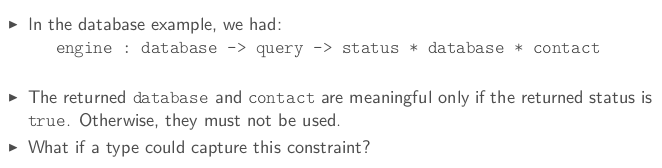
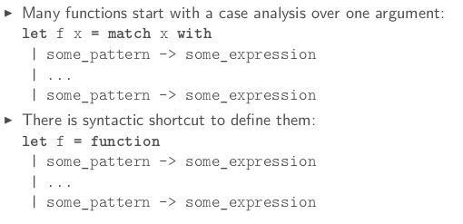
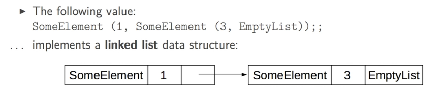
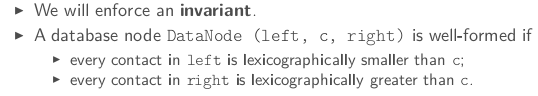

Title: [OCaml MOOC] week3: MORE ADVANCED DATA STRUCTURES  
Date: 2016-11-21    
Slug: ocamlMOOC_wk3_advanced_ds  
Tags: OCaml   
Series: Introduction to Functional Programming in OCaml   
   
[TOC]  
  
Last week, we only defined *flat data structures* which are nice to aggregate values but quite limited when you try to structure values.   
  
This week: **algebraic datatypes**.  
  
1. TAGGED VALUES  
================  
  
  
  
⇒ change the return type to a type ``query_result``, which can be either of these:   
  
* an error  
* a new database (in case of successful insertion/deletion)  
* a contact and its index (in case of successful search)  
  
  
in ocaml, can define such a type (called **sum type**) by :   
  
```ocaml   
# type query_result =   
| Error  
| NewDatabase of database  
| FoundContact of contact*int;;  
```  
More generally, to define disjoint union of types:  
  
```ocaml   
type some_type_identifier =   
| SomeTag of some_type  
| ...  
| SomeTag of some_type   
```   
  
tag must start with uppercase letter  
  
Taga are also called **conscturcors**, grammar is like java constructors: ``SomeTag (some_expr, ..., some_expr)`` (the parenthesis can be omitted if only 1 expr is required)  
  
enumeration:   
  
``type color = Black | Gray | White;;``  
  
### observing tagged values  
  
must prvide an expression *for each possible case* of the value. A **case** is described by a pattern:   
``SomeTag (some_pattern, ..., some_pattern)``  
  
A branch is composed of a pattern an an expr separated by an arrow. ``some_pattern -> some_expr``  
  
**pattern matching **is a seq of branches:  
  
```ocaml   
match some_expr with  
| some_pattern -> some_expr  
|...  
| some_pattern -> some_expr   
```  
example:   
  
```ocaml   
let engine db query =   
  match query with  
    | Insert contact -> insert db contact  
    | Delete contact -> delete db contact  
    | Search name -> search db name;;   
```   
  
synatactic shortcut: **function** keyword (for functions with only 1 argument)   
  
  
  
**pitfalls**  
  
* ill-typed pattern  
* non-exhaustive case analysis  
  
  
These errors can be caught by the checker.   
  
  
  
2. RECURSIVE TYPES  
==================  
  
data structures with unbounded depth, ie, list/tree.   
  
For example, an integer list can be defined as:   
  
```ocaml   
# type int_list =   
  | EmptyList  
  | SomeElement of int * int_list;;  
type int_list = EmptyList | SomeElement of int * int_list  
```   
  
in the machine:   
  
  
functions on such datastruct usually use pattern matching:   
  
```ocaml   
# let rec length = function  
  |EmptyList -> 0  
  |SomeElement (x,l) -> 1 + length l;;  
val length : int_list -> int = <fun>  
```  
  
The predefined type in ocaml: ``t list``  
  
* empty list: ``[]`` ( ``[]`` is just a special tage corresponding to EmptyList)  
* head and tail: ``i::r`` ( ``::`` is just a special tage corresponding to SomeElement)  
* a list can be defined by enumeration: ``[some_expr; ...; some_expr]``  
* list concatenation: ``@``  
  
```ocaml   
# let rec length = function  
  | [] -> 0  
  | x::xs -> 1 + length xs;;  
val length : 'a list -> int = <fun>   
# length [1;2;3;];;  
- : int = 3  
# let rec rev = function  
  | [] -> []  
  | x::xs -> (rev xs)@[x];;  
val rev : 'a list -> 'a list = <fun>  
# rev [1;2;3;4];;  
- : int list = [4; 3; 2; 1]    
```  
   
the ``rev`` function above has quad-complexity → here is the tail rec version:   
  
```ocaml   
# let rec rev_aux accu = function  
| [] -> accu  
| x::xs -> rev_aux (x::accu) xs;;  
val rev_aux : 'a list -> 'a list -> 'a list = <fun>  
# let rev l = rev_aux [] l;;  
val rev : 'a list -> 'a list = <fun>   
```   
  
3. TREE-LIKE VALUES  
=============================  
  
  
the database type is formed in a (binary)tree-like fashion:   
  
```ocaml   
# type database =   
  | NoContact  
  | DataNode of database * contact * database;;  
type database = NoContact | DataNode of database * contact * database   
```   
  
impose the BST invariant:   
  
  
  
Now the functions insert/search/delete is BST fashion:   
  
4. CASE STUDY: A STORY TELLER  
=============================  
  
**type-directed** programming: writing the right type declaration is half success.   
  
define a story type (and other types:   
  
```ocaml   
type story = {  
  context: context;  
  perturbation: event;  
  adventure: event list;  
  conclusion: context;  
}  
  
and context = {characters: character list}  
  
and character = {  
  name: string;  
  state: state;  
  location: location;  
}  
  
and event =   
  | Change of character * state  
  | Action of character * action  
  
and state = Happy | Hungry  
  
and action = Eat | GoToRestaurant  
  
and location = Appartment | Restaurant;;   
```  
  
5. POLYMORPHIC ALGEBRAIC DATATYPES  
==================================  
  
parametric programming: example — list is parametrized by the element type.   
Hence in ``List`` module contains polymorphic functions.   
  
Good for code reuse.   
  
define your own polymorphic types, using '``a`` to indicate unkonw types:  
  
``type ('a1,...,1aN) some_type_identifier = some_type``  
  
example:  
  
```ocaml   
type 'a option =   
  | None   
  | Some of 'a;;  
type ('a, 'b) either =   
  | Left of 'a  
  | Right of 'b;;   
type square = {dimension: int);;  
type circle = {radius: int);;  
type shape = (square, circle) either;;  
```  
  
another example: bst:   
  
```ocaml   
type 'a bst =   
  | Empty   
  | Node of 'a bast * a' * 'a bst ;;  
  
let rec insert x = function   
  | Empty -> Node (Empty, x, Empty)  
  | Node (l, y, r) ->   
    if x=y then Node (l,y,r)   
    else if x<y then Node (insert x l, y, r)  
    else Node (l, y, insert x r);;    
```   
  
6. ADVANCED TOPICS  
==================  
  
### precise typing  
when 2 types have the same structure but different semantical meaning: a **sum type with only one constructor** can be useful to distinguish them.   
  
example:   
  
```ocaml   
type euro = Euro of float;;  
type dollar = Dollar of float;;  
let euro_of_dollar (Dollar d) = Euro (d /. 1.33);;  
let x = Dollar 4;;  
let y = Euro 5;;  
let valid_comparison = (euro of dollar x < y)   
```  
  
### disjunctive patterns  
  
Use or-patterns to factorize branches into a unique branch:   
  
``some_pattern_1 | some_pattern_2`` means observation of either pattern 1 or pattern 2.   
  
constraint: both must *contain the same identifiers*.   
  
ex:   
  
```ocaml   
let remove_zero_or_one_head = function  
  | 0::xs | 1::xs -> xs  
  | l -> l  
let remove_zero_or_one_head' = function  
  
| (0|1)::xs -> xs   
| l -> l   
```  
  
### as-patterns  
  
convenient ot *name a matched component*: ``some_pattern as x`` ( if the value can be observed using some_pattern, name it x)  
  
ex.   
  
```ocaml   
let rec duplicate_head_at_the_end = function  
  | [] -> []  
  | (x::_) as l -> l @[x]   
```  
  
### guard: pattern matching branch using `when`  
  
a **guard** (some bool-expression) can add an extra constraint to a pattern:  
  
ex.   
  
```ocaml   
let rec push_max_at_the_end = function  
  | ([] | [_]) as l -> l  
  | x::((y::_) as l) when x<=y -> x::(push_max_at_the_end l)  
  | x::y::ys -> y::push_max_at_the_end (x::ys);; (*when x>y, should permuate x and y*)   
```    
