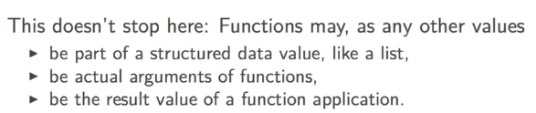
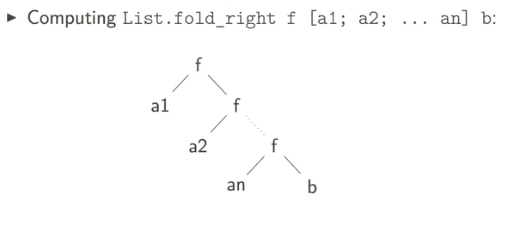
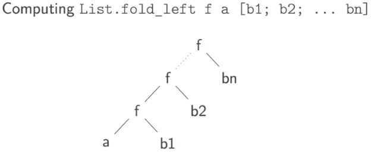

Title: [Ocaml MOOC] week4: HIGHER ORDER FUNCTIONS  
Date: 2016-11-22    
Slug: ocamlMOOC_wk4_higher_order_fun  
Tags: ocaml   
Series: Introduction to Functional Programming in OCaml 
   
[TOC]  
  
  
1. FUNCTIONAL EXPRESSIONS  
=========================  
syntax for functional expr: ``function some_identifier -> some_expr``  
the type of the functional expr is ``t1 -> t2`` where t1 is the type of some_identifier, t2 is type of some_expr  
  
ex.   
  
```ocaml   
function x -> x + 1;;  
(function x -> 2*x) 5;; (*annonymous function*)   
```  
the previous way of defining function:   
  
``let f x = e``,   
  
is just an abbreviation for common let-binding:   
  
``let f = function x -> e``  
  
In fact, the most general form of a function definitoin contains a seq of pattern matching:   
  
```ocaml   
function   
  | pattern_1 -> expr_1  
  | pattern_2 -> expr_2   
```  
  
When only 1 pattern, the ``|`` is omitted.  
  
example   
  
```ocaml   
let rc length = function   
  | [] -> 0  
  | _::r -> 1 + length r;;  
type expr =   
  | Int of int  
  | Add of expr * expr;;  
let rec eval = function   
  | Int n -> n  
  | Add(e1, e2) -> (eval e1) + (eval e2);;   
```  
  
2. FUNCTIONS AS FIRST-CLASS VALUES  
==================================  
  
functional types are just values of a particular type, thus this allows the uniform way of naming a value let x = ...   
  
Types govern function application. We can apply e1 to e2 when:   
  
* e1 has type t1 -> t2  
* t1 matchs the type of e2  
  
  
  
```ocaml   
let f1 = [(function x -> x+1); (function x -> 2*x)];;  
(List.hd fl) 17;;  
  
let apply_twice f x = f (f x);;  
apply_twice (function x -> 2*x) 1;;  
let rec apply_n_times f n x =   
  if n<=0 then x  
  else apply_n_times f (n-1) (f x);;  
apply_n_times (function x -> 2*x) 10 1;;  
  
let compose f g = (function x -> f (g x));;  
let fg = compose (function x->x+1) (function x->2*x) in  
fg 10;;   
```  
  
### function pitfalls  
  
function apply from left to right (*function application associates to the left*):   
  
``exp1 exp2 exp3``   
is equivalent to: ``(exp1 exp2) exp3``  
  
```ocaml   
let double = function x -> 2*x;;  
double double 5;;  
double (double 5);;   
```  
  
3. FUNCTIONS WITH MULTIPLE ARGUMENTS  
====================================  
  
anonymous function with several arguments: use keyword ``fun``:  
``fun p1 ... pn -> exp``  
  
unlike ``function`` keyword, ``fun`` *only admits one case/branch*  
  
remark: funs with several arguments are just abbrevations for single-argument functions that returns a function:  
  
```ocaml   
let f1 = function n -> (function x -> n+x);;  
(f1 17) 73;;  
f1 17 73;;  
let f2 = fun n x -> n+x;;  
f2 17 73;;  
(f2 17) 73;;   
```  
  
in fact, ``fun x1 ... xn -> e`` is just abbreviation for: ``function x1 -> (..(function x2 -> ... -> (function xn -> e)..)``  
  
  
4. PARTIAL FUNCTION APPLICATION  
===============================  
  
``let f = fun x y -> exp`` is equivalent to: ``let f = function x -> (function y -> exp)``  
  
⇒ partially apply f (ie, ``f x``) will give a function.    
  
```ocaml   
let f1 = fun x y x -> x + y *z;;  
let f2 = f1 1;;  
let f3 = f2 2;;  
f3 4;;   
```  
  
what happens at func-application:  
when applying ``f = function x->e`` to ``a``:  
→ evaluate ``e`` in the context ``x=a``  
→ the arrow ``->`` will **block** any evaluation  
  
```ocaml   
let f = fun x y -> (x / 0) + y;;  
let f2 = f1 17;; (*error will not happen here, as the `->` blocks the evaluation!*)  
f2 42;;   
```  
  
### partial evaluation  
  
sometimes we can do part of a calculation as soon as we have the frist few arguments   
⇒ extract that part of calculation before the arrow !   
  
```ocaml   
let egal l1 l2 =   
  List.sort compare l1 = List.sort compare l2;;  
let egalp l1 =   
  let l1sorted = List.sort compare l1 in (*sort the 1st argument before going to the next functional abstraction*)  
  function l2 -> l1sorted = List.sort compare l2;   
```	    
  
  
5. MAPPING FUNCTIONS ON LISTS  
=============================  
  
many useful functions in the ``List`` module, either ``open List`` at beginning, or with pointed notation (``List.hd``)  
  
### implementation  
  
```ocaml   
let rec map f = function  
  | [] -> []  
  | h::r -> (f h):(map f r);;  
map (function x -> x*x) [1;2;3;4;5];;  
  
let map2 f l1 l2 = match (l1, l2) with  
  | [],[] -> []  
  | h1::r1, h2::r2 -> (f h1 h2)::(map2 f r1 r2)  
  | _ -> raise (Invalid_argument "List.map2");;  
map2 (fun x y -> x+y) [1;2;3] [10;20;30];;   
```  
  
### examples  
example1: int vectors/matrices  
  
row vector: int list  
matrix: list of row vectors  
turn infix operators into functions : using parentheses ``(+) (/) ( * )`` ...(note: spaces are necessary for ``*``, otherwise this turns into comments...  
  
```ocaml   
let vsum  = List.map2 (+);; (* use partial application *)  
vsum [1;2;3] [10;20;30];;  
let msum = List.map2 (List.map2 (+));; (* nested partial application *)  
msum [[1;2;]; [3;4]] [[10;20]; [30;40]];;   
```  
  
example2: get *all sublists* of a list  
type: ``a' list -> 'a list list``  
write using induction:   
  
```ocaml   
let rec sublists = function   
  | [] -> [ [] ]  
  | h::r ->   
        let rp = sublists r  
        let appendh = function lst -> h::lst in  
        rp @ (map appendh rp)   
```  
  
6. FOLDING FUNCTIONS ON LISTS  
============================  
  
  
  
* map: apping a *unary* function on list, all elements considered isolated.   
* folding: combining all elements of a list using a *binary operator*.   
* 2 different ways of folding: fold-left/fold-right  
  
  
### fold_right  
``fold_right: ('a -> 'b -> 'b) -> 'a list -> 'b -> 'b ``  
  
  
  
implementation and usage:   
  
```ocaml   
let rec fold_right f l b = match l with   
  | [] -> b  
  | h::r ->  f h (fold_right f r b);;  
fold_right (+) [1;2;3;4] 0;;  
let concat = fold_right (fun x y -> x::y);; (partial application of fold_right)  
concat [1;2;3] [3;4;5];;   
```  
  
### fold_left  
 ``fold_left: ('a -> 'b -> 'a) -> 'a -> 'b list -> 'a``   
note: the default value's position is different from that of fold_right !   
  
  
  
```ocaml   
let rec fold_left f a l = match l with  
  | [] -> a  
  | h::r -> fold_left f (f a h) r;;  
fold_left (+) 0 [1;2;3];;  
let reverse = fold_left (fun x y -> y::x) [];; (* partial application *)  
reverse [1;2;3;4];;   
```   
   
  
### examples  
  
example1: Inner product of int vectors   
first get pairwise product, then sum up.   
  
```ocaml   
let product v1 v2 = List.fold_left (+) 0 (List.map2 ( * ) v1 v2);;  
product [1;2;3] [4;5;6];;   
```  
example2: countif  
  
```ocaml   
let countif p l = List.fold_left   
  (fun acc elem -> if p elem then acc+1 else acc) 0 l;;  
countif (fun x-> x>0) [3;1;-2;0;4];;   
```  
