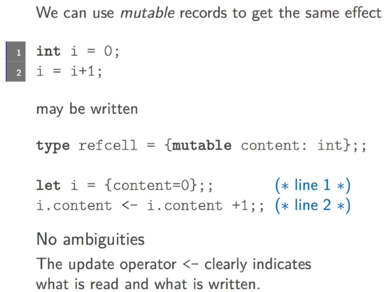

Title: [OCaml MOOC] week5: EXCEPTIONS, INPUT OUTPUT AND IMPERATIVE CONSTRUCTS  
Date: 2016-11-23    
Slug: ocamlMOOC_wk5_imperative  
Tags: OCaml   
Series: Introduction to Functional Programming in OCaml 
   
[TOC]  
  
  
1. IMPERATIVE FEATURES IN OCAML  
===============================  
  
functional language:   
  
* immutable data structure  
* identifiers instead of variables  
* pure functions  
  
  
but imperative features are useful:   
  
* exceptions to alter control flow  
* ops to consume input and output  
* *mutable* data structures  
* for and while loop for iterations  
  
  
2. GETTING AND HANDLING YOUR EXCEPTIONS  
=======================================  
  
  
* exceptions in ocaml are just constructors of a special sum type  ``exn``.  
* the constructors can have arguments  
* new exception can be defined *at any time*  
* unlike usual sum types, ``exn`` can be extended  
* but exception *can't* be polymorphic  
  
  
### raise exception  
to define an exception sum type: ``exception E;;``  
to raise exceptions: ``raise E;;``  
when an exception is raise, *any computation is immediately stopped*: ``let _ = raise E in [1;2;];;``  
  
example:   
  
```ocaml   
exception EmptyList;; (*define an exn value*)  
let head = function   
  | a::r -> a  
  | [] -> raise EmptyList;;  
head [1;2;3];;  
head [];;  
```  
  
### handling exceptions  
using ``try-with`` to capture exceptions  
  
```ocaml   
try   
  expr  
with  
  | p1 -> e1  
  | p2 -> e2   
```  
  
* ``expr`` is evaluated,  
* if during evaluation of ``expr``, any ``E`` is raised, then it's matched with patterns in the ``with`` clause  
* if E matches ``pi``, then evaluate expression ``ei``  
* note: all the ``ei``s must have the same type as ``expr``  
  
  
example: mul elements of a list, once encountered a 0, stop the computation.   
  
```ocaml   
let rec multl = function   
  | [] -> 1  
  | a::rest -> if a=0 then 0 else a*(multl rest);;  
(*the above implementation is not efficient: if 0 is at the end, then have to   
pop the whole stack and get 0 at the end *)  
  
(*using exceptions to directly return as soon as we get a 0   
(and throw away the stack) *)   
exception Zero;;  
let mullexc l =   
  let rec aux = function  
    | [] -> 1  
    | a::rest -> if a=0 then raise Zero else a*(aux rest)  
  in  
  try   
    aux l   
  with Zero -> 0;;    
```   
  
### runtime errors  
runtime errors can be:  
  
* div by 0  
* incomplete pattern matching  
* out-of-bound  
  
  
In these cases, ocaml raise an exception.   
  
   
  
3. GETTING INFORMATION IN AND OUT  
=================================  
  
### the unit type  
  
* has only 1 value: ``()``  
* often used as input/output type for funcitons with side effects  
  
  
### Simple input/output  
  
* ``print_int``: print out an integer  
* ``read_line``: read one line of string  
* other similar funs...   
  
```ocaml   
# print_int;;  
- : int -> unit = <fun>  
# print_int 123;;  
123- : unit = ()  
# read_line;;    
- : unit -> string = <fun>  
# read_line ();;  (* give the func a parameter *)       
hello  
- : string = "hello"   
```  
  
4. SEQUENCES AND ITERATIONS  
===========================  
  
### sequences of expressions  
ex. print several values.   
  
```ocaml   
let _ = print_int 1 in  
let _ = print_int 2 in   
let _ = print_int 3;;   
```  
  
cleaner way: separate such expressions just by single semi-colon:   
  
```ocaml   
print_int 1;  
print_int 2;  
print_int 3;   
```  
  
  
* expression sequence: ``e1; e2; ...; en``  
* eval ei in turn  
* drops all internal results, return the last expression  
* *all* intermediate exprs should be of type ``unit`` (otherwise warning)  
* note: precedence of ``;``:  
  
``if true then print_int 1; print_int 2;;``  
either use parentheses or use begin-end:   
``(e1; ...; en)``  
or: ``begin e1; e2;... en end``  
  
  
### iterations  
ex. print all integers from 1 to 10   
  
can define a recursive ``foreach`` function:   
  
```ocaml   
# let foreach starti endi f =   
  let rec aux n = if n <= endi then (f n; aux (n+1)) else ()   
  in aux starti;;  
val foreach : int -> int -> (int -> 'a) -> unit = <fun>  
# foreach 1 10 print_int;;  
12345678910- : unit = ()   
```    
  
**for loop**  
  
an easier way: ``for`` loop  
  
```ocaml   
# for i = 1 to 10 do  
  print_int i  
done;;  
12345678910- : unit = ()   
```   
  
* ``for id = e1 to e2 do e3 done``  
* the ``id`` cannot be altered  
* loop body ``e3`` is evaluated for each value of ``id``  
* type of the for loop is ``unit``  
* loop body e3 is expected to be ``unit`` (warning otherwise)  
  
  
alternative: backward for-loop  
  
```ocaml   
for i=10 downto 1 do  
print_int i   
done;;   
```  
  
**while loop**  
  
  
* ``while e1 do e2 done``  
* condition ``e1`` is evaluated, if true, the body ``e2`` is evaluated  
* type of the while loop is ``unit``, body ``e2`` expected to be ``unit``  
  
  
to ignore the warning when loop body is not unit: use ``ignore :'a -> unit`` function  
  
5. MUTABLE ARRAYS  
=================  
the (immutable) array:   
  
* fixed size  
* access to elements via index  
* constant time for accessing element  
* well-adapted to loop constructs   
  
  
example: find cubes which are also squares:   
  
```ocaml   
let cubes n = Array.init n (fun i -> i*i*i);;  
let sqrti n = truncate (sqrt (float n)) (*get sqrt of an integer*);;  
let issquare n = let s = sqrti n in s*s = n;;  
let squaresubes n =   
  let c = cubes n in   
  for i = 0 to n-1 do  
    if issquare c.(i) then   
    (print_int c.(i); print_string " ")  
  done;;   
```  
  
ocaml arrays are *real* arrays: each cell can be modified in place using ``<-`` operator  
  
  
* in-place modification: ``e1 <- e2``  
* ``e1`` denotes a mutable value  
* type of the opeartion is ``unit``  
  
```ocaml   
let a = [|0;1;2;3;4|];;  
a.(0);;  
a.(0) <- 100;;  
a.(0);;   
```  
  
example: rotate array   
  
```ocaml   
let rotate a =   
  let n = Array.length a in  
  let v = a.(0) in   
  for i = 0 to n-2 do   
    a.(i) <- a.(i+1)  
  done;  
  a.(n-1) <- v;;   
```   
  
6. MUTABLE RECORD FIELDS  
========================  
  
records: tuples with distinct name components.   
  
```ocaml   
some_type_identifier = {field_name_1: some_type1; ...; filed_name_n: some_typen}  
let r = {field_name_1 = e1; ...; field_name_n = en}   
```  
  
example:  
  
```ocaml   
type point2D = {x:int; y:int};;  
let origin = {x=0; y=0};;  
let offset_h p dx = {p with x = p.x+dx};; (*create a new point*)  
let offset_v p dy = {p with y = p.y+dy};;   
```  
  
we can define some fields of a record to be mutable:   
``type some_type_identifier = {...; mutable field_name_i: some_type_i;...}``  
these mutable fields can be modified in place using ``<-``  
  
```ocaml   
type point2D = {mutable x:int; mutable y:int};   
let origin = {x=0; y=0};;  
let move p dx dy = p.x <- p.x+dx; p.y <- p.y+dy;; (* modify p in place*)  
move origin 2 2;;   
```  
  
7. VARIABLES, AKA REFERENCES  
============================  
  
  
  
more consise way:   
  
* the predefined ``ref`` type (that wraps the above): '``a ref = {mutable contents: 'a)``  
* the ``ref`` function: '``a -> 'a ref``  
* ``!r``: prefix operator to read the contents of the reference ``r``  
* ``r:=v``: update the content of the reference  
  
```ocaml   
# let i = ref 0;;  
val i : int ref = {contents = 0}  
# i;;  
- : int ref = {contents = 0}  
# i := !i + 1;;        
- : unit = ()  
# i;;  
- : int ref = {contents = 1}   
```  
  
example: log2 of an integer  
  
```ocaml   
let log2int n =   
  let count = ref 0 and v = ref n in   
  while !v > 1 do  
    count := !count + 1;  
    v := !v / 2  
  done;  
  !count;;   
log2int 16;;  
```  
       
example 2: read int list from stdin  
  
```ocaml   
# let read_int () = in_of_string (read_line());;  
  
# let read_intlist () =   
  let l = ref [] in  
  let doread () =   
    try  
      while true do l := (read_int()) :: !l done  
    with _ -> ()   
  in doread ();  
  List.rev !l;;  
# read_intlist ();;  
1                                                                               2                                                                               3                                                                                 
4  
5  
6  
^C- : int list = [1; 2; 3; 4; 5; 6]   
```   
  
  
  
