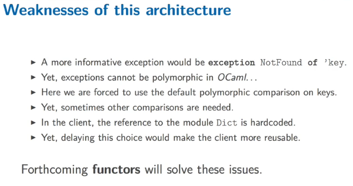

Title: [OCaml MOOC] week6: MODULES AND DATA ABSTRACTION  
Date: 2016-11-26    
Slug: ocamlMOOC_wk6_modules  
Tags: OCaml   
Series: Introduction to Functional Programming in OCaml 
   
[TOC]  
  
this week: programming-in-the-large using the module system of OCaml.  
  
1. STRUCTURING SOFTWARE WITH MODULES  
====================================  
  
in large project: mangage high number of definitions → abstractions built on top of other abstractions.   
  
  
* layers of abstractions: hide information  
* divide program into components  
* identifiers organised to avoid naming conflicts  
  
  
### module as namespace  
dot-notation: access module component.   
  
ex. ``List.length``   
or first ``open List`` then just call ``length``   
if open 2 modules having identical identifiers, the last opened module will be used.   
  
to define a module:   
  
```ocaml   
module SomeModuleIdentifier = struct  
  (* a seq of definitions *)  
end  
```   
  
  
* module name: start with an upper case  
* to alias a module: ``module SomeModuleIdentifier = SomeOtherModuleIdentifier``  
  
```ocaml   
# module Stack = struct  
  type 'a t = 'a list  
  let empty = []  
  let push  x s = x::s  
  let pop = function   
    | [] -> None  
    | x::xs -> Some (x,xs)  
end;;  
              module Stack :  
  sig  
    type 'a t = 'a list  
    val empty : 'a list  
    val push : 'a -> 'a list -> 'a list  
    val pop : 'a list -> ('a * 'a list) option  
  end  
# let s = Stack.empty;;  
val s : 'a list = []  
# let s = Stack.push 1 s;;  
val s : int list = [1]  
# let x,s =   
  match Stack.pop s with   
    | None -> assert false  
    | Some (x,s) -> (x,s);;  
val x : int = 1  
val s : int list = []  
# let r = Stack.pop s;;  
val r : (int * int list) option = None   
```	  
	  
  
  
### hierachical module structure  
  
* a module can contain other module definitions  
* a signature can also contain module signatures  
* if module ``B`` is inside ``A``, use ``A.B`` to get its namespace  
  
```ocaml   
module Forest = struct  
  type 'a forest = 'a list  
  module Tree = struct  
    type 'a tree =   
        Leaf of 'a   
        | Node of 'a tree forest  
  end   
end;;  
open Forest.Tree;;  
let t = Leaf 42;;   
```  
  
2. INFORMATION HIDING  
=====================  
a module should come with some user manual ("contract") to indicate to clients:  
  
1. function preconditions that must be verified  
2. data invariants that must be preserved  
3. definitions that user must not rely on (cause they'll change in the future)  
  
  
a module signature represents this contract, *the type checker will enforce point 2 and 3*.   
  
### module signatures  
  
* a module's type is called **signature** or **interface**  
* programmer *can* force a module to have a specific signature  
  
  
to define a signature:   
  
```ocaml   
module type sig   
  (* a seq of declarations of following form:*)  
  val some_identifier: some_type  
  type some_type_identifier = some_type_definition  
  exception SomeException of some_type  
end   
```  
  
to construct a module with a specific signature:   
  
``module M: sig ... end = struct ... end``  
  
to name a signature:   
  
``module type S = sig ... end``  
  
then use this name to annotate module:   
  
``module M:S = struct ... end``   
  
example: natural numbers  
  
```ocaml   
module Naturals: sig  
  (* Invariant: A value of type t is a positive integer *)  
  type t = int  
  val zero: t  
  val succ: t -> t  
  val pred: t -> t  
end = struct  
  type t = int  
  let zero = 0   
  let succ n = if n=max_int then 0 else n+1  
  let pred = function   
 |0 -> 0   
 | n -> n-1  
end ;;   
```  
  
### abstract types  
  
we can use the module normally:  
  
```ocaml   
open Naturals;;  
let rec add: t -> t -> t =   
fun x y ->   
if x = zero then y else succ (add (pred x) y);;   
```  
  
but the invariant can be easily broken:   
  
```ocaml   
let i_break_the_abstraction = pred (-1);;   
```  
  
This don't have compiler error, as the type of pred is ``int``, we can pass any ``int`` to it.   
  
⇒ use **abstract types** that will give no choice to the client but to respect the rule.   
  
in the signature:   
  
```ocaml   
module Naturals: sig  
  (* Invariant: A value of type t is a positive integer *)  
  type t (* remove the type value of t in the signature *)  
  val zero: t  
  val succ: t -> t  
  val pred: t -> t  
end   
```  
  
then calling pred (-1) will cause an error.   
  
→ we have hiddent the definition of the type t  
the sig don't publish t's implementation anymore, so the checker ensures clients can't use that fact  
t is called an **abstract type**.  
  
  
With abstract type, users can't do pattern matching, to allow pattern matching while forbidding the direct application of data constructors, OCaml provides a mechanism called **private types**. see [here](http://caml.inria.fr/pub/docs/manual-ocaml-400/manual021.html#toc76).  
  
  
3. CASE STUDY: A MODULE FOR DICTIONARIES  
========================================  
  
An example of using abstract types to increase the modularity of programs.   
  
Define a dictionary signature:  
  
```ocaml   
module type DictSig = sig  
  type ('key, 'value) t = ('key*'value) list (* internal repr of the dict is exposed@ *)  
  val empty: ('key, 'value) t  
  val add: ('key, 'value) t -> 'key -> 'value -> ('key, 'value) t  
  exception NotFound  
  val lookup: ('key, 'value) t -> 'key -> 'value  
end;;  
  
module Dict: DictSig = struct  
  type ('key, 'value) t = ('key*'value) list  
  (*......implementation *)  
end;;   
```  
  
Then a client can use this module:   
  
```ocaml   
module ForceArchive = struct   
  let force = Dict.empty  
  let force = Dict.add force "luke" 10  
  let force = Dict.add force "yoda" 100  
  let force_of_luke = Dict.lookup force "luke"  
  let all_jedis = List.map fst force (* here client knows that dict is a list!*)  
end;;   
```  
  
This is not very good if the internal implemtation of Dict is changed into   
  
For instance, change the implemention into a BST:  
  
```ocaml   
type ('key, 'value) t =   
  | Empty  
  | Node of ('key, 'value) t * 'key * 'value * ('key, 'value) t  
```  
  
→ change the signature of module to abstract type.   
  
  
  
4. FUNCTORS  
===========  
*Functors are functions from modules to modules. In other words, a functor is a module parameterized by another module.*   
  
Continue the last example, we want to choose a Dict implementation externally. → **module functor**  
  
To declear a functor, add the Dict module in the parameter  
  
```ocaml   
module ForceArchive (Dict: DictSig) = struct   
  let force = Dict.empty  
  let force = Dict.add force "luke" 10  
  let force = Dict.add force "yoda" 100  
  let force_of_luke = Dict.lookup force "luke"  
end;;   
```  
  
Then we can call the explicit implementation in the client:   
  
```ocaml   
module Dict_list: DictSig = struct   
...  
end;;  
module Dict_bst: DictSig = struct  
...  
end;;  
  
module Client1 = ForceArchieve (Dict_list)  
module Client2 = ForceArchieve (Dict_bst)   
```   
  
  
* a functor is a module waiting for another module  
* syntax:   
  
``module SomeModuleIdentifier (SomeModuleIdentifier: SomeSignature) = struct ... end;;``  
  
* to apply a functor to a module: ``SomeModuleIdentifier (SomeModule)``  
* signature of a functor:  
  
``functor (ModuleIdentifier: SomeSignature) -> sig ... end``  
  
  
### example: Set and Map  
  
They expects a module satisfying the following signature:   
  
```ocaml   
module type OrderedType = sig  
  type t  
  val compare: t -> t -> int  
end   
```  
  
Once a module ``E`` has this signature,   
  
* ``Set.Make (E)`` offers over sets of ``E.t`` elements  
* ``Map.Make (E)`` ....  
  
  
type parameterization of exception can be done using functor.   
  
In signature declaration:   
  
```ocaml   
module type DictSig = sig  
  (* before: type ('key, 'value) t *)  
  type key (* make the key not polymorphic *)  
  type 'value t  
  val empty: 'value t  
  val add : 'value t -> key -> 'value -> 'value t  
  exception NotFound of key (* parameterize exception type in signature *)  
  val lookup: 'value t -> key -> 'value  
end;;   
```  
  
In the implementation make the module a *functor*: add the Key module as argument  
  
```ocaml   
module Dict(Key: sig   
  type t  
  val compare: t -> t -> int  
end) : DictSig = struct   
  type key = Key.t (* key is the type of the Key module *)   
  ...  
end;;   
```  
    
(... don't quite get it......)  
  
*type constraint*: ``DictSig with key=string``  
  
  
