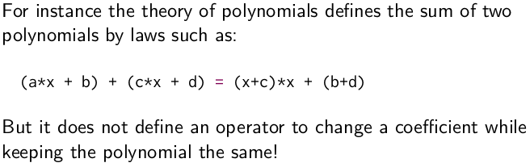
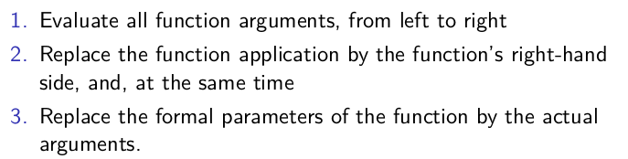
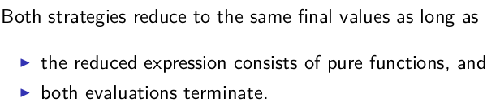
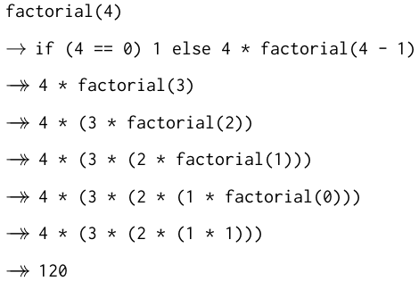

Title: [Scala MOOC I] Lec1: Functions & Evaluation  
Date: 2016-06-21  
Slug:  progfun1_lec1_fun_and_eval  
Tags: scala  
Series: Functional Programming Principles in Scala
 
   
>In this week, we'll learn the difference between functional imperative programming. We step through the basics of Scala; covering expressions, evaluation, conditionals, functions, and recursion  
  
1.1 - Programming Paradigms  
---------------------------  
imperative programming:  
  
* modify mutable variables  
* using assignments  
* control structures: if-else, loops, break, continue, return, etc.  
  
~~~> Von Neumann computer:  
    
   
  
*conceptualize data structures word-by-word. ⇒ need higher level abstractions (theories).*  
  
    
   
  
**theory doesn't describe mutations!**  
ex. theories of polynomials  
    
  
  
To implement high-level concepts following their math theories, **there's no place for mutation**.  
    
  
  
**Functional programming**  
    
  
functions in FP language are 1st-class citizens.  
  
1.2 - Elements of Programming  
-----------------------------  
in a language:  
  
* primitive expressions  
* operators to combin expressions  
* abstract expressions: introduce a name for an expression  
  
  
primitive types in scala are written capatilized:   
    
  
  
### REPL  
interactive shell: write expressions and respond its value  
  
### Evaluation  
evaluation: **expression → value**  
evaluation stops onces it results in a *value.*  
  
**evaluate non-primitive expressions:**  
  
* take the left-most operator  
* take (left and right) operands   
* apply the operator to operands  
  
  
**evaluate names:**  
replace the name with the rhs of its *definition.*  
  
definitions can have parameters.  
ex. variable/return types are *after* their names, seperated by a ``:``  
``def power(x: Double, y: Int): Double = ...``   
  
**evaluate a parameterized function:**  
    
  
    
  
  
This scheme is called "**substition model**" — formalized in the lambda calculus. This can be applied as long as there is no *side effects*(ex. modify variable ``c++``)*.*   
  
**Termination**  
Q: does every expression evaluates to a value?   
NO, ex.   
``def loop: Int = loop``  
  
**change evaluation strategy**  
do *not* reduce argument values before rewrite function application.  
    
  
  
call-by-name and call-by-value  
------------------------------  
the above evaluation schemes.   
  
* call-by-value: reduce argument values before rewrite function application.  
  
advantage: it evaluates every function argument only once.  
  
* call-by-name: do not reduce arg values  
  
advantage: a function argument is not evaluated if the corresponding parameter is unused in the evaluation  
of the function body.  
  
ex.  
    
  
  
1.3 - Evaluation Strategies and Termination  
-------------------------------------------  
CBV and CBN:  
    
  
    
  
  
ex.   
  
	def first(x: Int, y: Int) = x  
	first(1, loop)  
  
  
in scala:   
  
* normally use call-by-value (more efficient than call-by-name because it avoid repeated computation of CBN).  
* but: **if a  **``=>``** before a parameter type**, that parameter is called *by-name*.  
  
  
ex.   
  
	def constOne(x: Int, y: => Int) = 1  
	constOne(1+2, loop)  
	constOne(loop, 1)  
  
  
1.4 - Conditionals and Value Definitions  
----------------------------------------  
  
### conditional expressions  
the ``if-else`` expression  
the ``if-else`` is an expression, not statement.  
ex. ``def abs(x: Int): Int = if (x>=0) x else -x``  
the ``x>=0`` is a boolean expression, sometimes called **predicates**.  
  
### CBN and CBV for definition  
  
* ``def`` form is by name, its rhs is evaluated at each use  
* ``val`` is by value, evaluted at the definiton  
  
ex.  
   
	scala> def loop:Boolean = loop  
	loop: Boolean  
	  
	scala> def x = loop  
	x: Boolean  
	  
	scala> val x = loop  
	Execution interrupted by signal.  
  
  
exercice: implement ``and(x,y)``  
  
	scala> def and(x:Boolean, y: => Boolean) = if(x) y else false  
	and: (x: Boolean, y: => Boolean)Boolean  
	  
	scala> and(false, loop)  
	res3: Boolean = false  
  
  
1.5 - Example: square roots with Newton's method  
------------------------------------------------  
    
  
  
``def sqrt(x: Double): Double = ...``  
  
need helper (recursive) functions.   
  
note: in scala the *return type of recursive functions* must be given.  
  
	def improve(guess: Double, x: Double): Double =  
	  (x / guess + guess) / 2.0  
	  
	def isGoodGuess(guess: Double, x: Double): Boolean =  
	  math.abs((guess * guess - x)/x)<0.001  
	  
	def sqrtItr(guess: Double, x: Double): Double = {  
	  if (isGoodGuess(guess, x)) guess  
	  else sqrtItr(improve(guess, x), x)  
	}  
	  
	def sqrt(x:Double): Double = sqrtItr(1, x)  
  
  
  
1.6 - Blocks and Lexical Scope  
------------------------------  
  
### nested functions  
put aux functions inside a function.   
  
	def sqrt(x:Double): Double = {  
	  def improve(guess: Double, x: Double): Double =  
	    (x / guess + guess) / 2.0  
	  
	  def isGoodGuess(guess: Double, x: Double): Boolean =  
	    math.abs((guess * guess - x)/x)<0.001  
	  
	  def sqrtItr(guess: Double, x: Double): Double = {  
	    if (isGoodGuess(guess, x)) guess  
	    else sqrtItr(improve(guess, x), x)  
	  }  
	  
	  sqrtItr(1, x)  
	}  
  
  
### blocks and visibility  
blocks: delimited by braces ``{...}``  
The last element of a block is an expression that defines its value.  
Blocks are themselves expressions; *a block may appear everywhere an expression can*.  
  
    
   
  
ex.  
  
	val x = 0  
	def f(y: Int) = y +1  
	val result = {  
	  val x = f(3);  
	  x * x  
	} + x // result = 16  
  
ex. eliminate the parameter ``x`` of helper functions inside the ``sqrt`` function  
  
	def sqrt(x:Double): Double = {  
	  def improve(guess: Double): Double =  
	    (x / guess + guess) / 2.0  
	  
	  def isGoodGuess(guess: Double): Boolean =  
	    math.abs((guess * guess - x)/x)<0.001  
	  
	  def sqrtItr(guess: Double): Double = {  
	    if (isGoodGuess(guess)) guess  
	    else sqrtItr(improve(guess))  
	  }  
	  
	  sqrtItr(1)  
	}  
  
about multiline expressions: put the operator in the first line to avoid ambguity.   
    
  
  
1.7 - Tail Recursion  
--------------------  
review: evaluation of function application.   
    
  
    
  
  
ex1. gcd  
  
	def gcd(a:Int, b:Int): Int=  
	  if(b==0) a else gcd(b, a%b)  
    
  
  
ex2. factorial  
  
	def factorial(n:Int): Int =  
	  if(n==0) 1 else n*factorial(n-1)  
  
  
    
  
  
difference from the ``gcd`` case:   
  
* in ``gcd``, the expression is reduced to a ``gcd()``  
* in ``factorial``, *add one more element to the expression in each step*!  
  
  
### tail recursion  
if **a function calls itself  as its last action**, then the function's stack can be reused.   
⇒ tail recursion functions are iterative process.   
  
In general, if **the last action of a function consists of calling a function (which may be the same)**, one stack frame would be sufficient for both functions. Such calls are called *tail-calls*.  
  
tail-recursive function:   
  
* more efficient  
* can avoid stackoverflow  
* might not be as clear as a non-tailrec version   
  
  
add ``@tailrec ``annotation to the function, if its not tailrec, an error will be shown.    
  
	@tailrec  
	def gcd(a: Int, b: Int): Int = ...  
  
exercice: turn factorial into tailrec fashion.   
→ idea: use an **accumulator **(partial result) ``acc`` .  
  
	def factorialTR(n:Int):Int = {  
	  @tailrec  
	  def fact(n:Int, acc:Int):Int = {  
	    if(n==0) acc  
	    else fact(n-1, n*acc)  
	  }  
	  fact(n, 1)  
	}  
  
  
Programming Assignment: Recursion  
---------------------------------  
三道递归的练习题...  
  
	  /**  
	    * Exercise 1  
	    */  
	  def pascal(c: Int, r: Int): Int = {  
	    if (c == 0 || c == r) 1  
	    else pascal(c, r - 1) + pascal(c - 1, r - 1)  
	  }  
	  
	  /**  
	    * Exercise 2  
	    */  
	  def balance(chars: List[Char]): Boolean = {  
	    def balance_rec(chars: List[Char], acc: Int): Boolean = {  
	      if (acc<0) false  
	      else if (chars.isEmpty) acc == 0  
	      else if (chars.head == '(') balance_rec(chars.tail, acc+1)  
	      else if (chars.head == ')') balance_rec(chars.tail, acc-1)  
	      else balance_rec(chars.tail, acc)  
	    }  
	  
	    balance_rec(chars, 0)  
	  }  
	  
	  /**  
	    * Exercise 3  
	    */  
	  def countChange(money: Int, coins: List[Int]): Int = {  
	    if(money==0 ) 1  
	    else if(coins.isEmpty || money<0) 0  
	    else countChange(money, coins.tail) + countChange(money-coins.head, coins)  
	  }  
