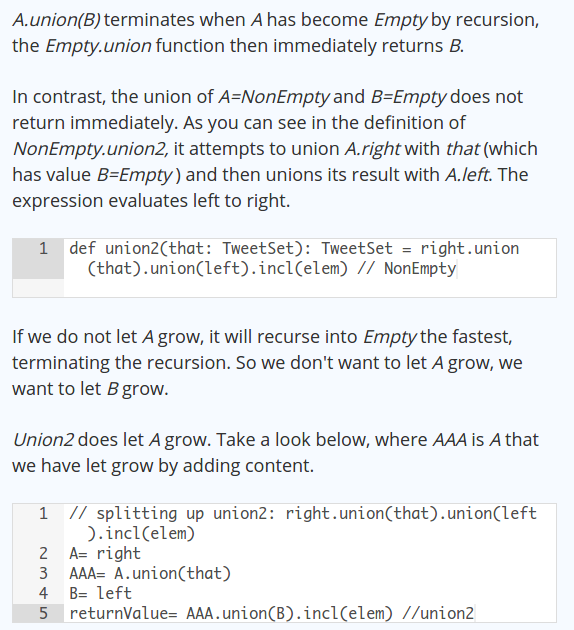
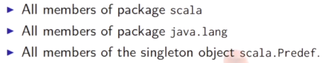
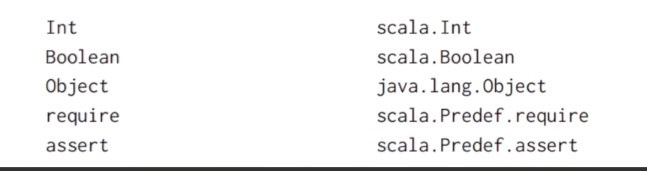
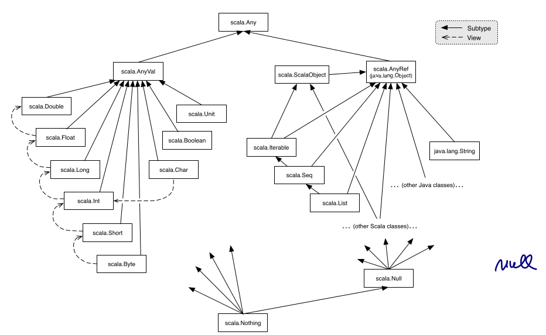
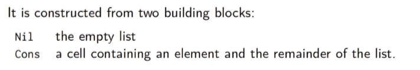
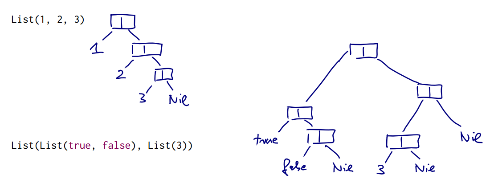
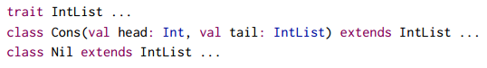
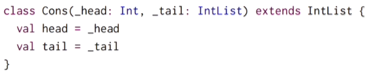
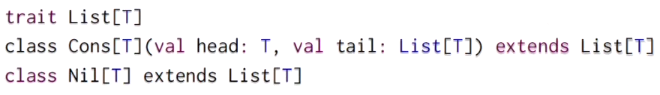
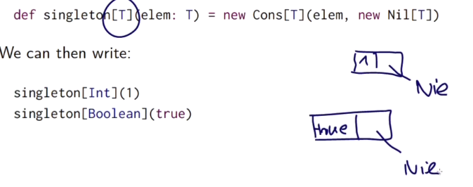

Title: [Scala MOOC I] Lec3: Data and Abstraction 
Date: 2016-06-28    
Slug:  progfun1_lec3_data_abstraction 
Tags: scala    
Series: Functional Programming Principles in Scala 
 
[TOC]
 
This week, we'll cover traits, and we'll learn how to organize classes into hierarchies. We'll cover the hierarchy of standard Scala types, and see how to organize classes and traits into packages. Finally, we'll touch upon the different sorts of polymorphism in Scala. 
 
3.1 - Class Hierarchies 
----------------------- 
 
### abstract class 
 
	abstract class IntSet { 
	  def incl(x: Int): IntSet 
	  def contains(x: Int): Boolean 
	} 
 
abstract class:  
 
* contains members without implementation 
* cannot be created with ``new`` 
 
 
### class Extensions 
implement the integer set abstract class with BST 
2 types of trees: ``Empty`` and ``NonEmpty`` 
 
	class Empty extends IntSet { 
	  override def incl(x: Int): IntSet = new NonEmpty(x, new Empty, new Empty) 
	 
	  override def contains(x: Int): Boolean = false 
	} 
	 
	class NonEmpty(elem: Int, left: IntSet, right: IntSet) extends IntSet { 
	  override def incl(x: Int): IntSet = 
	    if (x == elem) this 
	    else if (elem > x) new NonEmpty(elem, left.incl(x), right)// immutable! 
	    else new NonEmpty(elem, left, right.incl(x)) 
	 
	  override def contains(x: Int): Boolean = 
	    if (elem == x) true 
	    else if (elem > x) left.contains(x) 
	    else right.contains(x) 
	} 
 
root class of all classes: ``Object`` 
 
replace concrete defintion of super class: ``override`` is mandantory. 
 
### Object 
in the previous example, seems only one single ``Empty`` set is needed.  
⇒ define ``Empty`` as **singleton object** 
no other ``Empty`` instances can be created, object is a *value.* 
 
	object Empty extends IntSet { 
	  override def incl(x: Int): IntSet = new NonEmpty(x, Empty, Empty) 
	 
	  override def contains(x: Int): Boolean = false 
	 
	  override def toString = "." 
	} 
 
 
### Program 
create standalone scala applicatoins.  
Each such applications contains an ``object`` with a ``main(args:Array[String])`` method 
 
### exercice: implement union 
 
``union(other:IntSet): IntSet`` 
 
	override def union(other: IntSet): IntSet = 
	  left union (right union (other incl elem)) 
 
why this recursive call terminates ?  
every call to ``union`` is on a *smaller* IntSet ! 
 
写成这样就会stackoverflow: ``other.incl(elem).union(left).union(right)``  
讨论见: <https://www.coursera.org/learn/progfun1/discussions/weeks/3/threads/AzJ-4CLYEeag6wpD-92Rcw> 
(需要点"view earlier replies"才有) 
 
 
### Dynamic Binding 
behavior depends on the runtime type of the object.  
 
~ higher-order functions 
 
Lecture 3.2 - How Classes Are Organized 
--------------------------------------- 
 
### package 
 
	// named imports 
	import week3.Rational 
	import week3.{Rational, Hello} 
	// wildcard import  
	import week3._ 
 
 
 can import either from a package or from an object 
 
automatically imported in scala:  
 
ex: 
 
 
scaladoc: <http://www.scala-lang.org/files/archive/api/current/#package> 
 
### Traits 
in scala/java, a class has only one super class (single inheritance).  
have several supertypes? ⇒ trait! 
 
 
* one class can extend many traits (concated by ``with``)  — like java ``interface`` 
 
 
 
* traits can contain fileds and concrete methods 
* on the other hand, traits cannot have (value) parameters, but classes can 
 
 
### scala class hierchy 
 
 
* ``Any``: base class of all 
* ``AnyVal``: primitive types (``Int, Unit, Boolean,...``) 
* ``AnyRef``: (=alias of ``java.lang.Object``) all reference types (``String, List, Seq, Iterable,...``) 
* ``Nothing``: bottom of the hierchy, *is subtype of every type* 
* ``Null``: *subtype of every reference type, *``null``'s type is ``Null``, not compatible with ``AnyVal`` types.  
 
exception: ``throw Exc``, the typeof ``Exc`` is ``Nothing`` 
 
exercice:  
``if (true) 1 else false`` ⇒ type = ``AnyVal`` 
 
Lecture 3.3 - Polymorphism 
-------------------------- 
 
### cons-list 
immutable linked list 
 
 
implement this in scala: 
 
 
the ``val`` in the class definition: **defines at the same time parameter and field of a class**, equivalent to:  
 
 
**type parameters** (generic) 
 
 
	trait List[T]{ 
	  def isEmpty : Boolean 
	  def head: T 
	  def tail: List[T] 
	} 
	 
	class Cons[T](val head:T, val tail: List[T]) extends List[T] { 
	  def isEmpty(): Boolean = false 
	} 
 
head and tail are implemented in the parameters(fields), difference between ``val`` and ``def`` only consist in the initialization (CBN, CBV). 
 
	class Nil[T] extends List[T]{ 
	  def isEmpty = false 
	  def head: Nothing = throw new NoSuchElementException("Nil.head") 
	  def tail: Nothing = throw new NoSuchElementException("Nil.tail") 
	} 
 
use nothing as return type, and throw an exception.  
 
### generic functions 
type parameters can be applied to functions.  
 
sometime the type parameter can be deduced by scala compiler.  
ex. ``singleton(2); singleton(true)`` 
 
### Types and Evaulation 
type parameters don't affect evaluation.  
can assume type parameters are removed before the evaluation (*type erasure*).  
 
### Polymorphism 
 
* subtyping: instances of subclass can be passed to a base class 
* generics: function/class with type parameters 
 
 
exercice: write a function ``nth(n: Int, list: List)`` 
 
	def nth[T](n: Int, list:List[T]): T =  
	  if(list.isEmpty) throw new IndexOutOfBoundsException() 
	  else if (n==0) list.head 
	  else nth(n-1, list.tail) 
 
 
Programming Assignment: Object-Oriented Sets 
-------------------------------------------- 
 
``TweetSet``: an abstract class ``TweetSet`` with two concrete subclasses,``Empty`` which represents an empty set, and ``NonEmpty(elem: Tweet, left: TweetSet, right: TweetSet``), which represents a non-empty set as a binary tree rooted at elem. The tweets are indexed by their text bodies: the bodies of all tweets on the left are lexicographically smaller than elem and all bodies of elements on the right are lexicographically greater. 
