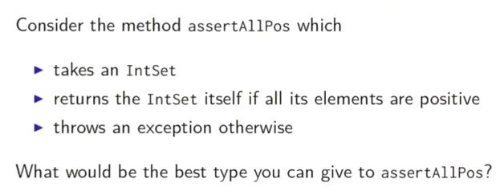
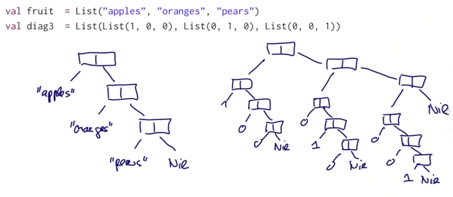
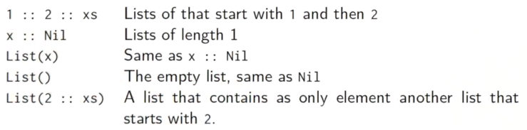
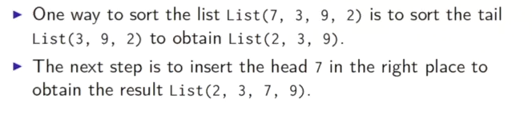

Title: [Scala MOOC I] Lec4: Types and Pattern Matching 
Date: 2016-07-17   
Slug:  progfun1_lec4_pattern_matching  
Tags: scala    
Series: Functional Programming Principles in Scala 
 
 
4.1 - Objects Everywhere 
------------------------ 
scala is *pure* OO: every value is an obj, every operation is a method of obj.  
 
``scala.Int`` ``scala.Boolean`` maps to JVM standard primitive types.  
 
Implement ``Boolean`` withous primitive type in scala:  

 
 
Then defin ``false`` and ``true`` as objects, give implementation for ``ifThenElse()`` funciton:  
 
	object true extends Boolean{ 
		def ifThenElse[T](t: =>T, e: =>T) = t 
	} 
	object false extends Boolean{ 
		def ifThenElse[T](t: =>T, e: =>T) = e 
	} 
 
 
4.2 - Functions as Objects 
-------------------------- 
 
Function values are treated as objects in scala.  
the type ``A => B`` is an abbrevation for ``scala.Function1[A, B]`` 

 
 
**Functions are objects with **``apply``** methods.** 
 
anonymous function ``(x: Int) => x*x`` is expanded to :  
 
	new Function1[Int, Int]{ 
	def apply(x: Int) = x*x 
	} 
 
 
function call ``f(a,b)`` is expanded to:  ``f.apply(a,b)`` 
``List(1,2)`` is expanded to : ``List.apply(1,2)`` 
 
4.3 - Subtyping and Generics 
---------------------------- 
2 forms of polymorphism: *subtyping and generics* 
 
### Type Bounds 

 
``assertAllPos`` taks either ``EmptySet`` or ``NonEmptySet``, the return type is EmptySet (when para=EmptySet) or NonEmptySet (when para=NonEmpty).  
To express this situation:  
 
``def assertAllPos[S <: IntSet](r: S): S = ...`` 
 
Here ``<: IntSet`` means IntSet is an upper bound of the type parameter.  

 
and we can mix the two notations:  
 
``[S >: NonEmpty <: IntSet]`` 
 
### Covariance 
Given ``NonEmpty <: IntSet``,  
should we have: ``List[NonEmpty] <: List[IntSet]`` ? 
 
In this case the typse are called *covariant. * 
 
In java, arrays are covariant: ``NonEmpty[] <: IntSet[]`` 
but this might cause problems:  

 
 
will get ArrayStoreException in 3rd line.  
 
**Liskov substitution principle**: when a type can be a subtype of another  
>*If A<:B, then everything one can do with an object of type B, one should also be able to do it with object of type A.*  
 
In scala the Array is not covariant: ``Array[IntSet]`` is not supertype of ``Array[NonEmpty]`` 
 
4.5 - Decomposition 
------------------- 
ex: arithmetic expression interpreter: a tree of numbers and sums, both are subtype of ``Expr``.  
 
1st try: test and accessor methods 

 

 

→ tedious... And to add more operands need to add many more methods...  
 
2nd try: (non-solution) 
type testing and type casting 
``isinstantceof``, ``asinstanceof`` 

 

discouraged in scala. 
 
1st solution: **OO decomposition** 
add ``eval`` method to class Expr. 

 

limitation: if we want to simplify an expression,  

 

⇒ there is no local simplification ! 
 
⇒ **pattern matching** 
 
4.6 - Pattern Matching 
---------------------- 
 goal: *reverse* the construction process.  
 
 
* which subclass it is? 
* what were the arguments? 
 
 
### case classes 
add ``case`` in class definition. 
ex. 
  
	case class Number(n: Int) extends Expr 
	case class Sum(e1: Expr, e2: Expr) extends Expr 
 
 
adding ``case`` adds *companion objects* with ``apply`` methods:  

 

according to the expansion, ``Number(2)`` is equal to ``Number.apply(2)`` which is actaully ``new Numver(2)`` 
 
### pattern matching 
``match``: extension of ``switch`` in java, ex:  
 
	def eval(e: Expr): Int = e match{ 
		case Number(n) => n 
		case Sum(e1, e2) => e1 + e2 
	} 
 
 

 
 
patterns include:  
 
* constructor, ex. ``Number(n)`` 
* variable, ex. ``n, e1, e2`` 
* wildcard patters, ex. ``_`` 
* constant, ex. ``1, true`` 
* or their combination, ex ``Sum(Number(1),  Var(x))`` 
 
 
The whole match expression is replaced with the expression to the rhs of the first match pattern.  
 
exercice: implement a ``show`` function. 
 
	def show(e: Expr): String = e match { 
		case Number(n) => n.toString 
		case Sum(l, r) => show(l) + "+" + show(r) 
	} 
 
 
4.7 - Lists 
----------- 
example:  

 

 

difference between List and Array:  
 
* Lists are immutable, elements cannot change 
* Lists are recursive, arrays are flat 
* both are homogeneous, all elements of the same type 
 
 
All ``List``s in scala are constructed with:  
 
* Empty list ``Nil`` 
* construction op ``::``(pronunced: cons), ``x::xs`` 
 
 

 
 
convention in scala: operators ending with ``:``  
 
* are *right-associative*. ``a::b::c`` is equal to ``a::(b::c)`` 
* seen as method calls from the right-hand operand. ``1::2::Nil`` equal to ``Nil.::(2).::(1)`` ( ``::`` is prepend operation) 
 
 
operations on lists:  
 
* head 
* tail 
* isEmpty 
 
 
list in pattern matching: 
 

 

ex. insertion sort of lists 

 
 

	def isort(xs: List[Int]): List[Int] = xs match{ 
		case List() => List() 
		case y::ys => insert(y, isort(ys)) 
	} 
	def insert(x:Int, xs:List[Int]): List[Int] = xs match{ 
		case List() => List(x) 
		case y::ys => if(x<=y) x::xs else y::insert(y, ys) 
	} 
 
