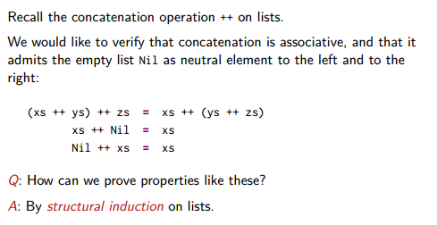

Title: [Functional Programming Principles in Scala] Lec5: Lists
Date: 2016-07-29 21:30   
Slug:  progfun1_lec5_lists
Tags: scala 

5.1 - More Functions on Lists
=============================

already known methods: 

	xs.head
	xs.tail

sublist and ele access: 

* ``xs.length``
* ``xs.last``
* ``xs.init``: all elementh except last element
* ``xs.take(n)``: sublist of first n elements
* ``xs.drop(n)``: the rest of list after taking first n elements
* ``xs(n)``: = ``xs.apply(n)`` , element at index n

More methods:

* concatenation: ``xs ++ ys`` (``:::`` is legacy usage)
* ``xs.reverse``
* ``xs.updated(n,x)``: return a same list, except xs(n)=x (Note: Lists are immutable, so cannot modify)
* ``xs.indexOf(x)``: index or -1
* ``xs.contains(x)``: same as ``xs.indexOf(x)>=0``

complexity: 
head, tail: simple to implement
⇒ complexity of ``last``?

	def last[T](xs: List[T]): T = xs match{
		case List() => throw new Error("last of Nil")
		case List(x) => x
		case y::ys => last(ys)
	}

⇒ complexity of last = O(n)

implement ``init``:

	def init[T](xs: List[T]): T = xs match{
		case List() => throw new Error("init of Nil")
		case List(x) => List()
		case y::ys => y::init(ys)
	}

⇒ complexity = O(length of xs)

implement concatenation ``:::``/``++``
(NB: ``:::`` is right-associative, ``xs:::ys`` = ``ys. :::(xs)``. )

	def concat[T](xs: List[T], ys: List[T]) = xs match{
		case List() => ys
		case z::zs => x:concat(xs, ys)
	}

⇒ complexity of concat = O(length of xs)

implement of reverse

	def reverse[T](xs: List[T]) = xs match{
		case List() => List()
		case y::ys => reverse(ys) ++ y
	}

⇒ complexity of reverse: every call contains a concat, thus complexity=O(n2)

exercice: remove nth element: 

	def removeAt[T](n:Int, xs: List[T]): List[T] = 
	(xs take n ) ++ (xs drop n+1)

5.2 - Pairs and Tuples
======================

example: sort list faster than insertion sort → merge sort. 

sort 2 sublist, merge them ⇒ list is sorted

	def msort(xs: List[Int]): List[Int] = {
		val n = xs.length/2
		if(n==0) xs
		else{
			def merge(xs: List[Int], ys: List[Int]) = ... // see below
			val (fst, snd) = x splitAt n // splitAt returns 2 sublists
			merge(msort(fst), msort(snd))
		}
	}

merge: 

	def merge(xs: List[Int], ys: List[Int]): List[Int] = xs match {
		case Nil => ys
		case x::zs => match ys{
			case Nil => xs
			case y::ws => {
				if(x<y) x::merge(zs, ys)
				else y::merge(xs, ws)
			}
		}
	}

### Pair/Tuple
written as ``(x, y)`` in scala. pair can be used as patterns :  similar for tuples. 

	val pair = ("a", 2)
	val (label, value) = pair

tuple implementation: 

⇒ can use ``_1`` ``_2`` to access elements

exercice: rewrite the merge function using a *pattern matching over pairs*:

	def merge(xs: List[Int], ys: List[Int]): List[Int] =
	(xs, ys) match {
		case (Nil, ys) => ys
		case (xs, Nil) => xs
		case (x:zs, y:ws) => 
			if(x<y) x::merge(zs, ys)
			else y::merge(xs, ws)
	}

5.3 - Implicit Parameters
=========================

pb: how to apply msort to list of other element types. 

using type parameters ? ``msort[T]``⇒ the compare operator is not always defined ! 

⇒ *pass the lt function as a parameter*: 

``def msort[T](xs: List[T])(lt: (T,T)=>Boolean) = ...``

another option: ``scala.math.Ordering[T]``

	impor math.Ordering
	def msort[T](xs: List[T])(ord: Ordering) = ...// use ord.lt(x,y)
	msort(nums)(Ordering.Int)

pb: pass each time the function parameter is cumbersome... ⇒ use **implicite** parameters

	def msort[T](xs: List[T])(implicite ord: Ordering) = ...// use ord.lt(x,y)

⇒ the function calls can ignore the implicite parameter, the compiler will figure it out. 

5.4 - Higher-Order List Functions
=================================

functions over list have similar pattern: 

* transform each element 
* retrive elements that satisfy some cretirion
* combing elements using an operator

### map
apply an operation to every elements. 

	abstract class List[T]{
		def map[U](f: T=>U): List[U] = this match {
			case Nil => this
			case x:xs => f(x)::xs.map(f)
		}
	}

### filtering

	def filter(p: T=>Boolean): List[T] = this match {
		case Nil => this
		case x:xs => f(p(x)) x::xs.filter(p) else xs.filter(p)
	}

other methods that extracts sublist: 

exercice: implement a function ``pack``: 

	def pack[T](xs: List[T]): List[List[T]] = xs match {
		case Nil => Nil
		case x::ys => {
			val (head, tail) = xs span (c => c==x)
			head :: pack(tail)
		}
	}

exercice2: implement  a function ``encode``:

	def encode[T](xs: List[T]): List[(T, Int)] = xs match {
		case Nil => Nil
		case x::ys => {
			val (head, tail) = xs span (c => c==x)
			(x, head.length) :: pack(tail)
		}
	}

another version: use the pack: 

	def encode[T](xs: List[T]): List[(T, Int)] = 
		pack(xs) map (l => (l.head, l.length))

5.5 - Reduction of Lists
========================

fold/reduce: combine elements using an operator. 

### reduceLeft
(can apply only to non-empty lists) 
inserts a binary operator between adj elements: 

ex. 

	def sum(xs: List[Int]) = (0::xs) reduceLeft ( (x,y)=> x+y)
	def prod(xs: List[Int]) = (1::xs) reduceLeft ( (x,y)=> x*y)

write shorter function values using underscore ``_``:  every ``_`` represents a new parameter

	def sum(xs: List[Int]) = (0::xs) reduceLeft ( _+_ )
	def prod(xs: List[Int]) = (1::xs) reduceLeft ( _*_ )

### foldLeft
foldLeft is like reduceLeft, but can apply on Nil, and takes an **accumulator** ``z`` => returns z when calling on Nil. 

	def sum(xs: List[Int]) = (xs foldleft 0) ( _+_ )
	def prod(xs: List[Int]) = (xs foldleft 1) ( _*_ )

### foldRight/reduceRight

dual functions to ``foldLeft`` and ``reduceLeft``, but produce a tree leaned to right

if the operation is associative and communitive, foldLeft and foldRight should give same results. Other times need to think. 

ex. concat

if apply foldLeft ⇒ type error, because the ``::`` operator will be applied to 2 elements of type T.

5.6 - Reasoning About Concat
============================

proof of programs

### structural induction
pb: prove some properties of concat:

类似数学归纳法: 

ex. prove ``(xs ++ ys) ++ zs = xs ++ (ys ++ zs)``: induction on ``xs``

	def concat[T](xs: List[T], ys: List[T]) = xs match{
		case Nil => ys
		case z::zs => x:concat(xs, ys)
	}

* base case: ``xs=Nil``

``(Nil ++ ys ) ++ zs = Nil ++ (ys ++ zs)``

* induction step: ``x::xs``

5.7 - A Larger Equational Proof on Lists
----------------------------------------

pb: want to prove that ``xs.reverse.revese == xs``

* base case: ``Nil.reverse.revers = Nil``
* induction step

pb: cannot advance 
⇒ generalize the argument. 

