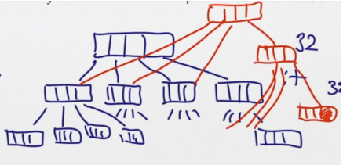
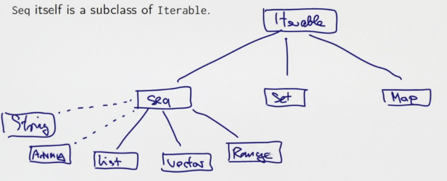
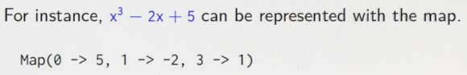
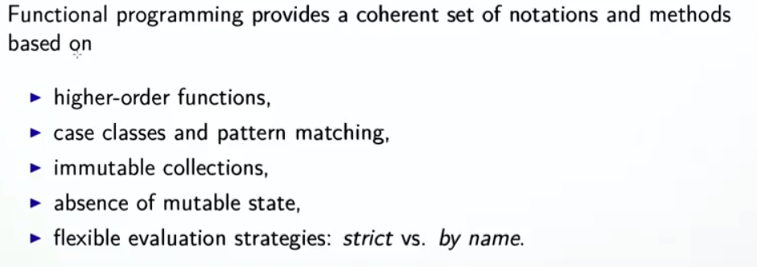

Title: [Scala MOOC I] Lec6: Collections
Date: 2016-07-30
Slug:  progfun1_lec6_collections
Tags: scala 
Series: Functional Programming Principles in Scala
 
[TOC]

6.1 - Other Collections
=======================
so far: only seen List. → more (**immutable**) collections. 

### vector
List:  is linear -- access to head is faster than middle or end element. 
Vector: better rand access performance. 

represented as very shallow trees(32-split at each node)

``Vector`` support similar operations as List (head, tail,map, fold) , except concat ``::``, instead Vectors have ``+:`` and ``:+``:

* ``x +: xs`` create new vector with x in head
* ``xs :+ x`` create new vector with x in tail

implementation of ``:+``: create copies

### Seq
``Seq`` is base class for ``Vector`` and ``List``, ``Seq`` itself is subclass of ``Iterable``.

Hierarchy of Iterables: 

### Array ans String

Array and String support same op as Seq, can implicitly be converted to seq when needed. But they are NOT subclasses of Seq as they come from java. 

	scala> val xs: Array[Int] = Array(1,2,3)
	xs: Array[Int] = Array(1, 2, 3)
	
	scala> xs map (2*_)
	res3: Array[Int] = Array(2, 4, 6)
	
	scala> val ys = "Hello"
	ys: String = Hello
	
	scala> ys filter (_.isUpper)
	res4: String = H

### Range
represents a seq of evenly spaced integers.

represented as an obj with 3 values: lower bound, upper bound, step value. 
 
3 op: 

* ``to``: inclusive 
* ``until``: exclusive
* ``by``: step value

	1 to 6       // 1 2 3 4 5 6
	1 until 6    // 1 2 3 4 5
	1 to 6 by 2  // 1 3 5
	6 to 1 by -2 // 6 4 2

### More ops on Seq

* ``xs exists p``
* ``xs forall p``
* ``xs zip ys``: takes 2 seq, returns a single seq, each elem is a pair

	scala> List(1,2,3) zip Vector(2,3,4)
	res7: List[(Int, Int)] = List((1,2), (2,3), (3,4))

* ``xs.unzip``: reverse zip, return 2 lists 
* ``xs flatMap f``: apply f to all elements, and **concat the results** 

	scala> "hello" flatMap (c => List('.', c))
	res9: String = .h.e.l.l.o

* ``flatten``: flatten a seq of seq into just one seq...

``xs flatMap f = (xs map f).flatten``

The result is concated, instead of being a list of list. 

* ``xs.sum``/``xs.product``: for numeric collection
* ``xs.max``/``xs.min``: an ordering must exist

### Examples

* cartesen product: 1..M x 1..N:

``(1 to M) flatMap( x => (1 to N) map (y => (x,y)) )``

* scalar of 2 vectors

	def scalaProd(xs: Vector[Double], ys: Vector[Double]): Double = 
	  (xs zip ys) map (xy => xy._1 * xy._2).sum

alternative: use pattern matching in map (need to add braces ``{}``!): 

	(xs zip ys) map ( {case(x,y) => x*y}).sum

* test isPrime for a number

``def isPrime(n: Int): Boolean = (2 until n) forall (d => n%d!=0)``

6.2 - Combinatorial Search and For-Expressions
==============================================

goal: handle nested seq. 

⇒ extend usage of higher order functions instead of using nested loops. 

example:   
>given n, find all (i,j) st: 1<=j<i<=n, and i+j is prime.

(1 until n) flatMap ( i => (1 until i) map (j => (i,j)) ) filter ( {case(i,j) => isPrime(i+j)})

this works, but less understandable... ⇒ for expressions. 

### for/yield expressions

example: class of person

``case class Person(name: String, age: Int)``

To obtain names of persons over 20 years old: 

``persons filter (_.age>20) map (_.name)``

equivalent to :

``for (p <- person if p.age > 20) yield p.name``

The for expression is similar to jave for-loop, except **it builds a list of the results of all iterations**. 

for expression form: 

>``for( s ) yield e ``
>where ``s`` can contain **generators** and **filters**: 

* generator: ``p<-e`` where ``e`` is a collection, ``p`` is a pattern
* filter: ``if f`` where t is boolean expr

rewrite the prime sum example: 

	for{
	  i <- 1 until n
	  j <- 1 until i
	  if isPrime(i+j)
	} yield (i,j)

exercice: write the scalaProd using for expr: 

	def scalaProd(xs: Vector[Double], ys: Vector[Double]): Double =
		(for( (x,y) <- xs zip ys ) yield x*y ) sum

more on scala for expr: 
<http://www.artima.com/pins1ed/for-expressions-revisited.html>

6.3 - Combinatorial Search Example
==================================

goal: combine ``set`` and ``for``-expr to solve the n-queens problem. 

### Sets
3 fundamental iterable collection types: seq, **set**, map. 

* set support most operations on seq (c.f. doc on Iterable)
* sets are unordered
* set don't have dup elements
* contains: ``s contains e``

### Example: N-Queens

8*8 chess board, 8 queens 
⇒ places queens st: no two queen in same row/col/diag

algo: put one queen in each row (in the right column) 

recursive solution: suppose already have solutions for first n-1 rows. 
represent each (partial)solution as a list of column index. 

return all possible solutions (as a Set). 

	def queens(n: Int): Set[List[Int]] = {
		def placeQueens(k: Int): Set[List[Int]] = ???// place first k rows
		placeQueens(n)
	}

Fill in the helper function: 

	def placeQueens(k: Int): Set[List[Int]] = {
		if (k==0) Set(List())
		else for{
			queens <- placeQueens(k-1) // queens(List[Int]) = one solution to k-1
			c <- 0 until n
			if isSafe(c, queens) // if column c doesn't conflict with the partial solution queens
		} yield c::queens // the kth row solution is in head of list
	}

Now fill in the function isSafe that check if a column is valid wrt queens for above rows:

	def isSafe(col: Int, queens: List[Int]): Boolean = {
		val k = queens.length // current row is k
		val indexedQueens = (k-1 to 0 by -1) zip queens // List[(row, col)]
		indexedQueens forall { 
				case(r,c) => c!=col && k-r!=math.abs(c-col) }
	}

Now the queens function will work. 

Write another function to print the solution out: 

	def show(queens: List[Int]): String = {
		val lines = for (col <- queens.reverse) 
					yield Vector.fill(queens.length("* ").updated(col, "X ").mkString
		"\n" + lines.mkString("\n")
	}
	(queens(4) map show) mkString "====\n"

6.4 - Maps
==========
``Map[Key, Value]``

ex: 

	val romanNumerals = Map("I" ->1, "V" ->5, "X" -> 10)
	val captial = Map("France" -> "Paris", "US" -> "Washington")

Maps are iterables and **functions**: maps Key to Value like a function call 

ex. ``romanNumerals("I")``

will throw ``NoSuchElementException`` if the key is not in map. 

⇒ use ``get``: 

	scala> captial("France")
	res3: String = Paris
	
	scala> captial get "France"
	res4: Option[String] = Some(Paris)
	
	scala> captial get "China"
	res5: Option[String] = None

have a look at the Option type:

### The Option Type
definition: 

	trait Option[+A]
	case class Some[+A](value: A] extends Option[A]
	object None extends Option[Nothing]

so the get function of map gives: 

* ``None`` if key is not in map
* ``Some(x)`` if map associates key to x

since ``Some`` is case class, can use pattern matching to decompose. 

	def showCaptical(country: String) = captial.get(country) match{
		case Some(cap) => cap
		case None => "missing data"
	}

### Sorted and GroupBy
two useful SQL queries. 

* orderBy can be expressed using sortWith and sorted: 

	val fruit = List("apple", "pear", "orange", "pineapple")
	scala> fruit sortWith (_.length < _.length)
	res7: List[String] = List(pear, apple, orange, pineapple)
	scala> fruit.sorted
	res8: List[String] = List(apple, orange, pear, pineapple)

* ``GroupBy(f)``: **partition a collection into a map of collections** according to ``f``

	scala> fruit groupBy (_.head)
	res9: scala.collection.immutable.Map[Char,List[String]] = 
			Map(p -> List(pear, pineapple), 
				a -> List(apple), 
				o -> List(orange))

### map Example: polynomials
can be seen as map from exponents to coefficients:

⇒ represent polynm as maps

	class Poly(val terms: Map[Int, Double]) {
		def + (other: Poly) = new Poly(terms ++ // ++ on maps: will override older entries in terms!
								(other.terms maps adjust)) // adjust defined below
		
		def adjust(term: (Int, Double)):(Int, Double) = {
			val (exp, coeff) = term
			terms get exp match{
				case None => Pair(exp, coeff) // or write: exp -> coeff
				case Some(coeff1) => Pair(exp, coeff+coeff1)
			}
		}
		override def toString = 
		(for( (exp, coeff) <- terms.toList.sorted.reverse) yield coeff+"x^"+exp) mkString "+ "
	}

### default values
``withDefulatValue``: makes a map into a **total map**

rewrite the poly example: 

	class Poly(terms0: Map[Int, Double]) {
		val terms = terms0 withDefaultValue 0.0
		def + (other: Poly) = new Poly(terms ++ // ++ on maps: will override older entries in terms!
								(other.terms maps adjust)) // adjust defined below
		
		def adjust(term: (Int, Double)):(Int, Double) = {
			val (exp, coeff) = term
			exp -> (coeff + terms(exp))
		}
		override def toString = 
		(for( (exp, coeff) <- terms.toList.sorted.reverse) yield coeff+"x^"+exp) mkString "+ "
	}
	}

change to variable parameter for better constructor calling: add another constructor

	def this(bindings: (int, Double)*) = // bindings is s sequence
	this(bindings.toMap)

Exercie: re-implement the ``+`` using foldLeft : 

	def + (other: Poly) =
		new Poly( (other.terms foldLeft terms)(addTerm) )
	def addTerm(terms:Map[Int, Double], term: (Int, Double)): Map[Int, Double] = {
		val (exp, coeff) = term
		terms + ( exp -> (coeff + terms(exp)) ) // map + (k,v) updates the map
	}

6.5 - Putting the Pieces Together: T9 keyboard mnem
===================================================

convert a seq of numbers to a scentence

	val mnem  = Map('2'->"ABC", '3'->"DEF", 4->"GHI", '5'->"JKL",
				'6'->"MNO", '7'->"PQRS", '8'->"TUV", '9'->"WXYZ" )
	val in = Source.fromURL("...")
	val words = in.getLines.toList // dictionary: list of valid words

goal: design a ``translate(phoneNumber)`` that produces all phrases of words that can serve as mnemonics(助忆) for a phone number. 

Step 1: invert the mnem map to a map from A~Z to 2~9: 

	val charCode: Map[Char, Char] = 
	for ( (digit, str) <-mnem; ltr<-str) yield ltr->digit

Step 2: map a word to the string it represents, ex. "java"->"5282"

	def wordCode(word: String):String = 
		word.toUpperCase map charCode

Step 3: maps from digit string to all possible valid strings, ex. "5282"->List("java", "kata",...)
⇒ just a groupby!!

	val wordsForNum: Map[String, Seq[String]] = 
		words groupBy wordCode

→ Error: key not found: "-", some words contains a "-"... → drop such words... 

``val words = in.getLines.toList filter (wd => wd forall (ch => ch.isLetter))``

Step 4: return all ways to encode a number as a list of words →  recursive, recurse on the nb of first words~

	def encode(number: String): Set[List[String]] = {
		if(number.isEmpty) Set(List())
		else{ 
			val phraseList = for{  
				split <- 1 to number.length // the first word in phrase uses numbers[1:split]
				firstWd <- wordsForNum[ number.take(split) ]
				followingWds <- encode(number.drop(split))
			} yield firstWd::follwingWds
			phraseList.toSet
		}
	}

⇒ error in the line with ``wordsForNum``: key not found... 
⇒ ``wordsForNum["7"]`` will give error 
⇒ make the ``wordsForNum`` a total map, using withDefaultValue

	val wordsForNum: Map[String, Seq[String]] = 
		(words groupBy wordCode) withDefaultValue( Seq() )

Step 5: return strings (instead of List[String])

	def translate(number: String): Set[String] = {	
		encode(number) map (_.mkString(" "))
	}

summary: 

Conclusion
==========

<https://www.scala-exercises.org/>

