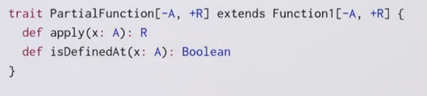

Title: [Functional Program Design in Scala] Lec1: For Expressions and Monads
Date: 2016-08-12
Slug:  progfun2_lec1_forexpr
Tags: scala 

Recap: Functions and Pattern Matching
=====================================

### case classes
ex: json
json objects can be seq, num, str, bool,...

⇒ represented as abstract class and case classes. 

### pattern matching

→ question: what is the type of the ``{case(key, value)=>"..."}`` clause? 

it is ``(JBinding => String)`` type, which is a shorthand for ``Function1[JBinding, String]``. 

### Function1 Trait

### subclass a function type
function types can also be extended ! 

element accessing can be written as function calls because ``Seq``s are functions!

### Partial Match
if there is no match → throw MatchError

	val f: String=>String  = {case "ping" => "pong"}
	f("ping") // no pb
	f("abc") // MatchError

⇒ define f as partial function

	val f: PartialFunction[String,String]  = {case "ping" => "pong"}
	f.isDefinedAt("ping")
	f.isDefinedAt("abc")

``isDefinedAt`` is a method for the ``PartialFunction`` class. 

The f definition is translated to: 

But the ``PartialFunction`` will only apply for level 1: 

Recap: Collections
==================

scala collections hirarchy: 

collections *share* some general methods (**core methods**): 

* map
* flatMap
* filter
* foldLeft/foldRight

(idealized) implementation of ``map`` and ``flatMap`` on Lists: 

### For expressions

for-expr can *simplify combinations of core methods*. 

**the** **lhs of a generator can also be a pattern!**

pat <- expr 

is translated to : 

	x <- expr withFilter {case pat => true; case _ => false
					} map {case pat => x}

1.1 - Queries with For
======================

for notation is equivalent to common ops on databases(ex. sql). 

ex. books in library

``case class Book(title: String, authors: List[String])``

query1: books with author name is "Bird"

	for( b<-books; a <- b.authors if a startsWith "Bird,") 
	yield b.title

query2: books with "Program" in the title: 

	for( b<-books if b.title indexOf "Program" >=0)
	yield b.title

query3: names of authors who wrote >=2 books

	for{
		b1 <- books
		b2 <- books 
		if b1!=b2
		a1 <- b1.authors
		a2 <- b2.authors
		if a1==a2
	} yield a1

→ pb: the authors will be doubled → b1,b2 and b2,b1
⇒ change line 3 to ``b1.title < b2.title``

→ still pb: print 3 times if authors write 3 books... 
⇒ 
sol1. use ``distinct`` function 
sol2. decalre books as Set instead of List. 

1.2 - Translation of For
========================
for expressions → higer order functions

map, flatMap, filter can all be implemented with for expression:
 

 
In reality: scala translates for expr to map/flatMap/filter. 

### implemention of for-expr: 3 rules

* rule 1: in for(..) only a simple generator 

``for(x <- l1) yield e2``

is translated to: ``l1.map(x => e2)``

* rule2: in for(..), followed by the generator there is a filter

``for(x <- l1 if f; s) yield e2 //s is seq of other generators and filters``

is translated to: 

``for( x <- l1.withFilter(x=>f) ) yield e2``

* rule3: in for(..), starts with 2 generators → flatMap

``for( x<-l1; y<-l2; s) yield e3``

is translated to: 

``l1.flatMap( x => for(y<-l2; s) yield e3 )``

example: 

	for{ 
	b <- books
	a <- b.authors if a startsWith "Bird"
	} yield b.title

translated to: 

	books flatMap ( 
		b => b.authors.filter( a => a startsWith "Bird").map(y=>y.title)

	)

NB: for expr is not restricted to collections, it supports any types with ``map/flatMap/withFilter`` method. ⇒ use for expr for your own types as well. 

1.3 - Functional Random Generators
==================================

goal: use for expr on rand generators. 

for expr support any type with map/flatMap/filter ⇒ ex. rand value generator. 

generate rand value of type T: 

	trait Generator[+T] { 
	def generate: T
	}

first implement Generator[Int], then use this to implement booleans, pairs, lists, sets, trees,......

	val integers = new Generator[Int]{
		val rand = new java.util.Random
		def generate = rand.nextInt()
	}
	
	val booleans = new Generator[Boolean{
		def generate = integers.generate > 0
	}
	
	val pairs = new Generator[(Int, Int)]{
		def generate = (integers.generate, integers.generate)
	}

→ can we avoid the ``new Generator[...]`` ? 

*ideally we want to write booleans as pairs as:* 

	val booleans = for( x <- integers ) yield x>0
	def pairs[T,U](t: Generator[T], u: Generator[U]) = 
		for{x <- t; y <- u} yield (x,y)

the for expr will be translated to map/flatMap/filter... 

⇒ define map and flatMap on the Generator trait so that it supports for expr!

	trait Generator[+T]{
		self => // syntax: `self` is an alias of `this`
		def generate: T
	
		def map[S](f: T=>S): Generator[S] = 
			new Generator[S]{
				def generate = f(self.generate) // can't use `this` here: inf loop
				// or use Generator.this.generate
			}
	
		def flatMap(f: T=>Generator[S]): Generator[S] = 
			new Generator[S]{	
				def generate = f(self.generate).generate 
			}
	}

ex. the booleans expression: 

``val booleans = for (x<-integers) yield x>0``

is translated to: 

``val booleans = integers map (x=>x>0)``

which is then expands to: 

	val booleans = 
	new Generator[Boolean]{
		val f = (x => x>0)
		def generate = f(integers.generate)

	}

after reduction, the expression is: 

	val booleans = new Generator[Boolean{
		def generate = integers.generate > 0
	}

which is the initial implementation... 

### other base Generators

(The ``T*`` syntax is variable parameter)

### rand List Generator

	def lists: Generator[List[Int]] = for{
		isEmpty <- booleans
		list <- if (isEmpty) emptyLists else nonEmptyLists
	} yield list
	
	def emptyLists = single(Nil)
	
	def nonEmptyLists = for{
		head <- integers
		tail <- lists // recursive call to `lists`
	} yield head::tail

### rand (binary) Tree Generator

two types of tree nodes: leaf or inner node

	def trees: Generator[Tree] = for{
		isLeaf <- booleans
		tree <- if(isLeaf) leafs else inners
	} yield tree
	
	def leafs: Generator[Leaf] = for{
		x <- integers
	} yield Leaf(x)
	
	def inners: Generator[Inner] = for{
		l <- trees
		r <- trees
	} yield Inner(l, r)

Application: random testing
---------------------------

test: check *postconditions* (expected results)

→ generate random test inputs

a generic wrapper:

	def randTest[T](g: Generator[T], numTimes: Int=100)(testfcn: T=>Boolean): Unit = {
		for( i <- 0 until numTimes){
			val value:T = g.generate
			assert(testfcn(value), "test failed for "+value)
		}
		println("passed" + numTime + "tests")
	}

### ScalaCheck

*instead of writing tests, write properties that are assumed to hold.* 

	forAll { 
		(l1:List[Int], l2:List[Int]) =>
			l1.size + l2.size == (l1++l2).size
	}

1.4 - Monads
============

from last section: not only collections, but also any type with map and flatmap can use for expr ⇒ monads. 

<def>. Monads is a type M[T] with 2 operations: ``flatMap`` ("bind") and ``unit``, and satisfy some laws.

	train M[T]{
		def flatMap[U](f: T=>M[U]): M[U]): M[U]
	}
	def unit[T](x:T): M[T]

examples: 

* ``List`` is a monad, ``unit(x) = List(x)``
* ``Set``, with ``unit(x) = Set(x)``
* ``Option``, with ``unit(x) = Some(x)``
* ``Generator``, with ``unit(x) = single(x)``

``map`` can be defined as a combination of ``flatMap`` and ``unit``: 

``m map f == m flatMap (x => unit( f(x)) )``

### Monad laws

* associativity

``(m flatMap f) flatMap g == m flatMap ( x => f(x) flatMap g )`` 

↔ (x+y+z) = x+(y+z)

* left unit

``unit(x) flatMap f == f(x)``

* right unit

``m flatMap unit == m``

the Try type
------------

We define a Try class, which is similar to Option class. 

	abstraxt class Try[+T]
	case class Success[T](x:T) extends Try[T]
	case class Failure(ex: Exception) extends Try[Nothing]

we can write ``Try(expr)`` to give a computation a try, by implementing the ``apply`` method of object Try:

	object Try{
	def apply[T](expr: =>T): Try[T]= // expr is passed BY NAME, otherwise will cause exception in eval
		try Success(expr) // java syntax of try-catch
		catch{ case NonFatal(ex) => Failure(ex) }
	}
	}

if Try is a Monad ⇒ can be written in for expr: 

⇒ define map and flatMap on ``Try`` type. 

question: is Try a monad with ``unit(x)=Try(x)``?
⇒ no, left-unit fails: ``Try(expr) flatMap f != f(expr)``
(lhs never nonfatal exception, but rhs will raise)

Try is not a monad, but it can still use for expr...

### Conclusion

for exprs are useful not only for collections: ``Generator``, ``Option``, ``Try``

