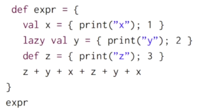
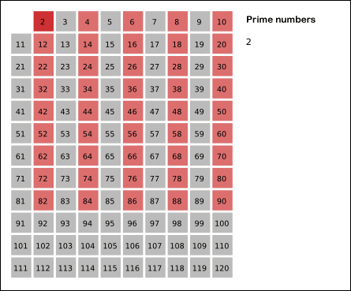
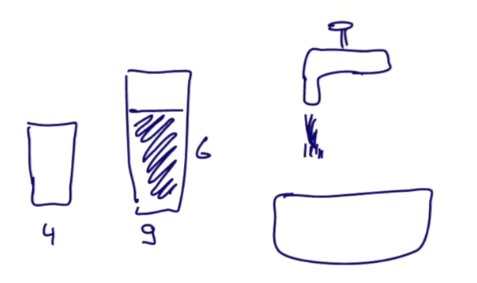
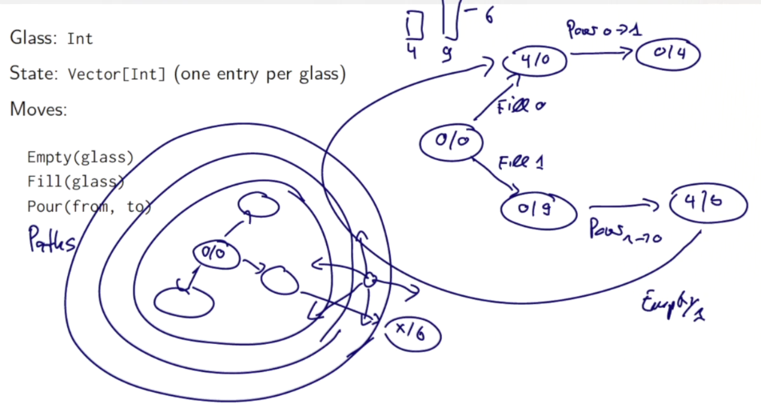
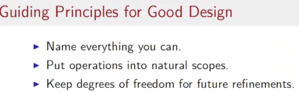

Title: [Scala MOOC II] Lec2: Lazy Evaluation 
Date: 2016-10-22 
Slug:  progfun2_lec2_lazyeval 
Tags: scala  
Series: Functional Program Design in Scala 
 
 
Lecture 2.1 - Structural Induction on Trees (optional) 
====================================================== 
 
Generalize the structural induction on list to general structures like trees.  
 
>To prove a property ``P(t)`` for all trees ``t``:   
	* show for any leave l, ``P(l)`` holds  
	* for each internal node ``t`` with subtrees ``s1...sn``, show ``P(s1)&...&P(sn)`` holds  
 
 
Example: Prove correctness for IntSets 
-------------------------------------- 


 
recall the ``IntSet`` def: empty set or non-empty set organized in a binary (search) tree structure. 
 
```scala
abstract class IntSet{ 
    def incl(x: Int): IntSet 
    def contains(x: Int): Boolean 
} 
object Empty extends IntSet{ 
    def contains(x: Int): Boolean = false 
    def incl(x: Int): IntSet = NonEmpty(x, Empty, Empty) 
} 
class NonEmpty(elem: Int, left: IntSet, right: IntSet) extends IntSet{ 
    // NonEmpty is just a BST 
    def contains(x: Int): Boolean =  
        if (x<elem) left contains x 
        else if (x>elem) right contains x 
        else true 
    def incl(x: Int): IntSet =  
        if (x<elem) NonEmpty(elem, left incl x, right) 
        else if (x>elem) NonEmpty(elem, left, right incl x) 
        else this 
} 
```

 
**Prove the correctness** of this implementation: show that it respects certain laws:  
 
**prop1:** ``Empty contains x = false`` 
 
pf: easy... 
 
**prop2:** ``(s incl x) contains x = true`` 
 
pf: proof by structual induction on ``s`` 
 
* base case: ``s = Empty``,  
 
        (Empty incl x) = NonEmpty(x, Empty, Empty) 
        NonEmpty(x, Empty, Empty) contains x = true 
 
 
* induction step: ``s=NonEmpty(z,l,r)`` 
 
    - first case, ``z=x`` 
            s incl x = NonEmpty(x,l,r) incl x = NonEmpty(x,l,r) 
     
    so ``NonEmpty(x, l, r) contains x = true`` 
    - second case, z<x 
    ``s incl x = NonEmpty(z,l,r) incl x = NonEmpty(z,l,r incl x)`` 
    so: 

        (s incl x) contains x  
        = NonEmpty(z,l,r incl x) contains x  
        = (r incl x) contains x = ture // by induction hypothesis 
 
 
    - third case, z>x: symmetric ... 
 
**prop3:** if x!=y, ``(s incl x) contains y = s contains y``   
 
pf: by structual induction 
 
 
* base case: ``s = Empty`` 
* induction step: ``s=NonEmpty(z,l,r)`` 
    5 cases to consider... 
    - z=x 
    - z=y 
    - z<y<x 
    - y<z<x 
    - y<x<z 
 
 
Lecture 2.2 - Streams 
===================== 
 
motivation: 2nd prime number between 1000 and 10000:  
 
elegant, but not efficient solution:  
``( (1000 to 10000) filter isPrime) (1)`` 
 
→ ALL prime numbers are constructed in the code, only use the first 2 elements...  
 
⇒ *avoid computing the tail of a seq until necessary * 
 
→ new data structure: ``Stream``s, like lists, but *tail is eval only on demand* 
 
Stream class 
------------ 
**constructor** 
Streams defined from either constant ``Stream.empty`` and constructor ``Stream.cons`` 
ex: ``val xs = Stream.cons(1, Stram.cons(2, Stream.empty))`` 
 
(Stream.empty~=``Nil``, Stream.cons~=``::``) 
 
or by using the ``Stream`` object as a factory (like other collections): ``val xs = Stream(1,2,3)`` 
 
**toStream()** 
``toStream`` on a collection will turn the collection into a stream.  
 
```scala
	scala> (1 to 1000).toStream 
	res1: scala.collection.immutable.Stream[Int] = Stream(1, ?) // the tail is (?) -- not evaled 
``` 
 
The tail is not evaled! 
 
let's write a function to return a range as Stream ( returns ``(lo until hi).toStream)`` ):  
 
```scala
def streamRange(lo: Int, hi: Int): Stream[Int] =  
    if (lo>hi) stream.empty) 
    else Stream.cons(lo, stramRange(lo+1, hi)) 
```
 
**other methods** 
``Stream`` supports almost all method of a ``List`` 
 
``((1000 to 10000).toStream filter isPrime)(1)`` 
 
Exception: concat operator ``::`` will always return a list instead of a stream. 
→ alternative: ``#::`` returns a stream 
``x#::xs == Stream.cons(x,xs)`` 
 
Implementation of Streams 
------------------------- 
 
similar to the implementation of lists.  

 ```scala
trait Stream[+A] extends Seq[A]{ 
    def isEmpty: Boolean 
    def head: A 
    def tail: Stream [A] 
} 
 ```
 
concrete implementations are in the ``Stream`` *companion object*: 
 
```scala
object Stream{ 
	def cons[T](hd:T, tl: => Stream[T]) = // **`=>`: tl is by name, will be evaled later!  
		new Stream[T]{ 
			def isEmpty = false 
			def head = hd 
			def tail = tl 
		} 
	val empty = new Stream[Nothing]{ 
		def isEmpty = true 
		def head = throw new NoSuchElementException("empty.head") 
		def tail = throw new NoSuchElementException("empty.tail") 
	} 
}
```
 
all other methods are implemented similar to list counterparts...  
ex:  
 
```scala
class Stream[+T]{ 
//... 
  def filter(p: T=>Boolean): Stream[T] =  
    if (isEmpty) this
    else if (p(head)) cons(head, tail.filter(p))// tail.filter(p) will be evaled on demande
    else tail.filter(p)
    //... 
} 
```
 
 
Lecture 2.3 - Lazy Evaluation 
============================= 
 
pb with the last implementation of Streams: if tail is called several times, the corresponding stram will be re-computed each time.  
 
→ can store the 1st result of the eval and use it later. (As in FP, the eval result never change) 
 
⇒ this scheme is called **lazy evaluation**, as opposed to both by-name evaluation (``def x``) and strict-evaluation (``val x``). avoids both unnessary and repeated eval.  
 
``lazy val x = expr`` 
 
exercice:  
 
 
→ this will print: "xzyz" 
 
adapt the lazy scheme for Stream implementation:  
 
```scala
def cons[T](hd: T, tl: => Stream[T]) =  
new Stream[T]{ 
    def head = hd 
    lazy val tail = tl // **lazy instead of `def`** 
    //... 
    } 
```
 
 
Lecture 2.4 - Computing with Infinite Sequences 
=============================================== 
 
with lazyness, can deal with inf seqs. ⇒ *infinite Streams* 
 
example: the stream of all integers starting from a given number:  
 
	def from(n: Int): Stream[Int] =  
	n #:: from(n+1) // non-terminating recursive call here 
 
all natural numbers:  
``val nats = from(0)`` 
all multiples of 4:  
``nats map (_ * 4)`` 
 
```scala
scala> def from(n:Int):Stream[Int] = n #:: from(n+1); 
from: (n: Int)Stream[Int] 
 
scala> val nats = from(0) 
nats: Stream[Int] = Stream(0, ?) 
 
scala> val m4s = nats map (_ * 4) 
m4s: scala.collection.immutable.Stream[Int] = Stream(0, ?) 
 
scala> (m4s take 10).toList 
res2: List[Int] = List(0, 4, 8, 12, 16, 20, 24, 28, 32, 36) 
 ```
 
example1: Sieve of Eratosthenes 
------------------------------- 
 
 
 
written in scala:  

```scala 
def sieve(s:Stream[Int]): Stream[Int] = // param s is the prime numbers for sieve 
s.head #:: sieve(s.tail filter (_ % s.head!=0)) 

scala> val primes = sieve(from(2)) 
primes: Stream[Int] = Stream(2, ?) 
 
scala> primes.take(100).toList 
res0: List[Int] = List(2, 3, 5, 7, 11, 13, 17, 19, 23, 29, 31, 37, 41, 43, 47, 53, 59, 61, 67, 71, 73, 79, 83, 89, 97, 101, 103, 107, 109, 113, 127, 131, 137, 139, 149, 151, 157, 163, 167, 173, 179, 181, 191, 193, 197, 199, 211, 223, 227, 229, 233, 239, 241, 251, 257, 263, 269, 271, 277, 281, 283, 293, 307, 311, 313, 317, 331, 337, 347, 349, 353, 359, 367, 373, 379, 383, 389, 397, 401, 409, 419, 421, 431, 433, 439, 443, 449, 457, 461, 463, 467, 479, 487, 491, 499, 503, 509, 521, 523, 541) 
```
 
 
example2: square root 
--------------------- 
previous implementation: use ``isGoodEnough`` test termination. 
now: express the converging seq without having to worry about when to terminate:  
  
```scala
def sqrtStream(x: Double): Stream[Double] = { 
	def improve(guess: Double) = (guess + x/guess) / 2 
	lazy val guesses: Stream[Double] = 1 #:: (guesses map improve) //**this will not explod!** 
	guesses 
} 
def isGoodEnough(guess: Double, x: Double) = 
	math.abs((guess * guess - x) / x) < 0.0001 
(sqrtStream(4) filter (isGoodEnough(_, 4)) ) (1) // get the 1st guess that is good enough 
```
 
 
Lecture 2.5 - Case Study: the Water Pouring Problem 
=================================================== 
 
**task: "water pouring problem"** 
given: source, sink, glasses of different sizes, target size...  
goal: fill/empty/move water from 1 glass to another 
 
 
**Model** 
Glass: ``Int`` 
State: ``Vector[Int]`` one entry per glass 
Moves:  
``Empty(glass), Fill(glass), Pour(from, to)`` 
 
 
question: how to find the correct sequence of moves ?  
⇒ BFS, generate all possible paths (from initial state where all glasses are empty) of length=1,2,3,...  
 
**Implementation** 
 
first: define Move classes, they have a change method, take one state as param and return a state:  
 
```scala
class Pouring(capacity:Vector[Int]) { 
  type State = Vector[Int] 
  val initialState = capacity map ( x => 0 ) 
 
  trait Move{ 
    def change(state:State):State 
  } 
  case class Empty(glass:Int) extends Move{ 
    def change(state: State) = state.updated(glass,0) 
  } 
  case class Fill(glass:Int) extends Move{ 
    def change(state: State) = state.updated(glass,capacity(glass)) 
  } 
  case class Pour(from:Int, to:Int) extends Move{ 
    def change(state: State) ={ 
      val amount = state(from) min (capacity(to)-state(to)) //the amount to move 
      state updated (from, state(from)-amount) updated (to, state(to)+amount) 
    } 
  } 
  ... 
} 
```
 
generate all possible moves:  
  
```scala
val glasses = capacity.indices // equal to `0 until capacity.length` 

val moves =  // all possible moves 
( for(g<-glasses) yield Empty(g) ) ++ 
  ( for(g<-glasses) yield Fill(g) ) ++ 
  ( for(gfrom<-glasses; gto<-glasses; if gfrom!=gto) yield Pour(gfrom, gto) ) 
```
 
Then define a ``Path`` class: 
 
```scala 
  class Path(history: List[Move]){// history: moves in reversed order
    def endState:State = // given a path (list ot moves), return the final state by following the path
      (history foldRight(initialState)) ( (mv:Move, stt:State) => mv change stt) // as in the list are reversed order of moves, use foldright

    def extend(move: Move) = new Path(move::history)

    override def toString =
      ( history.reverse mkString " " ) + "-->" + endState
  }

  val initialPath = new Path(Nil)
```
 
Then define a ``Stream`` of path sets: given current (set of) paths, extend one move and generate (a set of) paths of longer length:  
 
```scala
  def from(paths: Set[Path]): Stream[Set[Path]] ={
    if(paths.isEmpty) Stream.empty
    else {
      val more = for{
        path<-paths
        next <- moves map path.extend
      }yield next
      paths #:: from(more)
    }
  }
  val pathSets = from(Set(initialPath))
``` 
 
finally, solve the problem: for each path, track its end state, and if the target value is in the end state, return the path.  
 
```scala
  def solutions(target:Int):Stream[Path] =
    for{
      pathsets <- pathSets
      path <- pathsets
      if path.endState contains target
    } yield path
```
 
pb: too slow for some case 
→ we generate ALL paths of a certain length in the stream, but in the paths, we should avoid returning to a preivous state !  
→ re-define the ``from`` function: add a param of explored set of states.  
 
```scala
  def from(paths: Set[Path], explored:Set[State]): Stream[Set[Path]] ={
    if(paths.isEmpty) Stream.empty
    else {
      val more = for{
        path<-paths
        nextpath <- moves map path.extend
        if (explored contains nextpath.endState)==false
      }yield nextpath
      val newstates = more map (_.endState)
      paths #:: from(more, explored.union(newstates))
    }
  }
  val pathSets = from(Set(initialPath), Set(initialState))
```
 
→ more improvement: avoid computing ``endState``(a ``foldRight``) over and over again — add to class param.  
 
```scala
class Path(history: List[Move], val endState:State){// history: moves in reversed order
  def extend(move: Move) = new Path(move::history, move change endState)

  override def toString =
    ( history.reverse mkString " " ) + "-->" + endState 
}
```
 
 
 
Programming Assignment: Bloxorz 
=============================== 
 
https://github.com/X-Wei/Coursera-progfun2/tree/master/hw2-stream-bloxorz/streams
