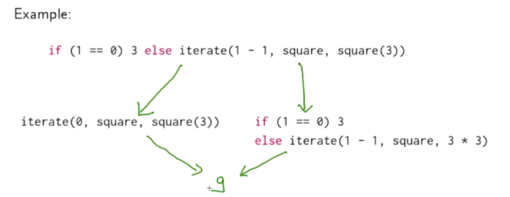
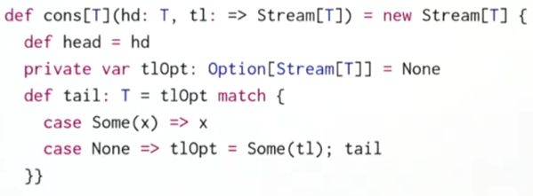
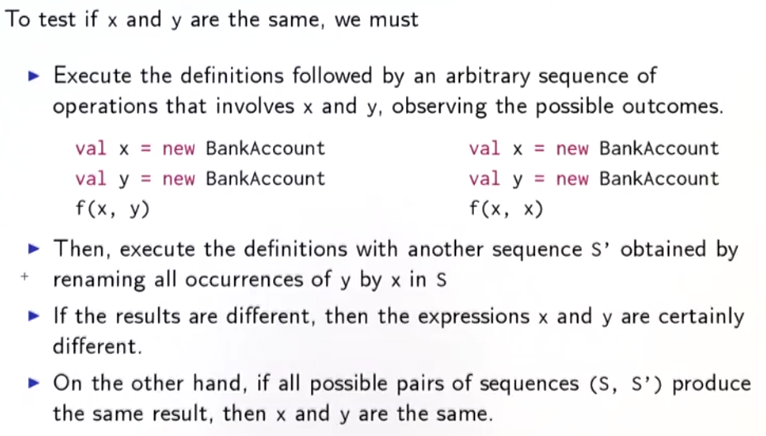
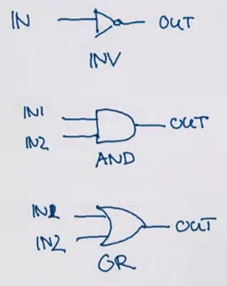
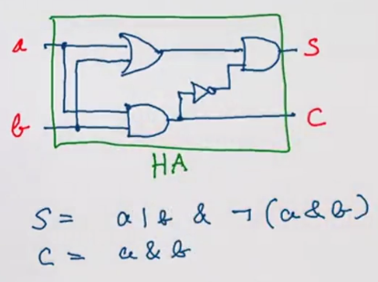
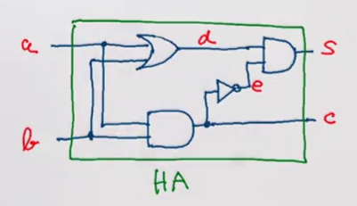
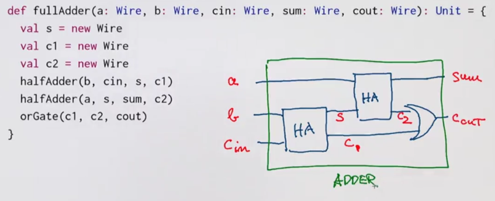
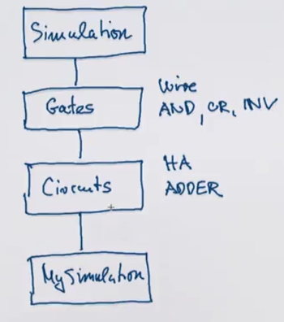
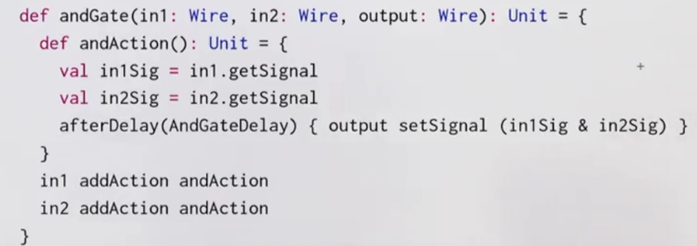

Title: [Scala MOOC II] Lec 3: Functions and State   
Date: 2016-10-31   
Slug: progfun2_lec3_var   
Tags: scala    
Series: Functional Program Design in Scala 
   
  
  
  
This week: scala for imperative programming.   
  
Lecture 3.1 - Functions and State  
=================================  
  
So far: pure functional programming  
→ side-effect free: therefore *time doesn't matter*.   
Any rewriting that terminates lead to the same solution. (Churcher-Rosser Th)  
  
  
Now: **mutable states**   
  
*Stateful objects*: objects can have state that change over time. (state is influenced by its history). ⇒ variables ``var`` in scala, associates a value to a name, and can be changed by assignment.   
  
ex. bank account — pretty much like java class  
  
```scala  
class BankAccount{  
  private var balance = 0  
  def deposit(amount:Int): Unit =  
    if (amount>0) balance = balance + amount  
  def withdraw(amount:Int): Unit =  
    if(0<amount && amount<=balance){  
      balance = balance - amount  
      balance  
    }else throw new Error("insufficient balance")  
}  
  
val acct = new BankAccount  
acct deposit 50  
acct withdraw 20  
acct withdraw 10  
```
  
ex2. streams impolemented using mutable variable  
  
  
  
Lecture 3.2 - Identity and Change  
=================================  
  
when are 2 (*mutable*) objs equal ? → what is equal?   
  
>``x`` and ``y`` are **operationally equivalent** if no possible *test* can distinguish between them.   
  
to test if ``x`` and ``y`` are the same:   
  
  
*The substitution model is no longer valid*:   
  
* x and y are ``not`` the same:  
  
	val x = new BankAccount  
	val y = new BankAccount  
   
  
* x and y are the same:  
  
	val x = new BankAccount  
	val y = x  
  
  
Lecture 3.3 - Loops  
===================  
  
prop: ``var``s are already enough to model all imperative programs. *Can model loops using functions*.   
  
ex. scala while loop   
  
```scala
def power (x:Double, exp:Int): Double = {  
  var r = 1.0; var i = exp  
  while(i>0) {r = r*1; i = i-1}  
  r   
}  
```
  
  
This while loop can be implemented using a function ``WHILE``:  
  
```scala  
def WHILE(cond: => Boolean)(cmd: =>Unit):Unit = {// cond and cmd must be passed by name  
  if(cond) {  
    comd  
    WHILE(cond)(cmd)  
  }  
  else () // or `()`=Unit (= void in java)  
}  
```
  
exercice: write a REPEAT function: ``REPEAT{cmd} (condition)`` , similar to ``do...while``  
  
```scala  
def REPEAT(cmd: =>Unit)(cond: =>Boolean):Unit = {  
  cmd  
  if (cond) () // stop  
  else REPEAT(cmd)(cond)  
}  
```
  
do-while loop syntax in scala: ``do{cmd}while(cond)``  
  
the classical ``for`` loop in java can NOT be modeled by higher-order function, because the for loop arguments contains declaration of a variable i. However, in scala, use:   
  
``for(i <- 1 until 3) println(i)``  
  
This is similar to previously discussed ``for-expression``, but using ``foreach`` instead of ``map``/``flatMap``.  
  
example:   
  
``for(i<-i until 3; j<- "abc") println(i+" "+j)``  
  
translates to:   
  
``(1 until 3) foreach (i => "abc" foreach (j => println(i+" "+j)))``  
  
Lecture 3.4 - Extended Example: Discrete Event Simulation  
=========================================================  
  
digital circuit simulator.   
A digital circuit(DC) is composed of ``wires`` and functional components.   
  
Basic components: Inverter, AND gate, OR gate  
components have reaction time (*delay*)  
  
diagrams:   
  
  
example: half adder (input=a,b, output=sum and carry)  
  
  
  
**language** to describe digital circuits: using classes and functions  
  
```scala  
val a,b,c = new Wire  
def inverter(input: Wire, output:Wire): Unit  
def andGate(a1: Wire, a2: Wire, output:Wire): Unit  
def orGate(a1: Wire, a2: Wire, ouput:Wire): Unit  
```
  
a half adder can be defined as:   
  
```scala  
def halfAdder(a: Wire, b: Wire, s: Wire, c:Wire): Unit = {  
    val d,e = new Wire  
    orGate(a,b,d)  
    andGate(a,b,c)  
    inverter(c,e)  
    andGate(d,e,s)  
}  
```
  
  
  
And this half adder can be used as another component, for example, for *full adder*:   
  
   
  
Lecture 3.5 - Discrete Event Simulation: API and Usage  
======================================================  
  
give implementations of the digital circuits, based on an API for discrete event simulation.   
  
### discrete evenet simulator  
performs *actions*, specified by user at a given *moment*.  
  
An ``Action``: a function that takes 0 parameters and returns ``Unit``.   
  
``type Action = () => Unit``  
  
  
class hierachy:   
  
  
  
  
 
```scala
trait Simulation {  
  def currentTime: Int = ???   
  def afterDelay(dalay: Int)(block: =>Unit): Unit = ???  
  def run(): Unit = ???  
}  
abstract class Gates extends Simulation{  
    class Wire{...}  
    ...}  
abstract class Circuits extends Gates{...}  
object sim extends Circuits  
...  
```
  
``Wire`` class:  
state of a wire is modeled by 2 private vars  
  
  
* ``getSignal: Boolean``: current value of signal in wire  
* ``setSignal(sig:Boolean):Unit`` : modifies value of signal  
* ``addAction(a: Action): Unit``: attach actions to be *executed at each change of signal*  
  
```scala  
class Wire{  
  private var sigVal = false  
  private var actions: List[Action] = List()  
  def getSignal = sigVal  
  def setSignal(sig:Boolean):Unit =  
    if(getSignal!=sig){  
      sigVal = sig  
      actions foreach (_()) // for(a<-actions) a()  
    }  
  def addAction(a: Action):Unit = {  
    actions = a::actions  
    a() // have to perform it when added   
  }  
}
```
  
``Inverter``:*install an action on its input wire*, the change is effective after a delay.   
  
```scala
def inverter(input:Wire, output:Wire):Unit = {  
  def invertAction():Unit = {  
    val inputSig = input.getSignal  
    afterDelay(InverterDelay) {output setSignal !inputSig}  
  }  
  input addAction invertAction  
}  
```
  
``andGate/orGate ``is similar:  
  
  
  
Lecture 3.6 - Discrete Event Simulation: Implementation and Test  
================================================================  
  
implement the simulation trait: keep each instance of ``Simulation`` in ``agenda`` of actions to perform.   
  
``Agenda`` is a list of ``Event``s, each event consists of an ``action`` and the ``time``, sorted by actions' time.   
  
To run the simulation, use a ``loop`` to handle events in agenda.   
  
To examine the changes of the signals in wires, use funciton ``probe``.  
  
```scala
trait Simulation {  
  type Action = ()=>Unit  
  case class Event(time:Int, action:Action)  
  private type Agenda = List[Event]  
  private var agenda: Agenda = List()  
  private var curtime = 0  
  def currentTime: Int = curtime  
  def afterDelay(delay: Int)(block: =>Unit): Unit = {  
    val item = Event(currentTime+delay, ()=>block)  
    agenda = insert(agenda, item) //insert to the write time  
  }  
  private def insert(ag:List[Event], item:Event): List[Event] = ag.match{  
    case first::rest if first.time<=item.time  
        => first::insert(rest, item)  
    case _  
        => item::ag  
  }  
  private def loop():Unit = // event handling loop  
    agenda match{  
      case first::rest =>  
        agenda = rest  
        curtime = first.time  
        first.action()  
        loop()  
      case Nil =>  
    }  
  def run(): Unit = {  
    afterDelay(0){println(s"*** simulation started, time = $currentTime ***")}  
    loop()  
  }  
  def probe(name:String, wire:Wire):Unit = {  
    def probeAction(): Unit =  
      println(s"$name time = $currentTime, value = ${wire.getSignal}") // string formatting in scala  
    wire addAction probeAction  
  }  
}  
```

to pack delay constrains into their own trait, use ``extend..with..`` syntax:   
  
```scala
trait Parameters{  
  def InverterDelay = 2  
  def AndGateDelay = 3  
  def OrGateDelay = 5  
}  
object sim extends Circuits with Paramters  
```
  
### summary  
state and assignments make model more complicates, lose referential transparency  
on the other hand, assignments allow formulate certain programs in an elegant way.   
  
Programming Assignment: Quickcheck  
==================================  
  
This assignment has nothing to do with the mutable data... but rather to use scalacheck for testing.   
  
Write properties that a heap should have to test heap implementations.   
  
### about Generator  
<https://github.com/rickynils/scalacheck/blob/master/doc/UserGuide.md#generators>  
  
my code:   
<https://github.com/X-Wei/Coursera-progfun2/tree/master/hw3-quickcheck/quickcheck>
