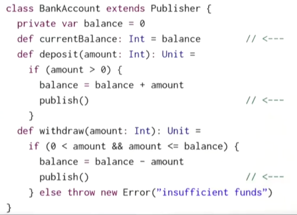
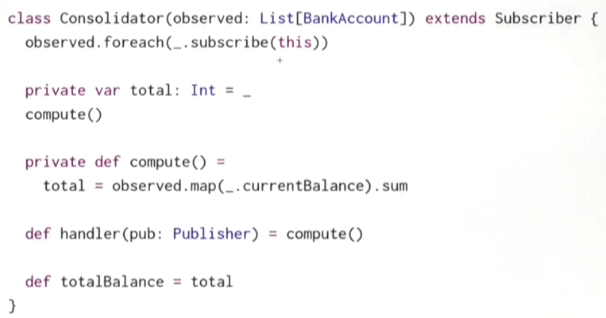
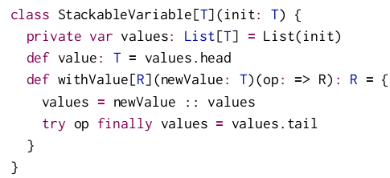
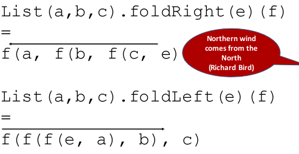
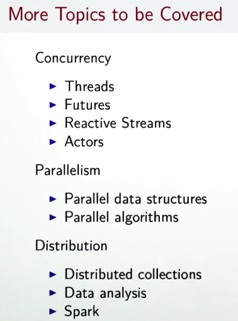

Title: [Scala MOOC II] Lec4 - Timely Effects  
Date: 2016-11-09  
Slug: progfun2_lec4_var  
Tags: scala     
Series: Functional Program Design in Scala  
    
[TOC]    
 
 
this week: discuss how to handle events in user-interface — MVC, functional reactive programming.  
 
Lecture 4.1 - Imperative Event Handling: The Observer Pattern 
============================================================= 
 
Traditional way of handling events: *observer Pattern (MVC)*. Used when views need to react to change in a model.  
 
MVC: model-view-controller for user interface 
 
 
* Views can announce themselves to a model (called "*substribe*") 
* Models can "*publish*" new informations to views 
 
```scala  
trait Publisher{ 
    private var subscribers: Set[Subscriber] = Set() 
    def subscribe(subscriber: Subscriber): Unit 
    def unsubscribe(subscriber: Subscriber): Unit 
    def publish(): Unit = subscribers.foreach(_.handler(this)) 
} 
trait Substriber{ 
    def handler(pub: Publisher)  
} 
```
make the ``BankAccount`` a ``Publisher``:  
 
 
 
create a ``Consolidator`` that displays bank accounts:  
 
 
 
Advantages of MVC: 
 
 
* decouples views from stat 
* have varying number of views of a given state 
* simple to set up  
 
 
Disadvantages:  
 
 
* forces imperative style since handlers are of Unit type 
* many moving parts that need to be coordinated 
* concurrency will be more complicated (ex. 2 models update one view at the same time) 
* Views are tightly bound to one state, view updates immediately 
 
 
Lecture 4.2 - Functional Reactive Programming 
============================================= 
FRP:  
 
* reactive programming: react to seq of *events* that happen in *time*.  
* functional view: aggregate an event sequence to a **signal**.  
 
 
In our simple API, the most important concept is ``Signal``.  
 
**Signal:**  
 
 
* is a vlaue that *changes over time* 
* represented as a *function* mapping time to value domain  
* define new signals from existing ones (instead of having *mutable* state) 
 
 
**example: move mouse positions** 
 
**event-based view:**  
whenever mouse moves, an event ``MouseMoved(toPos: Position)`` is fired 
 
**FRP view:**  
use a signal(function): ``mousePosition: Signal[Position]`` , which at any point represents a current mouse position 
 
### Signal opeartions 
 
2 fundamental ops on signals:  
 
* obtain value of signal at current time (the ``apply`` function): ``mousePosition()`` 
* define a signal in term of another signal (constructor ``Signal(expr)``) 
 
 
example: from the mouse curve signal, define a new signal indicating whether the curve is inside the rectangle or not.  
 
```scala  
def inReactangle(LL: Position, UR: Position): Signal[Boolean] =  
    Signal{val pos = mousePosition() // the mouse pos signal 
    LL<= pos && pos <= UR} 
``` 

 
use ``Signal(_value)`` to define a constant signal:  
 
``val sig = Signal(3) // constant signal`` 
 
then define a subclass ``Var`` of ``Signal`` for changable signals, which has an ``update`` operation to redefine the value of a signal.  
 
```scala  
val sig = Var(3) 
sig.update(5) // update  
```
 
⇒ In scala, ``update`` is also a special function: assignments like ``a(e1,...en)=e`` are translated to ``a.update(e1...en, e)``. (Here the n could be 0, i.e. no arguments in the assignment expression).  
 
→ So ``sig.update(5)`` can be re-written as ``sig()=5``. The ``()`` is like dereferencing a varable.  
 
>Difference between ``Var``s and mutable ``var``s: we can *map over signals*, i.e. maintain a relation between 2 signals forever in the future, whereas using mutable ``var``s have to propagate all updates manually.  
 
### example: bank account 
add a signal ``balance`` to ``BankAccount``s, define a *function* ``consolidated`` which takes sum of all balances of accounts in list.  
  
```scala  
class BankAccount { 
  val balance = Var(0) // a Var signal 
  def deposit(amount: Int): Unit = if(amount>0){ 
      val b = balance() 
      balance() = b + amount // otherwise cyclic definition of `balance` 
  } 
  def withdraw(amount: Int):Unit = 
    if(0<amount && amount<=balance()){ 
      val b = balance() 
      balance() = b - amount 
    }else throw new Error("insufficient balance") 
} 
 
def consolidated(accts: List[BankAccount]):Signal[Int] = 
  Signal(accts.map(_.balance()).sum) 
 
// similarly, define exange rate signals 
def xchange = Signal(246.0) 
def inDollar = Signal(c()*xchange) 
```  

note the difference between var assignment and signal update:  
 
 
* ``v = v+1``: the new value is old value + 1 
* ``s() = s() + 1``: the s is a function that is always 1 larger than itself (cyclic definitions) 
 
 
Lecture 4.3 - A Simple FRP Implementation 
========================================= 
 
implementation of ``Singal`` and ``Var``.  
 
class API:  
 
```scala  
class Signal[T](expr: =>T){ 
  def apply(): T = ??? // s() give cur value 
} 
 
object Signal{ 
  def apply[T](expr: =>T) = new Signal(expr) // construct new signal 
} 
 
class Var[T](expr: =>T) extends Signal[T](expr){ 
  def update(expr: =>T):Unit = ??? // s()=expr for update 
} 
 
object Var{ 
  def apply[T](expr: =>T) = new Var(expr) 
} 
```  
  
or more convientently:  
 
 
* use ``sig()`` get the signal's (current) value 
* use ``sig() = {new_expr}`` to update the signal's expression 
 
 
implemention idea 
----------------- 
 
### Signal 
each ``sig: Signal[T]`` maintains:  
 
* its *current value * 
 
    ``private var myValue: T`` 
 
* its *current expression * 
 
    ``private var myexpr: () => T`` 
 
* set of *observers *: other signals (**callersig**s) that depend on ``this.myValue``  — if ``this.myValue`` changes, all signals in this.observers should be re-evaluated  
 
    ``private var observers: Set[Signal[_]]`` 
 
* protected  function to re-evaluate value 
 
``protected def computeValue(): Unit`` 
 
* protected function to change expression  
 
``protected def update(expr: => T): Unit`` 
 
How to record dependencies:  
 
 
* when evaluating a ``Signal``, need to know which ``callersig`` gets defined by ``this`` 
* So we should add the caller to ``this.observers`` when ``apply`` is called (like: ``sig()``).  
* if ``this.myValue`` changes (when calling ``computeValue()``), all caller signals in ``this.observers`` are re-evaluated (``callersig.computeValue()``); and ``this.observers`` is **cleared(!! see next item)**.  
* when ``callersig``s re-evaluate their expression, the ``apply()`` method will add the ``callersig`` again to ``this.observers`` 
 
 
### caller 
How to find out *who is calling* so that a signal is evaluated ? 
simplistic way: maintain a *global* data structure (stack-fashion) referring to current ``caller: StackableVariable[Signal[T]]``.  
 
``caller`` is a global "stack" of ``callersig``s that get poped/pushed.  
 
The API of the ``StackableVariable[Signal[T]]`` class:  
 
 
* ``caller.value: Signal[T]``:  
 
get *the callersig on top of stack, which depends on currently evaluating signal* (``this``), and so should be added to ``this.observers``. 
 
* ``caller.withValue(sig:Signal[T])(expr: () => [T])``:  
 
first add ``sig`` to the top of stack; then evaluate ``expr``; finally pop ``sig`` off the stack.  
 
Here is the implementation of the ``caller`` :   
 
 
 
* So whenever ``sig`` want to know who depends on it, it just use ``caller.value``;  
 
thus, in the ``apply`` method of ``Signal``s, we write like this:   

```scala  
def apply() = { 
  observers += caller.value // caller.value=top of stack, it depends on currenlty-evaluating value (this), so it should be added to this.observers 
  assert(!caller.value.observers.contains(this), "cyclic signal definition") 
  myValue 
  } 
```
 
 
 
* And if ``sig`` want to depend on other signals, in order to write the expression(which includes other signals that sig depends on), it use: ``caller.withValue(this){expr...}`` 
 
so in ``computeValue()``, as ``this.myExpr`` may contain other signals that ``this`` depend on, we should write:  

```scala
protected def computeValue(): Unit = {
    for (sig <- observed)
      sig.observers -= this
    observed = Nil
    val newValue = caller.withValue(this)(myExpr()) // withValue will add this to the top of stack, so when eval other signals, they know that it's this signal that depends on them
    if (myValue != newValue) { // re-evaluate all callersigs that depends on this
      myValue = newValue
      val obs = observers
      observers = Set() // clear observers for this: the callersigs may be added back in apply()
      obs.foreach(_.computeValue()) // here this.observers might be added with calersigs
    }
  }
```
 
 
 
 
problem: global stack is not good... especially for concurrency  ⇒ replace global state by *thread-local state*.  
 
Or use *implicit parameteres*: pass current value of the thread-local variable into a signal expr as implicit parameter.  
 
 
Lecture 4.4/4.5 - Latency as an Effect 
====================================== 
 
(I didn't quite get the point from this lecture on...) 
 
when computation takes a lot of time: register a **callback** when computation terminates (either success or failure).  
 
``Future[T]``: a **monad** that handles both exceptions and latency 
 
```scala
trait Future[T] { 
def onComplete(callback: Try[T] =>Unit): Unit 
} 
```
 
The callback use pattern matching:  
 
```scala
ts match{ 
    case Success(t) => onNext(t) 
    case Failure(e) => onError(e) 
} 
```
 
another option: give 2 callbacks, one for success, one for failure.  
 
``def onCompelet(success: T=>Unit, failed: Throwable => Unit): Unit`` 
 
Lecture 4.6/4.7/4.8/4.9/4.10 - Combinators on Futures/Composing Futures 
============================ 
 
 
higher-order funcitons on ``Future``s: map/filter/flatMap/... 
 
recover/recoverWith for Error case ⇔ map/flatMap for Future. 
 
fallbackTo:  
 
retry: deal with failure...  
 
turn recursion to foldleft/foldright...  
 
 
 
 
Conclusion 
========== 
 
 
* lazy evaluation: infinite data structure 
* distinction between computations and values: random/signal are computations 
* monads: abstract over properties of computations, encapsulate mutations, ... 
 
 
mix FP and mutable state 
 
* laziness 
* FRP 
* monads 
 
 
 
 
 
exercice: calculator 
==================== 
 
 
Use Function Reactive Programming (FRP), with the Signal[A] class that you have seen in the lectures, to implement a spreadsheet-like calculator. In this calculator, cells can depend on the value of other cells, and are recomputed automatically when the latter change.  
 
<https://github.com/X-Wei/Coursera-progfun2/tree/master/hw4-calculator> 
