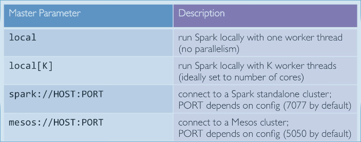
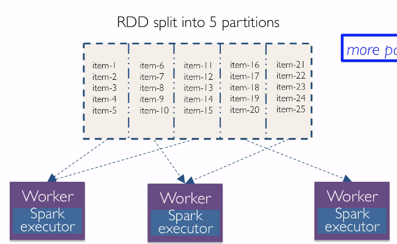
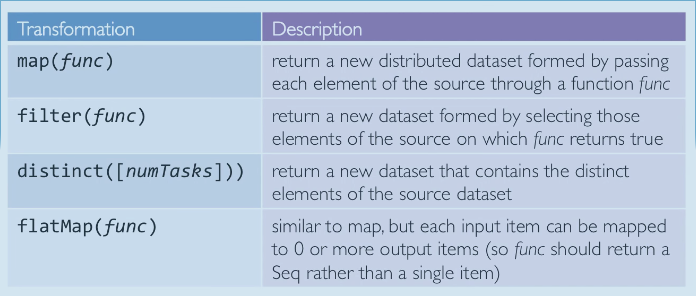
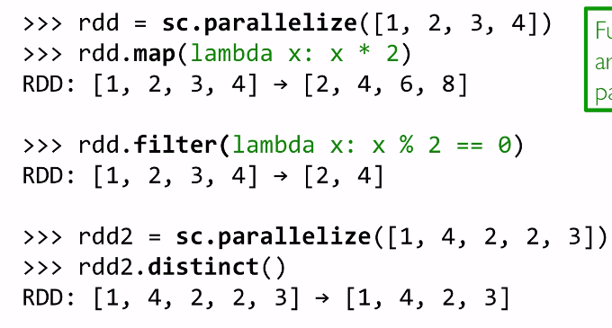
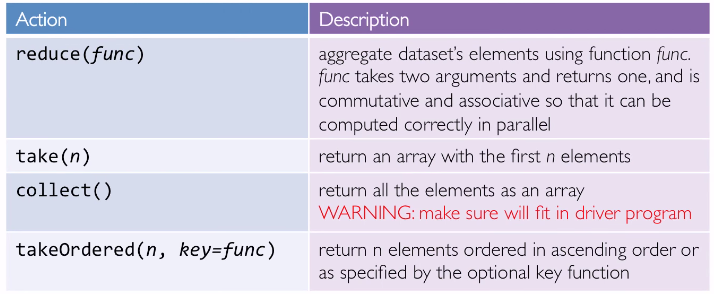
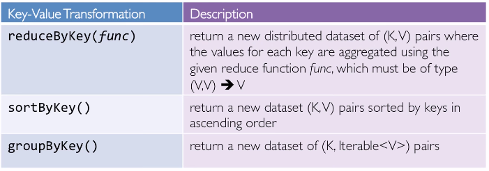
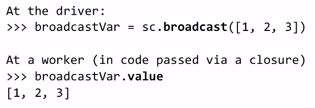
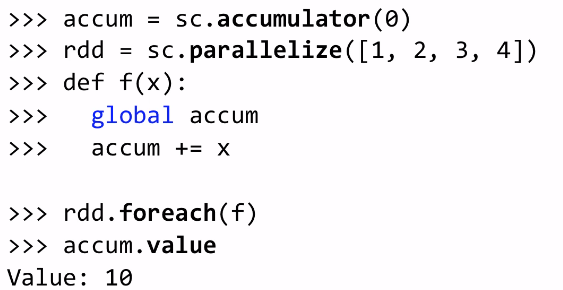

Title: [Spark MOOC note] Lec4. Spark Essentials
Date: 2015-06-16
Slug: sparkmooc_note_lec4
Tags: spark
Series: spark MOOC
 

PYTHON SPARK (PYSPARK)
----------------------
**a spark prog has 2 programs:** 

* dirver program: runs on driver machine
* worker program: runs on local threads or cluster nodes

a spark prog first creates a **SparkContext object:**

* tells how and where to access a cluster
* shell will automatically create **the sc varible**
* in iPython: use constructor to create a ``SparkContext`` obj
* ⇒ use this SparkContext obj to create RDDs

Master:  
The ``master`` parameter (for a SparkContext) determines which type and size of cluster to use

RDDs
----
**Resilient Distributed Dataset**:

* immutable once created
* spark tracks linege information to compute lost data efficiently
* operations on collections of elements in parallel

**to create RDDs**:

* paralizing existing python collections
* transforming existing RDDs
* from files
* can specify the number of partitions for an RDD

2 types of operations on RDD:

* tranformation: lazy, *executed only one action runs on it*
* action

Working with RDD:

* create an RDD
* apply transformations to that RDD (ex. map, filter)
* apply actions on RDD (collect, count)

ex code:  

	data = [1,2,3,4]
	rDD = sc.paralize(data, 4)
	distFile = sc.textFile("readme.txt", 4) // elements are lines in the file

SPARK TRANSFORMATIONS
---------------------
to create new dataset from existing one (lazy)

examples of transformations:   

PYTHON LAMBDA FUNCTIONS
-----------------------
single expression

TRANSFORMATIONS
---------------

⇒ spark truns the function litral into a cloture, balck code runs in driver, green code in workers

SPARK ACTIONS
-------------
cause spark to execute recipe to transform source. 

SPARK PROGRAMMING MODEL
-----------------------

CACHING RDDS
------------
to avoid having to reload data: ``rdd.cache() ``⇒ read from memory instead of disk  

SPARK PROGRAM LIFECYCLE
-----------------------
create/paralise ⇒ transform ⇒ [cache] ⇒ action

SPARK KEY-VALUE RDDS
--------------------
each element of a *pair RDD* is a pair tuple

key-value transformations:   

ex:  

careful using `groupByKey`: create lots of data traffic and iterables at works

PYSPARK CLOSURES
----------------

* one closure per worker is sent *with every task* 
* no communication between workers
* changes to global vars will not effect driver / other workers

⇒ pbs: 

* inefficient to send large data to each job
* one-way: driver → worker

**pyspark shared vaiables**: 
2 types: 

* **Broadcase variables**:
	* send large, read-only variables to all workers
* **Accumulators**
	* aggregate values from worker to drivers 
	* only driver can access its value
	* for workers the accumulators are write-only

SPARK BROADCAST VARIABLES
-------------------------
ex. give every worker a large dataset   

SPARK ACCUMULATORS
------------------
can only be "add" to by associative operation   

careful to use accumulators in transformations:   

Lab1
----
VB更新以后虚拟机打不开了, 解决办法在:   
<http://bbs.deepin.org/forum.php?mod=viewthread&tid=26001>

