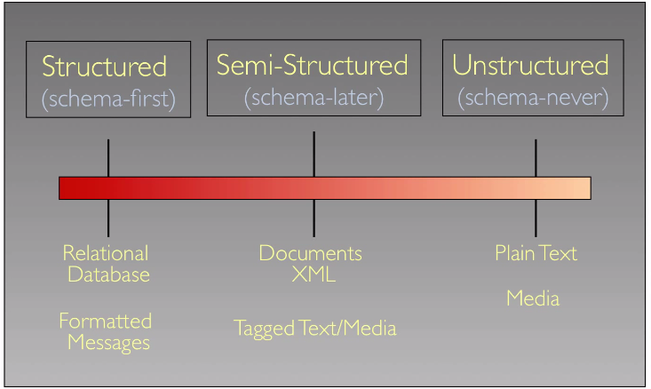
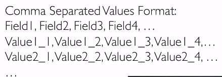
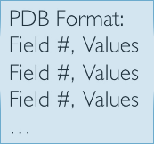
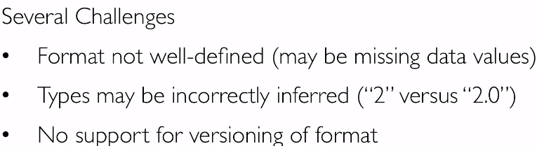
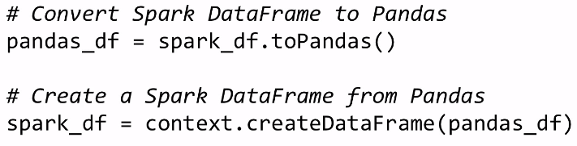
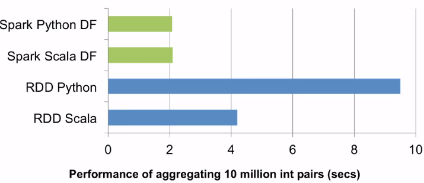
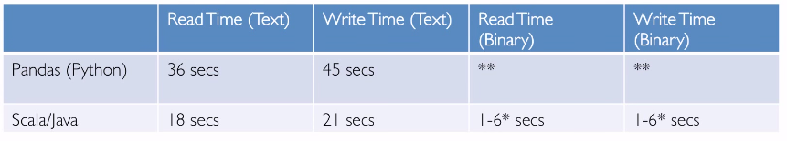
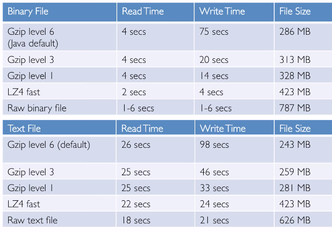

Title: [Spark MOOC note] Lec5. Semi-structured Data
Date: 2015-06-17
Slug: sparkmooc_note_lec5
Tags: spark
Series: spark MOOC
 
[TOC]  

KEY DATA MANAGEMENT CONCEPTS
----------------------------
data model: collection of concepts for describing data
schema: a description of a particular collection of data using a given data model

structure spectrum:   

semi-structured data: apply schema **after** creating data. 

FILES
-----
files: named collection of bytes, in hierarchical namespace (but: In a Content-Addressable Storage system files are stored, arranged, and accessed based on their content or metadata, not in hierarchy)

SEMI-STRUCTURED TABULAR DATA
----------------------------
table: a collection of rows and columns, each row has an *index*, each column has a *name*. 
cell: by a pair (row, col), values can be missing, types are *inffered* from content

CSV:  

PDB:(filed name can be repeated on multuple lines)    
 

CHALLENGES WITH TABULAR DATA
----------------------------
challenges:   

challenges for tabular data *from multiple source*:   

challenges for tabular data *from sensors*:   

PANDAS AND SEMI-STRUCTURED DATA IN PYSPARK
------------------------------------------
pandas ``DataFrame``: represented as python dict (colname → series)
pandas ``Series``: 1D labeled array capable of holding any data type

**spark DataFrame**: *Distributed* collection of data organized into named columns. 
types of columns are inferred from values. 

Using dataframes can be 5 times faster than using RDDs:   

SEMI-STRUCTURED LOG FILES
-------------------------
ex. Apache web server log format

EXPLORING A WEB SERVER ACCESS LOG
---------------------------------
NASA http server access log  
<http://ita.ee.lbl.gov/html/contrib/NASA-HTTP.html>

DATA MINING LOG FILES
---------------------
Data mining log files is a data exploration process that often involves searching through the data for unusual events, a task that can be done using dashboards for visualizing anomalies. The data being analyzed usually includes machine resource usage data and application queue information.

FILE PERFORMANCE
----------------
binary/text performance benchmark:  
  
⇒

* read and write times are comparable 
* binary files are mach faster than palin text files

compression performance benchmark:  
  
⇒ 

* write times are much larger than read times 
* small range of compressed file size
* binary still much faster than text 
* LZ4 compression ~= raw IO speed

