Title: [XCS224N] Lecture 1 – Introduction and Word Vectors
Date: 2020-03-09
Slug:  xcs224n-lecture1
Tags: deep learning
Series: XCS224N: NLP with deep learning

### Course intro

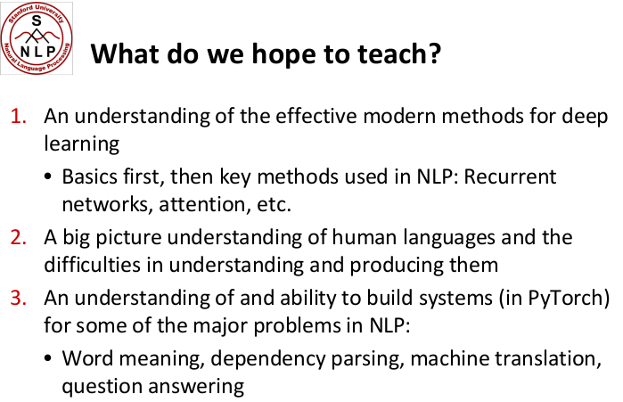

### Word Meaning and Representation

*denotational semantics*

**wordnet (nltk)**: word meanings, synonym, relationships, hierarchical

pb: missing nuance, missing new meanings, required human labor, *can't compute word similarity* 

Traditional NLP (untill 2012): 

* each words are *discrete* symbols — "**localist representation**"
* use *one-hot vectors for encoding*

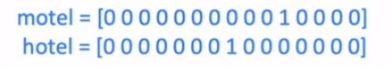

* pbs with one-hot vecotrs: 
  + large dimension size
  + each two words are *orthogonal*, no relationships between them

**distributional semantics**: A word’s meaning is given by the *words that frequently appear close-by*.
⇒ Use the many *contexts of w* to build up a representation of *w*.

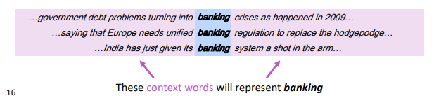

"**distributed representation**": 
use *dense vectors* for each word, *so that it is similar to vectors of words that appear in similar contexts.*

### Word2Vec Introduction

word2vec algo: for learning word embeddings.

#### idea

* start with large text corpus
* each word from the (*fixed*) vocab has a vector *v — *start with rand vectors
* for each center word `c` and context(outside) word `o` :
  + use `sim(c,o)` to compute `P(o|c)` or `P(c|o)` .
  + update the vecs to maximize the probability

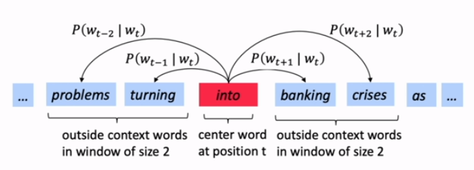

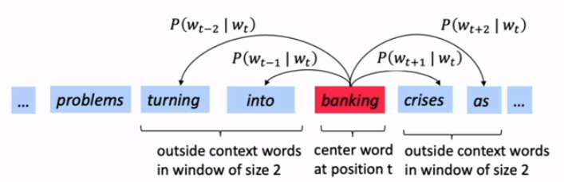

#### likelihood

**Likelihood** := product of all predicted probabilities for all window words (fixed window sz= `m` ), for all positions `t` .

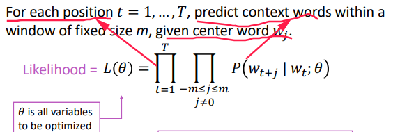

#### Loss function

⇒ take negative log likelihood as **loss function**:

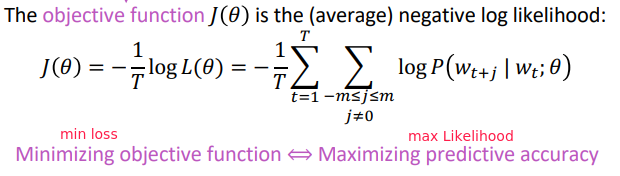

#### Prediction function

⇒ probability prediction `P(o|c)` is a function of the word vectors: 

* *we use two vectors per word:* 
  + use `v_w` when word *w* is the center word
  + use `u_w` when *w* is context word.
* proba = *softmax* of the dot products `dot(v,u)` for all context word u in Vocab.

  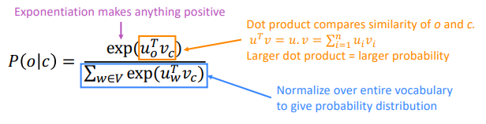

* 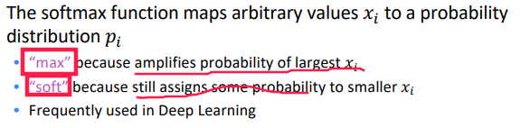

#### optimization

`θ` :=all parameters in the model, i.e. `2*V` vectors (u/v), each of dimension `d` .

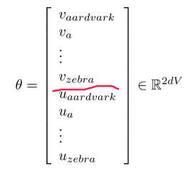

**gradient descent**: compute all gradients of `θ` w.r.t.loss function `J(θ)` .
I.e.compute dJ(θ)/dθ, which is `2*d*V` dimension.

Word2vec Derivations of Gradient
--------------------------------

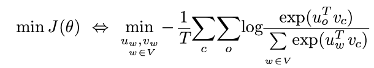 

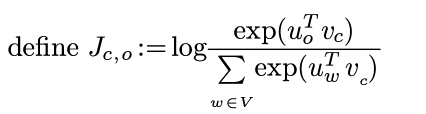 

using chain rule and multi-var derivative:

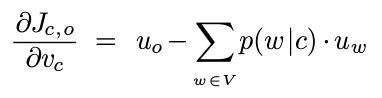

⇒ slope of the vector `v_c` w.r.t. `J_c,o` 
equals the current vector `u_o` minus the weighted average of context word `u_w` , i.e.*"expected context word"*.

Gensim Word Vector Visualization
--------------------------------

gensim: word similarity package

word composition

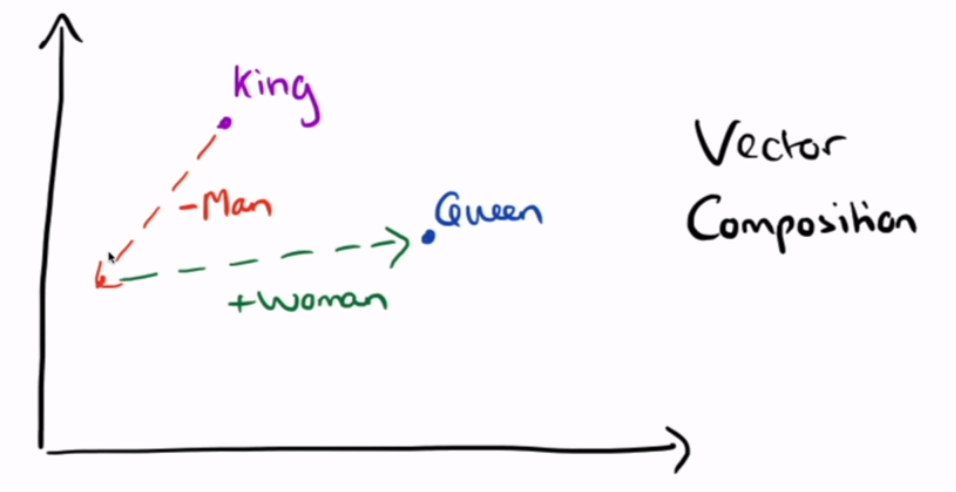
