Title: [XCS224N] Lecture 2 – Word Vectors and Word Senses
Date: 2020-03-17
Slug:  xcs224n-lecture2
Tags: deep learning
Series: XCS224N: NLP with deep learning

More on Word2Vec
----------------

parameters `θ` : matrix `U` and `V` (__each word vec is a row__):

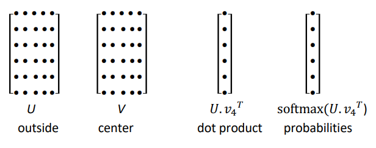

and the predictions don't take into account the *distance* between center word **c** and outside word **o**.
⇒ all word vecs predict high for the stopwords.

Optimization Basics
-------------------
min loss function: `J(θ)` 

### gradient descent

*direction of the gradient  = direction where J(θ) ***increases*** the most.*

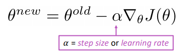

#### SGD

pb: `J(θ)` is for all words/positions in the corpus, `grad J(θ)` is very expensive to compute.
⇒ use *random samples* each time 
⇒ each time we only sample one window of `2m+1` words

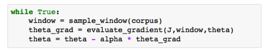

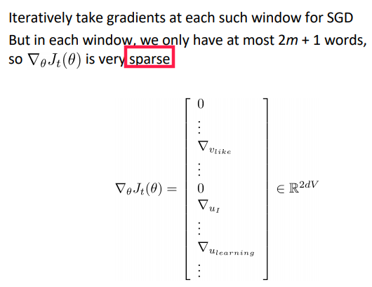

I.e.each time we compute the grad only on a **minibatch***.*
*⇒ *each time we only update the *wordvecs that appear* in the minibatch.

Word2Vec: Model Variants
------------------------
final embedding of a word = *average* of `u` and `v` 
⇒ we can also do only one vec per word, not much difference

2 main varaints of w2v family:

* skip-grams(**SG**): predict outside word **o** with center word **c**: `P(o|c)` .← presented in the class.
* continuous bag-of-words (**CBOW**): predict center word **c** using outside words **o**.

negative sampling
-----------------
So far: naive sotfmax, i.e.sum over *all* words in vocab — *expensive*.

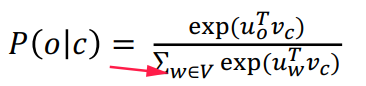

⇒ **negative sampling**.
Use several *binary logistic regressions* on:

* the **true pair** (center word and a true context word )
* several **nois pairs** (center word and a *random* word) ← *random negative pair*

**logistic regression ***= softmax with vocab size=2*
sigmoid function: from inner-product value to probability score

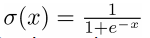 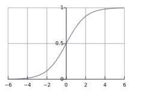

⇒ objective funcion (to maximize):

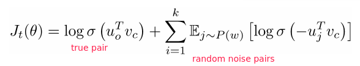

where `P(w)` is the distribution of negative sampling.
in practice: `P(w)=U(w)^(3/4)` i.e.3/4 power of the uniform distribution → makes *rare words appear more often*.

⇒  loss function (to minimize):

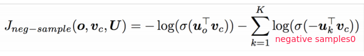

__QUESTION: why put the minus inside the logit?__

Alternative Methods: cooccurrence counts
----------------------------------------

**Why not using co-occurrence counts matrix?**

* co-occurrence in windows
* co-occurrence in document

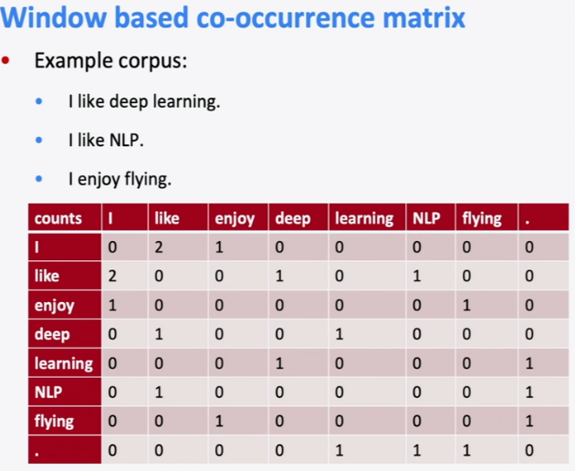

problems with co-occurrence matrix:

* matrix size increase with vocab size
* high dimensional, expensive storage
* Subsequent classification models have sparsity issues

⇒ *model less robust*

#### solution1: low-dimensional vectors

(signular value decomposition for k-largest eigen values)

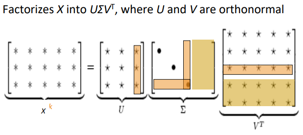

⇒ popular in the year 2000.

#### solution2: hacks to co-occurrence matrix

* trim stopwords
* counter more on closer words
* Pearson correlations to replace counts

#### comparison

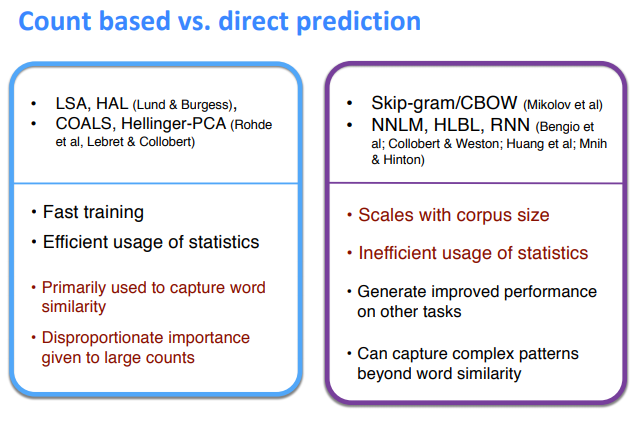

#### encode meanings

insight: **ratios** of co-occurrence probabilities can encode meaning.

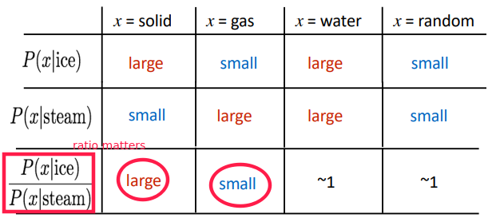

⇒ **make dot-products equal to the ***log*** of co-occurence prabability*** ⇒ vector diff *gives the ratio of co-occur proba

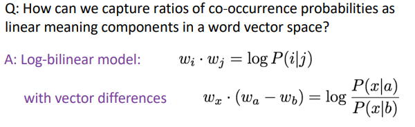

GloVe
-----
Combine the best of both worlds: count method and prediction method.

log-bilinear: 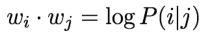

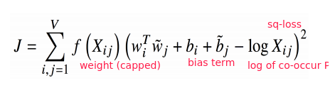

Where the weight ter f(Xij) is capped:

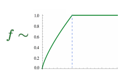

* Fast training
* Scalable to huge corpora
* Good performance even with small corpus and small vectors

Evaluating Word Vectors
-----------------------
*Intrinsic vs extrinsic* in NLP-eval: 
**Intrinsic**:

* Eval on a specific/intermediate *subtask*: e.g.word similarity, POS tag, etc.
* Fast to compute
* Not clear if really helpful unless correlation to real task is established

**Extrinsic***:*

* Eval on *real* task: e.g.web search / question-answering / phone dialog
* Hard to run
* Hard to diagnois

⇒ today: focus on intrinsic word vector evaluation

### Eval on word Analogies

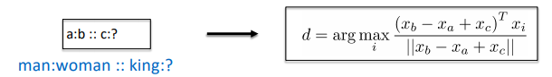

* **Semantic** eval: city-in-state  (e.g.*"Chicago Illinois Houston Texas"*)
* **Syntactic** eval: gram4-superlative (e.g.*"bad worst big biggest"*)

Hyperparameters:

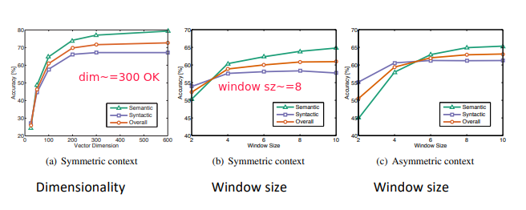

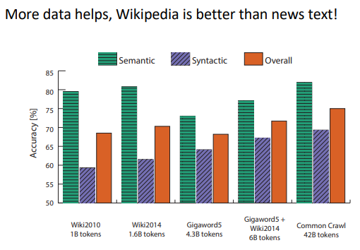

### Eval on word Similarities

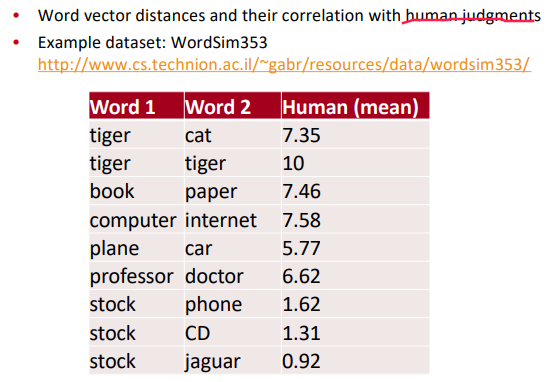

Word Senses
-----------
sense *ambiguity*: words have lots of meanings

* crude solution(2012): for each common word, find clusters of context that it occurs, split the word into pesudowords.
* Linear Algebraic Structure solution (2018):

word sense is a linear superposition:

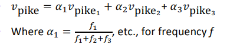

⇒ result: Because of ideas from *sparse coding* you can actually separate out the senses (providing they are relatively common)
actual word/sense are very sparse 

**Extrinsic** word vector evaluation: e.g. NER (finding person/organization/location)
