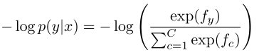

Title: [XCS224N] Lecture 3 – Neural Networks
Date: 2020-03-21
Slug:  xcs224n-lecture3
Tags: deep learning
Series: XCS224N: NLP with deep learning

This week: neural net fundamentals

Classification Setup and Notation
---------------------------------
training data:

### softmax classifier

(linear classifier — hyperplane): 

ith row of the param W: weight vector for class i to compute logits: 

prediction = softmax of f_y:

### cross-entropy

goal: for (x, y), maximize p(y|x)
⇒ loss for (x, y) = -log p(y|x)

in our case, the truth distribution is `one-hot` , i.e.p = [0, 0, ... , 1, ... 0]
⇒ cross entropy H = - sum{log q(y|x), for all x, y}

loss for all training data = averaging the losses:

where the logits vector `f` is:

Neural Network Classifier
-------------------------
softmax or SVM or other linear models are not powerful enough
⇒ NN to learn nonlinear decision boundaries

in NLP:
learn both *model parameters* ( `W` ) and *representations* (wordvecs `x` )

artificial neuron: `y=f(Wx)` , where f is nonlinear activation func.

when f = sigmoid = `1/(1+exp(-x))` , the neuron is binary logistic regression unit.

A neural network = running *several logistic regressions* at the same time

matrix notation: 

Without non-linearities *f()*, deep neural networks can’t do anything more than a linear transform.

Named Entity Recognition (NER)
------------------------------
task: find and classify names in text

*BIO encoding*: 

Binary Word Window Classification
---------------------------------
Classify a word in its *context* window of neighboring words.
simple idea: concat all context words

Binary classification with unnormalized scores(2008&2011): 
build *true window* and *corrupted windows*.

feed-forward computation:

intuition: middle layer learns *non-linear interactions* between words:
example: only if “*museums*” is first vector should it matter that “*in*” is in the second position.

max-margin loss: let true window score be larger (by at leaset delta=1)than the corrupted window score.

__QUESTION: why we can use SGD when continuous?__

SGD:

Computing Gradients by Hand
---------------------------
multivariable derivatives / matrix calculus

* *when f is from Rn → R1, ***Gradient**=vector of partial derivatives 

* *when f is from Rn → Rm, ***Jacobian** is an *m x n* matrix of partial derivatives 

**chain rule**: multiply the Jacobians

⇒ the nonlinear (activation) function **h** is *element-wise*, Jacobian of **h** is *diagonal:*

⇒ other Jacobians:

Gradients in Neural Network
---------------------------
notation:

⇒ Apply the chain rule with Jacobian/grad formulars from last section:

⇒ extract the common part, call it **local error signal**:

⇒

