Title: [XCS224N] Lecture 4 – Backpropagation
Date: 2020-03-21
Slug:  xcs224n-lecture4
Tags: deep learning
Series: XCS224N: NLP with deep learning

More Matrix Gradients
---------------------

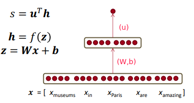

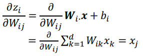

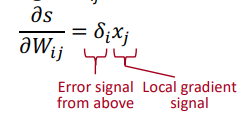
 ⇒ 
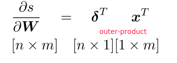

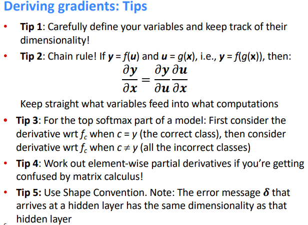

Deriving Gradients wrt Words
----------------------------

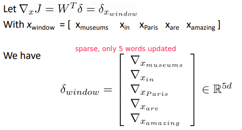

**pitfall** in tetraining word vectors: 
if some word is not in training data, but other synonyms are present ⇒ only the synonyms word vectors are moved

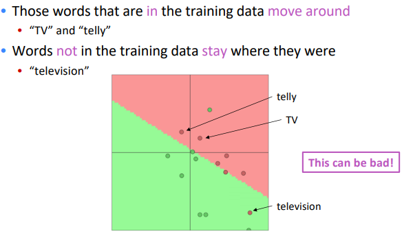

takeaway: 

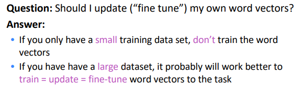

Backpropagation
---------------
backprop:

* apply (generalized) chain rule
* re-use shared stuff

### computation graph

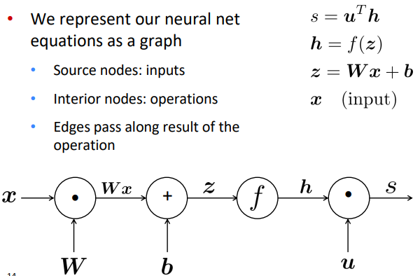

⇒ Go backwards along edges, pass along **gradients**

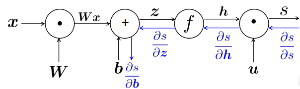

receive upstream grad => compute downstream grad

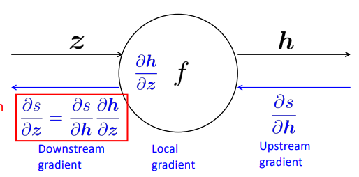

for node with multiple inputs:

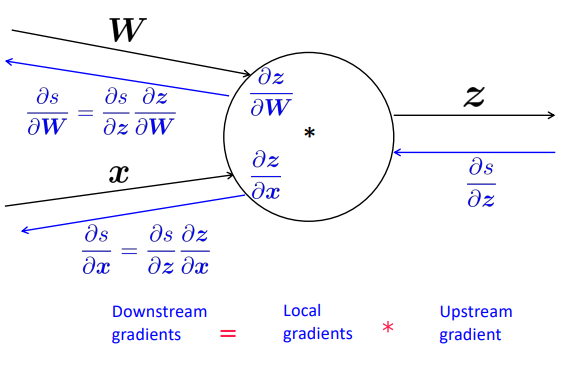

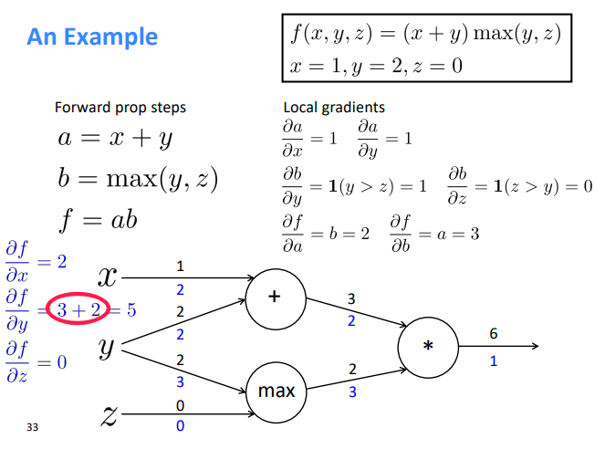

More on Backpropagation
-----------------------

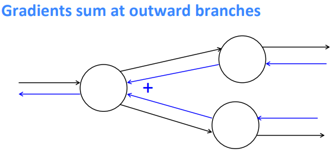

**intuition:**

* plus( `+` ) *distributes* upstream grad

  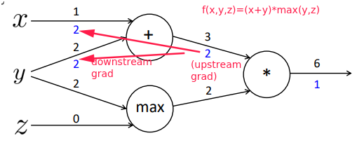

* `max`*routes* upstream grad

  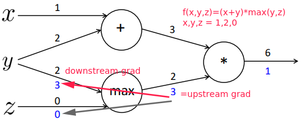

* multiply( `*` ) *switches* the upstream grad

  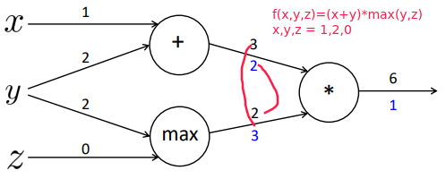

efficency: compute shared part once

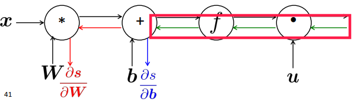

### Backprop in general computation graph

comput-graph is a DAG  ⇒ topological sort

* **Fprop**: visit nodes in topological
* **Bprop**: in reverse topological order

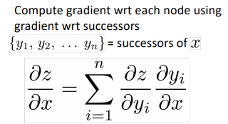

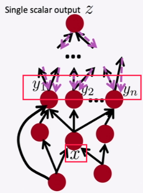

Complexity = **O(n)**
Automatic Differentiation: symbolic computation on the symbolic expression of Fprop.
Moden DL framework: must provide the Fprop/Bprop formular for each node.

Backprop Implementations
------------------------

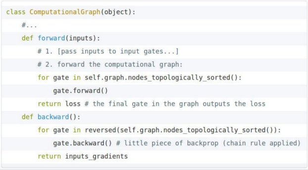

for each gate, impl the forward/backward API:

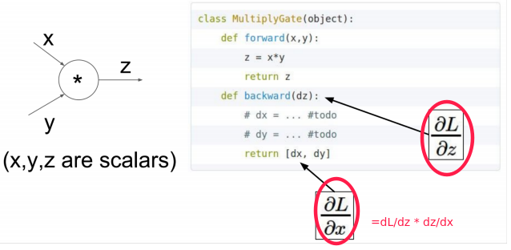

**Numeric Gradient**
For checking if the forward/backward impl is correct
e.g.check

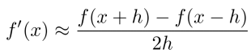

(note: use *two-sided* gradient checks)

Regularization
--------------
Regularization term added to loss func to prevent overfitting:

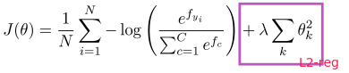

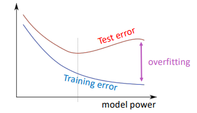

Vectorization/tensorization
---------------------------
avoid forloops, use matrix multiplication instead.

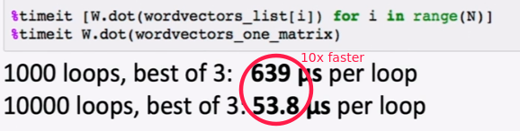

Nonlinearities
--------------

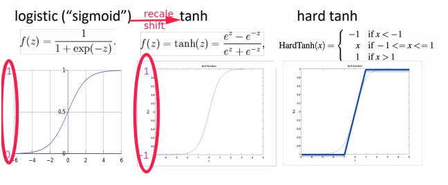

tanh is recaled and shifted of sigmoid:
`tanh(x) = 2 * sigmoid(2x) - 1` 

new world activation func:

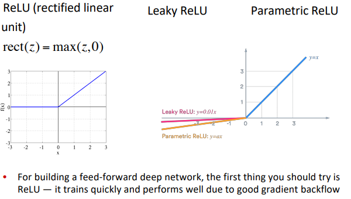

Parameter Initialization
------------------------
Initialize the weights to *small, random* values ⇒ **break the symmetry.**

* Init bias to 0
* Init all other weights to Uniform(-r, r).
* **Xavier initialization**: *variance inverse-proportional to sum of prev&next layer size*

  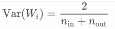

Optimizers and Learning Rates
-----------------------------
Usually simple SGD works fine, but needs to tune the learningrate (*lr*).
**adaptive optimizers**: *per-parameter* learning rate.

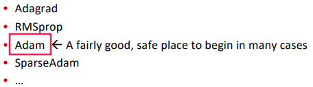

**learning rate:** 

* try with powers of 10
* learningrate-decay: 

  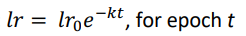

  (*epoch* = full pass over the training data)
