Title: [XCS224N] Lecture 5 – Dependency Parsing
Date: 2020-03-23
Slug:  xcs224n-lecture5
Tags: deep learning
Series: XCS224N: NLP with deep learning

**Phrase structure**: organize words into nested constituents.

Context-Free Grammars
---------------------
**context-free grammars (CFGs)**

* start with *words*, words are given a category (part of speech = POS):

* words combine into *phrases* with categories like *NP*(noun phrase) and *PP*(prep.phrase):

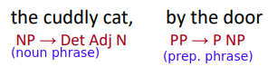

* Phrases can combine into bigger phrases recursively:

⇒ forms a tree structure:

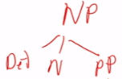

Dependency Structure
--------------------
Different from CFGs, instead of having concepts of NP/PP/etc, **dependency structure** shows which word *depend* on which other word.

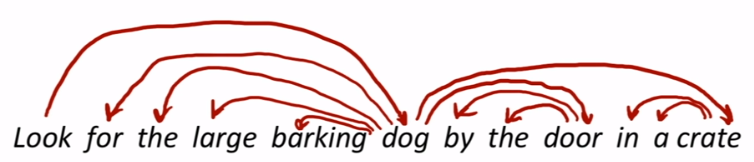

Prepositional Phrase Attachment Ambiguity
-----------------------------------------
**example of ambiguties:**

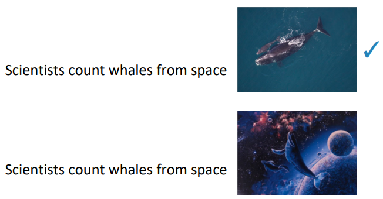

**multiplied ambiguities: **many PPs in a row

⇒ exp number of possible dep trees, 

Dependency Grammar - Structure and Parsing
------------------------------------------

* **Dependency syntax**: syntactic structure consists of *relations between lexical items*, normally binary asymmetric relations (“arrows”) called **dependencies**.
* The arrows are commonly *typed *with the name of grammatical relations (subject, prepositional object, apposition, etc.)
* Usually, dependencies form a *tree* (connected, acyclic, single-rooted graph)

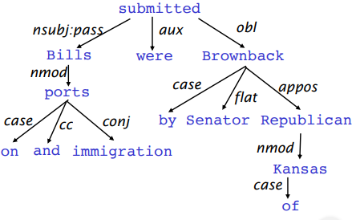

Treebanks
---------
Universal Dependencies treebanks: human-annotated dep trees

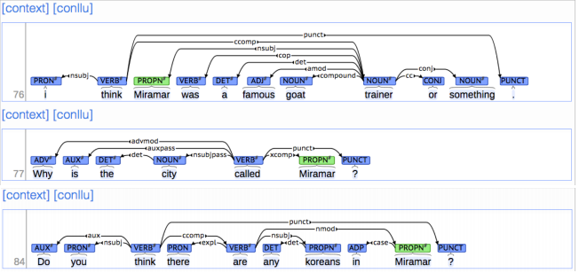

treebank vs.grammar:

* cons:
  + slow
* pros:
  + Reusability of the labor
  + Broad coverage, not just a few intuitions
  + Frequencies and distributional information
  + A way to evaluate systems

More on Dependency Parsing
--------------------------
**Dep parsing**: A sentence is parsed by *choosing for each word what other word* (including ROOT) is it a dependent of.
constraints:

* Only one word is a dependent of `ROOT` 
* no cycle

 pb: whether arrows can cross (*non-projective*)

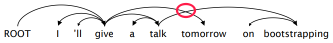

Transition-based Dependency Parsing
-----------------------------------
greedy discriminative dependency parser, a seq of bottom up actions.

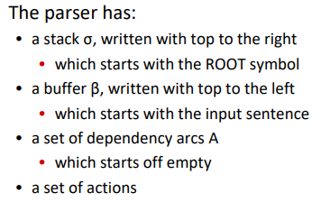

**States:**

* stack `alpha` 
* buffer `beta` 
* dependencies `A` 

**Possible actions**:

* `SHIFT` : removes the first word from the buffer and pushes it onto the stack.
* `LEFT-ARC` : marks the second (second most recently added) item on the stack as a dependent of

  the first item and removes the second item from the stack.

* `RIGHT-ARC` : marks the first (most recently added) item on the stack as a dependent of the second

  item and removes the first item from the stack.

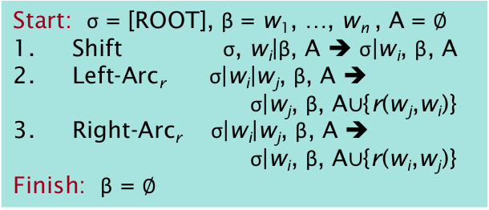

**Example:**

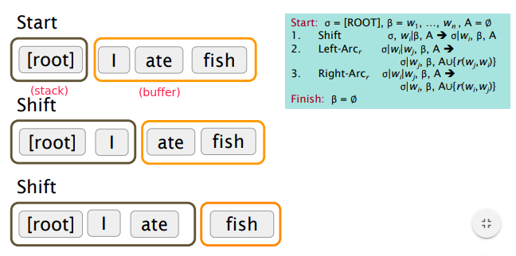

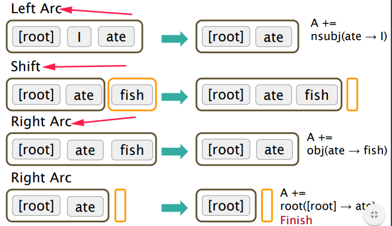

**Pb: how to choose the actions (shift/left-arc/right-arc) ?**
searching all possible actions or DP → cubical complexity❌️
⇒ *use ML to predict actions✔️*

* classes: 3 actions (for untyped choices)
* features: stack word, buffer word, POS
* can also do beam search:  keep *k* good parse prefixes at each time step.

⇒  provides very fast *linear time parsing*, with great performance
__QUESTION: what creteria to select best path?__

Conventional features: hand-engineered, **binary (indicator) features**

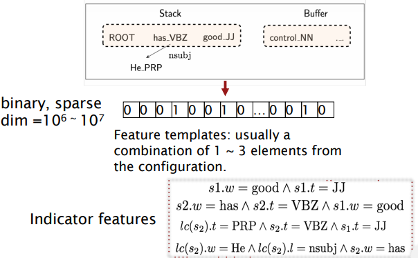

(from assignement)
**Four types of parsing errors**:

* **Prepositional Phrase** Attachment Error: 

e.g.
wrong: *Moscow sent [troops into Afghanistan]* 
right: *Moscow sent [troops] [into Afghanistan]*
⇒ prep phrase="*into Afghanistan*", correct head word = "*sent*", wrong head word = "*troops*"

* **Verb Phrase** Attachment Error

e.g.*[Leaving the store unattended], I went outside to watch the parade*
⇒ verb phrase = "*Leaving the store unattended*", head word="*went*"

* **Modifier** Attachment Error

e.g.*I am [extremely] short*
⇒ modifier="*extremely*", head word="*short*"

* **Coordination** Attachment Error

e.g.*Would you like brown rice or garlic naan?*
⇒ conjuncts="*rown rice*" and "*garlic naan*", coordinating conjunction="*or*"
The second conjunct (here "*garlic naan"*) should be attached to the first conjunct (here "*brown rice"*).

Evaluation of Dependency Parsing
--------------------------------
eval metrics: *dependecy accuracy*

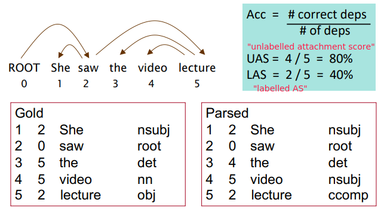

Neural Dependency Parsing
-------------------------
problem with indicator features:

* sparse
* incomplete
* expensive computation: most time are wasted computing the features

⇒  **neural dependency parser**

* represent each word as a `d` -dimensional *dense* vector (word vectors)
* POS and dependency labels are also represented as dense vectors
  + rational: some POS tags are similar, 
  + e.g. NNS(plural nouns) is similar to NN(singular noun), NUM(numbers) similar to AMOD(adj. modifier).

⇒ concat the embeddings of features, feed into a feed forward NN:

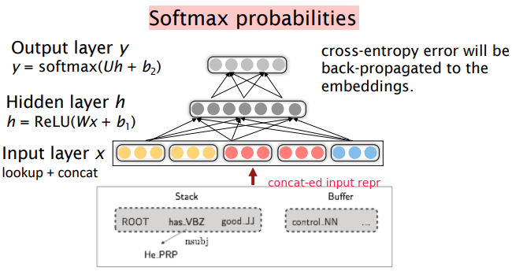

⇒ The dense representations let it outperform other greedy parsers in both accuracy and speed
