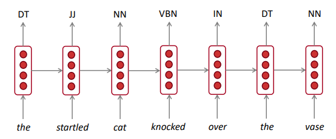

Title: [XCS224N] Lecture 6 – Language Models and RNNs
Date: 2020-03-28
Slug:  xcs224n-lecture6
Tags: deep learning
Series: XCS224N: NLP with deep learning

Language Modeling
-----------------
**Language Modeling**: task of predicting what words come next.

* i.e.compute the conditional probability distribution

    

* a language model can also be viewed as a system to give probability to a piece of text.

    

n-gram Language Models
----------------------
n-gram Language Model: *pre-deep learning* solution for language modelling.

idea: Collect statistics on *frequency of n-grams*, and use these to predict next word

(assumption: current word only dep on previous n-1 words)

sparsity problem:

* some ngrams never appear in training data
  + partial solution: *smoothing*, i.e. add small delta to all words in Vocab
* or the context n-1 gram is never in training data 
  + partial solution: *back-off*, i.e. just condition on the n-2 gram
* storage problem: need to store counts for all ngrams

language model to *generate* text:

Neural Language Models
----------------------
*window-based* neural model: use a fixed window

⇒ compared to ngram model:

* no sparsity problem
* no storage problem

remaining problems:

* window too small
* words at different positions use different weights, *no symmetry*

⇒ need a NN model that can process *any length input*

RNN Overview
------------
A new family of NN: 

* hidden state = function of prev hidden state and curr input vector
* apply the same weights `W` *repeatedly*.

RNN Advantages and Disadvantages
--------------------------------
**pros:**

* any length input
* Computation for step `t` can (*in theory*) use information from many steps back
* Model size doesn’t increase for longer input
* symmetry in how inputs are processed: apply the same weights Wh and We

**cons:**

* slow
* difficult to access information from many steps back *in practice*

Training RNN Models
-------------------

* get text corpus
* feed text to RNN language model, compute `y_t` *for every step* `t` .
* loss function: cross entropy

  

* averaged for all steps t:

  

in practice: compute t for entire corpus is too expensive

⇒ only compute for a sentence or a document

SGD: only compute loss for a batch of sentences

#### backprop

pb: the weights W is repeatedly applied, how to compute the grad?

⇒

**Multivariable Chain Rule**:

#### backprop through time

RNN Text Generation
-------------------
use the RNN LM to gen text: sampled output is next step’s input.

Evaluating Language Models
--------------------------
**Perplexity**: standard eval metrics of language models.

Perplexity equals `exp(J(theta))` where J is cross-entropy loss ⇒ **the smaller the better**

*Why should we care about Language Modeling?*

* LM is a *benchmark task* that helps us measure our progress on understanding language
* LM is a subcomponent of many NLP tasks

Recap
-----

* **Language model**:  system that predicts the next word
* **Recurrent Neural Network:**
  + seq input of any length
  + same weight on each step
  + optionally produce output on each step

RNN can be used for LM, but can be used for other taskes.

* RNN for POS tagging:

  

* RNN for sentiment classification:

  
  

* RNN as an *encoder module*: e.g.question answering, machine translation, etc.

  

* RNN used to gen text: e.g.speech recognition, machine translation, summarization

  

**terminology**: vanilla RNN, GRU, LSTM, etc.

