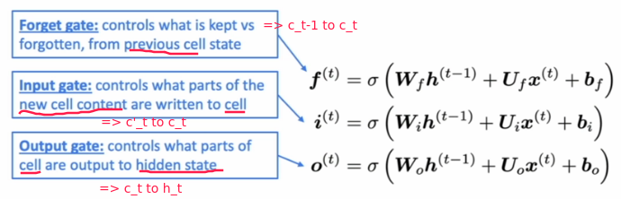

Title: [XCS224N] Lecture 7 – Vanishing Gradients and Fancy RNNs
Date: 2020-04-04
Slug:  xcs224n-lecture7
Tags: deep learning
Series: XCS224N: NLP with deep learning

Vanishing Gradient Intuition and Proof
--------------------------------------
ex: grad of loss at position 4 w.r.t.hidden state at postion 1

with chain rule, the grad is smaller as it backprops

 ⇒ 

If  the *largest eigenvalue* of `Wh` is less than 1, the gradient J_i/h_j will exponentially shrink.

Why Vanishing Gradient is a Problem
-----------------------------------
J2/h1 is bigger than J4/h1

Model weights are only updated only with respect to *near effects*, not *long-term effects*.

Gradient can be viewed as a measure of the *effect of the past on the future*.

example:

RNN models leans better *sequential* recency than *syntactic* recency.

Exploding Gradients
-------------------
If the gradient is too big, *SGD update step* is too big ⇒ this will result in Inf or NaN in your network.

solution: **gradient clipping**

LSTM Overview
-------------
How to fix vanishing gradient:

In a vanilla RNN, the hidden state is *constantly being rewritten*

⇒ can we have an RNN with *separate memory* ?

⇒ **LSTM**

Idea:

* at step `t` , in addition to the hidden state `h_t` , have a *cell state* `c_t` 
* both `h_t` and `c_t` are of length `n` 
* cell states store long-term information
* the LSTM can *erase*, *write* and *read* information from the cell

⇒ the selection of *erase/write/read* action is controlled by the corresponding **gates:**

* each gate is also vec of length `n` 
* each timestep, each element of the gates can be *open* (1), *closed* (0), or somewhere in-between.
  + open: info being passed through
  + closed: info don't pass
* gates are dynamic: their value is computed based on the current context 
  i.e.gate = sigmoid(Wh*ht-1 + Wx*xt + b)

The three gates: **f**, **i**, **o**

* LSTM architecture makes it easier for the RNN to *preserve information over many timesteps*

  if forget gate **f** is always 1, the info in the cell is preserved indefinitely

* LSTM doesn’t *guarantee* that there is no vanishing/exploding gradient, but it does provide an easier way for the model to learn long-distance dependencies.
* Became successful in 2013-2015
* in 2019: other approaches (e.g.*Transformers*) have become more dominant for certain tasks

Gated Recurrent Units
---------------------
Simpler alternative to the LSTM proposed in 2014.

Main idea: 

* *remove the cell state* ct, only use hidden state ht.
* still using gates to control flow of information

gates:

GRU makes it easier to retain info long-term (e.g. by setting update gate **u** to 0)

LSTM vs GRU
-----------

* LSTM and GRU are most widely used RNN variants
* more robust to vanishing gradient problem
* GRU is *quicker* to compute and has *less params*
* no conclusive evidence that one consistently performs better than the other
* LSTM is a *good default choice* (especially if your data has particularly long dependencies, or you have lots of training data)
* **Rule of thumb**: start with LSTM, but switch to GRU if you want something more efficient

Vanishing and Exploding Gradients in Other Architectures
--------------------------------------------------------
Vanishing/exploding gradient is **NOT** just a RNN problem: 

* It's a common pb for all *deep* NN architectures.
  + But RNNs are particularly unstable due to the *repeated multiplication by the same weight matrix* 
* The lower layers are learnt very slowly (hard to train).

⇒ solutoin: add more *direct connections* (thus allowing the gradient to flow) 

ex1. "ResNet": residual connections (or skip-connections)

⇒ makes *deep* networks much easier to train

ex2."DenseNet"
Directly connect everything to everything! (from all layers to all layers)

ex3."Highway connections"
Similar to residual connections, but the identity connection vs the transformation layer is *controlled by a dynamic gate*

Bidirectional RNNs
------------------
task: sentiment classification
using: RNN, and using elementwise max to get sentence encoding

⇒ **Bidir RNN**: two separate RNNs, concat

If you do have *entire* input sequence, bidirectionality is powerful (you should use it *by default*)

Multi-layer RNNs
----------------
Apply RNN in multiple layers

⇒ allows the network to compute more complex representations

* (2017 paper): 2 to 4 layers is best for the encoder RNN, and 4 layers is best for the decoder RNN
  + skip-connections/dense-connections are needed to train *deeper* RNNs (e.g. 8 layers)
* Transformer-based networks (e.g. BERT) can be up to 24 layers
