Title: [XCS224N] Lecture 8 – Translation, Seq2Seq, Attention
Date: 2020-04-05
Slug:  xcs224n-lecture8
Tags: deep learning
Series: XCS224N: NLP with deep learning

Overview
--------

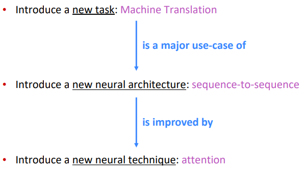

Background (Pre-Neural Machine Translation)
-------------------------------------------

* machine translation (MT): sentence from *source lang* to *target lang*.
* 1950s: rule based, using bilingual dictionary.

1990s-2010s: *Statistical* MT (**SMT**)

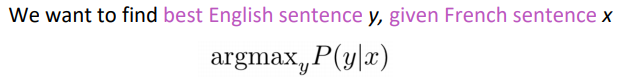

using Bayes rule: `P(y|x) = P(x|y)*P(y) / P(x)` 

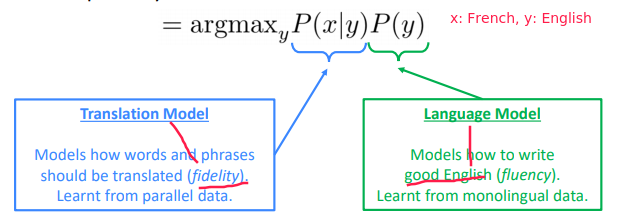

⇒ The **language model** we already learnt in prev lectures
⇒ To get the **translation model**: learn from a lot of *parallel data*, e.g.large corpus of English doc and French translations
and break it down with **alignment** `a` :

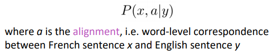

Examples of alignment: can be without counterparts, or one-to-many, or many-to-one, or many-to-many, 

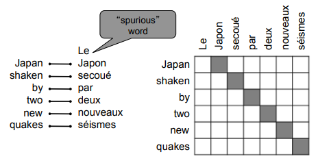

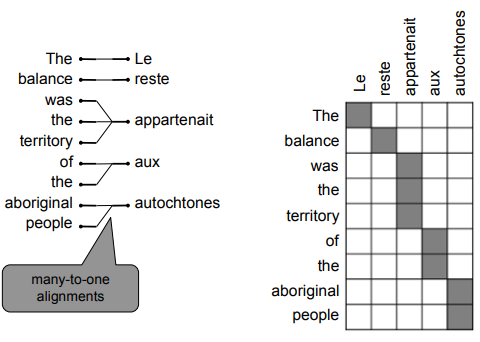

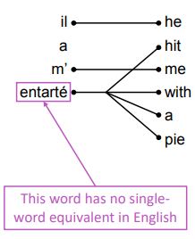

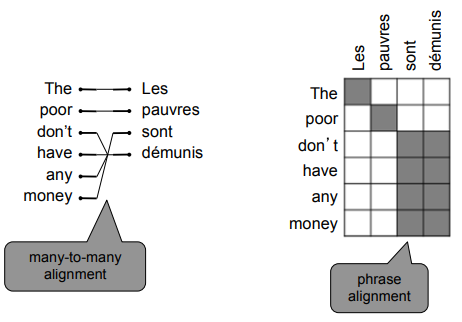

"Decoding": use heuristics to search for argmax sequence

Seq2Seq Overview
----------------
2014: **NMT** to do machine translation using a single neural network.
architecture: seq2seq, with 2 RNNs.

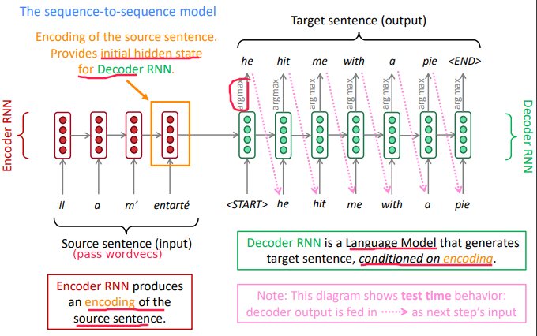

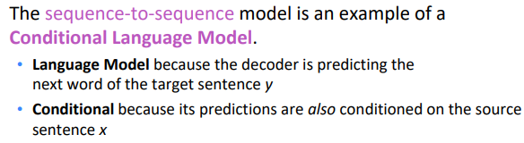

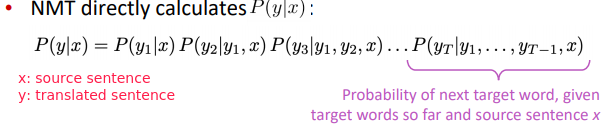

#### Training NMT

In decoder RNN: instead of taking argmax to gen text, *take the neg log prob of the correct translated words*.

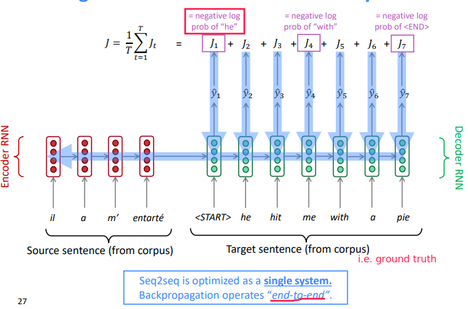

Decoding Methods
----------------
"*Greedy decoding*": 
Always take argmax *at each step*

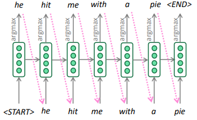

⇒ the final greedy sentence might not be argmax over all sentences

"*Exhaustive search decoding*": 

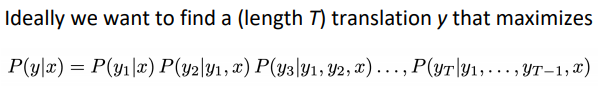

⇒ complexity O(VT) , too expensive

"*Beam search decoding*"
(not guaranteed to find optimal solution, but very efficient.)
At each step, keep track the *k-most *probable* hypotheses *(partial translations).
k = *beam size*

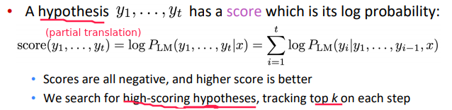

__QUESTION: logP is negative, logP1*logP2 become positive?__

Beam Search Example
-------------------

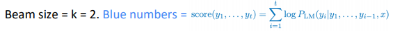

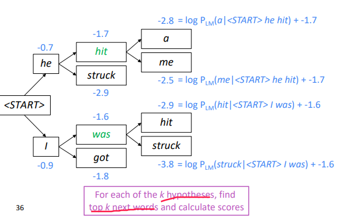

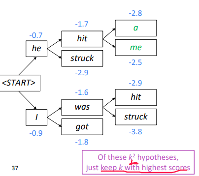

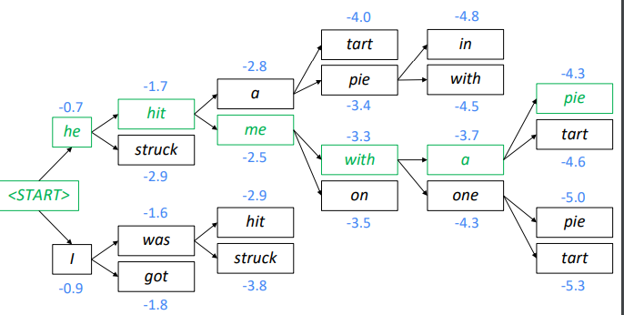

#### Stopping criterion

* In greedy decoding: we stop right after argmax= `<END>` 
* In beam search: `<END>` can be produced at different times

when `<END>` is produced, that hypothese is *complete*, continue exploring other hypotheses.

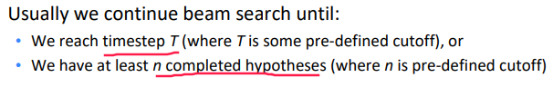

**problem**: *longer* hypotheses have *lower scores ?*

⇒ normalize scores by seq length:

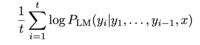

NMT Advantages & Disadvantages
------------------------------
**Advantages**

* Performance
* An e2e system: no subsystems to be individually optimized
* Much less human engineering effort

**Disadvantages** (w.r.t. SMT)

* less interpretable, hard to debug
* difficult to control: can't specify rules or guidelines

Evaluation
----------
Eval metrics for machine translation:
**BLEU** (**B**i**l**ingual **E**valuation **U**nderstudy) — compute *similarity score* between machine translations and human translations.

* based on **ngram precision** (n<=4): how many overlaps of 1/2/3/4-grams with human translations
* **brevity penalty**: penalty for too-short system translations
* BLEU is *useful* but *imperfect*

NMT outperformed tranditional SMT systems in 2016.

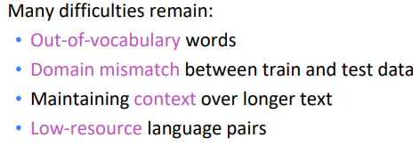

Attention Motivation and Overview
---------------------------------
The bottleneck problem with vanilla seq2seq architecture:

*depend too much* on the single vector of the *last encoder RNN hidden state* 

⇒ only the last hidden state influences decoder behavior.

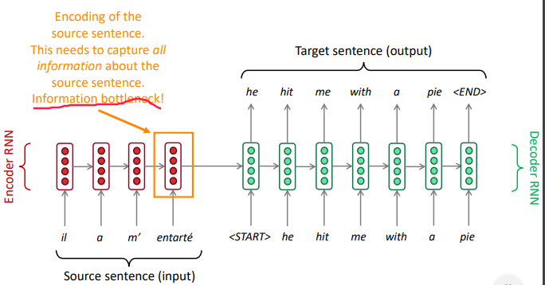

**Attention mechanism:**

On each step of the decoder, use *direct connection to the encoder*.
Focus on a *particular part* of the source sequence

1. Compute an **attention score** as *dot prod* between the current-step *decoder hidden state* **H(k)d** and each-step *encoder hidden state* **H(i)e**.

    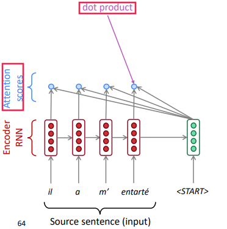

2. Apply softmax(attention-scores) to turn the attention scores into **attention distribution**, that shows which encoder hidden state we should focus on:

    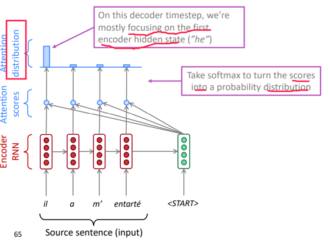

3. take the weighted average (according to the attention-distribution) of the encoder hidden states as **attention output**.

    (this is so-called "soft alignment" as it's a distribution instead of one-hot in SMT)

    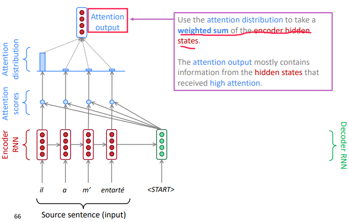

4. use the "attention output" to influence the next word prediction in decoder

    e.g.*concat* attention output with decoder current hidden state, and compute the decoder's word distribution and output a word

    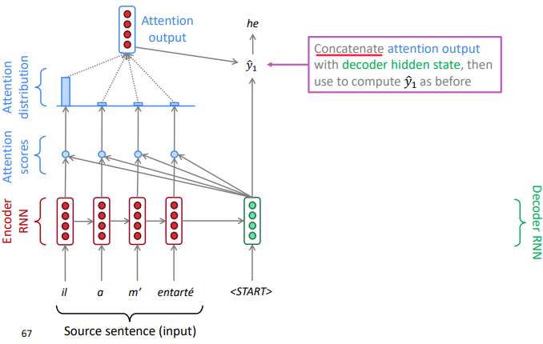

5. decoder go to the next position, and repeat

    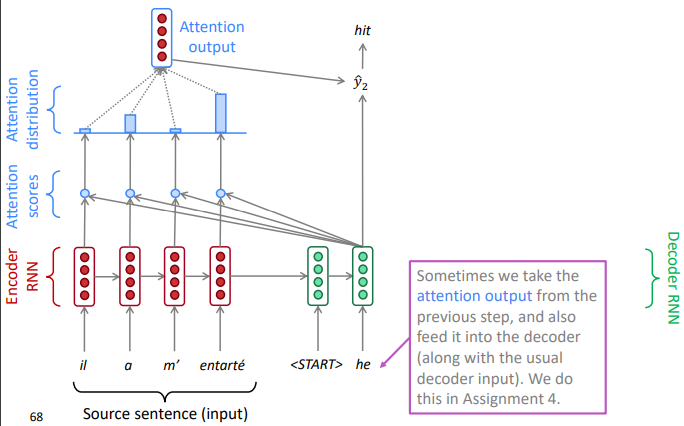

    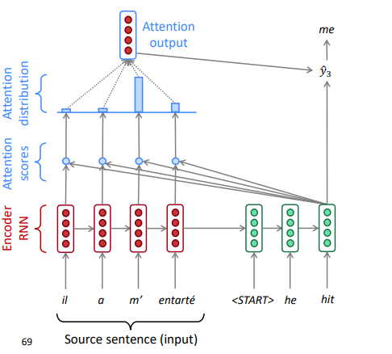

Attention Equations
-------------------

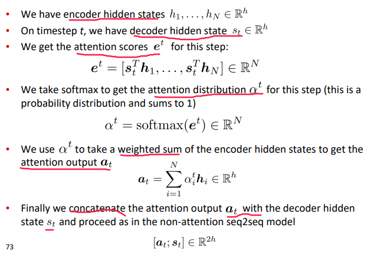

Attention Advantages
--------------------

* significantly improves NMT performance: allow decoder to focus on certain parts of the source
* solves the bottleneck problem
* helps with *vanishing gradient* problem: have direct connections between decoder and encoder over many timesteps
* provides some interpretability
  + inspecting attention distribution, we can see what the decoder was focusing on
  + we get (soft) alignment for free!
    - The network just learned alignment by itself

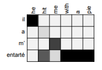

Generalization and Variants
---------------------------
Attention is a *general* Deep Learning technique
You can use attention in many *architectures* (not just seq2seq) and many *tasks* (not just MT).

**More general definition of attention:**

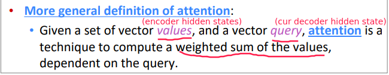

"*query* **attend** to the *values*"

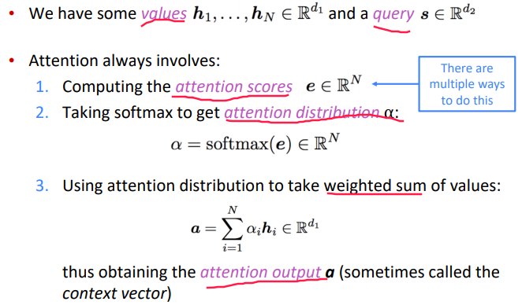

Intuition:

* The weighted sum is a *selective summary* of the information contained in the **values**, where the **query** determines which values to focus on
* Attention is a way to obtain a fixed-size representation of an arbitrary set of representations (the **values**), dependent on some other representation (the **query**).

Attention *variants* on how to compute attention score:

* Basic dot-product attention

  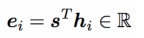

* Multiplicative attention:

  use a bilinear func of query and value-i

  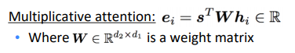

  the weight matrix is *learnable* parameter

* Additive attention

  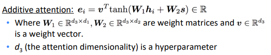

`W1` , `W2` and weight vector `v` are learnable, attention dimensionality d3 is hyperparam

