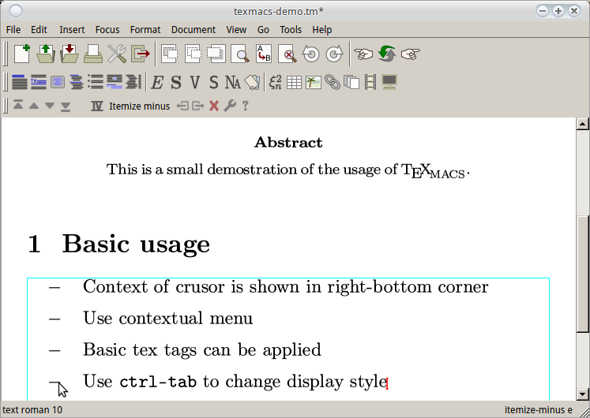

Title: 学术文章写作利器: TeXmacs介绍    
Date: 2015-11-22    
Slug:  TeXmacs_intro    
Tags: tex, TeXmacs             
    
  
今天介绍一个论文写作的神器: TeXmacs !   
  
0. Why TeXmacs?  
===============  
一说到"论文写作神器"一般大家首先想到的就是LaTeX, 确实LaTeX写出来的数学公式和文章的排版非常漂亮. 但是作为一个几年来用过LaTeX写过几次报告的小白用户, 说句实话我从来都没有喜欢上过LaTeX. 根本的原因大概是: LaTeX的语法是一种标记语言(markup language), 本质上是给机器看而不是给人看的—就像html源代码是为了给浏览器看而不是直接给人看的.   
  
## 0.0 LaTeX强迫症自测  
>矩阵A的转置, 你用tex会怎么写?  
  
⇒ 如果你不能容忍直接写成``$A^T$``, 而一定要写成类似``$\textbf{A}^\intercal$``的话... 请直接忽略本文 & 继续用LaTeX, 好走不送......   
(另: 强迫症可以去这里看到底怎么打转置: <http://tex.stackexchange.com/questions/30619/what-is-the-best-symbol-for-vector-matrix-transpose>)  
  
如果你认为这样的细节不重要, 好好描述数学问题本身才最重要的话, 请继续阅读.  
  
## 0.1 TeXmacs是什么  
简言之, TeXmacs是一个所见即所得的编辑器. 你也许想到了LyX, TeXworks之类的工具, 但是TeXmacs和它们不一样—它并不依赖LaTeX. 他吸收了LaTeX的优点, 即文章的排版非常美观. 同时它又不同于LaTeX, 比如, 在TeXmacs里是*没有*"源文件"这个概念的. 另外它还有一些非常实用的特性(尤其是对于数学公式的支持), 可以极大的提高编辑效率.   
  
>* 作者: Joris van der Hoeven (<http://www.TeXmacs.org/joris/main/joris.html> , **prof@X**)   
* 官网: <http://TeXmacs.org/tmweb/home/welcome.en.html>  
* 在官网上有两个短视频, 介绍了TeXmacs的简单用法: <http://TeXmacs.org/tmweb/home/videos.en.html> 
  
我自己感觉写同样的内容, 比如写同样一页纸的数学推导, 用TeXmacs大概比LaTeX快10倍... 另外如果你发现这一页纸的推导中间有一步有错误要修改的话...那么TeXmacs大概要快100倍吧...   
  
最早听到TeXmacs的名字是看到过王垠的一篇[博客](http://www.yinwang.org/blog-cn/2012/09/18/texmacs/), 后来我惊奇地发现TeXmacs的作者居然是X的一位老师!! 所以更要高举安利TeXmacs的大旗了. btw, 在X三年时间, 除了我自己和被我安利的Manu同学, 并没有见有别人用TeXmacs...唉.  

  
## 0.2 LaTeX吐槽  
正式安利TeXmacs之前, 先这里举一些我不认为LaTeX可以让人高效编辑文章的原因, 如果你认同大部分下面的吐槽, 欢迎继续阅读本文.   
  
>* 重申一遍, *markup的语法不是让人看的*: 要是忘记一个大括号或者少了个反斜杠就编译出错找半天  
* 请问每个tex文件开头那十来行usepackage什么的谁能记住?... 我每次要么上网搜要么从以前的tex文件里抄过来...  
* 公式是最痛苦的: 好几行的数学推导, 然后每行的内容又差不多的话, 编辑起来眼快瞎了  
* 想要插入个截图还得先保存为图片文件(&还得费时间起个文件名): 就不能像word那样直接粘贴进去么? 另外图片的大小和位置也要试好几次才知道怎么合适  
* 一编译生成一些乱七八糟的东西: xx.aux什么的, 写篇小文章也得专门建立个文件夹放这些乱七八糟的东西  
* LaTeX号称可以让人专心文章内容不关心排版, 可实际情况却是我每写一小段就会重新编译生成pdf看看, 因为我生怕少写一个花括号导致又编译不成了  
* 有时为了用一个包只好安装整个texlive-full, 电脑空间瞬间少了1G...   
* 还有什么欢迎补充...  
  
  
## 0.3 TeXmacs优点一览  
TeXmacs的优点大概是以下几点:   
  
>* 数学编辑功能非常强大, 用了再也不想用LaTeX源码写数学公式  
* 所见即所得, 不必记忆LaTeX各种tag, 有了它完全可以不用学LaTeX  
* 插入图片可以直接嵌入tm文件(其实是把图片序列化为一个很长的字符串), 不再需要为了插图专门建立文件夹  
* TeXmacs体积很小: 我用的版本解压后只有66MB  
* 可以从tex文件导入或导出到tex文件  
  
  
## 0.4 TeXmacs适合什么样的任务?  
目前为止我个人使用TeXmacs写过两篇比较正式的报告(其中一篇见[这里](https://github.com/X-Wei/INF580_HashCode2014/blob/master/documentation_Orsini%26Wei.pdf)), 另外用它写过一些课程的简单报告和作业, 还用它进行过一些数学的推导或者记笔记.   
个人感觉以下任务都可以用TeXmacs高效完成:   
  
>* 各种正式的学术报告  
* 常见的论文(TeXmacs里面内建了很多conf的文章style可以选择)  
* 课堂记数学笔记(前提是打字速度快, 最好能盲打)  
* 简单公式推导, 新建个tm文件就可以开始了, 不用兴师动众新建个文件夹...   
* 好像也可以用来做ppt (beamer), 个人没有尝试过  
  
  
## 0.5 TeXmacs不适合什么样的任务?  
我觉得TeXmacs不适合的就是LaTeX强迫症用户的任务...   
  
1. 基本操作  
=======  
  
## 1.1 界面  
打开TeXmacs可以看到如下的用户界面:   
  
正文上方有四行菜单栏:  
  
* 第一行是常见的菜单, 提供了所有功能  
* 第二行是一些常用操作: 打开/保存/复制粘贴/前进后退等  
* 第三行是插入一些常见"**环境**"的快捷按钮, 后面会看到.  
* 第四行非常有用, 它叫做"**上下文菜单**", 它的内容会随着光标所在"**环境**"而变化. 由于现在光标处在最开始位置, 此时上下文菜单是各种文章显示的选项, 可以选择一个style模板, 调整字体, 页面设置以及文章语言等.  
  
在正文下面, 窗口最底下还有一行:  
  
* 右下角指示当前光标所在处的"**环境**", 可以理解为当前光标处在什么tex的tag里面, 例如公式环境/表格环境/斜体字环境等, 在编辑的时候可以注意一下右下角的显示. 另外一般处在某种环境下面的话, 该环境会由矩形边框标出.   
  
  
## 1.2 插入标题  
点击*上下文菜单*右边的"Title"按钮可以加入文章标题, 敲回车可以输入作者名:   
  
注意此时光标处于"标题"环境下, 所以*上下文菜单*是关于标题的功能按钮, 点击"Title"右边的加号可以加入其他信息:  
  
texmac也支持简单的tex标记, 比如要加入日期的话 除了用上面的菜单, 也可以输入``\date``然后敲两次回车即可:  
  
  
## 1.3 插入概述  
从"标题"环境出来 又回到了整个文章的环境,*上下文菜单*也改变了  
  
此时*上下文菜单*右边是一个abstract按钮, 因为TeXmacs猜测我们在输入标题以后会输入概述, 点击这个按钮即可进入概述环境(见右下角).  
  
  
## 1.4 插入章节  
从abstract环境出来, 插入一个章节(tex里的``\section``标记)有三种办法:  
  
* 办法一: 使用第一行的菜单  
  
  
  
* 办法二: 使用第二行的"插入章节"图标  
  
  
  
* 办法三: 直接用tex标记, 输入``\section``然后回车即可  
  
  
  
## 1.5 选择样式  
在最外层环境下的上下文菜单里可以选择文章样式.   
  
  
## 1.6 插入列表  
在第二行有个按钮可以直接插入列表, 或者也可以输入``\itemize``然后回车.   
  
光标在列表环境时可以看到上下文菜单的内容也变化了:  
  
这里再介绍一个非常实用的快捷键: ``ctrl-tab``, 作用是改变当前环境的显示样式, 比如在列表环境里按下``ctrl-tab``以后可以变成其他样式(圆点变为了横线). 这个快捷键在公式或者表格环境里也很常用. 按下多次``ctrl-tab``可以在各种样式中循环.   
  
  
## 1.7 常见文字格式: 粗体/斜体/等宽/下划线/超链接  
  
* 粗体和斜体可以像word一样使用``ctrl-b/ctrl-i``做到  
* 等宽可以用第三行的工具栏按钮, 或者输入``\texttt``加回车.   
  
下划线我没有找到按钮, 不过直接用``\underline``加回车即可搞定.  
  
  
* 超链接使用第三行按钮即可  
  
  
在hyperlink环境下(注意上下文菜单又变化了)输入两个参数: 链接文本和链接地址, 然后回车即可  
  
  
## 1.8 定理/算法等  
插入一个定理或者算法, 可以直接用第三行的按钮, 看图:   
  
  
  
## 1.9 打开多个文件/退出TeXmacs  
如果打开了多个tm文件, 使用主菜单的Go按钮在文件之间切换:   
  
当前改动没有保存的时候, 标题栏的文件名后面会有一个星号指示. 此时直接点击关闭的话, 会在最下方有个提示框:   
  
  
2. 数学公式  
=======  
这是TeXmacs最激动人心的功能, 用它编辑数学公式非常畅快~   
  
## 2.1 公式环境  
首先为了进入数学公式环境, 可以直接输入``$``或者``alt-$``, ``alt-&``(对应行内公式/单行公式/多行公式).   
  
这里说一下, 个人感觉英文界面的一些词汇比如formula/equation, table/tabular, 傻傻分不清楚, formula和equation的区别在于, equation是多行公式... 把tm换成中文界面的话这些名字好理解多了:   
  
另外, 切换行内/单行公式也可以用``ctrl-tab``快捷键.   
  
在进入公式环境以后, 注意不止第四行的上下文菜单变成了公式的按钮, 第三行的插入菜单也变为了插入符号的按钮:  
  
  
## 2.2 输入数学符号  
这是我觉得TeXmacs最爽的地方: 公式环境下(注意是*在公式环境下*), **形状相似的符号通过tab轮转**.   
例子:   
>* 字母α和字母a形状很像, 输入字母``a``以后直接tab即可变为α.  
* ⊗怎么输入呢? 它等于``@-x``, 同理⊕等于``@-+``, ∞等于``@@``  
* ∈像什么? 只要输入``<``然后多tab几次就看到了  
* 不等号≠怎么输入? 直接连续打``= /``即可  
  
  
遇到别的不会打的字符, 可以用第三行的按钮, 鼠标悬停可以显示相应快捷键:   
  
  
## 2.3 其他数学符号: 上下标/根号/分数/积分/求和/...  
  
>* 输入上标直接打一个 ``^ ``即可, 下标是 ``_ ``, 和LaTeX里面一样 — 只不过不用看让人眼晕的源码.  
* 符号上标下标(不是右上角而是正上正下): 用``alt-a/alt-b``(above/below)  
* 输入根号快捷键是``alt-s``  
* 输入分数快捷键是``alt-f``(再``ctrl-tab``可以切换分数线的大小)  
* 积分号可以用按钮插入, 或者直接``\int``回车  
* 求和号同理, 可以直接输入``\sum``回车  
  
...LaTeX和这比起来简直就是石器时代!  
   
总结一下:   
  
  
## 2.4 公式编号/引用公式  
公式加入编号非常简单, 用上下文菜单里的一个"IV"按钮.   
  
如果对一个公式进行索引的话, 可以直接用tex里的``label/ref``标签完成.  
首先给这个公式加一个label, 只需要输入``\label``, 回车后输入参数(label名字)再回车即可.   
  
然后要引用这个公式时, 只需要输入``\ref``加刚才指定的label即可:   
  
以后对于图片/表格的引用也是同样道理.   
  
关于多行公式, 先要介绍表格的使用, 请看下节.   
  
3. 表格  
=====  
  
  
像上面这个公式的输入方法, 就是在大括号右边使用一个两行一列的表格.   
  
## 3.1 表格环境  
插入表格只需点击第三行的表格按钮:  
  
那些词汇也傻傻分不清楚, 倒是中文界面说的很清楚:   
  
不过这些表格样式也是可以通过``ctrl-tab``快捷键轮转切换的.   
点击以后进入表格环境, 注意上下文菜单的按钮又变了:   
  
  
## 3.2 增加/删除行和列  
在表格环境的上下文菜单里, 那八个中间是加号或叉号的方向按钮就是向各个方向新建/删除一行/一列的.   
或者使用快捷键: ``win-方向键``可以在当前格子的各个方向新建行/列, ``win-backspace``则是删除.   
  
## 3.3 对齐模式  
改变表格的对齐模式只要选中相应的格子然后用上下文菜单的按钮点选即可:   
  
  
## 3.4 矩阵  
输入矩阵的话, 可以*在公式环境下***嵌套***一个表格环境*.   
首先输入``alt-$``进入公式环境, 此时再看表格按钮的时候出现了矩阵选项:   
  
然后只需要像之前表格一样操作即可了, 关于如何输入各个方向的省略号, 只要多tab几次就可以了:   
  
  
以上我觉得基本够用了, 关于表格的其他的功能可以参考tm的文档...   
  
4. 插图  
=====  
关于插图我使用最多的只是截图然后直接从剪切板里粘贴而已, 这里只介绍这种最简单最常用操作.   
TeXmacs实际上远比我这里介绍的强大, 见这里: <http://www.TeXmacs.org/tmweb/documents/tutorials/TeXmacs-graphical-plugins.pdf>  
  
## 4.1 图片环境  
点击按钮插入图片  
  
  
## 4.2 插入截图  
截图在clipboard的时候, 只需要在TeXmacs里面粘贴就可以了:   
  
  
我想要强调的一点是, 用这种方法画图, 可以直接把图片嵌入tm文件里面, 而不用像LaTeX一样在文件夹里放一堆图片.   
  
## 4.3 画图  
TeXmacs也提供了直接画图的功能, 不过我基本没试过, 下图是乱画的:  
  
  
另外, 关于如何引用图片/表格, 只要用``\label``和``\ref``标签即可, 前面公式环境里已经介绍过了.   
  
5. 插入目录/参考文献  
============  
  
## 5.1 插入目录  
首先点击第三行的按钮插入目录:   
  
但是这是的目录是空的, 还需要更新目录, 方法是第一行的菜单: *document → update → table of content*  
然后就看到了目录:   
  
  
## 5.2 参考文献  
  
### bibtex文件  
首先, 为了引入参考文献, 需要建立一个*demo.bib*文件, 里面放的就是参考文献的bibtex代码, 比如:   
   
	@ARTICLE{lda,  
		author = {David M. Blei and Andrew Y. Ng and Michael I. Jordan and John Lafferty},  
		title = {Latent Dirichlet Allocation},  
		journal = {The Journal of Machine Learning Research},  
		year = {2003}  
	}  
	@article{nmf,  
		 author = "Yehuda Koren and Robert Bell and Chris Volinsky",   
		 title = "Matrix Faoctorization Techniques for Recommender Systems",  
		 journal = "IEEE Computer",    
		 pages = "42--49",   
		 year = "2009",  
		}  
	@book{pci,  
		title = "Programming Collective Intelligence: Building Smart Web 2.0 Applications",  
		author = "Toby Segaran",  
		year = "2007",  
	}  
  
注意每一个entry的别名(*lda, nmfCF, pci*)是我自己取的.   
  
### 插入参考文献  
点击按钮插入参考文献:  
  
然后在最下方的提示框输入样式名(一般就用默认tm-plain)以及bib文件名(和tm文件同一目录下):   
  
  
在引用文献时可以用tex标签``\cite``引用文献:  
  
TeXmacs不会在最后参考文献里显示没有被引用过的文献, 那些没有显式提到的文章可以用插入invisible citation的方式加入:   
  
注意, 此时需要update**两次**才可以看到效果.  
  
6. 更多  
=====  
这里只是介绍了最基础最简单的使用, 关于更多的高级TeXmacs使用方法, 这里有几个链接:   
>* tm官方的tutorial: <http://TeXmacs.org/tmweb/help/manual.en.html>  
* 一些其他人做的文章: <http://TeXmacs.org/tmweb/help/tutorial.en.html>  
* 王垠大神做的思维导图: <https://www.mindomo.com/mindmap/b207992c90c046bdbe4053cbdf88b5d5>  
* tm官网有个workshop的视频 里面展示了texmac一些亮瞎眼的功能: <http://magix.lix.polytechnique.fr/magix/workshop/workshop-videos.en.html>  

另外, 这篇文章所做的示例文件可以在这里下载: <https://github.com/X-Wei/texmacs-demo>

欢迎抛弃LaTeX & 拥抱TeXmacs!  
