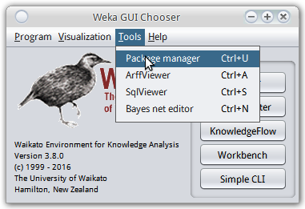
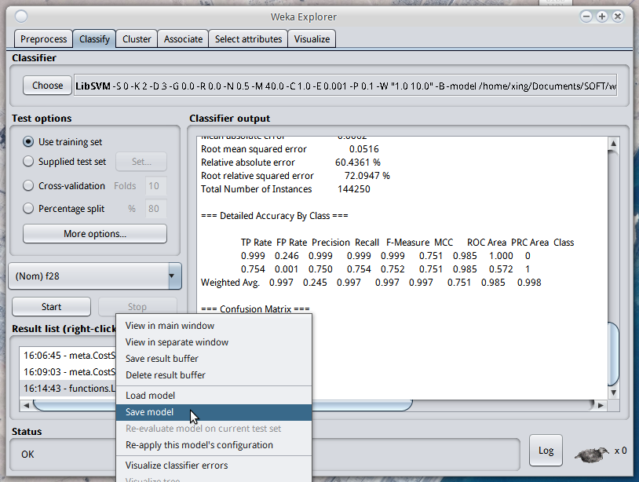

title: 在java程序里使用weka进行机器学习   
Date: 2016-05-21  
Slug: java-use-weka  
Tags: ml, weka, java  
  
  
之前一直用weka的GUI界面做机器学习的任务, 感觉这个软件虽然界面丑, 不过确实是快速开展机器学期的利器. 关于GUI的weka使用以后有时间再写. 今天这篇记录一下最近使用的java版本的weka.   
  
1. Include jars into project  
============================  
  
weka官网的下载链接里选择linux版本的weka压缩包即可, 下载以后找到weka.jar文件, 在工程里将其include一下就可以使用了(btw, 现在开始放弃eclipse, 进入IDEA的怀抱了...).   
  
weka的文档在解压缩的文件里有, 另外在线文档在: <http://weka.sourceforge.net/doc.stable-3-8/>  
  
### about libsvm...  
关于libsvm需要有一点特别指出. weka自带的算法里是不包含libsvm的 (有个类似的SMO, 不过还是libsvm久经考验啊...), 需要使用weka的package manager安装. 打开package manager是在weka主界面的菜单里:   
  
在package manager里搜索到libsvm安装即可. 然后(linux下)在主目录可以看到有个wekafiles文件夹, ``wekafiles/packages/LibSVM/``目录下就是libsvm的内容.   
  
需要指出的一点是, 要使用libsvm的话, [需要同时引用两个jar文件](http://stackoverflow.com/questions/30821926/solved-weka-api-libsvm-classpath-not-found), 而且都叫libsvm.jar!!   
  
这两个jar, 一个叫``LibSVM.jar``, 在``wekafiles/packages/LibSVM/``下, 另一个叫``libsvm.jar``, 在``wekafiles/packages/LibSVM/lib/``下...orz  
  
如果只include第一个jar的话, 就会报错: "java.lang.Exception: libsvm classes not in CLASSPATH! ".   
  
2. terminology  
==============  
首先统一一下各种东西的叫法...  
  
  
* ``Instances``: 就是dataset, 比如training set或者test set, Instances实际上就是一个Instance的集合  
* ``Instance``: 就是一个数据点了  
* ``Attribute``: 一个数据点有一些attribute (别处一般叫做feature), 其中有一个attribute其实是label(可以为missing)  
* ``Classifier``: weka里的Classifer其实是也包含了regressor或者cluster... 后面都称之为model  
* ``Evaluation``: 给定一个model和一个dataset, 给出evaluation的数据, 类似GUI界面给出的那些内容  
  
  
  
3. 在程序里构建数据  
===========  
这也是为什么要在java里用weka的原因: 如果数据可以直接以csv或者arff文件的方式得到, 那么直接在GUI界面下就可以搞了...  
  
### 新建Attribute  
<http://weka.sourceforge.net/doc.stable-3-8/weka/core/Attribute.html>     
新建numeric的attribue只要简单的在构造函数里传入一个attribute的名字即可:   
  
	// Create numeric attributes "length" and "weight"   
	Attribute length = new Attribute("length");   
	Attribute weight = new Attribute("weight");  
   
  
新建离散(normial)的attribue则需要一个list乘放所有可能的数值:   
  
	// Create list to hold nominal values "first", "second", "third"   
	List my_nominal_values = new ArrayList(3);   
	my_nominal_values.add("first");   
	my_nominal_values.add("second");   
	my_nominal_values.add("third");   
	// Create nominal attribute "position"   
	Attribute position = new Attribute("position", my_nominal_values);  
  
  
### 新建Instances(dataset)  
<http://weka.sourceforge.net/doc.stable-3-8/weka/core/Instances.html>  
``Instances``实际上就是一个``Instance``的集合, Instances可以类比为pandas里面的DataFrame, 然后每个instance相当于一行. 另外``Instances``比``Instance``多的就是Attribute信息(类比为pandas里DataFrame的表头head).   
  
``Instances``的构造函数有两种, 一种是直接在arff文件里读取, 这个后面再说. 另一种构造函数是在java函数里构建Instance时用的, 它构造一个空的Instance集合, 构造函数提供dataset的名字, attribute的集合(arraylist)以及初始的capacity:   
  
``Instances(String name, ArrayList<Attribute> attInfo, int capacity)``  
  
其中的第二个参数attInfo其实就相当于是表头信息了, 它是一个Attribute的ArrayList.   
  
	ArrayList<Attribute> atts = new ArrayList<Attribute>();  
	atts.add(length);  
	atts.add(weight);  
	atts.add(position);  
	Instances adataset = new Instances("aDataSet", atts, 10);  
  
(上面代码里的``length``, ``weight`` 和``position``都是前面声明的Attribute对象)  
  
Instances还可以指定哪一列对应的是class label (单个Instance则不能 — 因为单个Instance并没有表头信息attInfo):   
  
``void setClassIndex(int classIndex)``  
  
### 新建Instance  
<http://weka.sourceforge.net/doc.stable-3-8/weka/core/Instance.html>  
``Instance``是一个接口而不是一个类, 一半常用的是``DenseInstance``类(它又继承自``AbstractInstance``抽象类)   
  
这里有一个坑: 一定要指定Instance所属的DataSet(既它属于哪一个Instances对象)再使用setValue函数, 否则在调用setValue的时候可能会有问题!!!   
  
``void setDataset(Instances instances)``  
  
构造函数里只需要提供这个instance的attribute数量即可. 然后使用``setValue``函数可以给每个attribue指定数值. setValue函数的第一个参数接收一个Attribue对象, 第二个参数就是这个attribue的数值(double或者string).   
  
	// Create empty instance with three attribute values   
	Instance inst = new DenseInstance(3);   
	instance.setDataset(  adataset); // before calling setValue, should first set the Dataset!``  
	// Set instance's values for the attributes "length", "weight", and "position"  
	inst.setValue(length, 5.3);   
	inst.setValue(weight, 300);   
	inst.setValue(position, "first");  
  
  
4. 在程序里训练model  
==============  
这里只做classification的例子好了.   
<http://weka.sourceforge.net/doc.stable-3-8/weka/classifiers/Classifier.html>  
  
Classifier是一个Interface, 可以在文档里看到有很多类都实现了这个interface, 主要是三个常用的函数:   
  
  
* ``void buildClassifier(Instances data)`` : 用data数据进行训练  
* ``double	 classifyInstance(Instance instance)`` : 预测一个Instance的label  
* ``double[] distributionForInstance(Instance instance)`` :对于每一个可能的类, 给一个probability, 返回一个double数组  
  
  
所以程序里训练model只需要调用``buildClassifier()``函数即可.   
  
5. 从文件读入数据和model  
================  
之前讲的是在程序里得到数据, 在程序里储存结果的方法, 而如果可以保存数据到文件的话, 在GUI界面下调试模型应该更加放方便.   
  
预先已经得到了数据的话, 可以先把数据保存问arff格式, 然后用GUI的weka训练和调试参数. 当得到满意的结果以后可以在GUI界面里选择保存训练好的模型(一个.model文件):   
  
  
  
  
然后, weka提供了非常方便的方法, 直接从arff文件里得到``Instances``对象, 从model文件里得到``Classifier``对象:   
(参考链接: <https://weka.wikispaces.com/Serialization> 以及 <https://weka.wikispaces.com/Use+Weka+in+your+Java+code>)  
  
	Classifier clf = (Classifier) weka.core.SerializationHelper.read("/some/where/j48.model");  
	Instances testset = new Instances(new BufferedReader(new FileReader("/some/where/test.arff")));``  
  
6. 输出Evaluation统计  
=================  
当得到了训练好的模型``clf``以及要使用的测试数据``testset``以后, 可以在testset上测试模型, 并输出结果的统计数据. 这些是靠``Evaluation``类完成的.  
<http://weka.sourceforge.net/doc.stable-3-8/weka/classifiers/evaluation/Evaluation.html>  
Evaluation的构造函数里提供的Instances应该为training set, 这个训练集的作用是"to get some header information and prior class distribution information", 如果构造时给的是testing set的话, 应该调用``useNoPriors()``函数一下.   
  
构造了evalation对象以后, 只要使用 ``evaluateModel(Classifier classifier, Instances data)`` 函数即可, 第一个参数为训练好了的模型(``clf``), 第二个参数为要用来测试的数据(``testset``).   
  
然后可以输出统计信息, 就像在wekaGUI界面一样, 主要靠``toSummaryString()``和``toMatrixString()``两个函数.   
  
	Instances trainInstances = ... instances got from somewhere  
	Instances testInstances = ... instances got from somewhere  
	Classifier scheme = ... scheme got from somewhere  
	  
	Evaluation evaluation = new Evaluation(trainInstances);  
	evaluation.evaluateModel(scheme, testInstances);  
	System.out.println(evaluation.toSummaryString());  
	System.out.println(evaluation.toMatrixString());  
  
  
  
7. 输出预测结果  
=========  
对于每一个Instance, 只需要调用Classifier的``classifyInstance(Instance instance)``或者``distributionForInstance(Instance instance)``函数, 即可得到预测结果...   
  
Voila, 大概就是这样, weka这个工具还是蛮好用的(只要能忍受它界面的丑), 而且也算没有太多的坑...   
