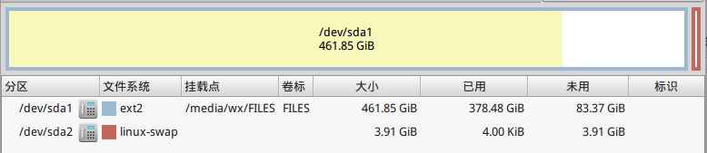
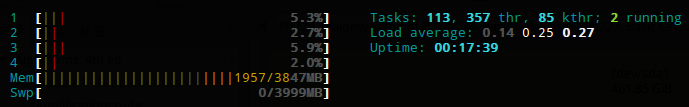

title: linux系统添加swap分区&调整swapness   
Date: 2015-09-27
Slug: linux-swap
Tags: linux
   
当年装mint 17.1的时候心想我的电脑有4GB内存怎么可能不够用, 于是果断没有分一个swap分区, 呵呵...   
   
然后就看到chrome这几年来吃内存越来越严重, 导致我开多几个标签页再开eclipse的话电脑就很有可能直接卡死... 郁闷啊 ! 于是决定给系统增加一个swap分区. 之前给[thealternative](http://thealternative.ch/index.php?view=linuxdays)写邮件询问这件事, Sandro Kalbermatter同学热情回复了我告诉我怎么做, 按照他说的果然成功了, 特此一记.    
   
step1. 建立swap分区   
---------------   
首先, 用gparted调整磁盘分区, 缩小一个磁盘的大小, 然后用空出来的空间新建一个swap分区.    
   
关于swap分区应该多大, 根据[这个帖子](http://www.linux.com/news/software/applications/8208-all-about-linux-swap-space), 大约是内存的2-3倍, 不过我只是分了和内存一样大的4G空间, 感觉这样应该够用了(吧).   
   
我是把存放文件的500G分区缩小, 这个过程会比较慢, 大概二十多分钟以后才结束:    
   
   
   
   
step2. 编辑fstab   
--------------   
建立好了swap分区以后, 打开终端, 输入``sudo blkid``查看所有的磁盘分区.    
   
	$ sudo blkid   
	/dev/sda1: LABEL="FILES" UUID="ddefc0a7-30a1-42fb-a71a-0aebb55cb0b3" TYPE="ext2"    
	/dev/sda2: UUID="952b70b9-c7ee-4adf-9ceb-ac631ed8d7eb" TYPE="swap"    
	/dev/sdb1: LABEL="WIN7" UUID="D268862068860407" TYPE="ntfs"    
	/dev/sdb5: UUID="0ee51625-2fe3-49c8-b388-53076bce7955" TYPE="ext4"   
    
   
然后看到了swap分区的UUID以后, 将其复制, 然后编辑fstab文件: ``sudo leafpad /etc/fstab``:   
   
``UUID=put-the-uud-here       none            swap            defaults  0 0``   
   
然后重启, 就可以看到swap分区了!    
   
   
step3. 调整swapness   
-----------------   
[swapness](http://askubuntu.com/questions/103915/how-do-i-configure-swappiness)是一个在0到100之间的数, 当系统的内存剩余不到百分之swapness的时候, 开始使用swap分区. 默认的系统swapness是60, 就是内存占用超过40%的时候就开始使用swap分区了.    
   
使用``cat /proc/sys/vm/swappiness ``可以查看当前的swapness.    
   
由于内存读写要比swap分区快很多, 在内存足够的情况下完全没有必要使用swap, 于是修改swapness为20:    
   
``sudo leafpaf /etc/sysctl.conf``   
   
在文件里加入一行: ``vm.swappiness = 10``   
   
重启即可...   
   
