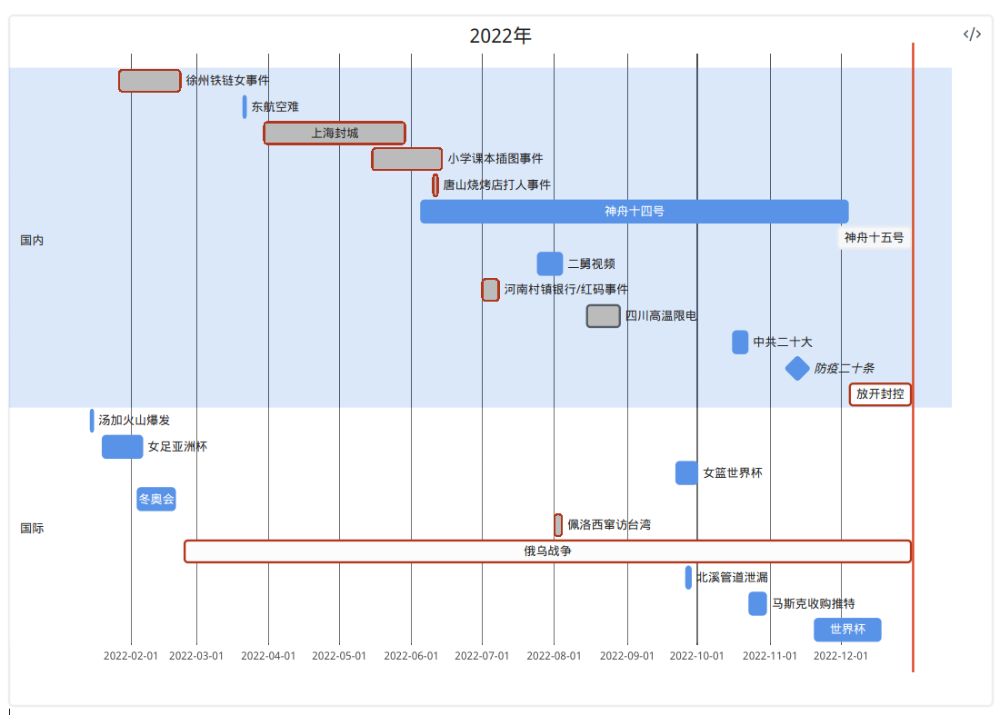
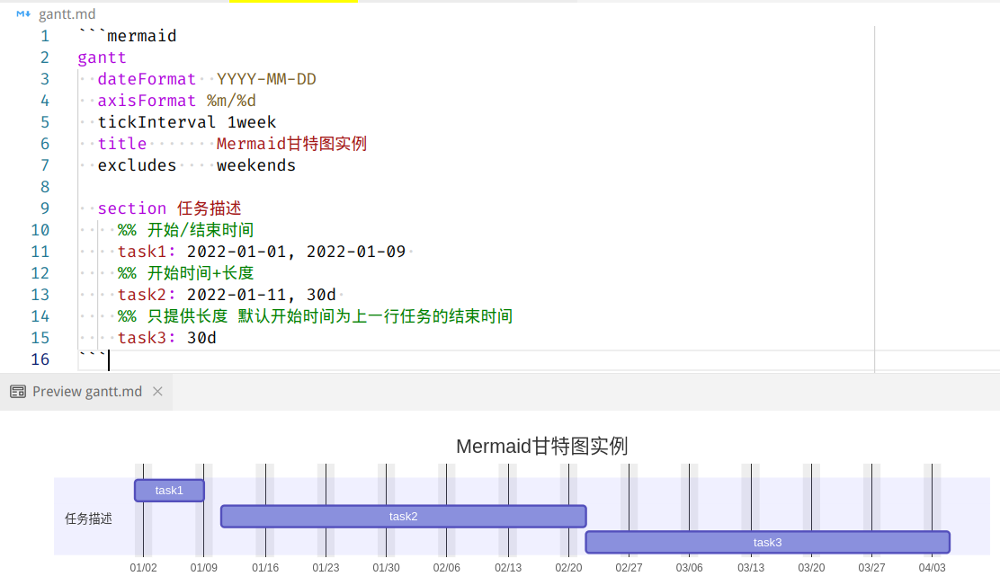
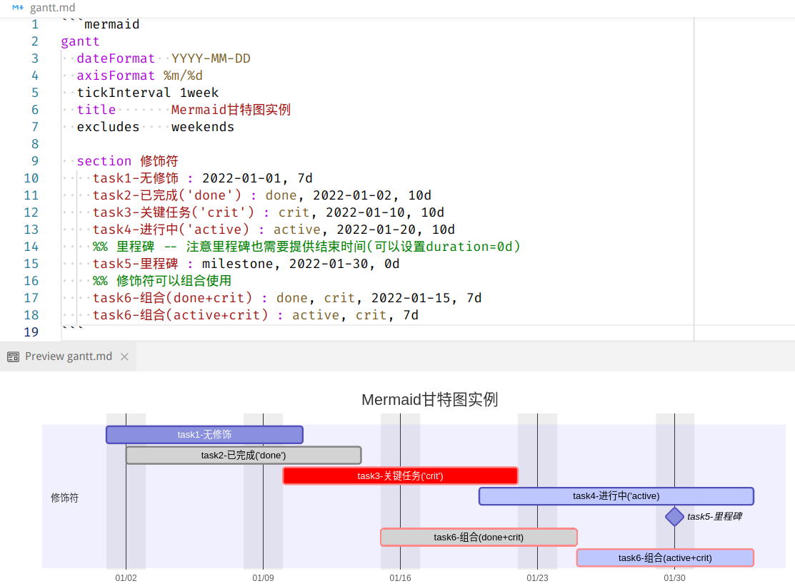
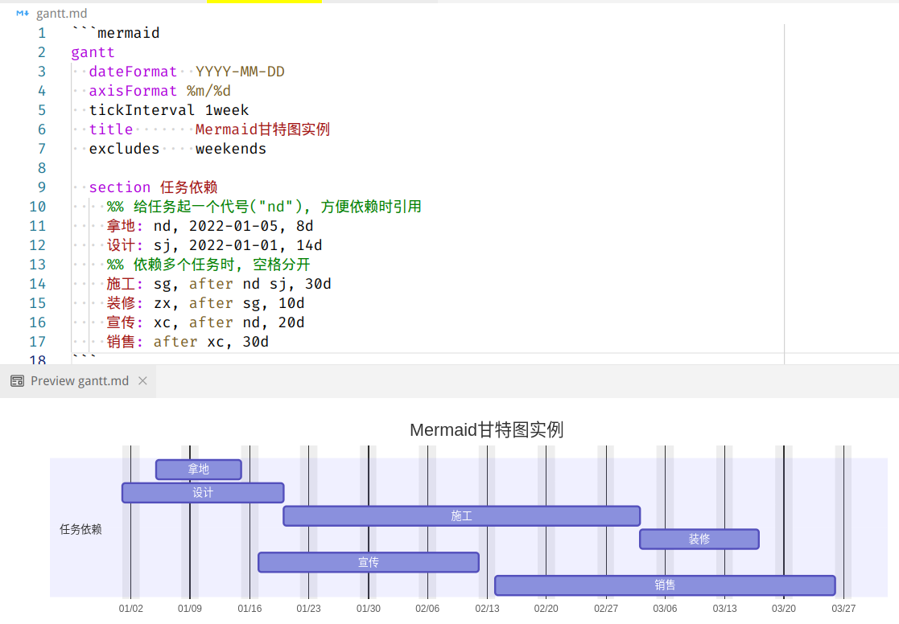
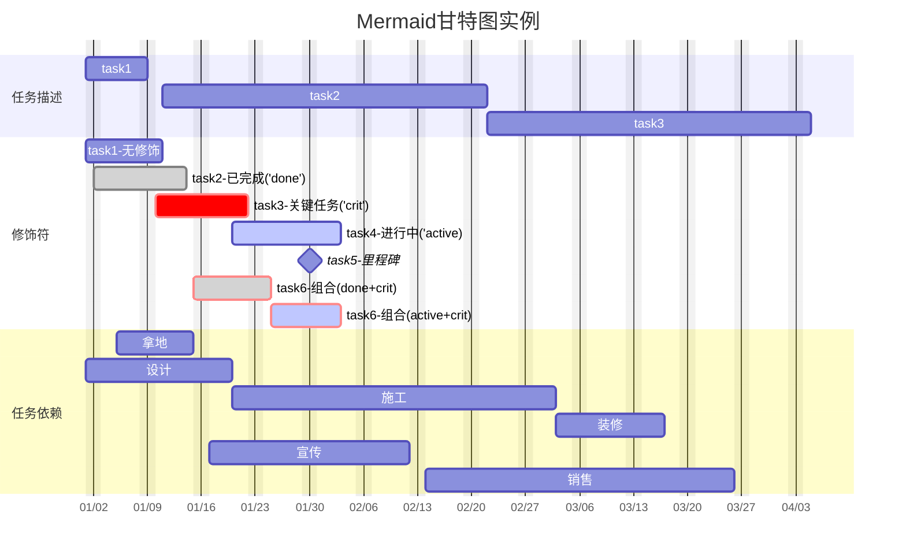

title: 用mermaid.js画甘特图
Date: 2023-01-01
Slug: mermaid-gantt-chart
Tags: mermaid

昨天突发奇想想总结一下2022年, 发现还是用mermaid的甘特图做最简单. 鼓捣一番以后在朋友圈里发了这张图: 

今天简单总结一下mermaid的甘特图(gantt chart)语法, 因为昨天感觉[mermaid官网的gantt文档](https://mermaid.js.org/syntax/gantt.html) 只给了几个例子 不太适合上手.

## mermaid.js
[mermaid.js](https://mermaid.js.org/)是一个用来在网页中生成图表的库. 使用简单的语法来描述图表, 通过 JavaScript渲染.  

支持生成多种类型的图表, 例如**流程图/时序图/甘特图**等等. 

>Mermaid.js 的目标是让生成图表变得简单而且易于使用, 让用户能够更专注于图表的内容和信息的传递而不是图表的排版. 

它的理念和markdown/graphviz一样, **用代码代替富文本**(word/powerpoint/画图工具), 这样做的好处有:  
- 文件超小(只是文本文件), 打开和修改很方便  
- 生成的图片是SVG, 不但美观还可以无损缩放  
- 方便版本管理(git)  

之前我试过mermaid的流程图(flow chart), 感觉不如graphviz灵活(虽然语法更简洁). 但是mermaid被许多markdown编辑器支持, 而且覆盖了很多类型的图表, 所以相当值得一试.

有几个方式可以使用mermaid:  
- [mermaid.js官方在线编辑器](https://mermaid.live/)  
- 笔记软件[obsidian](https://obsidian.md/)默认支持mermaid语法的代码块嵌入markdown文件中  
- 使用[VSCode编辑器](https://code.visualstudio.com/), 只需要安装[mermaid VSCode插件](https://marketplace.visualstudio.com/items?itemName=bierner.markdown-mermaid)就可以使用了  

## 甘特图
>Gantt chart (甘特图) 是一种用来展示项目进度和任务分配的图表.  
>它常常被用来展示在一个时间范围内任务的**开始时间, 持续时间以及前置任务之间的关系**.  
>Gantt chart 可以帮助团队成员更好地理解项目进度.并有效地协调任务之间的依赖关系.  

=> 用来做时间线图表刚刚好

## mermaid 甘特图语法

Mermaid.js 使用类似于 markdown 的语法来生成 Gantt 图. 可以划分不同章节, 每个章节包含若干任务信息.

关键字有:  
- `title`: 图表标题  
- `section`: 章节  
  - 章节下包含若干任务, 每行一个**任务**信息  
- `excludes`: 排除若干日期, 可以是特定的日期(yyyy-mm-dd格式), 也可以是星期几或"weekends"  
  - 排除的日期会显示为灰色  

### 描述任务起止时间
**"任务"** 在这里指一项事件或者工程, 表现为甘特图中的一条.

mermaid每一行内容作为一个任务(或者事件)的描述, 大概语法为:

>**`<task_name> : [<id>,] [<modifier(s)>,], <start_time>, <end_time|duration>`**

描述任务的开始和截止时间, 既可以都用实际的时间(`start_time, end_time`), 也可以用开始时间+进行长度(`start_time, duration`).  
如果不给出开始时间, 默认从上一个任务结束开始算起.

虽然下面的例子都是以日期为单位, 其实它也支持小时/分钟的时间段, 比如可以用甘特图画一天的工作日志.

### 修饰符(modifier)
描述任务除了给出开始/结束的时间外, 还可以进行修饰修改其显示效果.

任务修饰符:  
- `milestone`: 里程碑  
- `crit`: 关键 -- 任务颜色变为红色  
- `done`: 已完成任务 -- 任务变为灰色  
- `active`: 进行中的任务  
- 另外这些关键字可以进行组合, 用逗号分隔.  

### 任务依赖关系
由于甘特图用于展示项目进度和任务分配, 对任务之间的依赖关系也有支持.  
可以在冒号后面给任务起一个id, 然后用`after`关键字描述任务之间的依赖关系.  

以房地产开发为例, 几个环节(拿地/设计/施工/装修/宣传/销售)的依赖关系可以这样搞定:

### 完整示例代码

