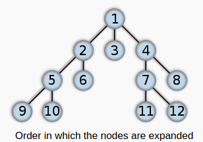

Title: 广度优先搜索(BFS)小结   
date: 2015-10-08   
Slug: bfs-summary   
Tags: algorithm   
Series: 算法笔记
 
[TOC] 
   
   
今天总结一下广度优先搜索(BFS). BFS是树/图的遍历的常用算法之一, 对于没有边权重的图来说可以计算最短路径.    
由于树的BFS只是图的BFS的一种特殊情况, 而且比较简单不需要visited标记, 这里只写一下图的BFS好了.    
先定义一个Graph类, 这里在每一个节点保存邻居信息:    
   
	public class GraphNode{   
		int val;   
		List<GraphNode> neighbors;   
	}   
   
   
BFS for trees/graphs   
--------------------   
   
   
图的遍历需要注意不走重复节点, 所以需要一个HashSet(名字叫visited)来保存哪些节点已经访问过了. 需要注意的是, *在把一个节点放进队列queue的时刻就要把它放进visited*, 而不是在队列里取出来的时刻再放.    
   
	public void BFS(GraphNode start){   
		LinkedList<GraphNode> q = new LinkedList<GraphNode>();   
		HasheSet<GraphNode> visited = new HasheSet<GraphNode>();   
		q.push(start);   
		visited.add(start);   
		while(!q.empty()){   
			GraphNode cur = q.poll();   
			System.out.println(cur.val);   
			for(GraphNode next: cur.children){    
				if(!visited.contains(next)){   
					q.push(next);   
					visited.add(next); // mark node as visited when adding to queue!    
				}   
			}   
		}//while   
	}   
   
   
BFS with distance   
-----------------   
在BFS的同时我们可以记录从start节点到当前node的距离, 方法是把一个距离信息同时入队(封装一个``Pair<GraphNode, Integer>``), 或者使用一个与queue*平行*的队列保存距离信息.    
在上面的代码中, 加入:    
   
	//...   
	LinkedList<Integer> distq = new LinkedList<Integer>();   
	distq.push(0);// distance from start to start   
	//...   
	// in the while(!q.empty()) loop:    
		int d = distq.poll();//get distance from start to current node   
		for(GraphNode next: node.children){   
			distq.push(d+1);// distance from start to next node   
			//...   
   
对于Tree的情况来说, 这里的dist其实就是当前节点的深度depth.    
   
   
properties   
----------   
**性质1:**    
每个节点node的distance都是node距离起始点start的最短距离.    
   
**性质2:**    
距离start近的节点(depth浅的节点)一定比距离start远的节点早被访问到.    
   
这是对一个树BFS的时候节点的访问顺序:    
   
   
BFS "by layer"   
--------------   
参考上面的性质, 可以一次处理"一层"的节点, "一层"的意思是指所有节点距离start的距离相同. 代码在while循环里不是一次poll一个节点, 而是一次把queue的内容处理完, 然后换新的queue进入下一次while循环. 代码重新写一下:    
   
	public void BFS(GraphNode start){   
		ArrayList<GraphNode> q = new ArrayList<Tree>();   
		HasheSet<GraphNode> visited = new HasheSet<GraphNode>();   
		q.push(start);   
		visited.add(start);   
		while(!q.empty()){   
			ArrayList<GraphNode> newq = new ArrayList<Tree>();// create a new queue   
			for(GraphNode cur: q){// deal with all nodes in the queue    
				System.out.print(cur.val+", ");// all nodes in q are of the same distance/depth   
				for(GraphNode next: cur.children)    
					if(!visited.contains(next))   
						{ newq.push(next);visited.add(next); }   
			}   
			System.out.println();   
			q = newq;//replace q with newq   
		}//while   
	}   
   
   
以上程序每次打印一行, 第i行包括了距start距离为i的所有节点.    
由于这样的话每次不必在队首poll出元素(而是依次处理所有queue的元素), 所以可以改用ArrayList. 此时while循环里的不变量是: 所有q里面的节点距离start的距离都相同.    
   
   
complexity   
----------   
假设一个图有N个节点和M条边, BFS会走遍所有节点, 时间是O(N), 然后由于每个节点会检查所有的出边, 最终所有的边都会被检查过, 时间是O(M), 所以BFS的时间复杂度是**O(N+M)**.    
   
队列里面最多可能存放所有节点, 空间复杂度为**O(N)**.    
