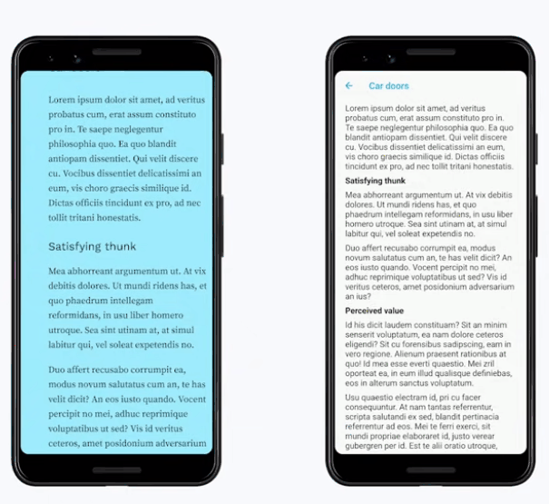

Title: 提升Flutter App的设计细节
Slug: flutter-improve-UI-details
Tags: Flutter
Date: 2021-03-20

这篇文章主要总结了FlutterEngage里的这个talk:

<iframe width="560" height="315" src="https://www.youtube.com/embed/MIepaf7ks40" title="YouTube video player" frameborder="0" allow="accelerometer; autoplay; clipboard-write; encrypted-media; gyroscope; picture-in-picture" allowfullscreen></iframe>

(这个talk的名字的中文翻译挺牛的: "小事一桩：成为开发和设计俱佳的神级人物")

talk里代码地址在: <https://github.com/filiph/little_things>

这个talk还是挺有意思的, 介绍了如何提升App的设计细节从而获得更高的 **"Perceived value"**: 
有时候app本身的功能性和技术性是一方面, 但是呈现给用户的感觉却有可能因为一点点细节而完全不同. 这一点我之前不太重视, 细想一下确实有道理.

## 1. White space

多使用padding添加空隙和留白, 体现一种高级感~
结合Flutter的hot reload可以快的实验 找到合适的padding.

## 2. Typography

换个好看的字体也可以让应用看起来非常高级.

GoogleFont配合hot reload来选择好的字体

## 3. Color
给app添加特别的配色.

可以从网上找一些配色方案(color palette), 比如:

- https://coolors.co/palettes/trending
- https://undesign.learn.uno/colors/


把选好的ColorPalette放在`MaterialApp.theme`里头: <https://github.com/filiph/little_things/blob/main/lib/main.dart#L27-L55>

## 4. Iconography

意思就是鼓励多给app多加一些图片/图标.

Filip的例子他用到了BoxDecoration(可以配置gradient以及image): <https://github.com/filiph/little_things/blob/main/lib/src/list.dart#L18-L32>

```dart
Container(
  decoration: BoxDecoration(
    gradient: LinearGradient(
      colors: [
        Color(0xFF96E3FF),
        Color(0xFF9EECFF),
        Color(0xFF9FEBFF),
        Color(0xFF9FEEFF),
        Color(0xFF9FECFF),
      ],
    ),
    image: DecorationImage(
      image: AssetImage('assets/meditation.jpg'),
      alignment: Alignment.bottomCenter,
    ),
  ),
  child: Scaffold(/*...*/),
)
```

## 5. Animation

动画也可以很大提升用户对app的评价.

默认animation的curve是linear, 一般这种curve都会让人感觉很不自然. 可以尝试一下`easeIn`/`easeOut`这种.

另外还可以同时提供多个animation (slideTransition / resize / text 等等), 这时候如果所有animation一起跑其实会很乱, 我们应该用 **"Staggered Animation"**, 就是一个animation接另一个animation.

用`curve: Interval(0.2, 0.6)`, 可以让这个animation在整个animation(`parent`)的20%~60%的时间段运行:


```dart
ScaleTransition(
  scale: CurvedAnimation(
    curve: Interval(
      0.2,
      0.6,
      curve: Curves.elasticOut,
    ),
    parent: _controller,
  ),
  child: /*...*/,
)
```

这里Filip自己实现了一个显示文字的widget(`TrackedOutText`), cf. <https://github.com/filiph/little_things/blob/main/lib/src/congrats.dart>

## 最终效果对比



App质感的提升还是挺明显的!

另外原视频的简介里也提供了一些UI设计的视频可以参考入门.