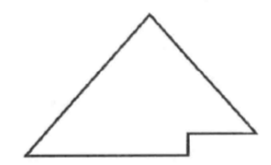
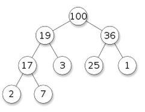
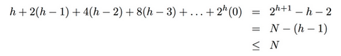

Title: Priority Queue/Heap (优先队列/堆)小结  
Date: 2015-12-09  
Slug:  heap-summary    
Tags: algorithm         
  
  
  
今天简单介绍一下优先队列(priority queue, 以下简称PQ)这个数据结构的实现.  
  
PQ又叫"堆"(heap), 但是可能优先队列这个名字更容易记忆它的用途: pq是一种队列, 不过不是先进先出(FIFO), 而是每次出队的元素永远是优先级最高的.   
  
logical structure of PQ  
=======================  
  
个人感觉"堆"这个名字大概源于PQ的(逻辑上的)形状吧: PQ是一种树(tree), 准确的说, 是一种二叉树(binary tree), 说得再准确一点, 它是一种**完全二叉树(complete binary tree)**: 没错, PQ是一种满足某些条件的完全二叉树.   
  
所谓的"完全二叉树", 要满足:  
>* 除了最后一层, 所有层都排满(没有非空节点)  
* 最后一层的所有非空节点都排在左边  
  
  
一张图可以直观说明, 完全二叉树其实就是长得像这样:  
  
  
  
一个完全二叉树能被成为PQ的话, 要满足的条件就是:   
>对于任何一个节点, 它的优先级都大于左右子节点的优先级.   
  
比如下图(圆圈里数字代表优先级):  
  
  
这样看上去的话, 确实像是"一堆"东西的形状(码的还挺整齐的), 而且我们知道在这一堆节点里, 优先级最高的就是最顶上的那个节点了.   
  
我很喜欢这个比喻: 一个heap就像是一个*公司的hirachy结构:* 子节点就是下属, 父节点就是上司, 每一个上司的能力都比他的下属强(优先级比子节点搞). 能力最强(优先级最高)的人在最上面.  
  
array representation of PQ  
==========================  
对于一个完全二叉树, 没有必要用常规的树结构(使用指针)来表示, 因为如果从上到下走过每层(每层内从左到右)给所有节点编号(根节点的编号为1)的话, 完全二叉树有以下性质:   
  
>* ``father(i) = i/2`` 其中father(i)表示编号为i的节点的父节点的下标   
* ``leftchild(i) = i*2, rightchild(i) = i*2+1``  
  
  
既然用数组表示的时候, 任何节点的父亲节点和左右子节点都可以轻松得到, 就没有必要使用指针了. 所以只需要一个数组即可表示PQ ! 比如一个int的PQ在内部只要表示为: ``int pq[]``.   
  
另外注意, 上面的公式成立的前提是数组下标从1开始, 实现的时候我们把数组的第0个元素空出来即可.   
  
不难看出一个PQ有以下性质:   
>* 高度为lgN  
* 第k层有 2^k 个节点 (root是第0层)  
* 最后一层的节点对应的下标>=N/2  
  
  
PQ implementation  
=================  
先写一下代码框架:  

	public class PQ{// maxPQ of integers  
		int pq[];  
		int MAX_CAPACITY=1000;// if we use ArrayList we do not need MAX_CAPACITY  
		int size;// pq[size] is the index of last element (rightmost node in last level)   
		public PQ(){  
			pq = new int[MAX_CAPACITY+1];  
			size = 0;  
		}  
		public boolean isEmpty(){  
			return size==0;  
		}  
		public int top(){ // get top element  
			assert !isEmpty();  
			return pq[1];  
		}  
		public void add(int n); // insert element to PQ --> stay tuned  
		public int poll(); // get and remove top element --> stay tuned  
	}  
  
最关键的两个函数是``add``和``poll``, 实现这两个操作的关键在于两个基本操作: ``siftup()``和``siftdown()``. 在PQ的性质被扰乱的时候, 使用这两个操作可以使PQ恢复性质(所谓的"调整").   
  
### siftup  
如果一个新元素到来, 首先将其放在最后(最底层最右边的节点), 如果新来节点的优先级比较高, 可以用siftup将其提升到一个合适的层次. 用公司结构来类比就是新入职的员工由于能力强被提高到了高层, 而提升的办法就是: 和上司交换岗位(也就是和父节点交换位置).   
  
所以这个操作只要不断把该元素与父节点交换, 直到遇到一个优先级大于该节点的父节点或者已经到了最高处停止. 代码很短:   
  
	private void siftup(){  
		int i = size;// i is the index of the newly added element	  
		for(;i>1 && pq[i/2]<pq[i]; i/=2)  
			swap(pq, i/2, i);  
	}  
  
  
### siftdown  
siftdown的功能和siftup相反: 如果在最高处是一个优先级很低的元素, 需要将其"下放". 方法就是把它和子节点里面优先级较高的进行交换.   
  
代码也不长, 不过第一次写可能不太简洁:   
  
	private void siftdown(){  
		if(isEmpty()) return;// nothing to sift when empty  
		int i=1;// siftdown root node  
		while(i*2<=size){ // while the node is not in last level  
			int max=pq[i], j=i;// j is the element to swap  
			if (pq[i*2]>max) // left child  
				{j=i*2; max=pq[i*2];}  
			if (i*2+1<=size && pq[i*2+1]>max) // right node  
				{j=i*2+1; max=pq[i*2+1];}  
			if (j==i) return;// stop when node is bigger than both child  
			swap(pq, i, j);  
			i = j;  
		}  
	}  
  
  
implementation of add and poll  
------------------------------  
有了这两个sift的基本操作, add和poll的操作就简单了.   
**add**  
加入新元素的时候, 只要先把它放在最后面, 然后调用siftup()函数调整一下pq即可:  
  
	public void add(int n){ // insert element to PQ  
        assert size+1<MAX_CAPACITY;  
        pq[++size] = n;  
        siftup();  
	}  
  
  
**poll**  
堆顶元素被拿走以后, 我们可以先把最后一个元素放在顶部, 然后调用siftdown进行调整:   
  
	public int poll(){ // get and remove top element  
		assert !isEmpty();  
		int top = pq[1];  
		pq[1] = pq[size--];// put last element on the top  
		siftdown();  
		return top;  
	}  
  
  
PQ application  
==============  
接下来讲一下PQ的应用.   
  
### heapsort  
由于每次出队的都是在剩下元素里面最大(小)的, 所以只要把数组的元素放到一个pq里, 然后依次poll出来, 得到的序列就是排序好了的.   
  
不管是插入还是删除操作, 每次调整的复杂度为log(n) (堆的高度), 所以算法复杂度为 O(NlgN). 实际使用的时候效率比快速排序/合并排序略差, 以后专门写一篇关于排序算法的文章时再聊.   
  
### heapify  
首先前面的siftdown函数很明显可以修改一下加上一个参数变为``siftdown(int i)``(i代表要向下调整的元素的下标).   
  
在heapsort里第一步是要建立一个PQ. 最naive的建堆操作就是新建一个空的heap然后不断向里面加入数组``a``里的元素(空间复杂度N, 时间复杂度NlgN). 其实这个操作可以做的更好: 我们*先直接把数组a当作pq[]数组*, 现在显然它不满足PQ性质, 只需要*多次使用siftdown*进行调整即可.   
  
假设一共有h(=lgN)层, 由于最后一层的节点不必调用siftdown, 我们只要从倒数第二层开始调用siftdown即可, 结合前面提到的pq的性质(N/2以后的节点都在最后一层), 写法很简单(简单起见认为a也是把第0个元素空出来好了):   
  
	public static void heapify(int[] a){  
		int N = a.length;  
		for(int i=N/2;i<=1;i--){  
			siftdown(a, i);  
		}  
	}  
  
  
这个操作的时间复杂度是O(N)的 ! 为什么呢?  
→ 第k层节点有2^k个节点, 这一层的节点向下调整最多会进行h-k步, 所以计算量是一个求和表达式:   
``Sigma( 2^k * (h-k) ) for k=0,...,h-1``  
  
(具体见 <http://algs4.cs.princeton.edu/24pq/> 里面Q20的答案)  
  
### top K elements of a stream  
问题描述: 一系列数字一个一个到达, 当所有数(假设有N个)都到达以后, 求最大的K个数字.   
  
这是一个经典的PQ应用 ⇒ 使用一个最小堆(minPQ)即可达到这个效果: 新建一个minPQ(最小的数字在最上面, 每次当一个数字n到达时:  

* if minPQ.size<K → ``minPQ.add(n)``  
* if minPQ.size==K → 比较n和minPQ.top():   
	* if n>minPQ.top(): ``minPQ.poll(); minPQ.add(n)``  
	* else pass...  
  
  
### median of a stream  
问题描述: 一系列数字一个一个到达, 求他们的中位数(median)?  
这个的解法是使用*两个PQ*, 一个最大堆``maxpq``一个最小堆``minpq``, 然后*maxpq里存放较***小***的一半数字, minpq里存放较***大***的一半数字: *``maxpq.top()<=minpq.top()``.   
并且我们要求: ``minpq.size <= maxpq.size <= minpq.size+1``  
⇒ 这样中位数或者是maxpq.top(), 或者是两个top的平均值了~  
  
初始时两个pq都是空的, 每次数字n到来时:  
* 先把n放进maxpq里  
* 如果``maxpq.size>minpq.size+1``的话: ``minpq.add(maxpq.poll())``  
  
  
  
more about heap  
===============  
  
### k-way heap  
这里介绍的PQ其实是binary heap, 即这棵树是一个完全**二**叉树, 但是我们完全可以做成完全**K**叉树, 就是所谓的K-way heap了.  
  
这样的好处是heap的高度会变得更小(从log2(N)变为logK(N)), 不过由于每个分叉变成了K个, 所以siftdown每次循环的操作复杂度也会增加(从2变为K).   
  
### more "flexible" heap  
在某些应用中(比如Dijkstra算法), 我们希望在插入后修改某个元素的优先级, 这时候需要对这个标准的heap做一些修改, 需要用一个数组把元素的"逻辑编号"和在pq数组里的"实际编号"相互转换.   
  
不过这个会比较subtle(其实我已经记不起来了...), 见: <http://x-wei.github.io/algoII_week2_2.html> (IndexedPQ部分)
