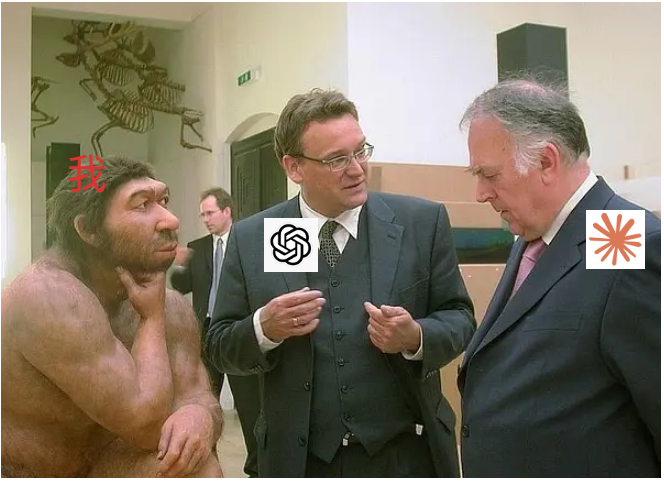

Title: 赶在苹果开发者账号过期前: 打包两个自用的macOS App
Date: 2026-08-22
Category: tech
Tags: macos, linux, fcitx, rectangle
Slug: my-macos-apps-before-apple-dev-expires

前两天收到苹果邮件, 提醒我的Apple Developer账号这周末就要自动扣费续期了. 

这两年其实基本没怎么正经用过, 每年白给苹果送钱(瑞士帐号不是99刀, 而是**109CHF**!). 跟Gemini聊了一下后果断关了自动续费 -- 等以后真有发布需求再说. 

与此同时, 自从今年买了Mac mini之后我也在渐渐适应macOS. 但用惯了Linux上的Cinnamon桌面, 转过来还是觉得各种不顺手. 

既然开发者证书这周末才到期, 本着**不薅白不薅**的原则, 我决定趁这两天把macOS上用着最别扭的两个开源软件签名打包成dmg. 

---

## 1. fcitx5-macos 签名版

在Linux上用惯了Fcitx(很久以前还用它做了个[法语输入法](https://github.com/x-wei/fcitx-table-french)), 最近转到了fcitx5. 在Mac上miss它, 主要是它的**剪贴板管理**和**快速短语**功能实在太方便了, 而且拼音选词也比macOS自带的智障拼音强太多.

- **痛点**: 但[官方README](https://github.com/fcitx-contrib/fcitx5-macos-installer/blob/master/README.zh-CN.md#:~:text=%E8%AF%B7%E6%82%A8%E7%90%86%E8%A7%A3%EF%BC%8C%E8%AE%A4%E8%AF%81%E9%9C%80%E8%A6%81%E5%BC%80%E5%8F%91%E8%80%85%E4%BB%98%E5%87%BA%E5%85%8D%E8%B4%B9%E8%BD%AF%E4%BB%B6%E6%97%A0%E6%B3%95%E6%8E%A5%E5%8F%97%E7%9A%84%20%E8%AE%A2%E9%98%85%20%E6%88%90%E6%9C%AC%E3%80%82%E8%AF%B7%E6%82%A8%E6%8C%89%E4%B8%8B%E8%BF%B0%E6%AD%A5%E9%AA%A4%E6%89%8B%E5%8A%A8%E8%A7%A3%E9%94%81%EF%BC%8C%E6%88%96%E8%80%85%E4%BD%BF%E7%94%A8%E4%B8%80%E9%94%AE%E5%AE%89%E8%A3%85%E5%91%BD%E4%BB%A4%E3%80%82)里写了: 因为认证需要开发者付出免费软件无法接受的订阅成本, 未签名的安装包需要手动绕过一堆限制解锁. 
- **折腾**: 趁证书还在, 拉下来打包、签名并公证(Notarization), 做了一个拿来就能直接开箱双击安装的dmg. 
- **产出**: 
  - Repo & Release: [fcitx5-macos-signed (v0.3.5)](https://github.com/maxing-labs/fcitx5-macos-signed/releases/tag/0.3.5)
  - 顺便去官方仓库发了个帖子分享给社区: [fcitx5-macos Discussion #413](https://github.com/fcitx/fcitx5-macos/discussions/413)

---

## 2. 修改 & 打包 Rectangle (修复分屏记忆问题)

- **痛点**: 在macOS上主要用Rectangle做窗口分屏. 但跟Cinnamon的分屏逻辑相比, 它有个很别扭的地方: **没法通过连续按"左半 + 上半"两次快捷键把窗口放到左上角占据1/4屏幕**. 因为在左半的状态下按下"上半"快捷键, Rectangle会直接把窗口重置成顶部的上半屏(把原本的宽度覆盖回100%了). 在和AImode反复确认这个功能缺失以后, 决定改源码. 
- **折腾**: 给Rectangle加了这么一个选项(分屏切换主轴时保留另一个轴的尺寸`halvesPreserveOtherAxis`), 打包成dmg自用. 
- **产出**: 
  - 自用 Release: [Rectangle v0.99-halvesPreserveOtherAxis](https://github.com/maxing-labs/Rectangle/releases/tag/v0.99-halvesPreserveOtherAxis)
  - 顺便给 upstream 提了 PR: [Rectangle PR #1824](https://github.com/rxhanson/Rectangle/pull/1824)

---

## 3. WhichSpace: 差点又要魔改打包

- **痛点**: 安装了[WhichSpace](https://github.com/geovens/WhichSpace)用来在菜单栏显示当前在第几个桌面. 在Linux下切换虚拟桌面习惯了**wrap around**(在第一个和最后一个桌面之间循环切换), 但在Mac上切到头就卡住了. 
- **插曲**: 本来我也摩拳擦掌准备把WhichSpace源码拉下来改代码 + 签名打包, 结果跟Claude一聊, 它翻了下文档提醒我: **其实作者早就支持wrap around这个隐藏开关了!** 接着Claude陪我一起排查了半天为什么打开配置后没生效, 终于只要修改设置就能用 -- 一行代码没改也不用打包了😎👌. 

---

## 后记: 我也成了"能工智人" 😹

昨晚全部装上实测了一圈, 用得极爽, 操作手感终于非常接近我在Linux上的Cinnamon桌面了. 

之前几周有点倦怠, 这周又重燃了兴趣 下班回家有空就抓着agent vibe聊两句 (主要再不快点苹果那个就过期了). 

整个过程中, 其实在Apple开发者后台手动登录、点击、生成、导出并下载certificate反而是最耗费时间的机械操作; 另外在编译完成之后怎么测试安装时也来回问了Claude好几次. 

修改源码实现的时候, 进行了几轮的`grill-me` session把我想要的效果跟agent说清了, 然后一把梭的代码直接就可用. 

至于具体的Swift代码修改? **我是一行也没看**. 

最后在GitHub上发布Release和提交PR, 也是Claude给出意见我就直接"同意/下一步"闭眼执行 -- 我自己完全不懂macOS原生开发, 全是Claude一股脑手把手一把做完的. 

看着PR和Release库库的出来, 而我基本不懂感觉像出卖了灵魂; 再仔细看看 PR内容写得巨专业的样子, 有一种冒名顶替感... 

