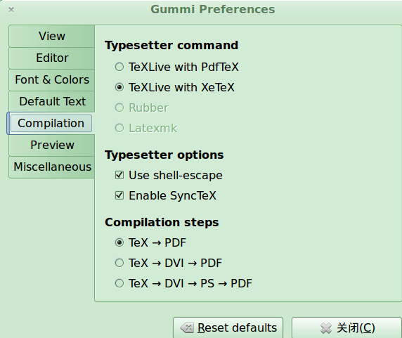
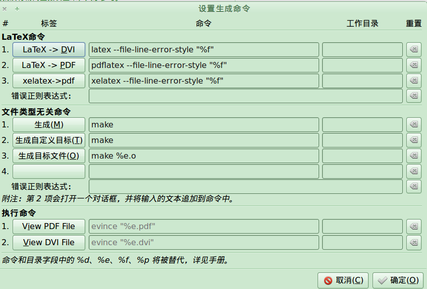

Title: xelatex--linux下tex中文的完全解决!
Date: 2012-02-27
Slug: xelatex_zh
Tags: tex, 中文乱码

前几天校内上看见了这个[latex中文指南](http://page.renren.com/601024697/note/806581340?ref=share), 想试一试...

可是貌似不给力(or我没做对)安装了texlive之后还是不能编译它的测试源文件...

搜索发现了[这样一篇](http://blog.sina.com.cn/s/blog_4c20fe7b0100vjbj.html)非常强大的文章... 这货直接把他的源文件放上去了... 不过这样的话他的文章可读性就不好了...

要进行的操作:

    sudo apt-get install texlive-xetex latex-cjk-xcjk texlive-latex-recommended

其实好像这样之后就可以用中文了(按博客里的意思), 可惜我用的geany开始使用latex编译的, 老是报错...

其实应该用命令行 xelatex xx.tex就应该好使了...

然后我又按照博客里的提示安装了Gummi...... 一个可以在右面看到效果的texIDE... 还是不行, 因为默认的编译器都是latex不是xelatex...

当然我最终发现了要用xelatex, 那么老是用命令行也不大方便... gummi里面找到了设置:

这样就好了...

但是我现在已经非常喜欢geany了, 不想因为tex再单独用一个编辑环境... 还好找到了geany里面的设置: 生成-->设置生成命令, 在里面添加一个xelatex就行啦!~ 嗯 还是geany亲切~!

最后把源文件生成好的pdf也放进来吧...
[./xelatex_test.tex](./xelatex_zh/xelatex_test.tex)

[./xelatex 及中文 Gummi 在 ubuntu 上的配置.pdf](./xelatex_zh/xelatex%20%E5%8F%8A%E4%B8%AD%E6%96%87%20Gummi%20%E5%9C%A8%20ubuntu%20%E4%B8%8A%E7%9A%84%E9%85%8D%E7%BD%AE.pdf) 

**imported from zim** 

