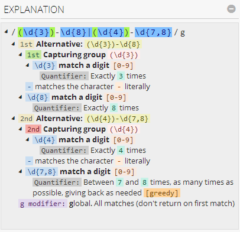
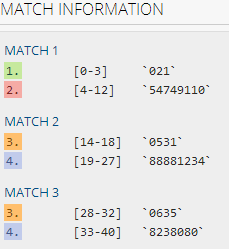
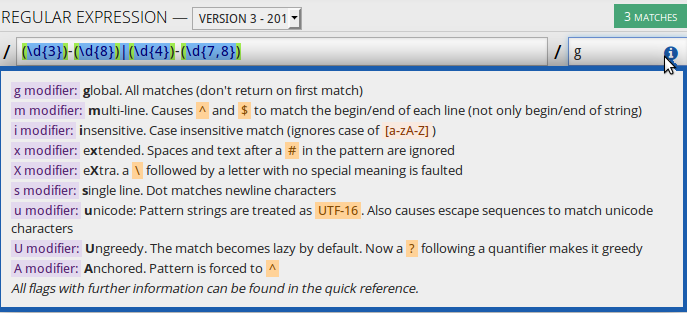

Title: 正则表达式入门简介
Slug: 正则表达式入门简介
Tags: regex
Date: 2014-08-01

以前虽然也用过正则表达式(比如那个饮水思源的[PPP版图片下载器](http://x-wei.github.io/%E6%B0%B4%E6%BA%90PPP%E6%9D%BF%E5%9B%BE%E7%89%87%E4%B8%8B%E8%BD%BD%E5%99%A8.html)...)但是那时候基本上是网上到处搜 然后把代码拿过来改, 没有系统的学过这个东西. 前一段实习一开始的时候要处理很大量的文本, 从文本里提取出需要的信息, 所以用到了不少的正则表达式, 也好好的学了一下, 现在回来进行一下总结. 

什么是正则表达式
--------
很多时候,我们需要在文本里寻找满足一种**模式**(*pattern*)的一段子字符串(substring), 注意是一种模式而不是某一个具体的字符串. 举个例子, 在一段文本里寻找这里面出现的所有的网址, 那么对应的模式就是: 

>"以``www.``开头, 中间有一些东西(可以是字母也可以是数字等), 最后以 ``.com/.org/.edu...`` 结尾的所有的字符串"

再比如, 要查找文本中出现的电话号码, 电话号码的格式是区号加横线再加号码, 那么模式就应该是:

>"以3个或4个数字开头, 三个或四个数字之后跟一个横线, 横线后再跟7个或8个数字"

再再比如, 要查找出现的电子邮件地址, 那么模式大概是:

>"以字母或数字或下划线开头, 之后跟着一个@符号, @符号以后一些用点分隔的字母或数字, 最后应该以.com/.org/.edu等结束"

可以想象实际应用中会有描述起来更加罗嗦的模式, 而**正则表达式就是用来描述这种"模式"的语法**, 使用正则表达式, 可以用很简短的代码表达很复杂的模式. 有人给正则表达式起了个别名叫"*字符串模板*", 其实更贴切... 

还有, 后面总是会提到"某个正则表达式*exp*匹配(match)了某个字符串*str*", 这里说**"匹配"**的意思其实是*"字符串str满足了正则表达式exp描述的那种模式"*.

关于正则表达式, [这篇博客](http://deerchao.net/tutorials/regex/regex.htm)可以说是经典之作, 搜索"正则表达式"这篇文章几乎都是第一个被找到的. 每次我有问题都要再翻出来看一下这篇, 讲的非常好. 

另外强烈推荐一个非常赞的在线测试正则表达式的网站: <http://regex101.com/> 做得超级棒(具体怎么棒见后文).

匹配单个字符
------

* 匹配某个*特定的*字符:

只需要写出来就好了, 类似于记事本的查找功能. 
ex. 查找"abc"这个字符串, 正则表达式就是: ``abc``

* 匹配*某一类*字符:

比如匹配数字, 只需要把候选的字符放进**中括号**, 而且可以用横线表示一系列的字符:

ex. 匹配一个数字: ``[0-9]``
ex. 匹配大写的一个字母: ``[A-Z]``
ex. 匹配一个数字或字母(大小写都可以): ``[A-Za-z0-9]``
ex. 匹配一个元音字母(aeiou中的一个): [aeiou]

* 匹配某一类以外的字符:

在这一类字符前面加上``^``, 起到的作用就是取这些字符的补集(**"反义"**).
ex. 匹配一个不是数字的字符: ``[^0-9]``
ex. 匹配任意一个不是元音字母的字符: ``[^aeiou]``
ex. 匹配以b开头, 以d结尾的三个字母长的单词: ``b[a-z]d ``, "bed", "bad"都满足这个条件

* 匹配正则表达式中用到的的特殊字符

比如要匹配'^'这个字符, 由于这个字符是正则表达式里使用的有特殊含义的字符, 需要在前面加**反斜杠转义**: ``\^``
类似的特殊字符还有不少:  `&`, `.`, `*`, `?`, `(`, `)`, `[`, `]`,......

匹配任意字符
------
用的最多的是这一个:

* 匹配除了换行符以外的任意字符: ``.``

(在开启"单行模式"的时候, 可以连换行符一起匹配, 见后文.)

然后, 在反斜杠后面加某些字母的时候有特殊含义(**"元字符"**): 

* 匹配字母或数字或下划线或汉字: ``\w ``(用前面的``[A-Za-z0-9]``之类的方法也可以做到)
* 匹配任意空白字符(空格或TAB): ``\s``
* 匹配任意数字: ``\d ``(用前面的``[0-9]``也可以做到)

把上面这些反斜杠加小写字母变成反斜杠加*大写字母*的话, 成了取补集(类似前面那个``^``的作用)

* 匹配任意不是字母，数字，下划线，汉字的字符: ``\W``
* 匹配任意不是空白符的字符: ``\S``
* 匹配任意非数字的字符: ``\D``

所以如果要匹配, 包括换行符的话, 只需要把``\s \S``一起用:

* 匹配所有字符, 包括换行符: ``[\s\S]`` <http://bbs.csdn.net/topics/300041987>

匹配位置
----
有时候还要指定某些位置, 比如说: 要匹配网址, 网址要以"www."开头, 所以如果有个网址是: "www.abcwww.com" 的话, 有可能匹配成了中间那个"www.", 那么就有问题了. 所以要指定"www."要在一个字符的开头出现, 而不能是在中间(前面不能有字符). 

这种情况下我们就不是要匹配某个具体的字符串, 而是**匹配一个位置**.

* 匹配单词的开始或结束(*word boundary*): ``\b``

这就是我们前面说的情况, 只需要加上\b, 就不会匹配在某个单词中间出现的"www."了.
ex. 匹配网址开头的"www.": ``\bwww\.`` [例子链接](http://regex101.com/r/oZ6aK1/1) ⇐ 可以把最开始那个``\b``去掉, 看看结果有什么区别. 

注意这个``\b``可以是单词的开始, 也可以是单词的结束. 还是网址的例子, 如果一个网址是:"www.abcwww.qwert.coming.com"的话, 我们说"匹配以.com"结尾的字符串, 就有可能是匹配到了**qwert.com**ing, 也会有问题, 所以我们应该在"com"后面加上一个``\b``.

ex. 匹配网址结束处的".com": ``\.com\b ``[例子链接](http://regex101.com/r/oZ6aK1/2) ⇐ 同理可以看看去掉``\b``以后有什么不同.

* 然后这个元字符``\b``变成大写以后也是反义, ``\B``匹配所有不是单词开头或结束的位置.

* 匹配整个字符串的开头: ``^``

注意是整个字符串的开头, 而不是指每一行的开头! (但是在"多行模式"时可以代表每一行的开头, 见后面冠以正则表达式选项的讨论)

* 匹配字符串的结束: ``$``

同样是指整个字符串的结束. 

重复次数
----
这个和前面介绍的匹配字符配合起来(指定要匹配的字符, 再指定字符重复的次数), 就可以完成大部分的工作了.

* 字符重复*(exactly)n次*

只需要把数字n放进**大括号**里就可以了. 
ex. 找一个六位的数字, 那么就是0-9的数字重复6次: ``[0-9]{6}``

* 重复*m到n次*

只需要在大括号里把m和n用逗号进行分隔.
ex. 找一个6到8位的数字: ``[0-9]{6,8}``

但是要重复m**或**n次的话, 我没有找到好的写法, 可以用后面介绍的分支条件实现, 不过比较繁琐...

* 重复*大于等于n次*

(重复小于等于n次等价于0到m次)
大括号里面n后面加一个逗号:
ex. 找6位以上的数字: [0-9]{6,}

平时用到的比较多的是要求*"重复大于等于1次"*或者*"重复大于等于0次"*, 由于上面这样的写法有的时候比较罗嗦, 所以有了下面的简写:

* 重复*大于等于1次*: ``+``

等价于 ``{1,}``
ex. ``goo+gle ``, 可以匹配"google", "gooogle", "goooogle"等, 因为第二个o可以出现大于等于1次. 
(当然上面这个例子也可以在前后加上单词边界``\b``, 以防止匹配到某个长单词的中间)

* 重复*大于等于0次*: ``*``

等价于 ``{0,}``
ex. 匹配以a开头以t结尾的单词: ``a[a-z]*t`` , "at", "attachment", "act"等都符合条件

* 重复一次或0次: ``?``

等价于 ``{0,1}``
ex. 匹配"color"或者"colour": ``colou?r``

贪婪(greedy)模式/懒惰(lazy)模式
-----------------------
前面介绍的那些指定重复次数的部分, 由于有时是指定一个重复次数的范围, 而经常匹配到的重复的次数也是一个范围, 所以有"贪婪"和"懒惰"的区别.

好像上一句话没有说清楚... 举个例子, 要匹配大于六位的数字, 我们的正则表达式是``[0-9]{6,}``, 意思是要有六个或更多的重复次数. 那么对于一个字符串: "123456789", 一共有9位, 它既可以看作重复6次(取前6位), 也可以看作重复7次, 8次, 9次... 那么岂不是含义上出现歧义(ambiguous)了??

而实际上, 我们写的表达式``[0-9]{6,}``在这个例子里最终会匹配所有的9位, 这是因为我们写的这个表达式默认上是**贪婪模式**的, 意思是匹配重复>=6次的的重复, 但是会*尽可能多重复*. 

与之相反, **懒惰模式**的意思是*尽可能少重复*. **正则表达式默认是贪婪模式**, 要开启懒惰模式只需要在重复次数的后面加上一个问号"``?``".

* ``+?`` : 重复>=1次, 但是尽量少重复
* ``*?`` : 重复>=0次, 但是尽量少重复
* ``??`` : 重复0或1次, 但是尽量少重复
* ``{n,}?``: 重复>=n次, 但是尽量少重复
* ``{m,n}?``: 重复m到n次, 但是尽量少重复

再插一句, 这个"贪婪模式的开启标志"``?`` 和"重复次数的符号"``?`` 虽然都是问号, 但是由于放的位置不一样, 所以不会造成歧义, 因为"重复次数的符号"的问号是出现在"匹配字符"(比如``\w``, ``[0-9]``, ``.``)的后面的, 而"贪婪模式的开启标志"的问号是出现在"重复次数"(如``{m,n}``, ``+``, ``*``)的后面的...

分支条件(alternative)
-----------------
意思就是可以匹配两种模式的任意一种, 看例子:

* ex1. 

中国的电话号码有的城市是三位区号加横线加八位号码(比如"021-54749110" ⇐ 这是上海一所学校的保卫处号码), 有的是四位区号加横线加七位或八位号码的(比如"0635-8238080" ⇐ 这是山东一所大学的保卫处, 以及"0531-88881234" ⇐ 这是山东台小么哥的号码==...). 要匹配这样的号码, 如果这样写:
``\d{3,4}-\d{7,8}``
(别忘了``\d``等价于``[0-9]``)
那么其实是不对的, 因为我们不允许出现3位区号后面跟7位号码的情况出现, 所以这里其实是两种模式, 所以我们是要**匹配这两种模式其中的任意一种**. 

这种情况下, 只需要把两种情况分别写出来, 中间用``|``分割即可:
``\d{3}-\d{8}|\d{4}-\d{7,8}``
不过看起来有点乱了... 可以加上小括号这样显得更清楚一些: 
``(\d{3}-\d{8})|(\d{4}-\d{7,8})``

不过小括号在正则表达式里面除了让正则表达式(稍微)更容易读以外, 还有一个作用是后面提到的"分组"或者"捕获", 这个后面再说...

* ex2.

前面说到过怎么匹配重复m**或**n次的数字, 我没有找到更方便的方法, 只好用分支条件实现了:
``\d{m}|\d{n}``
但是要注意, 这个时候会有和前面贪婪/懒惰类似的问题: 如果一串数字有9位长, 我要匹配6位或9位的数字, 那么应该匹配到哪里呢? 

其实这个时候取决于我们是写``\d{9}|\d{6}``还是``\d{6}|\d{9}``, 正则表达式有类似于编程语言里的"**条件短路**"(shortcut)性质, 一旦第一个模式满足了, 就不会去寻找竖线后面的第二个模式了...

小括号: 对结果进行分组(group), "捕获"
-------------------------
先说一句别的, 前面介绍重复次数的部分, 介绍了怎么指定某个类型的*单个字符*重复的次数, 要是想寻找某个特定字符组合的重复次数该怎么办呢? 只需要把要重复的部分用小括号括起来, 然后后面指定重复的次数就可以了...

ex. 寻找好几个"bla"连着的字符串: ``(bla)+``, 这样"blablabla"之类的字符串就可以被匹配了. 

所以小括号的这种作用类似于小括号在一般编程语言的作用, 就是把一部分内容放在一起. 但是与此同时, 每一个小括号其实还"**捕获**"了一个"**分组**"(group). 意思就是在匹配到的字符串里(叫做一个"match"), 我们还可以得到它的一个子字符串. 

还是举电话号码的例子, 前面的方法我们可以得到一个类似"021-54749110"这样的匹配结果, 但是如果我们想*把区号和区号后的号码分别保存*的话, 还需要再*在程序里*对这个字符串做个处理: 比如把字符串的前三个截取出来保存为区号, 把第五个字符到最后的子字符串截取出来保存为号码... 这样会有问题, 因为我们也可能得到"0531-8881234"这样的结果... 于是我们只能先在得到的字符串里寻找"-", 然后再从"-出现的位置那里把字符串截成两段...... 总之这样的话在程序里还要进行很麻烦的后期处理, 非常不爽(c'est trop lourd!)......

幸好我们可以使用正则表达式的分组功能, 在得到结果的字符串的同时, 还在不同的分组里放了对应的的子字符串,*这样在程序里只要得到每一个分组就可以了*. 

而给字符串分组的方法也很简单, 就是简单的*给要分组的地方加上小括号括起来就好了*. (当然, 可能你只是为了看得清楚才给表达式加小括号, 但是在正则表达式匹配字符串的时候也会帮你把它捕获到一个分组里.) 所以没加一对小括号就会在结果中增加一个分组, 分组的顺序是按照小括号出现的顺序排列的. 

所以在电话号码这个例子里, 我们可以写:
``(\d{3})-(\d{8})|(\d{4})-(\d{7,8})``
[例子链接](http://regex101.com/r/bS1uP4/3)
我喜欢reg101这个网站的原因就是它可以显示非常丰富的信息. 
在网站的右上角,有关于表达式的解释:

在右下角会显示捕获到的分组(groups):

(这里的分组编号可能有点问题, 后两个分组的编号应该是1和2的... 这是由于我们使用了分支条件造成的, 不知是bug还是feature...)

然后关于怎么在程序里获得正则表达式的分组, 可以去看每一种编程语言的相关文档...... 

正则表达式选项("模式")
-------------
使用正则表达式的时候, 还可以指定一些"模式"选项, 比如在reg101网站上, 表达式右边有一个选项窗口:

当开启某些"模式"的时候, 正则表达式的匹配行为稍有不同. 其实上面的截图已经讲的很清楚了, 下面捡比较常用的说一下:

* 全局模式global, "g": 就是不止匹配第一个, 而是把所有的匹配都显示出来.
* 扩展模式(或者"注释模式")extended, "x": 使用后正则表达式也可以换行, 可以随便加空格(将被忽略), 也可以使用注释(使用``#``开始注释)

这个是我经常用的选项, 有时候表达式写的很长很乱, 如果不能换行或者加注释的话, 下次看得时候就不知道是怎么回事了...
比如刚才那个电话的例子, 我们在开启了扩展模式以后, 可以写成这样:

	(\d{3}) - (\d{8}) #region code, -, phone number
	| #alternative
	(\d{4}) - (\d{7,8})#region code, -, phone number

[例子链接](http://regex101.com/r/bS1uP4/4)

* 多行模式multiline, "m": 前面"匹配位置"那一节提到了, 就是改变``^``和``$``的意思, 不让它们匹配整个字符串的开始和结束, 而是每一行的开始和结束.
* 单行模式singleline, "s": 前面也提到了, 作用是让``.``也匹配换行符...

(所以可见, *单行模式和多行模式根本不是相互排斥的关系*....... 这名字起的不好...)

关于怎么开启这些选项, 还是要看不同语言的文档... 
比如在python里, 只要在``re.compile()``函数使用加入``re.X``等参数, 见[文档](https://docs.python.org/2/library/re.html#module-contents)...

其他内容
----
这里我只写了我用到的一些东西, 关于正则表达式还有很多没有提到的内容(所谓的"高级议题"?), 比如"零宽断言"以及"平衡组"等内容, 这些都在deerchao的那篇[经典博客](http://deerchao.net/tutorials/regex/regex.htm)里提到了...

实际例子
----

* 例子1

要分析很长的文本, 文本的一部分包含了一趟航班的信息, 比如出发和到达的时间, 出发和到达的机场, 以及航班号等... 这些信息中间都包含在一长串字符中间. 

我们用正则表达式处理, 并且把不同的信息放在不同的分组里, 这样就方便了程序的处理. [这里](http://regex101.com/r/bS1uP4/5)是我写的正则表达式.

* 例子2

再举个例子, 我想要现在[这个页面](http://www.cs.waikato.ac.nz/ml/weka/mooc/dataminingwithweka/)的所有的东西, 可是用鼠标一个一个点击实在是太麻烦了, 所以可以写一个程序把这些链接都提取出来, 然后自动进行下载. 

所以需要分析这个页面的html文件, 右键 → 显示网页源代码就可以看到了, 虽然我不懂html的语法, 但是可以发现, 下载的链接都是这样的片段:

><a class="download_link" href="https://drive.google.com/uc?export=download&amp;id=0B-f7ZbfsS9-xUjhLaURQbWsxbjg" target="_blank">en</a></td>

就是说在``class="download_link"``之后, ``href=``后面的用引号引起来的内容就是我们想要的下载链接了, 于是可以很快用正则表达式来提取它, 我写的表达式见[这里](http://regex101.com/r/hN1lH1/1).

