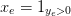
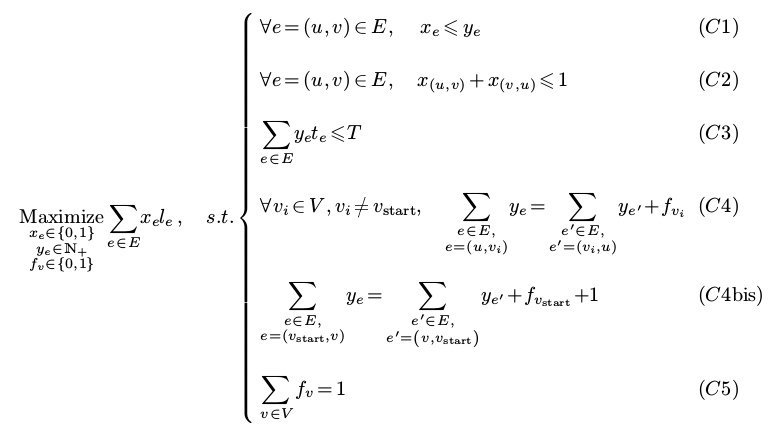
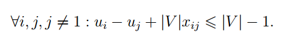
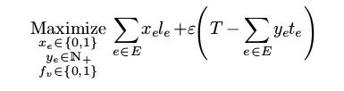
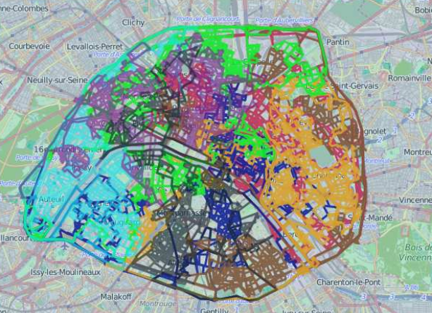
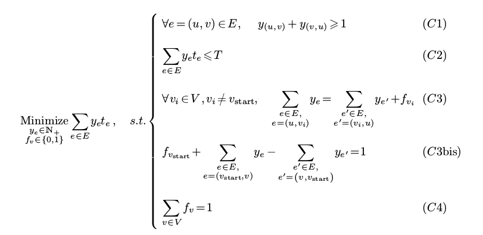

Title: 运筹的力量: 用线性规划解决Google 2014 HashCode问题
date: 2015-02-02
Slug: hashcode2014-solved-by-LP
Tags: LP, algorithm

[TOC]

INF580(programmation par contraintes) 大概是在X学到的最有用的一门课, 它让我能够用把运筹学(MAP557)里学到的东西和计算机结合起来: 用电脑的力量解决(大规模)运筹问题. 

这门课的projet是去年巴黎谷歌举行的一个比赛的题目: 最优化谷歌街景拍照小车的路线. 做这个projet的三周里, 我和Manu从一开始信心满满, 到中间一筹莫展, 再到后来柳暗花明, 以及最后乘胜追击终于在今晚得到了近乎完美的解答, 非常精彩, 这里特意一记.

问题描述
====

谷歌那次比赛的题目在这里(我们做的是Main Round的题目): <https://sites.google.com/site/hashcode2014/tasks>

简单来说, 就是已知巴黎的道路信息, 设法用八辆车(每辆车的行驶时间有限)从巴黎谷歌出发, 尽可能多的走遍巴黎的所有街道, 参赛者给出这些车的路线, 他们的分数就是这八辆车走过的街道的长度之和(重复走的街道不算分). 

去年四月份我们也参加了这个比赛, 不过当时纠结于如何设计每辆车的路线, 最后只是用了贪心算法, 再加上一点点的随机, 得到的结果并不好... 当时ENS的人包揽了前三名, 而且比赛后进一步把分数刷到了满分: 他们的路线可以把所有街道都跑遍. 

这学期学了INF580以后, 手里有了**JaCoP**以及**AMPL**等"重型武器", 我们经过一番努力也得到了满分, 而且用了几乎最少的时间. 代码放在了: <https://github.com/X-Wei/INF580_HashCode2014> (里面还有个pdf的报告, 比这篇博客里说的精炼).

I. 初步建模
====

线性规划(LP)模型
----------
站在一个更高的角度上考虑这个问题, 从一个线性规划的角度看, 给定一个图``G(V,E)``, 目标是最大化走过的街道长度, 如果用对每条街道``e``, 定义一个``x_e``,: 当一条街被经过的时候使它为1, 否则为0, 那么目标函数就是一个x的线性组合(系数就是对应街道的长度). 

但是如果一条街被经过了大于一次, ``x_e``也只能是1, 所以再引入一个变量``y_e``: 用来表示一条街被经过的**次数**. 所以``x_e``可以看成是``y_e``的indicatrice函数: , 这一点可以通过增加线性约束: ``x_e<=y_e`` 即可实现, 因为``x_e``的取值范围是{0,1}. 

不过一条街可能从两个方向被经过(``G``里面的边是有向的), 如果``e``'代表反方向的``e``, 那么还应该增加约束:  ``x_e+x_e'<=1`` 就好了. 

接下来``y``要满足的就是所有的``y``要组成一个*路径(path)*, 对于既不是起点又不是终点的一个节点``v``, 还是很好写的, 类似flot: ``sum(进入v的y_e) = sum(从v流出的y_e)``.

对于起点``v_start``来说, 其实也不难: ``sum(进入v_start的y_e) = sum(从v-start流出的y_e)+1 ``.

但是对于终点的话, 有个问题是我们不知道车会停在哪里! Manu太聪明了, 对每一个节点``v``引入了另一个变量``f_v``,取值范围也是{0,1}, 如果在节点``v``停下来, 那么``f_v``等于1, 否则就是0. 所以上面的约束可以写成: ``sum(进入v的y) = sum(从v流出的y_e)+f_v``. 另外别忘了只能停在一个节点, 所以再加约束: ``sum(所有的f_v)=1``.

以上的目标函数以及约束, 虽然数目庞大, 但是都是线性的, 所以是一个整数线性规划问题, 写成数学形式就是: 

从solution得到路径
-------------
一旦上面那个线性规划问题解决了, 我们得到的将会是那些变量``x``,``y``,以及``f``, 但是需要从中提取一条路径最后才能作为solution!! 

这个问题实际上可以归结为: 给定一个一笔画的曲线(其实就是那些``y``: 可以想象把每条边都复制``y``次, 得到的就是这么一个曲线了), 找出一个可以将其一笔画出来的路径(这条路径也叫"欧拉路径", 没"汉密尔顿路径"有名). 聪明的Manu很快想出来一个算法(我们叫它"Orsini算法"): 大意是当走到底没有走完的时候, 把那些错过的路径夹在原路径的中间就好了. 

算法描述如下: 

>i) 从起点开始出发走, 把走过的边涂上颜色(以后不能再走), 只要还可以继续走(还有没有着色的边可走)就一直走下去, 一直到无路可走. (应该会停在``f=1``的地方), 得到路径``p0``.

>ii)  如果所有边已经被走过了: **over**. 如果没有: 找一个没有走过的边与``p0``的交叉点: ``v``(如果找不到的话说明有问题: 后面就遇到这个问题了), 然后执行(iii)

>iii) 从``v``出发, 在进行类似(i)的操作得到一条路径(应该是一个环), 然后把``p0``从``v``那里劈开, 把这个环塞到中间组成新的``p0``, 然后再执行(ii).  

这样就可以得到对应的路径了. 

一开始的想法
------
以上的建模是针对一辆车的, 我们一开始的想法是: 对一辆车进行这个操作, 得到结果以后更新一下``G``(把那些已经走过的街道的长度设为0, 然后再走下一辆车... 这样跑8次就能得到最优解了. 

一切看起来*似乎*都非常完美......

II.遇到的问题
=====

计算能力问题
------
写好了AMPL的程序以后, 我们遇到的第一个问题是: 这么大的问题, 一般电脑算不出来(曾经用glpk让电脑跑了一夜, 还是没有得到结果). 

后来问老师, 老师说glpk并不是非常高效的求解器, 然后推荐给了我们一个非常给力的网站: [NEOS](http://neos-server.org/neos/) ! 这个网站可以让人上传AMPL程序, 然后用它们的服务器跑, 而且使用的求解器也是商用的, 比开源求解器快的不是一个数量级(我们发现最快的求解器是*Gurobi*, 十分给力). 

这样一来计算的问题就解决了, 但是我们很快发现一个更严重的问题, 是我们的建模里的一个严重缺陷...

subtour问题
---------
我们兴冲冲的拿NEOS的结果跑Orsini算法的时候, 发现总是报错: 也就是在第二步, 程序无法找到一个和``p0``有交叉点的边: *也就意味着我们的模型得到的路径并不是只有一个connected component!!! *也就是说, 我们得到的解其实是一条从起点到某个终点的路径, 外加很多和这个路径没有交点的圈圈(subtour)!

是啊, 这个问题很类似旅行商问题(TSP), 而TSP的困难之一 就是要解决subtour的话需要加入2^n个新的约束.... 2^10000个约束? impossible...

III. subtour问题的"解决"
==============

各种纠结
----
在一次PC上有一道题目介绍了TSP subtour问题的一种建模方式, "potentiel"建模, 可以防止加入2^n个约束: 为每个节点``v``引入新的变量``u_v``,``u_v``代表了节点``v``被访问的顺序, 约束做的非常巧妙, 是这样的: 

这样, 当``x_ij``是1的时候, 就保证``u_j``比``u_i``大1, 而当``x_ij``是0的时候, 这个约束则非常松弛, 几乎相当于没有. 

不过这个方法套到我们这个projet的话也有问题: 那就是每个节点只能有一个``u_v``, 所以每个节点只能最多访问一次.... 不过我们很快想到了办法: 把所有节点复制一个(复制"一层"), 然后每条边的话也进行复制, 同时加上那些连接各层的边. 

举个例子, 原来的一条边是: ``(u, v)``, 我们复制了一层, 这些新节点叫它们``u',v``',... 那么在这个两层的图里, 我们要把原来的这条边变成4条: ``(u, v)``, ``(u, v')``, ``(u', v)`` 和 ``(u', v')``. 这样就可以保证路径可以经过一个点两次了, 如果想要保证可以经过一个点K次, 只要做K层就好了(每条边变成K^2条). 

然后, ``x``也不需要了, 因为每条边的``y``最大就是1. 但是还有一个问题是目标函数, 由于一条边变成了四条, 如果走四遍的话就多算了四次这条边的长度... 有两种解决办法: 一是类似前面的方法, 给每条边指定定一个indicatrice, 这样就不会重复了, 还有一种更简单的办法是, 在四条边里, 只取一条边的长度保持不变, 其他长度都设成0, 算法自然会优先走那条长度不是0的边(这个没有仔细证明, 不过貌似是这样的). 我们采用了第二个办法.... 

就这样废了好大功夫, 写好了两层节点的程序, 送去NEOS一跑.... 超时了(超过8h后NEOS会自动停止求解过程)... 后来我们发现即使是不多加新一层的程序, 也会超时. 那节PC里也说, 这种建模方法实际上计算效率比加入2^N个约束的建模还要差... 

所以总结一下就是: 问题还是没有解决...

绕过subtour问题
-----------
就在一筹莫展之际, Manu提议把搜索的范围缩小: 不用整个巴黎的数据, 只取起点附近的区域, 这样的话, 说不定我们原先的模型得到的结果会少一点connected components... 试了一下, 果然! 虽然没有强制要求路径的连通性, 得到的结果确实(几乎)只有一个联通分支! 

后来就想到了一个很聪明的办法: 用八倍的T作为时间限制, 让一辆车去跑, 由于时间很充分, 我们得到的解应该不太会出现多个联通分支, 然后一旦得到了这个路径(后来我们叫它"big path"), 只需要把它分成8段, 每辆车先从起点(巴黎谷歌)跑到每一段的开头, 然后沿着这条路跑就好了啊!! 虽然从巴黎谷歌跑到每一段的起点会稍微浪费一些时间, 但是这点损失其实微不足道!! 而且也不用跑8次LP这么麻烦了 -- 要是早点想到这个就好了!!

而且很神奇的是, 把时间变成了8T以后, 我们的Lp模型计算的更快了: 原先要计算30分钟左右, 现在只要差不多3分钟就出结果了!! 这一点没太想明白, 可能是搜索的空间变小了??

说写就写, 最短路径用Dijkstra算法就能得到了, 不一会就写出了这个把一条big path变成8条small path的程序. 然后我们一举得到了1957596分(离满分还差了两千米左右)!!

IV. 进一步优化
=====

优化的话有两个方向: 第一个方向是修改那个程序代码, 使得每次走到big path某段起点的时候可以少走些路, 不过这个方向应该没什么前途: 程序写起来麻烦不说, 可以改进的空间也很有限, 因为big path一共也没有剩多少时间, 所以八辆车是不可能把big path走完的. 第二个方向则是设法优化big path的时间使用, 使得它在得到最长路径的同时使用尽量少的时间. 

引入时间正则项
-------
其实8T作为时间来说非常充裕, 但是我们的解里面, big path还是把时间用的差不多了: 因为时间根本没有出现在目标函数里. 所以, 可以把时间也作为目标函数加上去, 不过要注意最优先要优化的还是路径长度, 所以时间项前面要乘以一个非常小的数(比如0.000001), 类似做regularization. 

所以新的目标函数是: 

这样一运行, 我们的big path居然剩下了六千多秒的时间!!! 这些时间足够八辆车跑到各段的起点了!! 我们这样, 八辆车走完了big path所有的路程得到的结果离满分只差了7米, 而最后一辆车还有两千多秒没有走! 

检查了一下, 发现有一个7米长的路是唯一剩下没走过的路: 于是只要再让最后一辆车去走一下就好了(因为时间够用), 最终我们的方案走完了整个巴黎:

等一下, 这里有点奇怪: 为什么优化得到的结果并不是最优的(没有走完所有的路程)? 我们通过后来手动走那条剩下的路都没有超时, 所以说其实肯定可以在8T的时间走遍所有街道的! 后来查了一下才发现, 原来Gurobi并不是返回最优解, 而是当当前可行解与最优解足够接近的时候就直接停止, 这个参数的名字叫mipgap, 更多参数可以参考这里: <http://www.gurobi.com/documentation/6.0/ampl-gurobi-guide/parameters> .

这也就解释了为什么NEOS得到的解不是最优的, 不过还好, 通过最后手动添加那条没走的边, 还是走完了所有的街道. 

............

只是作为强迫症的话觉得还是有点......不够完美.

直接优化时间
------

今晚, 机智的Manu想到了解决办法: 既然知道所有的街道都会被走遍, 直接不把它看成目标, 而是直接作为约束好了, 然后约束直接改成优化时间! 

要就经过所有街道的约束很简单, 那就是对任何街道``e``, 都有: ``y_e+y_e'>=1``. 另外肯定所有街道都会经过, ``x``就没有必要存在了. 

LP模型表达为: 

用这样的模型, 我们的big path 省下了一万两千多秒, 所以我们的最终结果里, 最后的一辆车跑完以后还有9596秒没有用!!

到这一步, 真的可以算是完美解决这个问题了, 而且强迫症也得救了. 

Yeah!  : )

