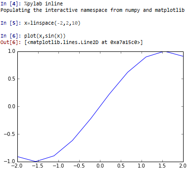
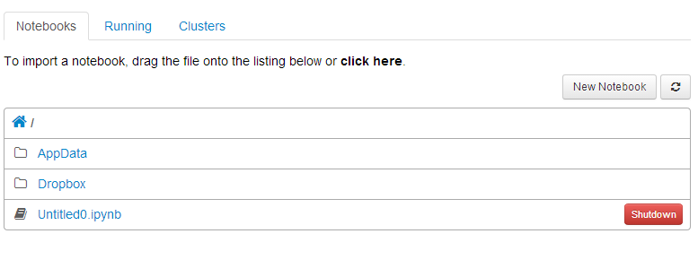
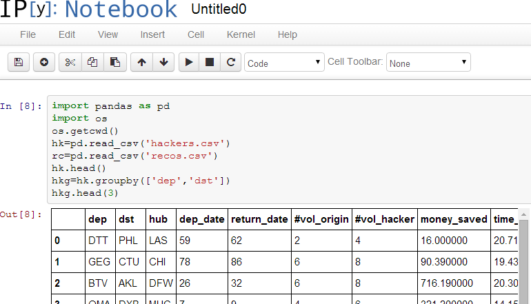
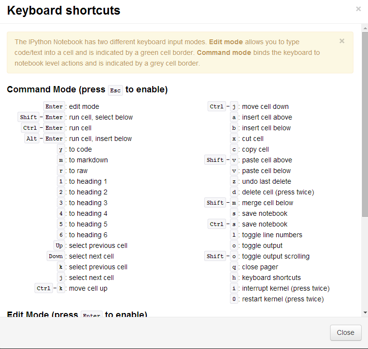
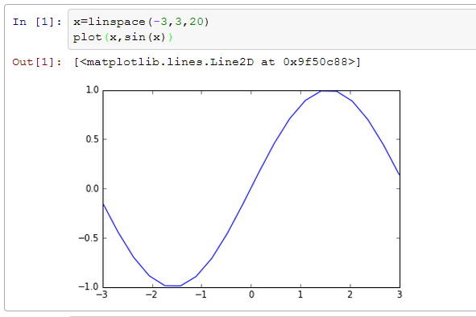

Title: IPython上手学习笔记
Date: 2014-07-22
Slug: IPython上手学习笔记
Tags: python

[Learning IPython for Interactive Computing and Data Visualization](http://www.packtpub.com/learning-ipython-for-interactive-computing-and-data-visualization/book)这本书的前两章的笔记, 这本书还被放在了IPython官网上, 虽然只有一百页多一点点, 但是讲的内容却很丰富, 介绍了IPython, numpy, pandas以及并行计算等方面. 

(在开始系统学IPython之前简单使用过IPython, 那时候我还是更喜欢bpython的代码提示功能...)

ch1: 10 IPython essentials
==========================

* 在任何变量后面加问号``?``或者双问号``??``, 将会输出详细的信息(按``q``退出), ``??``的信息更加详细些
* Tab Completion: 没啥好说的 没有bpython做的好 也凑合吧...
* ``_, __, ___ ``保存最近三次的输出;  ``_i, __i, ___i ``保存最近三次的输入(作为字符串保存)

magic commands
--------------

* 在IPython里面可以使用一些标准unix命令, 比如``cd``, ``pwd,ls``等... 

这个太好了 否则还要``import os``, 然后再什么``os.chdir('...')``

* 其实这些unix命令是IPython的**magic commands**, 这些magic commands一般用``%``作为前缀.

但是由于默认IPython开启了**automagic system**, 上面那些命令可以不用加前缀了(或者使用Tab自动给加上前缀)
 

* ``%run`` 命令, 运行一个.py脚本, 但是好处是, 与运行完了以后这个.py文件里的变量都可以在Ipython里继续访问
* ``%timeit`` 命令, 可以用来做基准测试(*benchmarking*), 测试一个命令(或者一个函数)的运行时间

ex. 
	
	%timeit [x*x for x in range(1000)]
	10000 loops, best of 3: 56.5 µs per loop
	
	%timeit [x*x for x in xrange(1000)]
	10000 loops, best of 3: 51.7 µs per loop

* ``%debug`` 命令: 当有exception的时候, 在console里输入``%debug``即可打开debugger. 

在debugger里, 输入``u,d``(up, down)查看stack, 输入``q``退出debugger

	%debug
	> <ipython-input-34-17c374156862>(2)<module>()
	      1 if 1<2:
	----> 2     raise Exception
	      3 
	ipdb> u
	*** Oldest frame
	ipdb> d
	*** Newest frame
	ipdb> q

使用%pdb开启自动pdb模式

>%pdb  
>Automatic pdb calling has been turned ON

* ``%pylab`` 命令, 大杀器, 看一下都import了什么:

    %pylab makes the following imports::
	    import numpy
	    import matplotlib
	    from matplotlib import pylab, mlab, pyplot
	    np = numpy
	    plt = pyplot
	    from IPython.display import display
	    from IPython.core.pylabtools import figsize, getfigs
	    from pylab import *
	    from numpy import *

画图的时候可以不用非要加``plt.``前缀了, 直接``plot()``即可. 图像化出来的时候, 画图窗口并没有block, 可以动态(*interactively*)画图.

另外, qtconsole和notebook一样, 指定了``inline``选项以后可以直接在窗口里画图:

后来发现inline的图片貌似不能放大看, 所以有时候还是单独一个窗口比较好, 换到非inline模式只需要再输入以下%pylab, 加上选项qt:
``%pylab qt``

IPython Notebook
----------------
**(重头戏)**

这个可以在浏览器里(!!)使用IPython, 并且可以使用多行编辑后再一并执行. 

>*The Notebook brings the functionality of IPython into the browser for multiline textediting features, interactive session reproducibility, and so on.*

在shell/cmd窗口里启动ipython的时候加上notebook:

``$ipython notebook``

看到浏览器打开了, 很神奇: 

新建一个notebook, 用用看: 

使用的过程中渐渐理解了为什么书里说可以用来做"*multiline textediting features, interactive session reproducibility*"... 因为这不只是个编程的东西, 还可以作为一个笔记本 — 而且是一个交互式的笔记本! 

(*注: 更多关于notebook的介绍在下面第二章的内容里.*)

* 代码,或者段落, 按照cell(格子)进行组织, 一个cell里面的内容可以是code, 但是也同样可以是markdown的段落, 或者是一个标题(heading).
* 在一个代码的cell里, 写入多行代码, 就像在编辑器里写python程序一样, 按回车只会换行, 不会运行程序.

写了一段程序代码以后, 按``ctrl+Enter``运行程序, 运行结果也是一个作为cell. 
(**注**: 在qtconsole里面相反, 如果要输入多行程序的话, 按``Ctrl+Enter``换行(按一一次ctrl+enter即可进入多行编辑模式), 写了几行代码以后要运行的话, 就按两次回车, 或者按``Shift+Enter``)

* ...还有好多快捷键, 按Esc以后再按h就可以看到... 这个还分编辑模式和命令模式呢... 真不能小看了IPython了!

customizing IPython
-------------------
保存自己的IPython配置文件, 只需要在shell/cmd里输入ipython profile create``,`` 配置文件存储在 ``~.ipython`` 或者 ``~/.config/ipython ``目录里.

  
  
  
  
  
  

ch2: Interavtive Work with IPython
==================================

IPython可以实现**shell(OS)和python的交互**. 这样做一些unix shell的操作的时候可以不必退出console了.

navigating the file system
--------------------------
例子: 完成下载压缩包, 解压缩, 以及打开解压后的文件这些操作...

在py变量前面加入$, 可以把这个变量共享给OS或者magic command:

	folder='data'
	%mkdir $folder

这样就在当前目录下建立一个'data'文件夹 — 这可比py的命令好记多了啊... ``%mkdir``的原理其实是给了shell命令一个别名(``alias``).

然后, ``%bookmark ``可以把当前的目录加入收藏夹 下次cd的时候方便直接跳到这里来:

ex.
``%bookmark bm``
那么以后可以直接用 ``cd bm`` 跳到这个目录下. ``%bookmark -l`` 可以列出收藏夹的目录内容.

然后发现原来IPython连文件名都是可以提示的啊!... 

    with open('0<TAB>
	0.circles 0.edges

Accessing system shell with IPython
-----------------------------------
在IPython里调用系统的命令, 不用再使用``sys.exec('...')``之类冗长的方式了, 只需要在系统的命令前面加上一个感叹号``!``即可...

shell返回的结果可以作为一个string的列表保存在一个python variable里.

ex. 

	In [2]: files = !ls -1 -S | grep edges
	In [3]: files
	Out[3]: ['1912.edges',
		'107.edges',
		[...]
		'3980.edges']

(当然 上面这一行只能在unix系统下运行, 因为Windows的cmd没有ls 和 grep命令)

还可以把一条比较长的命令作为alias保存起来, 用``%alias``命令... (这个应该一般用不到)

``%alias largest ls -1sSh | grep %s``

The Extended Python Console
---------------------------

* ``%history`` 或者 ``%hist`` , 显示之前的记录, 有一些参数可用...
* ``%store`` 把python变量的内容保存下来, 以后的session可以用
* ``%paste`` 导入并执行剪贴板里面的内容
* ``%run`` 之前讲过了, 运行py文件, 运行后py文件里的变量可以在console里访问
* ``%edit`` 打开系统的文件编辑器, 并且在关闭这个编辑器时自动运行程序
* 介绍了一个包 networkx, 可以用来分析复杂网络(graph)的....

### debug

* debug加入断点: ``%run -d -b29 script.py`` 运行script.py 并且在29行的时候暂停, 当输入``c``的时候再继续运行.
* 一些pdb(debugging环境)里常用的命令:
	* ``u/d`` for going up/down into the call stack
	* ``s`` to step into the next statement
	* ``n`` to continue execution until the next line in the current function
	* ``r`` to continue execution until the current function returns
	* ``c`` to continue execution until the next breakpoint or exception
	* ``p`` to evaluate and print any expression
	* ``a`` to obtain the arguments of the current functions
	* The ``!`` prefix to execute any Python command within the debugger

### benchmarking("基准测试")

* ``%timeit fun()`` 测试一个**函数**的执行速度
* ``%run -t``和``%timeit``效果类似, 作用是测试一个py脚本**文件**的执行速度
* 更精细的运行时间测试, 可以用**profile模块**

>*The profiler outputs details about calls of every Python function used directly or indirectly in this script.*

@@...好高级!!! 这样的话就更容易发现程序运行的瓶颈在哪里了!
方法是使用 ``%run -p`` 或者 ``%prun``

Using the IPython notebook
--------------------------
这个notebook的功能实在是很NB... 不仅可以加入代码/markdown段落, 还可以加入图片和视频... notebook的格式为.ipybn文件, 用JSON存储数据.

* 输入 ``ipython notebook``(或者在ipython里输入``!ipython notebook``)以后, 会在8888端口建立一个web server, 访问 <http://localhost:8888/> 就可以看到上面的那个截图, 或者称之为**notebook dashboard.**

* **cell magics**的作用域是整个cell(多行), 而magic command的作用域是一行, cell magics的前缀是两个百分号``%%``.

* 从一个py文件直接建立一个notebook, 只需要把文件拖入dashboard即可, 然后notebook也可以保存为文件. 

* 编辑了Markdown以后, 还是``Ctrl+Enter/Shift+Enter`` , 即可成为格式化的文本, 再双击就可以编辑!!

* 让plot的图片直接嵌入在notebook里面: 使用``ipython notebook --pylab inline``, 或者在notebook里面输入``%pylab inline``

### notebook的一些快捷键

* Esc从编辑模式(edit mode)退出到命令模式(command mode)
* Enter从命令模式到编辑模式

**(编辑模式下)**

* ctrl+Enter: 运行程序/markdown代码
* shift+Enter: 运行程序, 并自动跳到下一个cell
* alt+Enter: 运行程序, 并自动在后面新建一个cell在

**(命令模式下)**

* c: 复制一个cell
* x: 剪切一个cell
* v: 粘贴cell
* a: 在当前cell上面(**a**bove)新建一个cell
* b: 在当前cell下面(**b**elow)新建一个cell
* m: 让当前cell变成一个markdown的cell
* y: 让当前cell变成code的cell
* 1,2,3...: n级标题
* j,k: 上下移动选中的cell, vim风格..
* dd(d按两下): 删除一个cell(vim 风格...)

......爽到爆!!

