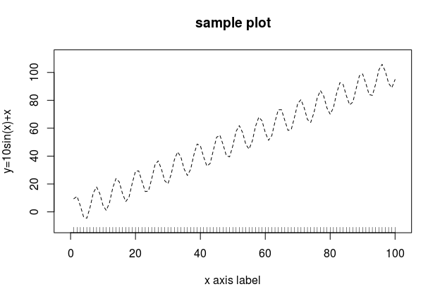
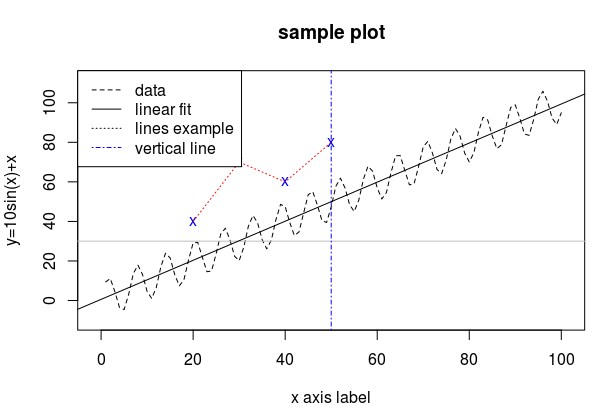

Title: R语言从入门到放弃 (3). 绘图
Date: 2016-07-28 
Slug:  Rnotes-3-plot
Tags: R

R关于绘图应该可以写很多, 不过这里只列举在compstat这门课里最经常用的几个函数. 关于R的绘图, 详细了解可以运行 ``demo(graphics)``或者 ``example("plot")``.

R里面的绘图命令分为两类: 一类是"high-level"的"创建新图片"命令, 运行以后会新画一个图; 另一类则是"low-level"的命令, 不会创建新图片, 而只会在当前图片中修改添加(例如添加线条, 添加点等). 下面分别简单介绍, 最后再介绍其他一些绘图配置的命令. 

configurations/parameters
=========================
介绍一下常用的参数意义, 以及画图的配置. 详细文档见``?par``. 这些参数可以放在绘图命令中. 

* ``par(mfrow=c(1,2))``: 这个命令是设定画图的布局, 把放置图片的区域分为一行两列, 第一个plot的图片在左边, 第二个在右边. 
* ``col``: 设定画图(线段/点)的颜色, 可以用数字(col=1, 2, ...)也可以用英文(col="red", "gray", "blue"等)
* ``lty``: 设定线段类型, 例如lty=1为实线, lty=2为虚线
* ``pch``: 设定点的类型(pch="point character")
* ``cex``: 似乎是设定文字大小的, 一般设置cex=0.6

high level命令: plot
==================
创建新图片的命令主要就是plot这个函数 (其他还有如``hist``, ``contour``, ``boxplot``, 不太常用, 看文档应该能会用). 

``plot``的内容或者为一系列x和y坐标, 或者为一个formula(见plot.formula). : 

* ``type``: 指定画线(``type="l"``)或者画点(``type="p"``, 默认值). 

当type="l"的时候, 可以设定``lty``参数, type="p"则可以设定``pch``参数. 

当``type="n"``的时候表示不画任何东西 — 然后可以用后面介绍的low level命令往里面添加东西. 

* ``main``: 设定图片的标题

* ``xlab``/``ylab``: x/y轴的文字

* ``xlim/ylim``: 设定x/y轴的范围, 例如: ``xlim=c(0,10)``. 

这个参数比较重要, 如果想要根据数据来动态调整的话, 可以使用extendrange函数, 它返回比数据range稍大一点的range: 

	> extendrange(1:10)
	[1]  0.55 10.45

一个plot的例子:　

    plot(x,　y,　type="l", lty=2, 
        xlab="x axis label", ylab="y=10sin(x)+x", 
        main="sample plot", 
        xlim=c(-1, 101), ylim=extendrange(y)　)

low level命令
===========

### points
``points(x, y) ``

添加(多个)点, 这些点的坐标在x和y中.   
此时可以用``pch``参数指定点的类型.

### lines
``lines(x, y)``

添加多条线段, 这些线段依次经过一系列的点, 而点的xy坐标放在x和y中.  
此时可以设定``lty``指定线段类型. 

### abline
这个函数作用是添加一条直线, 可以传入``lty``参数. 

abline有多种用法: 

* ``abline(a=a, b=b)``: 指定斜率和截距(y=ax+b)
* ``abline(h=y0)``/``abline(v=x0)``: 画水平/垂直的线
* ``abline(reg=lm_fit)``: reg为有coeff的对象(如一个线性fit), 画出fitted line

### rug
``rug(x)``的作用是在x轴添加小线段, 位置为参数``x``.

### lengend
添加图例, 直接看例子:

``legend("topleft", c("data", "fitted"), lty=1:2)``

这样在左上角(其他可选项见文档)添加图例, 文字"data"对应lty=1的数据, "fitted"对应lty=2的. 

### example

下面是一个low level绘图例子(在前一个图基础上添加各种东西): 

	newpts.x <- c(20, 30, 40, 50)
	newpts.y <- c(40, 70, 60, 80)
	points(newpts.x, newpts.y, pch='x', col="blue")
	lines(newpts.x, newpts.y, lty=3, col="red")
	
	abline(h=30, col="gray")
	abline(v=50, col="blue", lty=4)
	
	fit <- lm(y~x) # fit to linear model
	abline(fit, lty=1)
	
	legend("topleft", c("data", "linear fit", "lines example", "vertical line"), 
	                  lty=c(2, 1, 3, 4), col=c(rep("black",3), "blue"))

