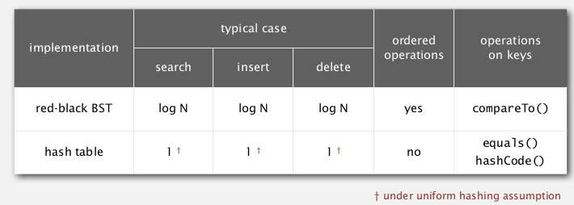
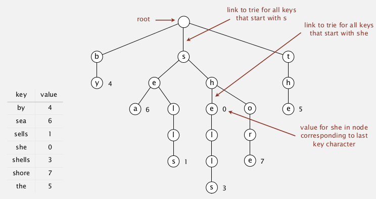
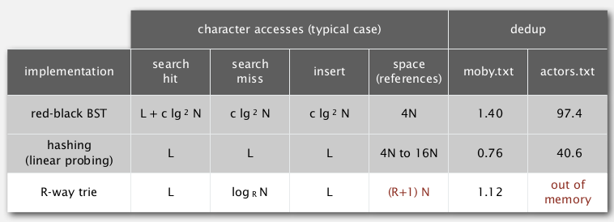
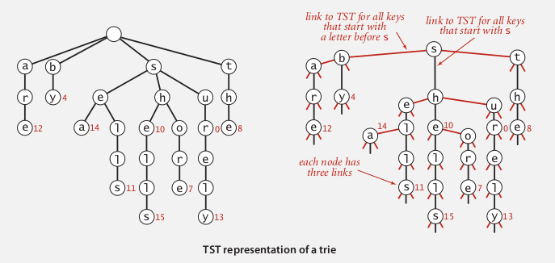
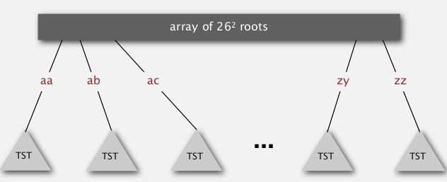
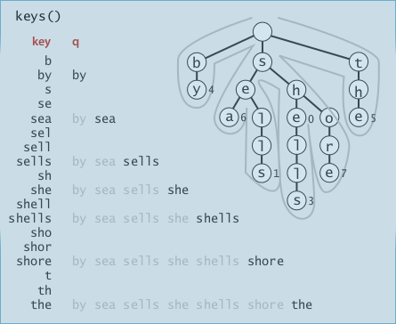
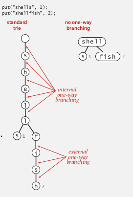
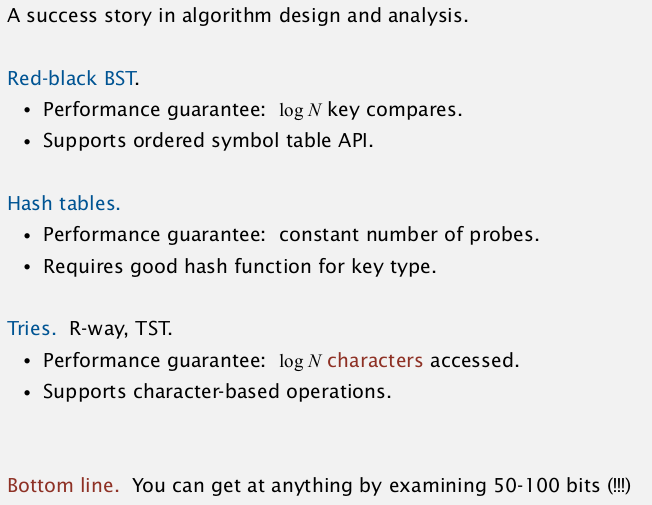

Title: [Algorithms II] Week 4-1 Tries  
Date: 2015-12-05      
Slug:  algoII_week4_1  
Tags: algorithm       
  
More efficient version of symbol-table where the keys are strings.   
  
1. R-way Tries  
==============  
Two implementations of symbol tables that we've seen:   
  
when keys are strings:  
(``L``=string length, ``N``=number of strings, ``R``=radix)  
  
  
for string keys ⇒ do better by avoiding examing the entire key.  
  
goal: faster than hashtable, more flexible than BST !  
  
String Symbol Table API  
-----------------------  
	public class StringST<V>{// implements ST<String, V>  
		public void put(String key, V val);  
		public V get(String key);  
		public void delete(String key);  
	}  
  
  
R-way tries  
-----------  
A trie is a tree where:   
  
* except the root, each node store *characters* (instead of string keys) — in fact the chars are stored in *links*  
* each node has R children  
* store *value* in node if the node corresponds to the* last char* in key.   
  
example: (*a trie<Integer>)*  
  
  
* **search in a trie **``get()``  
  
*hit* if when search ends the node has a non-null value  
*miss* if reach a null link or have null value when search ends.   
  
* **insertion in a trie** ``put()``  
  
follow the links as the chars indicate in the key  
→ if meet null links: create new node  
→ when reach last char in key: set the value of the node  
  
Java implementation  
-------------------  
trie node class:  
in each node use an array of size R to store links...  

	private static class Node{  
		private Object val;// because cannot create arries of generic type (array of Node)  
		private Node[] next = new Node[R];// chars are implicitly defined by link index  
	}  
  
另外关于为什么内部类Node声明为static, 参考这里:   
<http://www.geeksforgeeks.org/static-class-in-java/>  
  
implementation: use private recursive methods, 和BST的实现类似, 定义一个递归的private函数, 返回插入后的Node, 很有用.   
  
	public class TrieST<Value> {  
		pirvate final int R = 256; // ASCII chars  
		private Node root = new Node();  
		private static class Node{  
			private Object val;// because cannot create arries of generic type (array of Node)  
			private Node[] next = new Node[R];// chars are implicitly defined by link index  
		}  
		public void put(String key, Value val){  
			this.put(root, key, val, 0);// use private recursive helper method  
		}  
		private Node put(Node x, String key, Value val, int d){  
			// `d` is the index of char to put  
			// returns the inserted node  
			  
			if (x==null) x = new Node();  
			if (key.length()==d) x.val = val;  
			else{  
				char c = key.charAt(d);  
  
	 			x.next[c] = put(x.next[c], key, val, d+1);  
			}  
			return x;  
		}  
		public boolean contains(String key){return get(key)!=null;}  
		public Value get(String key){  
			Node nd = this.get(root, key, 0);  
			if(nd==null) return null;  
			return (Value) x.val; // cast back  
		}  
		private Node get(Node x, String key, int d){  
			// returns the node that contains val for key  
			if(x==null) return null;  
			if(d==key.length()) return x;  
			char c = key.charAt(d);  
  
			else return get(x.next[c], key, d+1);  
		}  
	}  
  
delete node in trie:  
  
* find the node and set the val to null  
* if a node has 0 links(leaf)  and val==null: delete it and recursivly go up.   
  
  
  
analysis  
--------  
**time:**  
search hit —  L nodes examined.   
serach miss —  sublinear in L  
**space:**   
each node has R links (possibly null) — *too much memory for large R* !  
  
**Application**  
interview question: data structure for spell checking.   
  
2. Ternary Search Tries  
=======================  
Solution to the memory issue of R-way tries —  much fewer null links. ternery=tuple of 3...  
TST:  
  
* store chars (and vals) *explicitly* in nodes  
* each node has **3** children:   
	* *smaller, larger: *TST that starts with char smaller/bigger than its char c.   
	* *equal: *the TST with keys that **starts with** this char c  
	* (所以除了用smaller/larger连接的节点在Rway trie里属于同一层  
  
  
  
类似于3-way radix sort(同一篇paper里提出的), 有有点RBTree的意思...   
  
**searching** in TST: quite similar to BST search, will go down ("equal" or "middle") when the current node matchs current char...  
  
Implementation  
--------------  
Node class:   

    private class Node{  
        private Value val;  
        private char c;// store char explicitly  
        private Node left, mid, right;  
    }  
  
TST class (again use recursive helper functions)  
有一种写BST代码的感觉, 另外由于这次char是显式存在node里, 代码反而更好理解了...  
  
	public class TST<Value>{  
		private class Node{...};  
		private Node root;  
		public void put(String key, Value val){  
			this.put(root, key, val, 0);  
		}  
		private Node put(Node x, String key, Value val, int d){  
			char c = key.charAt(d);// char to process  
			if(x==null) x = new Node(c);  
			if(c==x.c) {  
				if(d==key.length()-1) x.val = val;  
				else x.mid = put(x.mid, key, val, d+1);// d+1 means we go down one level  
			}  
			else if (c<x.c) x.left = put(x.left, key, val, d);// do not increment if the current char is not matchd  
			else x.right = put(x.right, key, val, d);  
			return x;  
		}  
		public Value get(String key){  
			Node nd = this.get(root, key, 0);  
			if(nd==null) return null;  
			return nd.val;  
		}  
		private Node get(Node x, String key, int d){  
			if(x==null) return null;  
			char c = key.charAt(d);  
			if(x.c==c) {  
				if(d==key.length()-1) return x;  
				else return get(x.mid, key, d+1);  
			}  
			else if(c<x.c) return get(x.left, key, d);  
			else return get(x.right, d);  
		}  
	}  
  
  
Hybrid of TST and Rway trie  
---------------------------  
  
* at root: do *R^2 branching*  
* other nodes are TSTs   
  
  
  
  
analysis  
--------  
space cost: linear in N.  
time: if keys arrive in rand order... (can use rotation to get worst-case guarantee..)  
  
  
Hashing vs. TST  
---------------  
Hashing:   
  
* need to check entire key no matter hit or miss  
* performance relies on hash functions  
* donot support ordered operations  
  
  
TST:  
  
* examines just enough chars  
* support ordered operations  
  
  
3. Character-Based Operations  
=============================  
some very useful char-based operations:   
  
* **prefix match**  
* **wildcard match**: use a dot to represent any char  
* **longest prefix**: find the key that is the longest prefix of a string  
  
  
API  
---  
    public class TrieST<Value>{  
        // functions decalred before..  
        Iterable<String> keys;  
        Iterable<String> keysWithPrefix(String s);  
        Iterable<String> keysThatMatch(String s);  
        Iterable<String> longestPrefixOf(String s);
    }  
  
  
keys(): ordered iteration  
-------------------------  
``keys()``: just an inorder-traversal of the *Rway trie* →dfs, + maintain the chars in the path (root to current node).   
  

	public Iterable<String> keys(){  
		Queue<String> q = new Queue<String>();  
		collect(root, "", q);// helper fcn  
		return q;  
	}  
	private void collect(Node x, String pathstr, Queue q){  
		if(x==null) return;  
		if(x.val!=null)// if this is a key  
			q.enqueue(pathstr);// pathstr is the string of chars from root to x  
		for(char c=0;c<R;c++) // dfs  
			collect(x.next[c], pathstr+c, q);  
	}  
  
  
prefix match  
------------  
very useful: ex. autocomplete, search bar, ...  
implementation⇒ just find the end of that prefix, then call ``keys()`` on the *subtrie*.  
之前写的俩helper function这里发挥作用了:   

    public Iterable<String> keysWithPrefix(String prefix){  
        Node subtrieRoot = get(root, prefix, 0);  
        Queue<String> q = new Queue<String>();  
        collect(subtrieRoot, prefix, q);  
        return q;  
    }  
  
  
longest prefix  
--------------  
⇒ just do a search and keep track of the longest key that we encounterd.   

	public String longestPrefixOf(String s){  
		int len = search(root, s, 0, 0);  
		return s.substring(0, len);  
	}  
	private int search(Node x, String s, int d, int len){  
		if(x==null) return len;  
		if(x.val!=null) len=d;// this is the current longest prefix  
		if(d==s.length()) return length;   
		char c = s.charAt(d);  
		return search(x.next[c], s, d+1, len);  
	}   
  
  
### application: T9 texting  
classique... G面试以及X的TP里都有涉及过...   
  
* first: generate all string combinations  
* second: call get() on the trie of dictionaries.  
  
  
Other Variants  
--------------  
  
### Patricia trie  
improvement: remove the one-eay branching (put >1 chars in a node).  
  
  
### suffix tree  
  
* patricia tree of the suffix  
* linear time construction  
* ongest repeated substring, longest common substring, longest palindromic substring, substring search, tandem repeats... 好有用!!...   
  
  
Summery  
-------  
  
