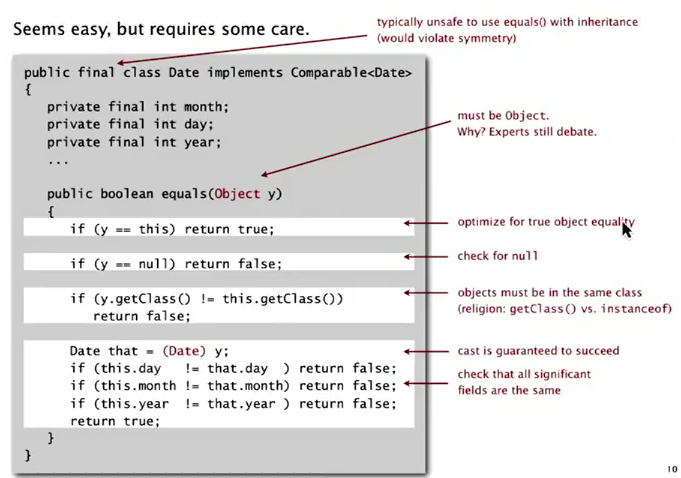
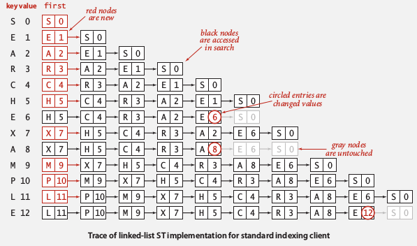
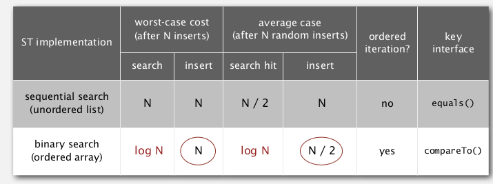
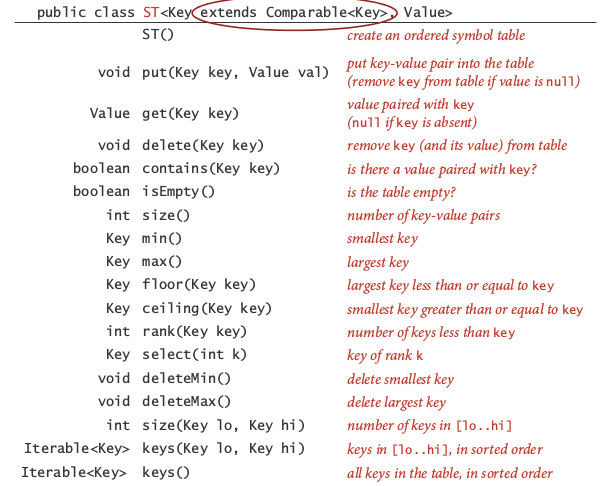
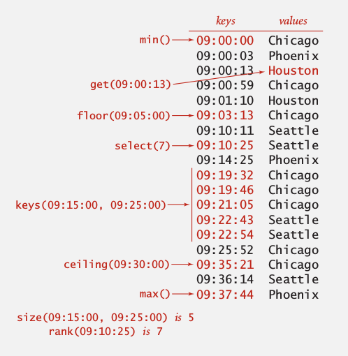

Title: [Algorithms I] Week 4-2a Elementry Symbol Tables   
Date: 2015-08-25   
Slug:  algoI_week4_2a      
Tags: algorithm   
   
1. Symbol Table API   
===================   
   
key-value pair abstraction    
   
* **insert** a value with a key   
* given a key, **search** for its value   
   
   
Association array abstraction   
-----------------------------   
Associate a value to a key — generalized array: *a[key]=val*.    
   
	public class ST<Key, Value>{   
		void put(Key k, Value v);//remove key if value=null   
		Value get(Key k);//return null if key is absent   
		void delete(Key k);   
		boolean contains(Key k);   
		boolean isEmpty();   
		int size();   
		Iterable<Key> keys();//better to return an ordered sequence of keys   
	}   
   
   
conventions:    
   
* values are not null   
* get() returns null if key not present   
* put() can *overwrite* older value   
   
   
→ some one-line implementations:    
   
* contains: ``return get(k)!=null;``   
* delete: ``put(k, null);``   
   
   
Assume keys to be comparable: ``class ST<Key implements Comparable<Key>, Value> ``— can thus use ``compareTo()`` method.    
Else →  we can only use the ``equals()`` method...    
Be careful when implementing the equals method: 坑不少...    
   
   
   
2. Elementary implementations   
=============================   
naive implementations   
   
using unordered linked list   
---------------------------   
*ListNode{key, value, next}*   
   
* search: scan through all keys ~N   
* insert: scan through, if not found, add to front ~N   
   
   
   
using ordered array   
-------------------   
using 2 arrays: *keys[] (sorted), vals[]*   
⇒ can improve performance by binary search   
   
**search operation**   
write a function rank() that returns the number of keys < k searched.    
找不到的时候: *比k小的元素个数=lo (lo>hi, 可以想想当hi=lo以后是怎么移动的)*   
   
	private int rank(Key k){   
		int lo=0, hi=keys.length-1;   
		while(hi>=lo){   
			int mid = lo + (hi-lo)/2;   
			int cmp = keys[mid].compareTo(keys[k]);   
			if(cmp==0) return mid;   
			else if(cmp>0) hi = mid-1;   
			else lo = mid+1;   
		}   
		return lo;   
	}   
   
   
Using rank() to implement the get() method:    
   
	public Value get(Key k){   
		int rk = rank(k);   
		if(rk<N && keys[rk].compareTo(k)==0) return vals[rk];   
		return null;   
	}   
   
   
**insert operation**   
Like insertion sort, time complexity is ~N for each insert.    
   
summery:    
   
   
3. Ordered Opeartions   
=====================   
When keys are comparable ⇒ provide *more functionalities* in the API.    
for example:    
   
* ``min()/max()``: min/max key   
* ``deleteMin()/deleteMax()``   
* ``floor(Key k)/ceiling(Key k)``: largest key <=k / smallest key >=k   
* ``rank(Key k)``: nb of keys < key   
* ``select(int i)``: key with rank=i   
* ``Iterator<Key> keys(lo, hi)``: iterates through [lo, hi]   
   
   
   
   
   
   
