Title: [Algorithms I] Week 6 Hash Tables   
Date: 2015-09-01   
Slug:  algoI_week6       
Tags: algorithm     
   
   
*Can we do better than BST if we do not need ordered operations ?*   
   
(No compare methods, use equals method)   
   
Idea: save items in an array.    
**Hash function**: method for calclulating the array index of  a key.    
   
Issues:    
   
* computing hash function   
* equality tests   
* collision resolution   
   
   
*Classic space-time tradeoff.*   
   
1. Hash Functions   
=================   
Goal: scramble the keys uniformly to produce a table index.    
   
* effcient to compute   
* all indices are equally likely for any key   
   
   
challenge: need different approach for different key types.    
   
Java's hashing   
--------------   
All java object has a methode ``int hashCode()``   
requirement:    
   
* if x.equals(y) ⇒ x.hashCode()==y.hashCode()   
* (hopefully) if x.equals(y)==false ⇒ x.hashCode!=y.hashCode()   
   
   
   
* Default implementation: *memory address* for x.    
* Custom implementations for standard types: Integer, Double, String, File, URL, Date...   
   
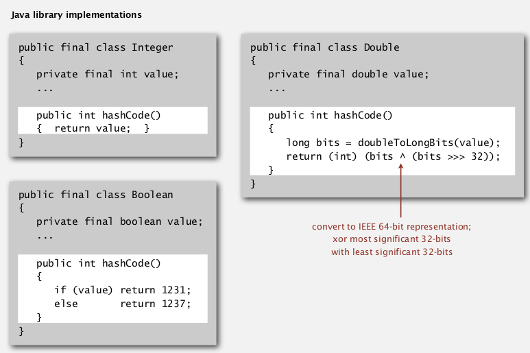   
Strings: Horner's method — compute a polynome.    
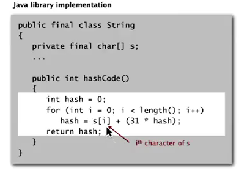   
recipe for user-defined types:    
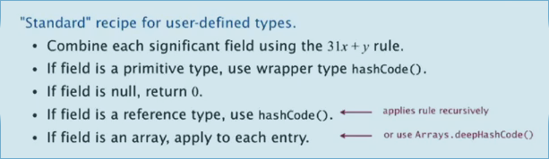   
   
Modeular hasing   
---------------   
(hash code VS hash function)   
   
* *Hash code*: 32-bit integer between -2^31 and 2^31-1 *(can be negative!!)*   
* *Hash function*: integer between 0 and M-1 (used directly as array index, should >=0)   
   
   
**BUG code:**    
   
	private int hash(Key k){   
		return k.hashCode()%M;   
	}   
   
→ bug: *number returned can be negative !*   
   
**1-in-billion bug code:**    
``return Math.abs(k.hashCode()) % M;``   
   
→ bug: Math.abs() returns negative numbers for -2^31   
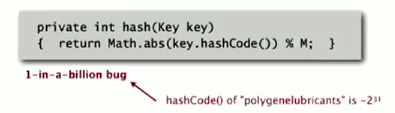   
   
**correct code:**   
just take the first 31 bits: x&0x7fffffff   
``return k.hashCode()&0x7fffffff % M;``   
   
另一个hash的思路是用random(用hashcode作为随机种子)   
   
uniform hasing assumption   
-------------------------   
each key is equally likely to hash to an integer between 0 and M-1   
   
一些数学结论:    
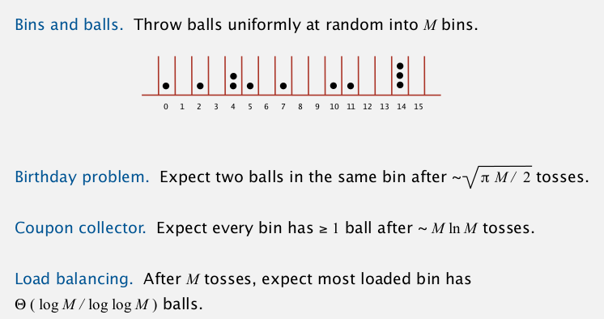   
   
   
2. Separate Chaining   
====================   
*one strategy for collision resolution.*    
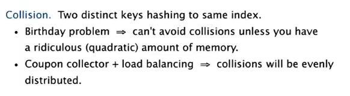   
   
**idea**: Using a table of size M < N,  build a list for each of the table positions.    
   
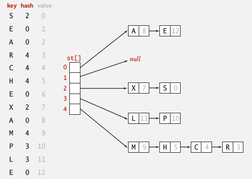   
   
implementation   
--------------   
   
	public class SeparateChainingHashST<Key, Value>{   
		private int M = 97;   
		private Node[] st = new Node[97];   
		private static class Node{   
			Object key, val; // no generic array creation!    
			Node next;   
			public Node(Key k, Value v, Node nxt){...}   
		}   
		int hash(Key k){   
			return (k.hashCode()&0x7fffffff) % M;   
		}   
		public Value get(Key k){   
			int h = hash(k);   
			for(Node x=st[h]; x!=null; x=x.next)   
				if(k.equals(x.val)) return (Value)x.val; //cast   
			return null;   
		}   
		public void put(Key k, Value v){   
			int h = hash(k);   
			for(Node x=st[h]; x!=null; x=x.next)   
				if(k.equals(x.val))    
					{x.val = v; return;}   
			st[h] = new Node(k,v,st[h]);   
		}   
	}   
   
注意内部类Node里用的是Object — 因为不能声明generic array.    
   
analysis   
--------   
**proposition**   
Under the assumption of uniform hashing, the number of keys in a list is within a constant factor to N/M.    
*proof.*   
binominal distribution.   
   
M times faster than sequential search   
→ typical choice: M ~ N/5   
   
   
3. Linear Probing   
=================   
Another approch for collision resolution.    
   
idea: **open addressing**   
Use an array of size **M>N**, when a key collides, *find next open slot*.    
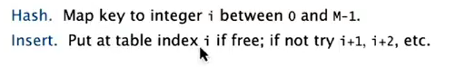   
   
* insert: when occupied, move pointer until got open slot   
* search: when not found, move pointer until find or reach open slot   
* *delete*: set key to null, then for all items behind this key: set to null, then insert this key......   
   
   
array M *must* be larger than N ⇒ array resizing is necessary.    
   
implementation   
--------------   
	public class LinearProbingHashST<Key, Value>{   
		private int M, N;   
		private Object[] keys;//cannot use generic array   
		private Object[] vals;   
		public void put(Key k, Value v){   
			int i = hash(k);   
			for(;keys[i]!=null;i=(i+1)%M)   
				if(keys[i].equals(k))    
					{vals[i]=v; return;}   
			keys[i]=k;   
			vals[i]=v;   
		}   
		public Value get(Key k){   
			int h=hash(k);   
			for(;keys[h]!=null;h=(h+1)%M)   
				if(k.equals(keys[h])) return (Value)vals[h];//ugly cast   
			return null;   
		}   
	}   
   
   
cluster   
-------   
def. **cluster**   
A contiguous block of items.    
   
New keys are more likely to hash into a cluster.    
   
Knuth parking pb:    
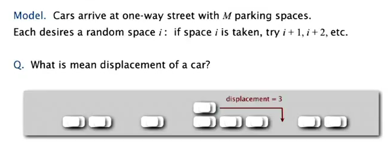   
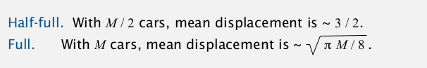   
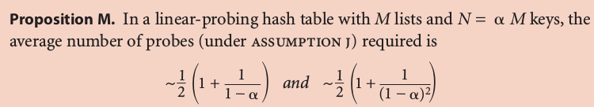   
(当年Knuth就是在证明了这个以后决定写那套书)   
   
Typical choice: **N/M ~ 1/2** (3/2 for search hit and 5/2 for search miss)   
   
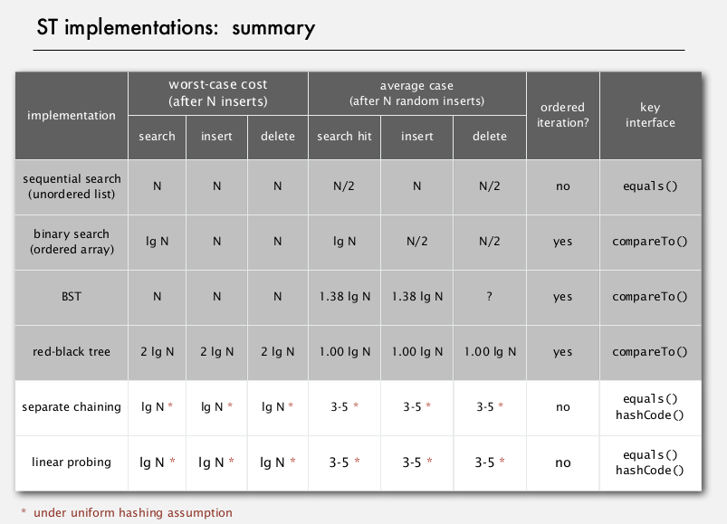   
   
4. Hash Table Context   
=====================   
widely used in applicataions.    
   
cost for computing hash VS cost for searching:    
hashCode() for strings in java 1.1: exemain only 8-9 evenly spaced characters to save time.   
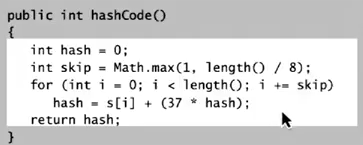   
   
uniform hashing assumption: performance not guaranteed...   
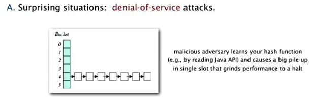   
   
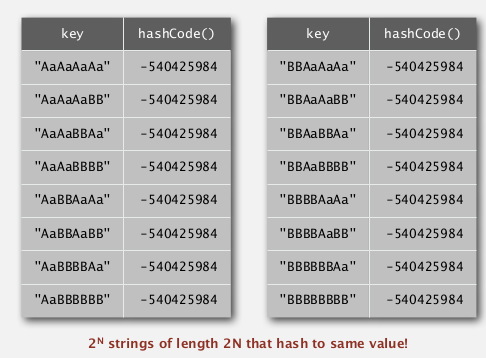   
   
**one-way hash functions**   
Hard to find a key that hash to a desired value, or 2 keys having the same hash value.    
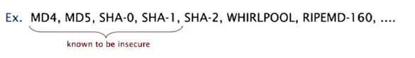   
used for fingurprints or store passwords, but too expensive for ST implementations.    
   
Seperate chaining VS linear probing   
-----------------------------------   
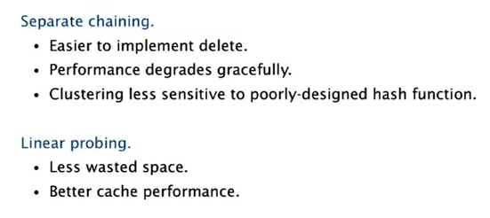   
   
variations   
----------   
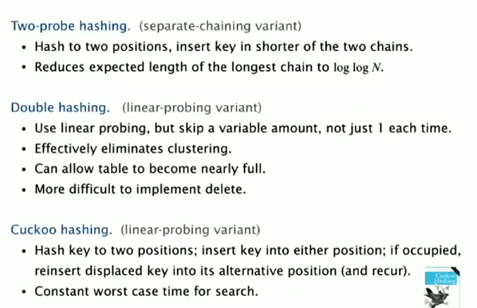   
   
ST choice: hash tables VS balanced search trees   
-----------------------------------------------   
   
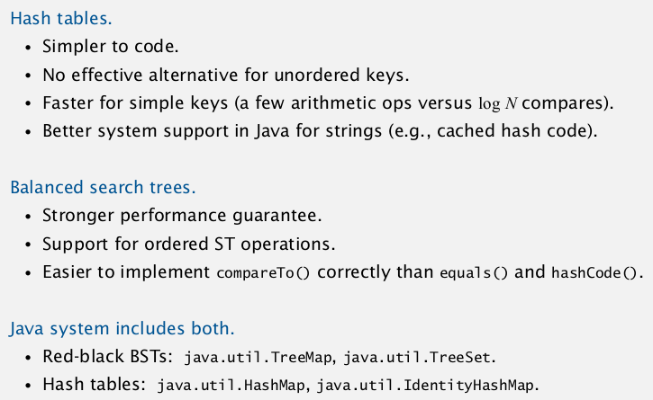   
   
