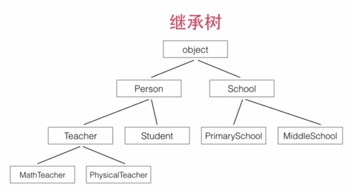
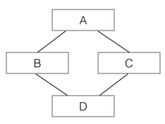

Title: [python进阶课程] 面向对象编程  
Date: 2016-02-19 14:00   
Slug:  imooc_py_oop  
Tags: python  
  
<http://www.imooc.com/learn/317>
  

模块和包
=======

**包**: 文件夹 (可以有多级), 且包含``__init__.py``文件(每层都要有) 
**模块**: py文件

代码分开放在多个py文件(**模块**名=文件名). 同名变量互不影响. 

模块名冲突: 把同名模块放在不同**包**中. 

### 导入模块

	from math import log
	from logging import log as logger
 
引用时: 使用完整的路径(包+模块名). ex. ``p1.util.f()``

### 动态导入模块

	try:
	    from cStringIO import StringIO
	except ImportError:
	    from StringIO import StringIO

上述代码先尝试从cStringIO导入，如果失败了（比如cStringIO没有被安装），再尝试从StringIO导入。这样，如果cStringIO模块存在，则我们将获得更快的运行速度，如果cStringIO不存在，则顶多代码运行速度会变慢，但不会影响代码的正常执行。

### 使用__future__
Python的新版本会引入新的功能，但是，实际上这些功能在上一个老版本中就已经存在了。要“试用”某一新的特性，就可以通过导入__future__模块的某些功能来实现。

ex. 在Python 2.7中引入3.x的除法规则，导入__future__的division：

	>>> from __future__ import division
	>>> print 10 / 3
	3.3333333333333335

安装第三方模块
-------
模块管理工具: 

* easy_install
* pip (推荐) 

查找第三方模块: <https://pypi.python.org/pypi>

  
面向对象编程基础  
========  
  
OOP: 数据的封装  
  
### 初始化实例属性  
当创建实例时，``__init__()``方法被自动调用, 第一个参数必须是 self（也可以用别的名字，但建议使用习惯用法, 第一个参数self被Python解释器作为实例的引用），后续参数则可以自由指定，和定义函数没有任何区别。  
相应地，创建实例时，就必须要提供除 self 以外的参数.   
  
用``setattr``让``__init__``接受任意的kw参数:   

>``setattr(object, name, value)``  
This is the counterpart of getattr(). The arguments are an object, a string and an arbitrary value. The string may name an existing attribute or a new attribute. The function assigns the value to the attribute, provided the object allows it. For example, setattr(x, 'foobar', 123) is equivalent to x.foobar = 123.  
  
	class Person(object):  
	    def __init__(self, name, gender, birth, **kw):  
	        self.name = name  
	        self.gender = gender  
	        self.birth = birth  
	        for k, v in kw.iteritems():  
	            setattr(self, k, v)  
  
  
### 访问限制  
Python对属性权限的控制是通过**属性名**来实现的.  
  
* 如果一个属性由双下划线开头(``__``)，该属性就无法被外部访问。  
* 但是，如果一个属性以"``__xxx__``"的形式定义，那它又可以被外部访问了，以"``__xxx__``"定义的属性在Python的类中被称为特殊属性有很多预定义的特殊属性可以使用，通常我们不要把普通属性用"__xxx__"定义。  
* 以单下划线开头的属性"``_xxx``"虽然也可以被外部访问，但是，按照习惯，他们不应该被外部访问。  
  
  
### 创建类属性  
绑定在一个实例上的属性不会影响其他实例，但是，类本身也是一个对象，如果在类上绑定一个属性，则所有实例都可以访问类的属性，并且，所有实例访问的类属性都是同一个！也就是说，实例属性每个实例各自拥有，互相独立，而*类属性有且只有一份*。  
定义类属性可以直接在 class 中定义：  
  
	class Person(object):  
	    address = 'Earth'  
	    def __init__(self, name):  
	        self.name = name  
  
因为类属性是直接绑定在类上的，所以，访问类属性不需要创建实例，就可以直接访问.  对一个实例调用类的属性也是可以访问的，所有实例都可以访问到它所属的类的属性.  
  
	print Person.address  
	print p1.address  
  
**类属性和实例属性名字冲突怎么办**  
当实例属性和类属性重名时，实例属性优先级高，它将屏蔽掉对类属性的访问。  
可见，千万*不要在实例上修改类属性*，它实际上并没有修改类属性，而是给实例绑定了一个实例属性。  
  
### 定义实例方法  
实例的方法就是在类中定义的函数，它的**第一个参数永远是** ``self``，指向调用该方法的实例本身，其他参数和一个普通函数是完全一样的. 在实例方法内部，可以访问所有实例属性，这样，如果外部需要访问私有属性，可以通过方法调用获得，这种数据封装的形式除了能保护内部数据一致性外，还可以简化外部调用的难度。  
  
我们在 class 中定义的实例方法其实也是属性，它实际上是一个函数对象. 因为方法也是一个属性，所以，它也可以动态地添加到实例上，只是需要用 types.MethodType() 把一个函数变为一个方法...  
  
### 定义类方法  
和属性类似，方法也分实例方法和类方法。  
在class中定义的全部是实例方法，实例方法第一个参数 self 是实例本身。  
要在class中定义类方法，需要这么写：  
  
	class Person(object):  
	    count = 0  
	    @classmethod  
	    def how_many(cls):  
	        return cls.count  
	    def __init__(self, name):  
	        self.name = name  
	        Person.count = Person.count + 1  
	print Person.how_many()  
	p1 = Person('Bob')  
	print Person.how_many()  
  
通过标记一个 ``@classmethod``，该方法将绑定到 Person 类上，而非类的实例。类方法的第一个参数将传入类本身，通常将参数名命名为 ``cls``，上面的 cls.count 实际上相当于 Person.count。  
  
类的继承  
====  
代码复用  
  
python的继承:  
  
* 总是从某个类继承(最上层是``object``)  
* 不要忘记``super.__init__``调用  
  
  
  
super(SubCls, self)将返回当前类继承的父类, 注意self参数已在super()中传入，在__init__()中将隐式传递，不需要写出（也不能写）。  
        def __init__(self, args):  
            super(SubCls, self).__init__(args)  
            pass  
  

  
### 判断类型  
函数``isinstance()``可以判断一个变量的类型，既可以用在Python内置的数据类型如str、list、dict，也可以用在我们自定义的类，它们本质上都是数据类型。  
  
	>>> isinstance(p, Person)  
	True    # p是Person类型  
	>>> isinstance(p, Student)  
	False   # p不是Student类型  
	>>> isinstance(p, Teacher)  
	False   # p不是Teacher类型  
	>>> isinstance(s, Person)  
	True    # s是Person类型  
  
  
在一条继承链上，一个实例可以看成它本身的类型，也可以看成它父类的类型。  
  
### 多态  
调用 s.whoAmI()总是先查找它自身的定义，如果没有定义，则顺着继承链向上查找，直到在某个父类中找到为止。  
  
由于Python是动态语言，所以，传递给函数 who_am_i(x)的参数 x 不一定是 Person 或 Person 的子类型。任何数据类型的实例都可以，只要它有一个whoAmI()的方法即可：  
  
	class Book(object):  
	    def whoAmI(self):  
	        return 'I am a book'  
  
这是动态语言和静态语言（例如Java）最大的差别之一。动态语言调用实例方法，不检查类型，**只要方法存在，参数正确，就可以调用**。  
  
### 多重继承  
除了从一个父类继承外，Python允许*从多个父类继承*，称为多重继承。  
  
	class A(object):  
	    def __init__(self, a):  
	        print 'init A...'  
	        self.a = a  
	  
	class B(A):  
	    def __init__(self, a):  
	        super(B, self).__init__(a)  
	        print 'init B...'  
	  
	class C(A):  
	    def __init__(self, a):  
	        super(C, self).__init__(a)  
	        print 'init C...'  
	  
	class D(B, C):  
	    def __init__(self, a):  
	        super(D, self).__init__(a)  
	        print 'init D...'  
  
  
  
D 同时继承自 B 和 C，也就是 D 拥有了 A、B、C 的全部功能。多重继承通过 super()调用__init__()方法时，A 虽然被继承了两次，但``__init__()``只调用一次：  
  
	>>> d = D('d')  
	init A...  
	init C...  
	init B...  
	init D...  
  
  
### 获取对象信息  
首先可以用 ``type()`` 函数获取变量的类型，它返回一个 Type 对象：  
  
	>>> type(123)  
	<type 'int'>  
	>>> s = Student('Bob', 'Male', 88)  
	>>> type(s)  
	<class '__main__.Student'>  
  
其次，可以用 ``dir()`` 函数获取变量的所有属性：  
  
	>>> dir(123)   # 整数也有很多属性...  
	['__abs__', '__add__', '__and__', '__class__', '__cmp__', ...]  
	  
	>>> dir(s)  
	['__class__', '__delattr__', '__dict__', '__doc__', '__format__', '__getattribute__', '__hash__', '__init__', '__module__', '__new__', '__reduce__', '__reduce_ex__', '__repr__', '__setattr__', '__sizeof__', '__str__', '__subclasshook__', '__weakref__', 'gender', 'name', 'score', 'whoAmI']  
  
``dir()``返回的属性是字符串列表，如果已知一个属性名称，要获取或者设置对象的属性，就需要用 ``getattr()`` 和 ``setattr() ``函数了：  
  
	>>> getattr(s, 'name')  # 获取name属性  
	'Bob'  
	>>> setattr(s, 'name', 'Adam')  # 设置新的name属性  
	>>> s.name  
	'Adam'  
	>>> getattr(s, 'age')  # 获取age属性，但是属性不存在，报错：  
	Traceback (most recent call last):  
	  File "<stdin>", line 1, in <module>  
	AttributeError: 'Student' object has no attribute 'age'  
	>>> getattr(s, 'age', 20)  # 获取age属性，如果属性不存在，就返回默认值20：  
	20  
  
	class Person(object):  
	    def __init__(self, name, gender, **kw):  
	        for k,v in kw.iteritems():  
	            setattr(self, k, v)  
	  
	p = Person('Bob', 'Male', age=18, course='Python')  
	print p.age  
	print p.course  
  
  
定制类  
===  
  
### 特殊方法  
又叫 "魔术方法"  
  
* 定义在class中  
* 不需要直接调用: py的函数或操作符会自动调用  
  
  
ex. 任何数据类型的实例都有``__str__()``特殊方法.   
  
pothon的特殊方法:   
  
* ``__str__``: 用于print  
* ``__len__``: 用于len  
* ``__cmp__``: 用于比较``cmp``/排序``sorted``  
  
  
### __str__ 和 __repr__  
实现特殊方法``__str__()``可以在print的时候打印合适的字符串, 如果直接在命令行敲变量名则不会:   
  
	>>> p = Person('Bob', 'male')  
	>>> print p  
	(Person: Bob, male)  
	>>> p  
	<main.Person object at 0x10c941890>  
  
因为 Python 定义了``__str__()``和``__repr__()``两种方法，``__str__()``用于显示给用户，而``__repr__()``用于显示给开发人员。  
偷懒定义``__repr__``: ``__repr__ = __str__``  
  
### __cmp__  

``__cmp__``用实例自身self和传入的实例 s 进行比较，如果 self 应该排在前面，就返回 -1，如果 s 应该排在前面，就返回1，如果两者相当，返回 0。  
  
	class Student(object):  
	    def __init__(self, name, score):  
	        self.name = name  
	        self.score = score  
	    def __str__(self):  
	        return '(%s: %s)' % (self.name.lower(), self.score)  
	    __repr__ = __str__  
	    def __cmp__(self, s):  
	        if self.score!=s.score:  
	            return - (self.score - s.score)  
	        else: return cmp(self.name, s.name)  
  
  
### __len__  
如果一个类表现得像一个list，要获取有多少个元素，就得用 len() 函数。  
要让 len() 函数工作正常，类必须提供一个特殊方法``__len__()``，它返回元素的个数。  
  
### 数学运算  
如果要让Rational类(有理数)进行``+``运算，需要正确实现``__add__``：  
  
	class Rational(object):  
	    def __init__(self, p, q):  
	        self.p = p  
	        self.q = q  
  
p、q 都是整数，表示有理数 p/q。  
  
	class Rational(object):  
	    def __init__(self, p, q):  
	        self.p = p  
	        self.q = q  
	    def __add__(self, r):  
	        return Rational(self.p * r.q + self.q * r.p, self.q * r.q)  
	    def __sub__(self, r):  
	        return Rational(self.p * r.q - self.q * r.p, self.q * r.q)  
	    def __mul__(self, r):  
	        return Rational(self.p * r.p, self.q * r.q)  
	    def __div__(self, r):  
	        return Rational(self.p * r.q, self.q * r.p)  
	    def __str__(self):  
	        d = 1  
	        for i in xrange(2,min(self.p, self.q)+1):  
	            if self.p%i==0 and self.q%i==0:  
	                d = i  
	        return '%s/%s' % (self.p/d, self.q/d)  
	    __repr__ = __str__  
  
  
### 类型转换  
要让``int()``函数对于Rational类正常工作，只需要实现特殊方法``__int__()``:  
同理，要让``float()``函数正常工作，只需要实现特殊方法``__float__()``。  
  
### @property  
  
	class Student(object):  
	    def __init__(self, name, score):  
	        self.name = name  
	        self.__score = score  
	    def get_score(self):  
	        return self.__score  
	    def set_score(self, score):  
	        if score < 0 or score > 100:  
	            raise ValueError('invalid score')  
	        self.__score = score  
  
  
使用 ``get/set`` 方法来封装对一个属性封装. 但是写 s.get_score() 和 s.set_score() 没有直接写 s.score 来得直接。  
  
可以用装饰器函数把 get/set 方法“装饰”成属性调用：  
  
	class Student(object):  
	    def __init__(self, name, score):  
	        self.name = name  
	        self.__score = score  
	    @property  
	    def score(self):  
	        return self.__score  
	    @score.setter  
	    def score(self, score):  
	        if score < 0 or score > 100:  
	            raise ValueError('invalid score')  
	        self.__score = score  
  
第一个score(self)是get方法，用``@property``装饰，第二个score(self, score)是set方法，用``@score.setter``装饰，``@score.setter``是前一个``@property``装饰后的副产品。对 score 赋值实际调用的是 set方法。  
  
### __slots__  
由于Python是动态语言，任何实例在运行期都可以动态地添加属性。  
  
如果要限制添加的属性，例如，Student类只允许添加 name、gender和score 这3个属性，就可以利用Python的一个特殊的``__slots__``来实现。  
顾名思义，``__slots__``是指一个类允许的属性列表 (所以是类属性)：  
  
	class Student(object):  
	    __slots__ = ('name', 'gender', 'score')  
	    def __init__(self, name, gender, score):  
	        self.name = name  
	        self.gender = gender  
	        self.score = score  
	  
	>>> s = Student('Bob', 'male', 59)  
	>>> s.name = 'Tim' # OK  
	>>> s.score = 99 # OK  
	>>> s.grade = 'A'  
	Traceback (most recent call last):  
	  ...  
	AttributeError: 'Student' object has no attribute 'grade'  
  
  
``__slots__``的目的是限制当前类所能拥有的属性，如果不需要添加任意动态的属性，使用``__slots__``也能节省内存。  
  
  
### __call__  
在Python中，函数其实是一个对象：  
  
	>>> f = abs  
	>>> f.__name__  
	'abs'  
	>>> f(-123)  
	123  
  
由于 f 可以被调用，所以，f 被称为可调用对象。  
所有的函数都是可调用对象。  
一个类实例也可以变成一个可调用对象，只需要实现一个特殊方法``__call__()``。  
  
把 Person 类变成一个可调用对象：  
	  
	class Person(object):  
	    def __init__(self, name, gender):  
	        self.name = name  
	        self.gender = gender  
	    def __call__(self, friend):  
	        print 'My name is %s...' % self.name  
	        print 'My friend is %s...' % friend  
  
现在可以对 Person 实例直接调用：  
  
	>>> p = Person('Bob', 'male')  
	>>> p('Tim')  
	My name is Bob...  
	My friend is Tim...  
  
单看 p('Tim') 你无法确定 p 是一个函数还是一个类实例，所以，*在Python中，函数也是对象，对象和函数的区别并不显著*。  
  
