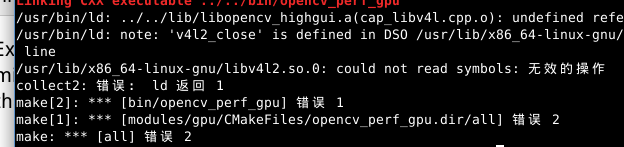
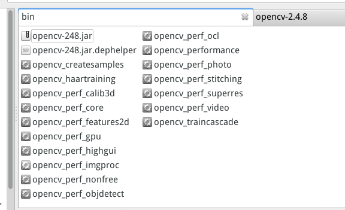

Title: linux下安装并使用java开发opencv的配置
Date: 2014-02-10
Tags: eclipse, java, opencv
Slug: linux下安装并使用java开发opencv的配置

今天花了四个小时, 终于在linux下把eclipse下java开发opencv给搞定了... 至于为什么花这么久的时间... 且听我慢慢讲... 

linux编译安装opencv
------------------
首先, linux下安装opencv其实不麻烦的, 参考文档即可完成:
<http://docs.opencv.org/trunk/doc/tutorials/introduction/linux_install/linux_install.html>

大致有以下几个步骤:

1) 安装gcc以及cmake等等乱七八糟的软件(不过ubuntu下默认差不多都有了吧...)

    sudo apt-get install build-essential python-dev cmake
    

2) 下载opencv-2.4.8.zip并解压缩

3) 新建一个build文件夹

	cd ~/opencv
	mkdir build
	cd build

4) 在终端里输入: 

	cmake -D CMAKE_BUILD_TYPE=RELEASE -D CMAKE_INSTALL_PREFIX=/usr/local ..
	make
	sudo make install

make命令会花费几十分钟时间...
然后**理论上**就结束了... 如果不用java开发的话 就OK了 比如 可以运行sample文件夹下的python代码...

**但是**, 如果要使用java开发的话 需要接着这样做.....

安装opencv-java
------------------

这一步非常DT, 因为官网上还有一个文档, 专门讲怎么用java开发的...
<http://docs.opencv.org/doc/tutorials/introduction/desktop_java/java_dev_intro.html>

1) 首先, 需要安装ant: 

    sudo apt-get install ant

2) 其次 需要运行cmake, 关键是cmake的参数, 官网给的是这样的: 

	export JAVA_HOME=/usr/lib/jvm/java-6-oracle#这句不加应该也可以的
	cmake -DBUILD_SHARED_LIBS=OFF ..

注意看输出的, 如果"To be built"里面有java这一项的话, 就**应该**是OK的.... 接下来只要``make -j8`` 就可以了...

最坑爹的地方来了, 以这样的参数运行cmake以后, 运行``make -j8``总是不成功, 说有错误.....

查了半天, 发现这是一个BUG:
<http://code.opencv.org/issues/2859>

那么试一试加上参数: ``-DBUILD_TESTS=OFF`` 吧...

**所以cmake的参数要这样写才可以**: 

``cmake -D CMAKE_BUILD_TYPE=RELEASE -D CMAKE_INSTALL_PREFIX=/usr/local -DBUILD_TESTS=OFF ..``

3) 用上面那样的参数运行cmake以后, 再: 

	make -j8
	sudo make install

这样就可以成功make了...

如何判断是否安装成功? 
------------------

以上操作结束后, 看看build文件夹, bin目录下是不是有一个``opencv-248.jar``文件:

如果有的话 就说明成功安装了opencv的java组件... 

**!!注意!!**
**不能用windows下opencv安装目录下的那个opencv-248.jar**!! 
刚才生成那个jar和windows下的jar不一样的!! (我查了MD5码... 其实看文件大小也能看出来!!)

Eclipse下的配置 
------------------

这里有一篇非常好的帖子, 写的非常到位, 我就不重复了, 链接:

<http://exintopro.net/blog/2013/10/02/setting-up-eclipse-for-using-opencv-java-in-ubuntu/>

这个帖子虽然很好, 但是没有介绍编译的那一部分, 由于安装java组件时的编译过程和官网给的不一样, 所以才导致我废了半天的时间啊!......

