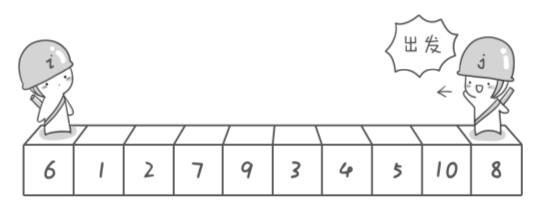
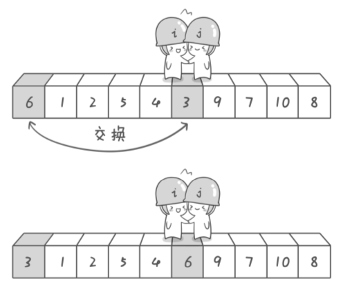
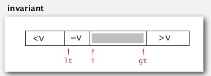
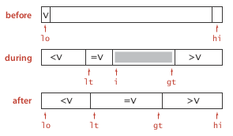

Title: quick sort and more: 快速排序算法总结  
Date: 2015-12-07  
Slug:  quick-sort-and-more  
Tags: algorithm    
  
  
今天总结一下非常有用的快速排序(qsort)算法, 以及由此衍生的一些其他相关算法(Knuth shuffle, quick select, 3-way partition).   
  
快速排序的算法可以用三句话描述:  
**[Algo]**   
>* 选择基准项(pivot element, 一般取第一个元素为pivot)  
* 把数组里所有小于pivot的移动到pivot左边, 大于pivot的移动到右边 ⇒ 此时pivot已经位于最终排序时的正确位置  
* 对pivot左右两个数组分别递归进行快速排序  
  
  
由以上描述可见, qsort是一个递归算法, 我们可以把它的函数声明写成: ``void qsort(int[] a, int lo, int hi)``, 表示排序a[lo, hi]之间(闭区间)的所有元素.   
  
quick partition  
---------------  
由上面描述可以见, qsort最关键的是第二步: 把数组元素以pivot分为两部分. 这个操作就是quick partition.   
  
函数声明为: ``int partition(int[] a, int lo, int hi)``, 该函数返回pivot(即subarray的第一个元素``a[lo]``)所在的位置.   
  
如果允许新建一个临时数组的话, 那么这个就不是什么问题, 但是为了节约空间占用, 现在需要直接修改(in-place)使得a[lo] 到, 而且希望可以用尽量少的交换(``swap(int[]a, int i, int j)``)操作, 就不是很evident了.   
  
这个函数的写法是用两个指针i和j分别从两端向中间走, 如果两个指针指向的元素一个小于pivot一个大于pivot那么就进行交换, 当两个指针碰面的时候结束(最后把pivot和指针元素交换). 请看下面这个萌萌的图(图片来自<<啊哈!算法>>):   
  
选取第一个元素(6)为pivot, 然后j向左走直到遇到一个小于pivot(6)的数停止, i向右走直到遇到一个大于pivot的数停止(*注意要让j先移动*), 此时二者交换:   
  
只要重复这个过程, 直到i>=j为止, 此时只要最后把pivot和j(*注意是j而不是i*)指向的元素交换即可:   
  
所以pivot的位置就是j, 函数返回j即可.    
  
java实现:   
  
	int partition(int[] a, int lo, int hi){  
		int pivot = a[lo], i=lo, j=hi;  
		while(true){  
			for(;j>=lo && a[j]>=pivot;j--);// move j to a point where a[j]<pivot  
			for(;i<=hi && a[i]<=pivot;i++);// move i to a point where a[i]>pivot  
			if(i>=j) break;// break if i and j meets  
			swap(a, i++, j--);  
		}  
		swap(a, lo, j);// swap pivot with a[j]  
		return j;  
	}  
  
这里有几点要注意的:   
  
* 让j先移动  
* 最后pivot要和j交换而不是和i交换: 因为最后放在最左边的应该是一个小于pivot的数嘛  
* 移动的时候别忘了需要加数组下标的边界检查(``i<=hi``, ``j>=lo``)  
* partition()的复杂度是线性的**O(n)**  
  
  
Knuth shuffle  
-------------  
qsort之所以快, 是因为每次都能够按照pivot分为大致同样长度的两个子数组(所以每次子问题的规模除以二), 所以复杂度为**O(NlogN)**. 最坏情况下, 如果每次两个子数组中可能有一个长度为0, 那么每次子问题的规模只减少了1, 所以复杂度变成了quadratic **O(N2)**.  
  
为了防止这种最坏情况的出现, 可以在一切开始之前把数组打乱顺序, 所以这一节讨论快速shuffle的算法. 最经典的就是Knuth的shuffle算法了, 算法很简答, 描述为: for(k=1 to n): 每次把第k个元素和前k个元素中的随机一个元素交换.  
  
代码只有两行:  
   
	void shuffle(int[] a){  
		for(int K=0; K<a.length; K++)  
			swap(K, Random.nextInt(K+1));  
	}  
  
  
关于算法的正确性, 其实只要证明"元素i在shuffle后最终位于位置i"的概率为1/N即可, 不难证明.   
  
quick sort  
----------  
好了 有了以上两个辅助函数就可以写qsort函数了:   
  
	void qsort(int[] a, int lo, int hi){//recursive helper function  
		if(lo>=hi) return;  
		int p = partition(a, lo, hi);  
		qsort(a, lo, p-1);  
		qsort(a, hi, p+1);  
	}  
	void qsort(int[] a){  
		shuffle(a);  
		qsort(a, 0, a.length-1);  
	}  
  
其实qsort的主体就是那个partition函数, 单独把partition列出来是因为它不止可以用在排序, 还可以用来做quick select, 见quick select节.    
  
quick select  
------------  
*对于一个没有排序的数组, 如何快速找到它的中值(median)?*  
以上这个问题的答案就在``partition()``函数.   
  
之前说过, ``partition()``函数的返回值表示pivot在排序好的数组中的位置(rank), 这个消息非常有用: 中值只不过是rank等于长度除以2的元素而已.   
  
为了寻找rank等于k的元素, 我们用partition函数可以每次把问题规模缩小: 如果partition()=p<k, 那么pivot左边的subarray不必考虑, 如果p>k那么右边subarray不用考虑, 如果数组事先shuffle过了的话, 问题规模每次缩小一半.   
  
定义一个函数, 寻找rank等于k的元素, 代码类似于二分查找:   
  
	int findKth(int[] a, int k){  
		shuffle(a);  
		int lo=0, hi=a.length-1;  
		while(lo<hi){  
		int p = partition(a, lo, hi);  
		if(p==k) return a[k];  
		else if(p<k) lo=p+1;  
		else hi=p-1;  
		}  
		return a[k];  
	}  
  
  
该算法内层循环为O(hi-lo), 每次问题规模减少一半, 所以复杂度为N+N/2+N/4+...+1 = 2N, 复杂度为线性时间!  
  
3-way qsort  
-----------  
qsort之前有个bug: 在数组里很多重复元素的时候, 效率会下降为O(N2). 原因是qsort没有好好处理重复元素的问题.   
  
于是Dijkstra提出了一个**3-way partition**的算法: 把数组分为三部分: 左边``[lo, lt)``严格小于pivot, 中间``[lt, gt]``等于pivot, 右边``(gt, hi]``严格大于pivot.   
  
算法初始化``lt=lo, gt=hi, i=lo``, 用指针i向右扫描, [i,gt]为未处理到的部分.   
算法很subtle, invariant是这样的:   
>* a[lo,lt-1] < pivot  
* a[lt, i-1] = pivot  
* a[i,gt] = unseen  
* a[gt+1, hi] > pivot  
  
  
这个图很有助于写代码:   
  
  
	void qsort3way(int[] a, int lo, int hi){  
		if(hi<=lo) return;  
		int lt=lo, i=lo, gt=hi, pivot=a[lo];  
		while (i<=gt){// [i,gt] is unseen elements  
			if(a[i]==pivot) //a[lt,i-1] are elements == pivot  
				i++;  
			else if(a[i]>pivot) // a[gt+1, hi] are elements > pivot  
				swap(a, gt--, i);  
			else // a[lo, lt-1] are elements < pivot  
				swap(a, lt++, i++);  
		}  
		qsort3way(a, lo, lt-1);  
		qsort3way(a, gt+1, hi);  
	}  
  
  
说它很subtle, 除了因为没有那个图我写不出来以外, 还有就是, 在把i和lt交换时, i可以increment (因为我们知道``a[lt]==pivot``), 但是i和gt交换时, i**不能**increment: 因为a[gt]不知道多大, 所以i位置要继续检查.   
  
另外说一句, quicksort的思想在radix sort和trie里面也有闪现, 见我关于这两个主题的MOOC笔记...
