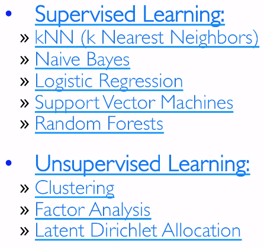
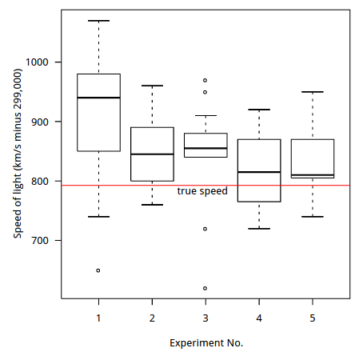
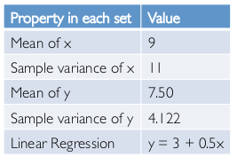
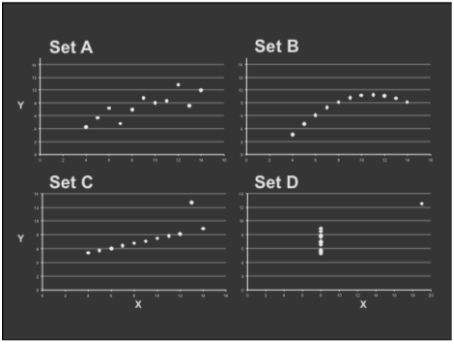

Title: [Spark MOOC note] Lec8. Exploratory Data Analysis and Machine Learning
Date: 2015-06-23
Slug: sparkmooc_note_lec8
Tags: spark

STATISTICS, BUSINESS QUESTIONS, AND LEARNING TECHNIQUES
-------------------------------------------------------
2 different kinds of statistics: 

* descriptive statistics

ex. median — describes data, *but cannot generalize beyong that*  

* inferential statistics

ex. *t-testing — inferences beyond the data*
techniques leveraged for machine learning and prediction

supervised learning (clf, reg), unsupervised learning (clustering, dim-reduction)
 → UL often used in a larger SL pb (ex. *auto-encoder*)  

EXPLORATORY DATA ANALYSIS
-------------------------
5-number summary:

The five-number summary is a descriptive statistic that provides information about a set of observations. It consists of the five most important sample percentiles:

* The sample minimum (smallest observation)
* The lower quartile or first quartile
* The median (middle value)
* The upper quartile or third quartile
* The sample maximum (largest observation)

→ box plot:   

THE R LANGUAGE AND NORMAL DISTRIBUTIONS
---------------------------------------
R: intractive exploration and visulization of data + statistical models and distributions + CRAN

Central Limit Th: sum/mean of n iid random variables 
many statistical test assume data to be normally distributed

DISTRIBUTIONS
-------------

* poissons distribution: accurrence freq
* exponential distribution: interval between 2 (poissons) events
* *Zipf/Pareto/Yule distributions*: frequencies of different terms in a document, or web site visits
* binomial/multinomial distribution: nb of count of events

RHINE PARADOX
-------------

SPARK'S MACHINE LEARNING TOOLKIT
--------------------------------
mllib: scalable, distributed ML library, *sklearn-like* ML toolkit
<https://spark.apache.org/docs/latest/mllib-guide.html>
lab: *collaborative filtering — *matrix factorisation  
  
⇒ *alternating* least square(ALS):    

**trouble with summary stats**: *Anscombe's Quartet*
→ have same statistics property  
  
→ quite different in fact:   
  
**Takeaways**:	
*•  Important to look at data graphically before analyzing it	*
*•  Basic statistics properties often fail to capture real-world complexities*	

Lab3. Text Analysis and Entity Resolution
-----------------------------------------
Entity Resolution (ER) refers to the task of finding records in a data set that refer to the same entity across different data sources (e.g., data files, books, websites, databases). ER is necessary when joining data sets based on entities that may or may not share a common identifier (e.g., database key, URI, National identification number), as may be the case due to differences in record shape, storage location, and/or curator style or preference. A data set that has undergone ER may be referred to as being cross-linked.

The file format of an Amazon line is:
"id","title","description","manufacturer","price"
The file format of a Google line is:
"id","name","description","manufacturer","price"

* re.split

re.split()有个很讨厌的地方: 字符串以句号等结尾时, 最后总是会出现一个空字符串:
	>>> re.split('\W+', 'Words, words, words.')
	['Words', 'words', 'words', '']
解决办法就是用个filter:　
``filter(None,re.split(split_regex, string.lower()) )``

* tfidf

TF rewards tokens that appear many times in the same document. It is computed as the frequency of a token in a document. IDF rewards tokens that are rare overall in a dataset. 

* cosine similarity

The metric of string distance we will use is called cosine similarity. We will treat each document as a vector in some high dimensional space. Then, to compare two documents we compute the cosine of the angle between their two document vectors. 

* ``flatMap``: 一行变多行, 别忘了...
* broadcast variable

we define the broadcast variable in the driver and then we can refer to it in each worker. Spark saves the broadcast variable at each worker, so it is only sent once.
声明广播变量的办法也很简单, 只要:
 ``idfsSmallBroadcast = sc.broadcast(idfsSmallWeights)``
然后用的时候要改成``xx.value``

* EXCEPT语句

找了一下没发现spark有SQL的EXCEPT语句(就是和join相反), 于是只好这么写了:
	nonDupsRDD = (sims
				  .leftOuterJoin(goldStandard)
				 .filter(lambda x: x[1][1]==None)
				 .map(lambda x:(x[0],x[1][0])))
用leftouterjoin 然后再只保留为None的那些... 应该不是最佳写法吧...

* complexity

用的ER办法(cosine similarity)的复杂度是O2 太高了...
⇒ An **inverted index** is a data structure that will allow us to avoid making quadratically many token comparisons. It maps each token in the dataset to *the list of documents that contain the token*. So, instead of comparing, record by record, each token to every other token to see if they match, we will use inverted indices to *look up records(documents) that match on a particular token*.
这种操作的基础是: 有很多向量的support是完全不重合的 

* .``collectAsMap()``: 把pair rdd变为map
* groupByKey(): 这个也用上了

lab4前后做了四个小时 不过很有意思... 第五部分出现out of memory error就没办法了...
