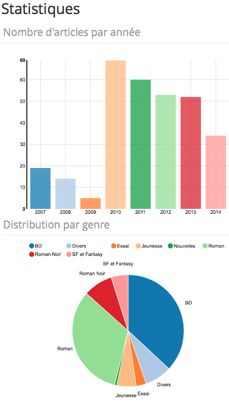

# Panorama - a statistics plugin for Pelican

[](https://travis-ci.org/romainx/panorama)
[](https://coveralls.io/r/romainx/panorama)

## Overview

**Panorama** is a [Pelican][LK_PELIC] plugin to generate **statistics from blog posts** (number of posts per year, categories and so on) and display them as **beautiful charts**.

No more talking, see a [live example](http://aubonroman.com/stats.html), or the screenshot below.



### Functional overview

Produce statistics based on posts metadata and display them by using several charts.
The mapping between data and charts is done by configuration (YAML file).

Metadata data used:

	Title: My super title
	Date: 2010-12-03 10:20
	Category: Python
	Tags: pelican, publishing

### Technical overview

This plugin uses:

- The Pelican [plugins feature](http://docs.getpelican.com/en/latest/plugins.html).
- The [Python Wrapper for NVD3][LK_PNVD3].
- The [Pandas Data Analysis Library][LK_PANDA].

### Design

Some design elements:

- The `panorama` plugin compliant with the [blinker](https://pypi.python.org/pypi/blinker) mechanism used by Pelican.
- A `data_factory` using article metadata to produce [Pandas][LK_PANDA] `Series` objects, in consequence data can be manipulated by all the powerful tools provided by the library.
- A `chart_factory` using data to render charts coming from the [Python Wrapper for NVD3][LK_PNVD3].
- A `conf_factory` mapping data to charts according to the YAML configuration file.

Charts are available in Pelican `context` (as a `panorama_charts` dict) and can be used by any [Jinja](http://jinja.pocoo.org/) template.

## Installation

### Get the plugin

The most convenient way is to clone the repository, but the distribution can also be downloaded and extracted.
*Note: The root folder of the Panorama distribution will be named `PANORAMA_DIR` in the rest of this chapter.*

### Install plugin dependencies

It is recommended to use `virtualenv` in order to preserve and isolate environments.

```bash
$ pip install -r requirements.txt
```

### Add NVD3 dependencies to your template

Panorama generates HTML content requiring javascript and CSS to display.

1. Download the following files from [NVD3](http://nvd3.org):

- `nv.d3.min.js`
- `nv.d3.css`

2. Download the following file from [D3JS](http://d3js.org)

- `d3.zip`

3. Create a `panorama` directory in `themes/<your_theme>/static/` and put them in this directory  as described below:

```bash
    |- panorama
	    |- d3
	    |   |-- d3.js
	    |   |-- d3.min.js
	    |   |-- LICENSE
	    |- nvd3
	    |   |-- nv.d3.min.js
	    |   |-- src	
	    |       |-- nv.d3.css
```

### Declare the plugin in the Pelican configuration

These settings are made in the Pelican configuration file (`pelicanconf.py`). 

To use the plugin it is necessary to define :

- the plugins location,
- which plugin to use. 

Assuming this is the first time plugins are used with Pelican, the configuration should look like this:

```python
PLUGIN_PATH = 'plugins'
PLUGINS = ['panorama']
```
Note: `PLUGIN_PATH` has to refer to the location where the Panorama plugin is stored, i.e. `PANORAMA_DIR`. For example, use `../panorama` if the panorama distribution is extracted at the same level as your Pelican site directory. Either the absolute path or the relative path to the plugin directory can be used in the settings file.

### Declare the template to use

It is required to configure the `DIRECT_TEMPLATES` setting. It tells Pelican which templates are to be used directly to render content. It is necessary to add the page that will display Panorama stats, let's call it `stats.html`.

```python
DIRECT_TEMPLATES = (('index', 'tags', 'categories', 'authors', 'archives', 'stats'))
```

Note: If you already have this setting in your configuration file, you simply need to append `stats` at the end.

### Create a template

The last step is to use data generated by Panorama in a template in order to display charts. A simple example is given in the `template/test_page.html` file.
This page has to match the name declared in the `DIRECT_TEMPLATES` setting, so it is called `stats.html` in our example, and created in the `themes/<your_theme>/template` directory. Here is a basic example iterating over the dictionary of results. However, the preferred way to integrate charts is to get each by its key from the `panorama_charts` dictionary in order to master the way it will be displayed. The keys are the 'chart_id' defined in the configuration file.

Two more things:
- Do not forget to add the heading block to reference NVD3 dependencies (CSS + JS), this block is not added automatically (it is added in the example below).
- If an error occurs during a chart configuration or generation, the corresponding key will not be available. So it's a good idea to add a test before using a key.

```jinja

Stats - {{ super() }}

<link href="/theme/panorama/nvd3/src/nv.d3.css" rel="stylesheet"/>
<script src="/theme/panorama/d3/d3.min.js"></script>
<script src="/theme/panorama/nvd3/nv.d3.min.js"></script>

<section id="content" >
    <div class="body">
        <header>
          <h1>Stats</h1>
        </header>
        <div class="entry-content">
		    
            <h2>{{ chart.name }}</h2>
            {{ chart.container }}
            {{ chart.htmlcontent }}
            
		</div>
    </div>
</section>

```
## Configuration

### Principle

Panorama loads its configuration from a YAML file. It tries to load a `panorama.yml` file located in the Pelican root directory. If this file does not exist, it uses the `default.yml` file located in the plugin directory.

### Default configuration

The default configuration provides default configuration and 3 configured charts that can be used as is :

- `nb_article_by_year`: Display the number of articles by year as a bar chart.
- `nb_article_by_category`: Display the number of articles by category as a pie chart.
- `nb_article_by_category_year`: Display the number of articles by category (one series by category) and by year as a multi bar chart.

### Custom configuration

### Metadata extracted

It is possible to configure the metadata to extract from articles. These names will be the column used by the `producer`.

- `metadata_columns`: By default title, date and category are mandatory, they cannot be removed. Other metadata (like author) for example can be added. The name must match the name of the metadata in content file.
- `tag_columns`: Its an optional setting permitting to define a column name for each tag in the order they are defined. By default tags are named `tag_0`, `tag_1` in the order they appear in the content files.

Here is an example of data extracted from some content, `tag_0` to `tag_3`have been renamed like this 

```YAML
tag_columns: [genre, ranking, publisher, writer]
```
 
```
                        title                date  category     genre  \
0        De si braves garçons 2014-12-21 00:00:00   Article     Roman   
1             In God we trust 2014-12-15 00:00:00   Article        BD   
2                    Genetiks 2014-12-02 00:00:00  Critique        BD

      ranking             publisher       writer             tag_4  \
0   4 étoiles             Gallimard   Modiano P.  Sélection Romans   
1   4 étoiles  Les Requins Marteaux    Winshluss     Coup de coeur   
2   2 étoiles           Futuropolis  Marazano R.      Ponzio J.-M.   
```

#### Configurations

A configuration is composed of:

- a `chart_id`: It is the name used to reference the chart. This name will be used in the template to access to the chart from `panorama_charts` in the Pelican context.
- a `producer`: It defines the source of the data, it is composed of:
	- a `function_name`: The name of the function to call and its potential arguments `args`.
- a `renderer`: It defines the way data are displayed, it is composed of:
	- a `class_name`: The class of the chart to instantiate.

##### Producer

The available `producer` are:

- Single series data producer
    - `count_article_by_column`: Count the number of articles by the specified column. For example, if the specified `column`` is "category", it will group articles by category and count the number of articles in each category.
        - `column`: the name of the column used to group data.
    - `count_article_by_year`: Count the number of articles by year. It will group articles by year and count the number of articles for each year.
    - `top_article: Return the top elements of a group. For example, if the specified `column` is "category" and `top` is "3", it will group articles by category and return the 3 categories with the more articles. 
        - `column`: the name of the column used to group data.
        - `top`: the number of items to return
- Multi series data producer
    - `count_article_by_column_by_year`: Count the number of articles by year for each group. For example, if the specified `column` is "category", it will group articles by category and count, for each category, the number of articles by year.
        - `column`: the name of the column used to group data.

##### Renderer

The available `renderer` are

- Single series charts:
    - `discreteBarChart`: A bar chart 
    - `pieChart`: A pie chart
- Multi series charts:
- `multiBarChart`: A bar chart with several series that can be stacked
- `stackedAreaChart`: An area chart with several series that can be stacked

See the [Python Wrapper for NVD3][LK_PNVD3], see the documentation for more information.

#### Charts configuration

Parameters to configure charts can be defined through the `chart_conf` dictionary. Its is possible to define `DEFAULT`settings and settings specific to each available charts. These specific settings override the `DEFAULT` configuration. In the example below the default `width` `700`is overriden for the `stackedAreaChart` chart with `500`. The parameters are the ones defined in the [Python Wrapper for NVD3][LK_PNVD3], see the documentation for more information.

```YAML
chart_conf:
    DEFAULT:
        height: 300
        width: 700
    stackedAreaChart:
        width: 500
```

[LK_PNVD3]: https://github.com/areski/python-nvd3
[LK_PANDA]: http://pandas.pydata.org
[LK_PELIC]: https://github.com/getpelican/pelican