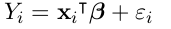
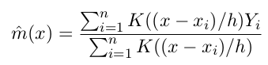
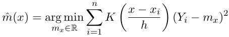
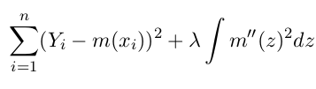
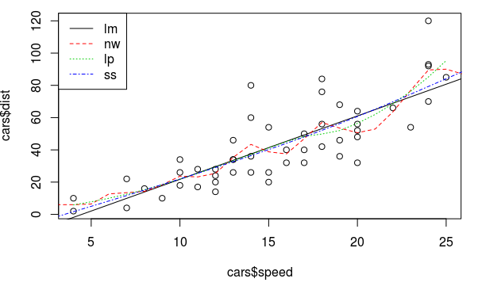
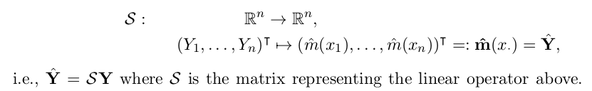
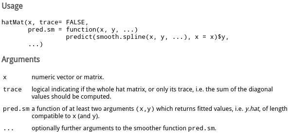
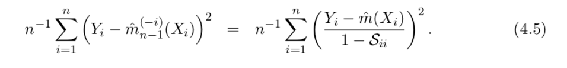
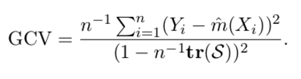

Title: R语言从入门到放弃 (4). 统计回归
Date: 2016-07-29 
Slug:  Rnotes-4-regression
Tags: R

R里面的统计函数有很多, 这里只用线性模型``lm``以及(一维)非参估计最常用的三个smoother: Nadaraya-Watson kernel(**NW, **``ksmooth``), Local Polynomial(**LP, **``loess``), Smoothing Spline(**SS, **``smooth.spline``). 用这三个smoother作为例子, 介绍R里面统计回归的一些用法. 

数据的形式是:　

目标是估计函数m(). 例子使用R自带的``cars``数据集, 它包含两列: 汽车速度speed和刹车距离dist. 

	> data(cars)
	> summary(cars)
	     speed           dist       
	 Min.   : 4.0   Min.   :  2.00  
	 1st Qu.:12.0   1st Qu.: 26.00  
	 Median :15.0   Median : 36.00  
	 Mean   :15.4   Mean   : 42.98  
	 3rd Qu.:19.0   3rd Qu.: 56.00  
	 Max.   :25.0   Max.   :120.00  
	> ?cars
	> plot(cars$speed, cars$dist)

Theory
======
首先简单介绍一下这4个smoother的原理: 

### linear model
认为m是线性形式(包含intercept): 

### Nadaraya-Watson kernel smoother
m_NW 在x处的取值为Yi的加权平均, 权重是按照kernel K()确定的. 

另外m_NW(x)还可以看做是最小化加权的square-error: 

### Local Polynomial smoother

m_NW(x)最小化加权sq-err那个表达式里, 可以是用一个*常数函数*mx来估计在x处的取值, LP将它泛化为p-1阶多项式的形式, m在x附近是多项式形式. m(u)=poly(x-u), 这个多项式的系数为beta(x): 

最后m_LP在x处的取值为: 

### Smoothing Spline

设定m的形式为knot在xi的spline, 加上penalize项: 

另外SS可以看作是bandwidth随x变化的kernel smoother. 

fit model
=========

### formula
``lm``和``loess``的文档里都提到参数为formula, 它大概是指示要fit的表达式形式. 这里面的加减号不是算数意义上的加减. 看例子: 

* ``dist ~ speed``: 表示dist是speed的函数
* ``y ~ .`` : 表示y是所有其他变量的函数
* ``y ~　x1+x2``: y 是x1和x2的函数
* ``y ~ x - 1``: y是x的函数, 且没有intercept项

### fit models
这几个函数的fit写法各不相同, 有的要提供formula, 有的要提供x和y值, 需要看文档: 

	fit.lm <- lm(dist~speed, data=cars)
	fit.nw <- ksmooth(cars$speed, cars$dist, kernel="normal")
	fit.lp <- loess(dist~speed, data=cars)
	fit.ss <- smooth.spline(cars$speed, cars$dist)

predict, fitted/residuals
=========================
predict的写法也是各不相同, 一般都是用``predict``函数, 然而这个函数在作用到不同smoother上面, 参数和返回值也都不一样......orz 关于``xx``smoother的predict函数用法参考?``predict.xx``. 最奇葩的是NW, 它不能用``predict``函数, 而要fit的时候在``skmooth``函数里传入``x.points``参数... 

看predict例子: 

	newspeed <- 1:26
	pred.lm <- predict(fit.lm, newdata = data.frame(speed = newspeed), interval = "prediction")[,"fit"]
	pred.nw <- ksmooth(cars$speed, cars$dist, kernel="normal", bandwidth=2, x.points=newspeed)$y
	pred.lp <- predict(fit.lp, newdata=newspeed)
	pred.ss <- predict(fit.ss, x=newspeed)$y

另外, 如果想看smoother在design points(Xi)处的预测值, 可以用``fitted``函数(NW还是不能用), 例子: 

	fitted.lm <- fitted(fit.lm)
	fitted.nw <- ksmooth(cars$speed, cars$dist, kernel="normal", bandwidth=2, x.points=cars$speed)$y
	fitted.lp <- fitted(fit.lp)
	fitted.ss <- fitted(fit.ss)

要看每个点的residual ri=yi-yhat_i, 用``residuals``函数(NW不行):

	resd.lm <- residuals(fit.lm)
	resd.nw <- ksmooth(cars$speed, cars$dist, kernel="normal", bandwidth=2, x.points=cars$dist)$y - cars$dist 
	resd.lp <- residuals(fit.lp)
	resd.ss <- residuals(fit.ss)

可以画出这几个方法的fit: 

	abline(fit.lm, lty=1, col=1) # linear model is just a straigh line
	lines(newspeed, pred.nw, lty=2, col=2)
	lines(newspeed, pred.lp, lty=3, col=3)
	lines(newspeed, pred.ss, lty=4, col=4)
	legend("topleft", c("lm", "nw", "lp", "ss"), lty=1:4, col=1:4)

bandwidth&df: Hat Matrix
========================

三个非参估计的smoother都有"带宽"(bandwidth)或者"自由度"(df)的概念, 带宽即NW或LP表达式里的h. 

自由度df是带宽的函数, smoother的df可以用它的**hat matrix** S计算出来. 

一个smoother的hat matrix S, 是把训练值Y映射到估计值Yhat的矩阵: 

而df则是S的迹: df = tr(S). df的

根据script(P28), S的第j列可以用这个smoother fit一个unit vector来得到: 

所以计算S可以用下面的代码: 

	n <- nrow(cars)
	Snw <- Slp <- Sss <- matrix(0, nrow=n, ncol=n)
	In <- diag(n) # identity matrix
	for(j in 1:n){
	  y <- In[,j] # unit vector ej
	  Snw[,j] <- ksmooth(cars$speed,y,kernel="normal", bandwidth = 2, x.points=x)$y
	  Slp[,j] <- fitted(loess(y~cars$speed))
	  Sss[,j] <- fitted(smooth.spline(cars$speed, y))
	}
	
	df.nw <- sum(diag(Snw))
	df.lp <- sum(diag(Slp))
	df.ss <- sum(diag(Sss))

发现三个非参smoother的自由度不同, 所以上面画图的比较并没有意义, 为了让三者的自由度相同, 可以设定ksmooth/loess/smooth.spline的参数.

控制带宽, Lp的参数为``span``, SS的参数为``spar``; 而指定想要的自由度则分别是``enp.target``和``df``. 

	cat("let all 3 np smoother use the same df=", df.nw)
	Slp <- Sss <- matrix(0, nrow=n, ncol=n)
	In <- diag(n) # identity matrix
	for(j in 1:n){
	  y <- In[,j]
	  Slp[,j] <- fitted(loess(y~cars$speed, enp.target=df.nw))
	  Sss[,j] <- fitted(smooth.spline(cars$speed, y, df=df.nw))
	}
	sum(diag(Slp))
	sum(diag(Sss))

发现SS的df参数使用以后控制的非常接近NW的df了, 不过lp的df还是不够接近, 用span来控制应该更准确一些, 为了找到合适的span, 用以下代码来寻找使得df=df.nw的span取值: 

	dflp <- function(span, val){
	  for(j in 1:n)
	  Slp[,j] <- loess(In[,j] ~ cars$speed, span = span)$fitted
	  return(sum(diag(Slp)) - val)
	}
	chosen_span <- uniroot(dflp, c(0.2, 0.5), val = df.nw)$root

如果不用这个循环计算的话, 可以用``sfsmisc``包里的``hatMat``函数: 

  

参数``trace``取TRUE的话, 直接返回hat matrix的迹, 否则返回整个hat matrix. 
需要把要计算的smoother包装成一个pred.sm函数传入, 这个函数接受x和y, 返回fitted数值. 例子: 

	hatMat(cars$speed, T, 
	       pred.sm = function(x,y) 
	         ksmooth(x, y, kernel="normal", bandwidth=2, x.points=x)$y )
	hatMat(cars$speed, T, 
	       pred.sm = function(x,y) fitted(loess(y~x, span=chosen_span)) )
	hatMat(cars$speed, T, 
	       pred.sm = function(x,y) fitted(smooth.spline(x, y, df=df.nw)) )

CV and Hat Matrix
=================

为了预测smoother的performance, 用loo CV来估计MSE(mean sq err)的值. 

loo CV可以用下面这个通用函数得到(注意看对于参数的要求): 

	##' Calculates the LOO CV score for given data and regression prediction function
	##'
	##' @param reg.data: regression data; data.frame with columns 'x', 'y'
	##' @param reg.fcn:  regr.prediction function; arguments:
	##'                    reg.x: regression x-values
	##'                    reg.y: regression y-values
	##'                    x:     x-value(s) of evaluation point(s)
	##'                  value: prediction at point(s) x
	##' @return LOOCV score
	loocv <- function(reg.data, reg.fcn){
	  ## Help function to calculate leave-one-out regression values
	  loo.reg.value <- function(i, reg.data, reg.fcn)
	    return(reg.fcn(reg.data$x[-i], reg.data$y[-i], reg.data$x[i]))
	
	  ## Calculate LOO regression values using the help function above
	  n <- nrow(reg.data)
	  loo.values <- sapply(1:n, loo.reg.value, reg.data, reg.fcn)
	
	  ## Calculate and return MSE
	  return( mean( (loo.values-reg.data$y)^2) )
	}

比如, 为了计算NW的CV数值, 需要这样: 

	regfcn.nw <- function(regx, regy, x)
	  ksmooth(regx, regy, kernel="normal", bandwidth=2, x.points=x)$y
	loocv(data.frame(x=cars$speed, y=cars$dist), regfcn.nw)

不过, 如果得到了hat Matrix S, 根据公式4.5, loo CV可以这样一次计算出来: 

试一下: 

	# compute CV using shortcut euqation
	yhat.nw <- Snw %*% cars$y # or use regfcn.nw(cars$speed, cars$dist, cars$speed)
	mean(  ( (cars$y-yhat.nw)/ (1-diag(Snw)) )^2 )

得到的结果和之前用loocv一样, 都是253.9128 !~ 

或者只用df, 计算generalized CV, 公式为: 

	#compute GCV
	mean( (cars$dist-yhat.nw)^2 ) / ( 1 - df.nw/n )^2

得到gcv=269.3911, 和looCV也比较接近. 
