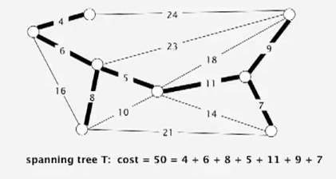

Title: [Algorithms II] Week 2-1 Minimum Spanning Trees     
Date: 2015-11-11   
Slug:  algoII_week2_1   
Tags: algorithm   
   
   
1. Introduction to MSTs   
=======================   
Given: undirected connecte graph ``G`` with positive edge weights.    
def. **Spanning tree **``T``   
is a subgraph of ``G``, that is both tree (*connected, acyclic*) and spanning(*all vertices are included*).    
   
⇒ Goal: find a spanning tree with minimum weight sum.   
   
2. Greedy Algorithm   
===================   
assumptions for simplification:    
   
* edge weights are distinct   
* graph is connected   
   
→ MST uniquely exists.   
   
cut property   
------------   
def. a **cut** of a graph is a partition of its vertices into 2 non-empty sets.   
def. a **crossing-edge** (wrt a cut) is an edge connecting vertex from one set to another.   
   
   
**prop. **Given any cut, the crossing edges with minimum weight *is in the MST*.    
   
*proof.*   
Given a cut. {S1,S2} are the two set of vertices,  let ``e`` be the min-weighted edge among all crossing-edges.   
 
If ``e`` is not in the MST   
   → exist another crossing-edge, ``f``, in the MST (otherwise not connected)   
    → adding ``e`` to the MST will create a cycle (tree property)   
        → the edge ``f`` will be in this cycle   
        → removing ``f`` and adding ``e`` will give us another spanning tree (!)   
                → this new spanning tree has smaller weight sum ⇒ contradiction, CQFD.   
   
   
Greedy MST algo   
---------------   
[**algo** ] Greedy MST  
>* initialize: all edges not selected (colored gray)   
* find any cut with *all crossing-edge gray*   
* use this cut and select the min-weighted crossing edge (color the edge as black)   
* repeat V-1 times.    
   
   
**prop.** the greedy algorithm gets the MST.    
*pf.*   
   
* any selected (black) edges are in the MST (according to the cut property)   
* If we haven't selected V-1 edges → there is always a cut with all crossing-edges gray. (证明algo不会卡死)   
   
(*if edge weight not distinct, the proof fails, but can be fixed)*   
   
**efficient implementations**:    
   
* how to choose the cut each time?   
* how to find min-weighted crossing-edge?    
   
⇒ Kruskal & Prim   

   
3. Edge-Weighted Graph API   
==========================   
   
Edge API   
--------   
→ *Edge abstraction*: make Edge comparable.   
   
	public class Edge implements Comparable<Edge>{   
		Edge(int v, int w, double weight);   
		int either();// get one of the endpoint of edge (as we are in undirected graph contex here)   
		int other(int v);// get the other endpoint    
		int compareTo(Edge that);// compare by edge weight   
		double weight();   
	}   
   
   
   
Edge-weighted Graph API   
-----------------------   
adj-list implementation: ``Bag<Edge>[] adj;``(for undirected graph, each edge appears twice in adj)   
   
	public class EdgeWeightedGraph{   
		private final int V;   
		private final Bag<Edge>[] adj;   
		EdgeWeightedGraph(int V){   
			this.V = V;   
			this.adj = (Bag<Edge>)new Bag[V];   
			for(int v=0;v<V;v++) adj[v] = new Bag<Edge>();   
		}   
		void addEdge(Edge e){// use the Edge class instead of directly v and w   
			int v = e.either(), w = e.other();   
			adj[v].add(e);   
			adj[w].add(e);   
		}   
		Iterable<Edge> adj(int v){//get Edges incident to v   
			return adj[v];   
		}   
		Iterable<Edge> edges();// get all Edges   
	}   
   
   
(allow self-loops and parallel edges)   
   
MST API   
-------   
	public class MST{   
		MST(EdgeWeightedGraph G);//compute the MST   
		Iterable<Edge> edges();// selected edges in the MST   
		double weight();// sum of all edge weights in MST   
	}   
   
   
4.  Kruskal's Algorithm   
=======================   
**[algo]**    
>* consider edges in ascending order of weight,   
 * add the edge to MST *unless it creates a cycle*.    
   
In the running of Kruskal: we have several small connect components and they merge with each other until we get MST.    
   
correctness   
-----------   
**prop. **Kruskal's algo works.   
*pf*   
(idea: proove that Kruskal is a special case of the greedy algorithm, ie. how to select the specific cut)   
suppose Kruskal's algo selects(colored black) an edge ``e=v-w``   
→ select a cut = vertices connected to v in the (constructing) MST; and the rest vertices.    
    → for this cut, there is no black crossing edges   
        → moreover among all crossing edges of the cut the edge e has the smallest weight!! (by def of Kruskal) CQFD   
   
   
implementation   
--------------   
   
* how to test if adding an edge will create a cycle ?    
   
DFS from v to w? → O(V)   
⇒ **Union-Find** !  O(lg*V) ☺ (almost constant time)   
   
if ``find(v)==find(w)``, then we know adding e will create a cycle.    
   
   
* considering edges in order? → use a prority queue.    
      
       
        public class KruskalMST extends MST{   
            private Bag<Edge> mst = new Bag<Edge>();   
            public KruskalMST(EdgeWeightedGraph G){   
                MinPQ<Edge> pq = new MinPQ<Edge>();   
                // build pq --> can be optimized to O(n) if build bottom-up   
                for(Edge e: G.edges()) pq.insert(e);   
                UF uf = new UF(G.V());// build a UF of V elements   
                while(!pq.isEmpty() && mst.size()<G.V()-1){   
                    Edge e = pq.delMin();   
                    int v = e.either(),w=e.other(v);   
                    if( uf.connecte(v,w) ) continue;   
                    uf.union(v,w);   
                    this.mst.add(e);		   
                }   
            }   
            public Iterable<Edge> edges(){   
                return this.mst;   
            }   
        }   
   
   
complexity   
----------   
running time: O(ElogE)   
   
   
5. Prim's Algorithm   
===================   
since 1930...    
Idea: start from a vertex and *grows the tree *``T``* to MST.*    

**[algo]**         
>* Add to the tree T the edge *that have exactely one endpoint in T* and with minimum weight,  
* repeat V-1 times.    
   
In the running of Prim: there is always ONE connnected component .    
   
Correctness   
-----------   
**prop**. Prim's algo works.   
*pf.*   
suppose edge e is the min-weighted edge connect a vertex in T with a vertex out of T.    
→ select the cut = vertices in the tree T; vertices out of T   
→ by def, there is no black crossing edge   
→ e is the min-weighed edge by def of Prim. CQFD   
   
   
implementation   
--------------   
challenge: how to find such an edge (connect T and other vertex, with min weight) ?   
⇒ priority queue    
   
### "lazy" implementation   
 **[algo]**    
>* Maintain a PQ of edges that connect T and the rest vertices.    
* `e = pq.delMin(), e = v-w  `,  if `v` and `w` are both in T (as edges in pq might become obsolete as T grows) ⇒ *just disregard it*    
* to maintain the pq: add all incident edges(with other endpoint not in T) of the newly added vertex to pq   
  
	public class LazyPrimMST{   
		private Bag<Edge> mst;   
		LazyPrimMST(EdgeWeightedGraph G){   
			boolean[] marked = new boolean[G.V()]; // vertices in T   
			MinPQ<Edge> pq = new MinPQ<Edge>();    
			this.mst = new Bag<Edge>();   
			marked[0] = 0; // add vertex 0 to T   
			for(Edge e:G.adj(0))    
				pq.insert(e);// add edges to pq   
			while(!pq.isEmpty() && this.mst.size()<G.V()-1){   
				e = pq.delMin();   
				int v = e.either(), w = e.other(v);   
				if(marked[v] && marked[w]) continue;//ignore obsolete edges   
				v = marked[v] ? w : v;// v is the newly added vertex   
				marked[v] = true;   
				for(Edge e:G.adj(v)){   
					if(!marked[e.other(v)])   
						pq.insert(e);   
				}   
			}   
		}   
	}   
   
   
Running time: **O(ElgE)**   
   
space: **O(E)** in worst time.   
   
### "eager" implementation   
Idea:    
>use a **PQ of vertices***, priority of vertex v := min-weight of edge that connects v to T.*    
   
**[algo]**   
>
* Get from pq the vertex ``v`` that is closest to T, add it to T.   
Update pq -- consider ``v``'s incident edge ``e=v-w:``   
	* if w in T → ignore   
	* else:   
		* if w in pq → add w to pq   
		* else → if `v-w` has smaller weight than the current priority, update `w`'s priority.      
* repeat till get V-1 edges.    
   
   
   
key implementation component: a [MinPQ](file:///home/wx/Dropbox/ZIM_NOTES/0._TmpNotes/Algorithms%2C_part_II/MinPQ.txt) that supports priority(key) update.    
   
	class IndexMinPQ<Key extends Comparable<Key>>{   
		IndexMinPQ(int N);// indices of elements: 0...N-1   
		void insert(int i, Key key);   
		void decreaseKey(int i, Key key);// update the key(priority) of element-i   
		int delMin();   
		int size();   
	}   
   
   
implementation of such a PQ:   
> Use same code as standart PQ (maintain a heap[] array).   
Elements are always accessed by "index", in range 0...N-1.
maintain 3 parallel arrays: ``keys[], pq[], qp[]``:   

>* ``keys[i]``: is the priority of element i (the element with index=i)   
* ``pq[i]``: is the index of the element in the heap position i (ie. in heap[i] is pq[i]th element  )   
* ``qp[i]``: is heap position of element i  ( ⇔ the ith element is in heap[qp[i]] )   
   
to ``decreaseKey(i,key)``: change `keys[i]`, then call `siftup(qp[i])`   
   
   
summery of pq implementations:    
   
   
6. MST Context   
==============   
   
   
* unsolved pb: does a linear MST algo exists?   
   
(recap: for UF, tarjan has *prooved* that linear algo doesn't exist — although Nlg*N is fast enough...)   
@_@...   
   
(这个Yao是清华那个Yao吧?)   
   
   
* Euclidean MST   
   
Given N points in plane, edge weight := Euclidean distance. (*dense graph, E = V2*)   
→ exploit geomerty, O(NlgN)   
   
   
* clustering   
   
k-clustering (~ dist-fcn)   
single-link clustering (def. dist of clusters = dist of 2 closest elements in each cluster)   
→ Kruskal...   
   
   
   
   
   
   
   
