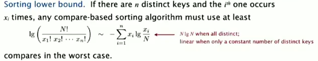
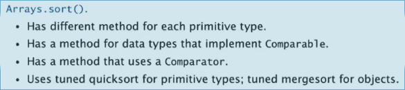

Title: [Algorithms I] Week 3-2 Quicksort      
Date: 2015-08-22      
Slug:  algoI_week3_2      
Tags: algorithm      
   
(maybe best algorithm for sorting.)   
   
1. Quicksort   
============   
**Idea:**     
   
1. shuffle the array     
2. *Partition* the array into two subarrays to left and right of pivot  (*now pivot is ***in its final position**)   
   
no larger entry to the left of pivot     
no smaller entry to the right of pivot     
   
3. sort each subarray recursively     
   
   
      
   
Implemetation   
-------------   
**The partition process:**      
这个方法也比较巧妙.    
Use 2 pointers i and j (个人觉得用hi, lo, pivot更好...) :      
      
→ a[i]>=a[lo], a[j]<**=**a[lo] (注意是大于**等于**/小于**等于**)      
⇒ exchange i and j      
→ Scan until i and j cross (ie. j<=i)      
⇒ finally exchange lo with **j**   
函数的签名定义的好: 把lo到hi部分的数组分成两部分, 并返回分割点的index.   
   
	private static int partition(Comparable[] a, int lo, int hi){   
		int i=lo+1, j=hi;   
		while(i<j){   
			while( i<=hi && less(a[i],a[lo]) ) i++; //a[i]>=a[lo]   
			while( j>=lo && less(a[lo],a[j]) ) j--; //a[j]<=a[lo]   
			if(i<j) exch(a,i++,j--);   
		}   
		exch(a,lo,j); //exchange pivot with j   
		return j; //j in its final position   
	}

   
这个函数其实并不好写对:     
   
* test for cross pointers is not trival (ex. edge case: the pivot is the smallest/largest entry in the range)   
* i<=hi is necessary !    
* for keys equal to a[lo]: better to stop at them   
   
   
invariance:      
      
   
**Quicksort:   **   
使用partition函数和辅助sort函数(recursive).  注意在整个流程开始以前先shuffle一下.     
   
	private static void sort(Comparable[] a, int lo, int hi){   
		if(hi<=lo) return;   
		int pivot = partition(a, lo, hi);   
		sort(a,lo,pivot-1);   
		sort(a,pivot+1,hi);   
		return;
	}   
	public static void sort(Comparable[] a){   
		StdRandom.shuffle(a); // don't forget to shuffle the array   
		sort(a,0,a.length-1);   
	}   

The randomness is preserved: the subarrays after partitionning is still randomly ordered.      
   
Analysis   
--------   
Performance: ~40% faster than mergesort.      
   
**Best case**   
#compares = NlgN      
(each partition will divide the array in half)     
     
**Worst case  **   
#compares = 1/2*N^2     
N+(N-1)+...+1   
if the array is already in order, *each partition will have one subarray of length=0*     
   
**Average case  **   
>**proposition  **   
On average, for array with N distinct keys, the #compares =  ~2NlnN, #exchanges = ~1/2*NlnN.      
*Proof.*      
C(N) := # compares for N entries     
pivot 在N个数离的排名是uniform的      
接下来的数学推到很漂亮(不过可能没啥用..)       
         
        
         
   
(上面最后一行写错了... 是2NlnN...orz)
random shuffle: probalistic guarantee against worst case.    
   
**Pitfalls    **   
implementations will get *quadratic* performance if array:    
   
* is sorted or reverse sorted   
* has many duplicates (even if randomized)   
   
   
**Staility  **   
Quicksort is **NOT** stable.     
partitionning can make long range exchanges     
      
   
Practical improvements   
----------------------   
   
* cutoff to insertion sort for <10 items    
   
→ ~20% improvement      
Or we can leave the small subarrays unsorted and sort them at last using insertion sort      
   
* estimate median by sampling 3 items       
   
     
 → 10% improvement     
	   
   
2. Selection   
============   
Goal: *given un array, find the kth largest item.*    
   
   
* Upper bound for this problem: NlgN (just sort the array)    
* for small k (ex k=1,2,3), the upper bound is N (one-pass/two-pass)     
* Lower bound is N: at least have to look at everything     
   
   
Quick select   
------------   
Algo proposed also by Hoare:      
   
1. partition the array into two arrays left of pivot and right of pivot.      
2. if pivot==k: return      
3. continue the partition for just one of the subarrays       
   
   
类似于二分查找的过程....    
注意这里**是不用递归的**! 因为partition函数返回的直接就是pivot*在整个数组里的*位置!    
   
Implementation   
--------------   
   
	privater static int partition(Comparable[] a, int lo, int hi){...}   
	   
	public static Comparable select(Comparable[] a, int k){   
		StdRandom.shuffle(a);   
		int lo=0,hi=a.length-1;   
		while(true){   
			int j = partition(a,lo,hi);   
			if(j<k) lo=j+1;   
			if(j==k) return a[j];   
			else hi=j-1;   
			if(hi<=lo) break;   
		}   
		return a[k];//这里不太理解为什么会在hi<lo的时候直接返回a[k]   
	}   
   
   
Analysis   
--------   
**Proposition  **   
Quick selection takes **linear** time on average.     
*proof  *   
intuitively, each partition will ct the subarray size in half:    
N+N/2+N/4+... = 2N     
formal analysis 略...   
   
**worst case**: quadratic (but very rare to happen)   
   
**Theoretical results**     
         
   
3. Duplicate keys   
=================   
if array contains many duplicate keys.    
   
* huge array     
* small number of distinct keys     
   
   
**for mergesort  **   
insensitive... always ~NlgN compares.     
   
**for quicksort  **   
Will get *quadratic* time if not stop on equal keys. (found in 1990s)      
mistake: put all items equal to pivot *to just one side   *   
→ N^2 compares if all keys are equal from lo to hi.    
correct: put all items equal to pivot in their final place.      
      
   
   
3-way partitionning   
-------------------   
(by Dijkstra)     
partition the array into 3 parts:       
       
    
Dijkstra's 3-way partition algo:    
使用3个指针: lt指向中间部分的左边界, gt指向右边界;  i指针从左向右扫描, 算法很subtle:     
   
* lt=lo, gt=hi, i=lo   
* if a[i]==v : i++   
* if a[i]<v: exch(i,lt), i++, lt++   
* if a[i]>v: exch(i,gt), gt--    
* repeat until i and gt cross (i>gt)   
   
   
***invariance***:    
   
* ``[lo, lt)`` ***all < v***
* ``[lt, i)`` ***all == v***
* ``(gt, hi]`` ***all >v***
   
      
   
      
   
Implementation: 3-way quick sort   
--------------------------------   
不必再写partition函数, 直接在sort递归函数里面.       
        
   
	private static void sort(Comparable[] a, int lo, int hi){   
		if(hi<=lo) return; // 递归函数别忘了先写终止条件...   
		int lt=lo, gt = hi;   
		Comparable v = a[lo];   
		for(int i=lo;i<=gt;){ //不能写 i++   
			if( less(a[i],v) )   
				exch(a, i++, lt++);   
			else if ( less(v,a[i]) )   
				exch(a,i,gt--);   
			else // v==a[i]   
				i++;   
		}   
		sort(a, lo, lt-1);   
		sort(a, gt+1, hi);  
	}   

      
当N个数有很多重复的时候, lower bound可以变小于NlgN:       
         
And Sedgewick proved that the 3-wy partition is propotional to the lower bound....       
      
   
4. System Sorts   
===============   
Arrays.sort() in java:   
   
``import java.util.Arrays;``   
   
      
quicksort for primitive arrays, mergesort for objects: java设计者认为如果用obj array表示空间不是问题...   
   
Pb in java's system sort: killer input exsit (havn't shuffle)...    
   
      
     
        
总结一下学过的5/6种排序:       
      
   
   
   
